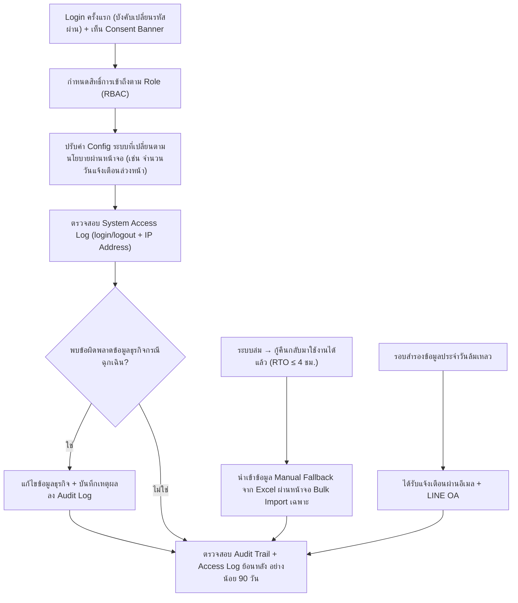

# User Journey — ผู้ดูแลระบบ (Admin)

> อ้างอิงจาก backlog.md และ spec ที่เกี่ยวข้อง — ดู [Feature List](../02-feature-list.md) สำหรับมุมมองระดับ Feature

## Diagram

## คำอธิบายตามลำดับ

1. **Login ครั้งแรก (บังคับเปลี่ยนรหัสผ่าน) + เห็น Consent Banner** — ผู้ดูแลระบบ login เข้าระบบด้วยสิทธิ์เต็ม (Full access) ด้านระบบ ในการ login ครั้งแรกระบบบังคับให้ตั้งรหัสผ่านใหม่ (อย่างน้อย 8 ตัวอักษร — ยืนยันแล้ว 20260825) ก่อนเข้าใช้งานหน้าจออื่น (อ้างอิง FR-6.6, BL-037 — เพิ่ม 20260824) และเห็น Consent Banner ตาม PDPA ที่ต้องกดยินยอมก่อนเข้าใช้งาน (อ้างอิง NFR Security/RBAC, BL-024; FR-6.3, BL-030)

2. **กำหนดสิทธิ์การเข้าถึงตาม Role (RBAC)** — ผู้ดูแลระบบกำหนดสิทธิ์การเข้าถึงตาม Role ให้ผู้ใช้แต่ละคน (เจ้าหน้าที่ รพ.สต. เห็นเฉพาะหน่วยตนเอง, ผู้บริหาร read-only ทั้งเครือข่าย ฯลฯ) เพื่อป้องกันการเข้าถึง/แก้ไขข้อมูลนอกขอบเขตหน้าที่ (อ้างอิง NFR Security, BL-024)

3. **ปรับค่า Config ระบบที่เปลี่ยนตามนโยบายผ่านหน้าจอ** — ผู้ดูแลระบบปรับค่า config ของระบบที่มีแนวโน้มเปลี่ยนตามนโยบาย (เช่น จำนวนวันแจ้งเตือนล่วงหน้าก่อนกำหนดส่งคำขอเบิกประจำเดือนตาม BL-009b ซึ่งยืนยันแล้ว 20260825 = 2 วัน) ได้เองผ่านหน้าจอระบบ โดยไม่ต้องแก้ไขโค้ดหรือรอรอบพัฒนาใหม่ — ขอบเขตค่าที่ยอมรับได้ (min/max) กำหนดเฉพาะทีละ Config Key แยกจากกัน ไม่ใช้กฎ validation เดียวกันทั้งหมด (ยืนยันแล้ว 20260825) (อ้างอิง FR-6.10, BL-043 — เพิ่ม 20260824)

4. **ตรวจสอบ System Access Log (login/logout + IP Address)** — ผู้ดูแลระบบตรวจสอบบันทึก System Access Log ที่ระบบเก็บไว้แยกจาก Audit Trail ทางธุรกิจ ครอบคลุมการ login/logout ของผู้ใช้ทุกคนพร้อม IP Address (อ้างอิง FR-6.1, BL-028)

5. **พบข้อผิดพลาดข้อมูลธุรกิจกรณีฉุกเฉิน?** — หากพบข้อผิดพลาดของข้อมูลธุรกิจ (เบิก/จ่าย/ยอดคงคลัง) ที่จำเป็นต้องแก้ไขเร่งด่วน ผู้ดูแลระบบดำเนินการแก้ไขได้เฉพาะกรณีฉุกเฉินเท่านั้น โดยระบบต้องบันทึกลง audit log ทันทีพร้อมเหตุผลการแก้ไข เพื่อไม่กระทบกระบวนการอนุมัติปกติ (อ้างอิง NFR Security, BL-025; FR-1.6, BL-008)

6. **ตรวจสอบ Audit Trail + Access Log ย้อนหลัง อย่างน้อย 90 วัน** — ผู้ดูแลระบบตรวจสอบว่า Audit Trail ทางธุรกิจและ System Access Log ถูกเก็บรักษาไว้อย่างน้อย 90 วันตาม พ.ร.บ. ว่าด้วยการกระทำความผิดเกี่ยวกับคอมพิวเตอร์ฯ มาตรา 26 และหลังพ้น 90 วันข้อมูลยังคงถูกเก็บต่อเนื่องไม่มีกำหนดลบ (อ้างอิง FR-6.2, BL-029)

7. **ระบบล่ม → กู้คืนกลับมาใช้งานได้แล้ว → นำเข้าข้อมูล Manual Fallback ผ่านหน้าจอ Bulk Import (Excel)** — เมื่อระบบล่มในเวลาราชการและทีมผู้ดูแลระบบกู้คืนระบบให้กลับมาใช้งานได้ภายในเป้าหมาย RTO ≤ 4 ชั่วโมง (อ้างอิง NFR Disaster Recovery, BL-042) ข้อมูลที่เจ้าหน้าที่/เภสัชกรบันทึกด้วยมือ/Excel ชั่วคราวระหว่างที่ระบบยังใช้งานไม่ได้ (ขั้นตอนสำรองแบบ manual fallback) ต้องถูกนำกลับเข้าสู่ระบบผ่าน**หน้าจอ/เครื่องมือ Bulk Import ข้อมูลจาก Excel เฉพาะสำหรับกรณีนี้** ไม่ใช่การกรอกซ้ำทีละรายการผ่านหน้าจอปกติ — ยืนยันแล้ว 20260825 (อ้างอิง NFR Disaster Recovery, BL-042) — **ผู้ใช้งานหน้าจอนี้ยืนยันแล้วโดยตรง (20260825, ผ่าน `AskUserQuestion`):** ผู้ดูแลระบบ (Admin) เป็นผู้ดำเนินการ ไม่ใช่การอนุมานอีกต่อไป — สอดคล้องกับรูปแบบเดิมของระบบที่ Admin เป็นผู้รับผิดชอบการแก้ไข/นำเข้าข้อมูลธุรกิจกรณีพิเศษอยู่แล้ว (ดู step 5, BL-025/FT-021 และ step 3, BL-043/FT-034) — BL-042 AC ข้อ 2 ยังคงระบุ "เจ้าหน้าที่/เภสัชกร" เฉพาะฝั่งที่บันทึกข้อมูลด้วยมือ**ระหว่าง**ระบบล่มเท่านั้น ซึ่งเป็นคนละบทบาทกับ Admin ผู้นำเข้าข้อมูลกลับ**หลัง**ระบบกลับมาใช้งานได้

8. **รอบสำรองข้อมูลประจำวันล้มเหลว → ได้รับแจ้งเตือนผ่านอีเมล + LINE OA** — เมื่อรอบสำรองข้อมูลอัตโนมัติประจำวันล้มเหลว ผู้ดูแลระบบได้รับแจ้งเตือนผ่านทั้งอีเมลและ LINE OA (ช่องทางเดียวกับการแจ้งเตือนอื่นของระบบ) เพื่อดำเนินการแก้ไขก่อนที่ RPO จะเกิน 24 ชั่วโมง — ยืนยันแล้ว 20260825 (อ้างอิง NFR Reliability/Backup & Recovery, BL-035)

## บันทึกการอัปเดต (Changelog)

- **20260816:** สร้าง User Journey ของผู้ดูแลระบบ (Admin) ครั้งแรก ครอบคลุม Epic 5 ที่เกี่ยวข้องโดยตรงกับบทบาท Admin (RBAC, System Access Log, แก้ไขข้อมูลฉุกเฉิน, การเก็บรักษา log ≥90 วัน) — ไม่รวม NFR ที่เป็นคุณสมบัติเชิงระบบล้วนๆ ไม่ใช่ขั้นตอนที่ Admin ลงมือทำ (เช่น Desktop-first UI/BL-026, Availability เฉพาะเวลาราชการ/BL-033) ซึ่งครอบคลุมอยู่แล้วใน [Feature List](../02-feature-list.md) FT-022/FT-025 แต่ไม่ปรากฏเป็น step ในไฟล์นี้
- **20260820 (audit, stage 2 ของ /check-backlog-sync):** ตรวจสอบไฟล์นี้เทียบกับ backlog.md ปัจจุบัน — พบว่า entry การเปลี่ยนแปลง 20260816 ด้านบนอ้างถึง BL-026 ด้วยชื่อเดิม ("Desktop-first UI") ซึ่งไม่ตรงกับเนื้อหาปัจจุบันของ BL-026 อีกต่อไป (แก้เป็น "Responsive เต็มรูปแบบ" เมื่อ 20260820) — คงข้อความ entry เดิมไว้เป็นบันทึกประวัติตามช่วงเวลาที่เขียนจริง แต่ชี้แจงในบรรทัดนี้ว่า ณ ปัจจุบัน BL-026/FT-022 คือ "Responsive เต็มรูปแบบ" ไม่ใช่ Desktop-first แล้ว (ไม่กระทบ diagram/คำอธิบายลำดับของไฟล์นี้ เนื่องจากไฟล์นี้ไม่มี step อ้างอิง BL-026 โดยตรงอยู่แล้ว) — ไม่พบจุดอื่นที่ต้องแก้ไขในไฟล์นี้
- **20260824 (audit, หลัง requirement-writer เพิ่ม BL-035 ถึง BL-043 — NFR เพิ่มเติม 10 หมวดใน Epic 5):** ตรวจสอบไฟล์นี้เทียบกับ backlog.md เวอร์ชันล่าสุด พบ 2 รายการที่มีการกระทำของ Admin ที่สังเกตได้จริงตาม AC แต่ยังไม่ปรากฏใน journey นี้ จึงเพิ่ม (auto-fixed): (1) **BL-037** (บังคับเปลี่ยนรหัสผ่านครั้งแรก + session timeout ทุก role) — แก้ node A ในไดอะแกรมและคำอธิบาย step 1 ให้รวมการบังคับเปลี่ยนรหัสผ่านครั้งแรกไว้ในขั้นตอน Login เดียวกับ Consent Banner (ส่วน session timeout เป็นพฤติกรรม passive ไม่เพิ่มเป็น step) (2) **BL-043** (Admin ปรับ config ผ่านหน้าจอ, cross-ref BL-009b) — เพิ่ม node ใหม่ B2 ในไดอะแกรมระหว่าง "กำหนดสิทธิ์ RBAC" (B) กับ "ตรวจสอบ System Access Log" (C เดิม) และเพิ่มคำอธิบายเป็น step ใหม่ที่ 3 (เลื่อนหมายเลข step เดิม 3-5 เป็น 4-6) — ตรวจสอบ BL-035/BL-036/BL-038/BL-039/BL-040/BL-041/BL-042 อีก 7 รายการแล้วพบว่าไม่มีขั้นตอนใดที่ Admin ลงมือทำผ่านหน้าจอ SmartSync โดยตรงตาม AC (BL-036/BL-038 ผูกกับเภสัชกรเท่านั้น, BL-035/BL-039/BL-040/BL-041 เป็น NFR เชิงระบบล้วนๆ, BL-042 (Disaster Recovery) แม้ระบุว่า "ทีมผู้ดูแลระบบดำเนินการกู้คืน" แต่ manual fallback process คือการออกจากระบบ SmartSync ไปใช้วิธีเดิมชั่วคราว ไม่ใช่การใช้งานหน้าจอของ SmartSync เอง) จึงไม่เพิ่ม step อื่นในไฟล์นี้ — ดู [Feature List](../02-feature-list.md) FT-026 ถึง FT-034 สำหรับเหตุผลแบบเต็มของแต่ละรายการ
- **20260825 (audit, หลังผู้ใช้ปิด `[รอยืนยัน]` 3 จุด — BL-009b = 2 วัน, BL-037 = รหัสผ่านขั้นต่ำ 8 ตัวอักษร, BL-043 = validation แยกตาม Config Key):** ตรวจสอบไฟล์นี้เทียบกับ backlog.md เวอร์ชันล่าสุด พบ 2 จุดที่ยังขาดรายละเอียดที่เพิ่งปิด `[รอยืนยัน]` (enrichment, ไม่ใช่การแก้ข้อผิดพลาดเดิม): (1) step 1 (Login ครั้งแรก) เพิ่มรายละเอียด "อย่างน้อย 8 ตัวอักษร" ของรหัสผ่านใหม่ (BL-037) (2) step 3 (ปรับค่า Config) เพิ่มค่าจำนวนวันที่ยืนยันแล้ว (BL-009b = 2 วัน) และหลักการ validation แยกตามทีละ Config Key (BL-043) ไม่พบจุดอื่นในไฟล์นี้ที่ต้องแก้ไข
- **20260825 (audit รอบที่ 2, หลังผู้ใช้ปิด `[ถือว่า]`/รายละเอียดที่ยังไม่ระบุของ BL-035/BL-039/BL-042 ผ่าน `AskUserQuestion` — spec 006 "เพิ่มเติมรอบ 3", scope change สำคัญของ BL-042):** ตรวจสอบไฟล์นี้เทียบกับ backlog.md เวอร์ชันล่าสุด — BL-042 (Disaster Recovery) ที่เดิมประเมินว่าไม่มี in-app operation ใดๆ เลย (ดู entry 20260824 ด้านบน) ตอนนี้ยืนยันแล้วว่าหลังระบบกลับมาใช้งานได้ต้องมีหน้าจอ Bulk Import ข้อมูลจาก Excel เฉพาะสำหรับนำข้อมูล Manual Fallback กลับเข้าระบบ — เพิ่ม node ใหม่ `G`/`H` ในไดอะแกรม (แยกสาขาใหม่ ไม่ต่อเนื่องจาก flow หลัก เพราะเกิดขึ้นเฉพาะกรณีระบบล่ม) และเพิ่มคำอธิบายเป็น step ใหม่ที่ 7 พร้อมหมายเหตุกำกับว่าการมอบหมายให้ Admin เป็นผู้ใช้งานหน้าจอนี้เป็น**การอนุมาน**จากรูปแบบการเขียน BL-042 และรูปแบบเดิมของโปรเจกต์ (BL-025/BL-043) ไม่ใช่การยืนยันตรงจากเจ้าของข้อกำหนด เนื่องจาก BL-042 AC ข้อ 2 กล่าวถึง "เจ้าหน้าที่/เภสัชกร" เฉพาะฝั่งบันทึกข้อมูลด้วยมือเท่านั้น — เพิ่มเติม (enrichment คู่กัน): BL-035 (Backup) เพิ่มรายละเอียดว่าเมื่อรอบสำรองข้อมูลล้มเหลวต้องแจ้งเตือน Admin ผ่านอีเมล+LINE OA (ยืนยันแล้ว) — เพิ่ม node ใหม่ `I`/`J` (แยกสาขา) และคำอธิบาย step ใหม่ที่ 8 — ตรวจสอบ BL-039 (Encryption, ปฏิเสธการเชื่อมต่อไม่เข้ารหัส) แล้วพบว่ายังไม่ผูกกับ role ใดโดยเฉพาะ (เกิดขึ้นได้กับผู้ใช้ทุก role) จึงไม่เพิ่ม step ในไฟล์นี้ — ดู [Feature List](../02-feature-list.md) FT-026/FT-030/FT-033 สำหรับรายละเอียดเต็มและเหตุผลการมอบหมาย role
- **20260825 (audit รอบที่ 3, ยืนยันจุดที่ยังกำกวมของ step 7):** เภสัชกรเจ้าของระบบยืนยันตรงผ่าน `AskUserQuestion` ว่าผู้ใช้งานหน้าจอ Bulk Import (BL-042) คือผู้ดูแลระบบ (Admin) ตรงกับที่เคยอนุมานไว้ในรอบก่อนหน้า — แก้ step 7 ให้ลบสถานะ "อนุมาน" ออก ระบุว่ายืนยันตรงแล้ว
