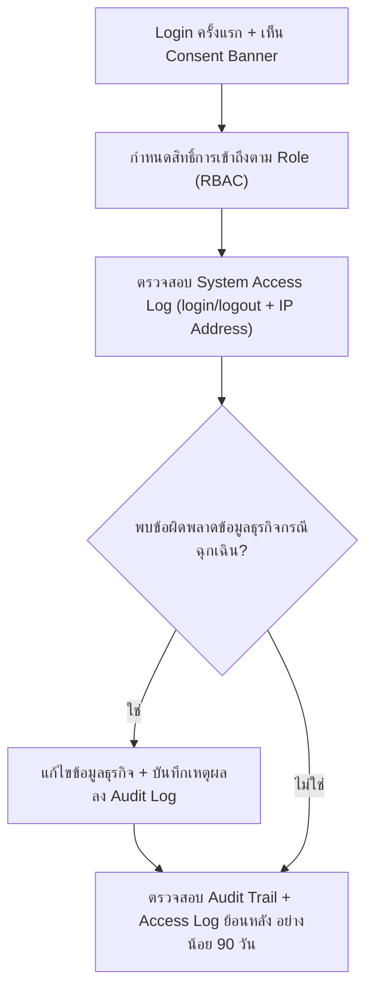

# User Journey — ผู้ดูแลระบบ (Admin)

> อ้างอิงจาก backlog.md และ spec ที่เกี่ยวข้อง — ดู [Feature List](../02-feature-list.md) สำหรับมุมมองระดับ Feature

## Diagram

## คำอธิบายตามลำดับ

1. **Login ครั้งแรก + เห็น Consent Banner** — ผู้ดูแลระบบ login เข้าระบบด้วยสิทธิ์เต็ม (Full access) ด้านระบบ และในการ login ครั้งแรกเห็น Consent Banner ตาม PDPA ที่ต้องกดยินยอมก่อนเข้าใช้งาน (อ้างอิง NFR Security/RBAC, BL-024; FR-6.3, BL-030)

2. **กำหนดสิทธิ์การเข้าถึงตาม Role (RBAC)** — ผู้ดูแลระบบกำหนดสิทธิ์การเข้าถึงตาม Role ให้ผู้ใช้แต่ละคน (เจ้าหน้าที่ รพ.สต. เห็นเฉพาะหน่วยตนเอง, ผู้บริหาร read-only ทั้งเครือข่าย ฯลฯ) เพื่อป้องกันการเข้าถึง/แก้ไขข้อมูลนอกขอบเขตหน้าที่ (อ้างอิง NFR Security, BL-024)

3. **ตรวจสอบ System Access Log (login/logout + IP Address)** — ผู้ดูแลระบบตรวจสอบบันทึก System Access Log ที่ระบบเก็บไว้แยกจาก Audit Trail ทางธุรกิจ ครอบคลุมการ login/logout ของผู้ใช้ทุกคนพร้อม IP Address (อ้างอิง FR-6.1, BL-028)

4. **พบข้อผิดพลาดข้อมูลธุรกิจกรณีฉุกเฉิน?** — หากพบข้อผิดพลาดของข้อมูลธุรกิจ (เบิก/จ่าย/ยอดคงคลัง) ที่จำเป็นต้องแก้ไขเร่งด่วน ผู้ดูแลระบบดำเนินการแก้ไขได้เฉพาะกรณีฉุกเฉินเท่านั้น โดยระบบต้องบันทึกลง audit log ทันทีพร้อมเหตุผลการแก้ไข เพื่อไม่กระทบกระบวนการอนุมัติปกติ (อ้างอิง NFR Security, BL-025; FR-1.6, BL-008)

5. **ตรวจสอบ Audit Trail + Access Log ย้อนหลัง อย่างน้อย 90 วัน** — ผู้ดูแลระบบตรวจสอบว่า Audit Trail ทางธุรกิจและ System Access Log ถูกเก็บรักษาไว้อย่างน้อย 90 วันตาม พ.ร.บ. ว่าด้วยการกระทำความผิดเกี่ยวกับคอมพิวเตอร์ฯ มาตรา 26 และหลังพ้น 90 วันข้อมูลยังคงถูกเก็บต่อเนื่องไม่มีกำหนดลบ (อ้างอิง FR-6.2, BL-029)

## บันทึกการอัปเดต (Changelog)

- **20260816:** สร้าง User Journey ของผู้ดูแลระบบ (Admin) ครั้งแรก ครอบคลุม Epic 5 ที่เกี่ยวข้องโดยตรงกับบทบาท Admin (RBAC, System Access Log, แก้ไขข้อมูลฉุกเฉิน, การเก็บรักษา log ≥90 วัน) — ไม่รวม NFR ที่เป็นคุณสมบัติเชิงระบบล้วนๆ ไม่ใช่ขั้นตอนที่ Admin ลงมือทำ (เช่น Desktop-first UI/BL-026, Availability เฉพาะเวลาราชการ/BL-033) ซึ่งครอบคลุมอยู่แล้วใน [Feature List](../02-feature-list.md) FT-022/FT-025 แต่ไม่ปรากฏเป็น step ในไฟล์นี้
