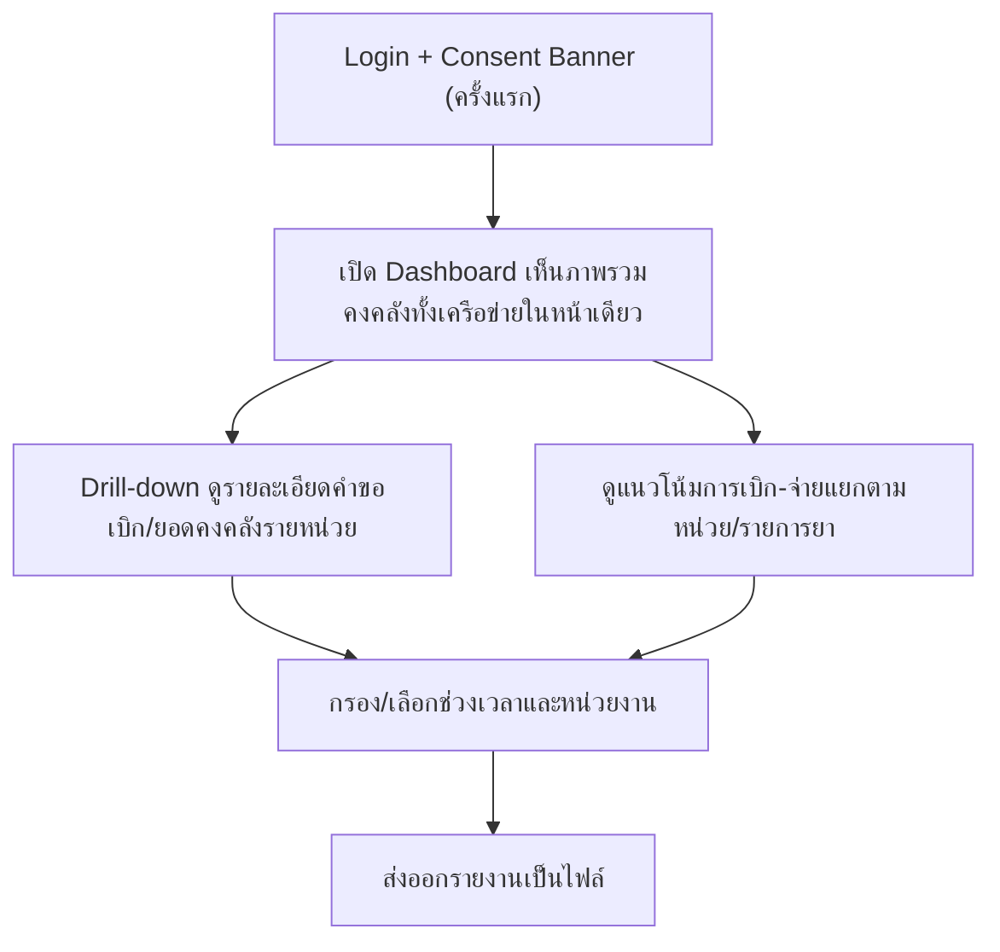

# User Journey — ผู้บริหาร รพ./สสอ.

> อ้างอิงจาก backlog.md และ spec ที่เกี่ยวข้อง — ดู [Feature List](../02-feature-list.md) สำหรับมุมมองระดับ Feature

## Diagram

## คำอธิบายตามลำดับ

1. **Login + Consent Banner (ครั้งแรก)** — ผู้บริหาร รพ./สสอ. login เข้าระบบด้วยสิทธิ์อ่านอย่างเดียว (Read-only) ทั้งเครือข่าย และในการ login ครั้งแรกเห็น Consent Banner ตาม PDPA ที่ต้องกดยินยอมก่อน (อ้างอิง NFR Security/RBAC, BL-024; FR-6.3, BL-030)

2. **เปิด Dashboard เห็นภาพรวมคงคลังทั้งเครือข่ายในหน้าเดียว** — ผู้บริหารเปิด Dashboard และเห็นสรุปยอดคงคลังของทุกหน่วยในเครือข่ายในหน้าเดียว เพื่อประเมินสถานการณ์ได้อย่างรวดเร็ว (อ้างอิง FR-3.1, US-3.1, BL-016)

3. **Drill-down ดูรายละเอียดคำขอเบิก/ยอดคงคลังรายหน่วย** — ผู้บริหารคลิกเลือกหน่วย รพ.สต. ใดหน่วยหนึ่งเพื่อดูรายละเอียดคำขอเบิก/ยอดคงคลังของหน่วยนั้นแบบ read-only โดยไม่ต้องกังวลเรื่องข้อมูลปฏิบัติการโดยตรง (อ้างอิง FR-3.5, US-3.3, BL-017)

4. **ดูแนวโน้มการเบิก-จ่ายแยกตามหน่วย/รายการยา** — ผู้บริหารเลือกดูแนวโน้มการเบิก-จ่ายยา ซึ่งระบบแสดงแยกตามหน่วยและ/หรือรายการยาได้ เพื่อวิเคราะห์แนวโน้มการใช้ยาในเครือข่าย (อ้างอิง FR-3.2, BL-018 — ไม่มี User Story เฉพาะของ FR นี้ใน spec 004)

5. **กรอง/เลือกช่วงเวลาและหน่วยงาน** — ผู้บริหารเลือกช่วงเวลาและ/หรือหน่วยงานที่ต้องการโฟกัส ข้อมูลที่แสดงจะกรองตามที่เลือก ทั้งในมุมมอง drill-down และแนวโน้ม (อ้างอิง FR-3.4, BL-019b)

6. **ส่งออกรายงานเป็นไฟล์** — ผู้บริหารกดส่งออกรายงานที่กรองแล้วเป็นไฟล์ เพื่อนำไปใช้ประกอบการประชุม/รายงานหน่วยเหนือ (อ้างอิง FR-3.3, US-3.2, BL-019)

## บันทึกการอัปเดต (Changelog)

- **20260816:** สร้าง User Journey ของผู้บริหาร รพ./สสอ. ครั้งแรก ครอบคลุม Epic 3 ทั้งหมด (ภาพรวม, drill-down, แนวโน้ม, กรอง, ส่งออกรายงาน)
- **20260816 (audit, stage 2 ของ /check-backlog-sync):** ตรวจสอบไฟล์นี้เทียบกับ backlog.md ปัจจุบัน (หลัง backlog-sync-checker ยืนยันว่า backlog sync กับ spec ครบแล้ว ไม่มีการแก้ backlog เพิ่ม) พบ 1 จุดอ้างอิงผิด: step 4 (แนวโน้มการเบิก-จ่าย, FR-3.2/BL-018) เดิมอ้างอิง "US-3.2 บริบทใกล้เคียง" แต่ US-3.2 ใน spec 004 จริงๆ คือ user story เรื่องส่งออกรายงาน (FR-3.3) ไม่ใช่แนวโน้ม — FR-3.2 ไม่มี User Story เฉพาะของตัวเองใน spec (backlog BL-018 เองก็อ้างอิงเฉพาะ FR-3.2 ไม่มี US) จึงลบการอ้างอิง US-3.2 ที่ผิดออกและระบุหมายเหตุแทน — ไม่พบจุดอื่นที่ต้องแก้ไขเพิ่มในไฟล์นี้
