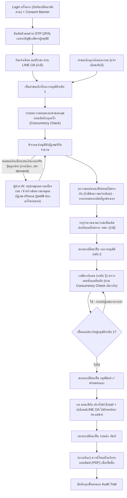

# User Journey — เภสัชกร (ผู้อนุมัติระดับ 1/2)

> อ้างอิงจาก backlog.md และ spec ที่เกี่ยวข้อง — ดู [Feature List](../02-feature-list.md) สำหรับมุมมองระดับ Feature
>
> หมายเหตุ: เภสัชกรผู้อนุมัติระดับ 1 และระดับ 2 เป็นบทบาท (role) ในกระบวนการอนุมัติ ไม่ใช่บุคคลตายตัวคนละคน — เภสัชกร รพ.แม่ข่ายคนใดคนหนึ่งอาจสลับทำหน้าที่ทั้งสองระดับได้ตามเวร (แต่ห้ามเป็นคนเดียวกันอนุมัติทั้งสองระดับในคำขอเดียวกัน) จึงรวมเป็น Journey เดียว ดู [001](../01-spec/20260816-001-project-scope-and-problem-background.md)

## Diagram

## คำอธิบายตามลำดับ

1. **Login ครั้งแรก (บังคับเปลี่ยนรหัสผ่าน) + Consent Banner** — เภสัชกร login เข้าระบบด้วยสิทธิ์อ่าน/เขียนทั้งเครือข่าย ในการ login ครั้งแรกระบบบังคับให้ตั้งรหัสผ่านใหม่ (อย่างน้อย 8 ตัวอักษร — ยืนยันแล้ว 20260825) ก่อนเข้าใช้งานหน้าจออื่น (อ้างอิง FR-6.6, BL-037 — เพิ่ม 20260824) และเห็น Consent Banner ตาม PDPA ที่ต้องกดยินยอมก่อน (อ้างอิง NFR Security/RBAC, BL-024; FR-6.3, BL-030)

2. **ยืนยันตัวตนด้วย OTP (2FA) เฉพาะบัญชีเภสัชกรผู้อนุมัติ** — หลัง login สำเร็จด้วย username/password แล้ว บัญชีเภสัชกรผู้อนุมัติระดับ 1 และระดับ 2 ต้องยืนยันตัวตนเพิ่มเติมด้วย OTP ก่อนเข้าใช้งานได้ เนื่องจากมีผลผูกพันทาง audit/กฎหมาย — role อื่น (เจ้าหน้าที่ รพ.สต., ผู้บริหาร, Admin) ไม่บังคับขั้นตอนนี้ โดย OTP กรอกผิดได้ไม่เกิน 3 ครั้งก่อนล็อก หมดอายุภายใน 5 นาที และส่งผ่านอีเมลที่มีอยู่แล้วในระบบ (ยืนยันแล้ว 20260825) (อ้างอิง FR-6.8, BL-038 — เพิ่ม 20260824)

3. **รับแจ้งเตือน "ขอปรึกษา" ผ่าน LINE OA (ถ้ามี)** — หากเจ้าหน้าที่ รพ.สต. กด "ขอปรึกษา" เพราะไม่เห็นด้วยกับยอดแนะนำเบิก กลุ่มเภสัชกรจะได้รับ alert ผ่าน LINE Official Account ทันที เพื่อช่วยพิจารณาก่อนเจ้าหน้าที่ยืนยันคำขอ (อ้างอิง FR-1.1b, US-1.1b, BL-003)

4. **เห็นคำขอเบิกที่รอการอนุมัติระดับ 1** — เภสัชกรผู้อนุมัติระดับ 1 เห็นคำขอเบิกทั้งหมดที่รอดำเนินการ (อ้างอิง US-1.2, BL-004)

5. **ระบบตรวจสอบสถานะคำขอล่าสุดก่อนบันทึกทุกครั้ง (Concurrency Check)** — ก่อนบันทึกการอนุมัติ/แก้ไขคำขอเบิกใดๆ (ทั้งขั้นตอนอนุมัติระดับ 1 ในข้อ 6 และระดับ 2 ในข้อ 10) ระบบตรวจสอบสถานะล่าสุดของคำขอนั้นก่อนทุกครั้ง (Optimistic Concurrency Check) หากพบว่ามีผู้อื่นแก้ไข/บันทึกคำขอเดียวกันไปแล้ว ระบบปฏิเสธการบันทึกและแสดง error ทันที ให้เภสัชกรโหลดข้อมูลล่าสุดก่อนดำเนินการต่อ — เกี่ยวพันโดยตรงกับกฎห้ามอนุมัติระดับ 1 และ 2 ด้วยเภสัชกรคนเดียวกัน (อ้างอิง FR-6.5, BL-036, BL-004 — เพิ่ม 20260824)

6. **พิจารณา/อนุมัติ/ปฏิเสธ/ปรับจำนวน** — เภสัชกรระดับ 1 พิจารณาคำขอและอนุมัติ/ปฏิเสธ/ปรับจำนวนได้ (อ้างอิง FR-1.2, US-1.2, BL-004) — ชื่อของเภสัชกรผู้อนุมัติระดับ 1 และวันเวลาที่อนุมัตินี้จะถูกพิมพ์ไว้ล่วงหน้าในบล็อกลายเซ็น "ผู้ตรวจสอบ" ของใบเบิกยาแบบพิมพ์ (PDF) ที่เจ้าหน้าที่ รพ.สต. ดาวน์โหลดได้ภายหลัง — ดู [staff-hph-journey.md](staff-hph-journey.md) step 9 (อ้างอิง FR-7.6, BL-046)

7. **(ทางเลือก) เรียกดูผู้ช่วย AI (on-demand) — สรุปเหตุผลความเบี่ยงเบน / ช่วยร่างข้อความเหตุผลปฏิเสธ-ปรับยอด** — ระหว่างพิจารณาคำขอ (step 6) หากยอดขอเบิกของคำขอนั้นเบี่ยงเบนจากยอดแนะนำเกินเกณฑ์ % ที่ Admin ตั้งค่าไว้ (Config Key ปรับได้แนวทางเดียวกับ FR-6.10/BL-043 — ค่าเริ่มต้น 25%, ขอบเขตปรับได้ 5-100%) ปุ่มเรียกดูผู้ช่วย AI จะถูกเน้น/แสดง badge ให้เห็นชัดกว่าคำขออื่น แต่เนื้อหายังไม่แสดงจนกว่าเภสัชกรจะกดเรียกดูเอง (on-demand เสมอ ไม่มี auto-display) — เมื่อกด ระบบมีความสามารถให้เลือกใช้ได้ 2 อย่าง (พัฒนาพร้อมกัน): (ก) สรุปเหตุผลความเบี่ยงเบนของยอดขอเบิกเทียบยอดแนะนำ โดยอ้างอิงเฉพาะประวัติของหน่วยตนเองย้อนหลังไม่เกิน 3 ปี เนื้อหาเป็นข้อสังเกตทั่วไปเท่านั้น ห้ามฟันธง/แนะนำการตัดสินใจ (ข) ช่วยร่างข้อความเหตุผลตอนปฏิเสธ/ปรับยอด โดย prefill ข้อความร่างลงในช่องกรอกทันที ซึ่งเภสัชกรต้องตรวจสอบ/แก้ไขข้อความก่อนกดส่งเสมอ (ระบบปฏิเสธการส่งถ้าข้อความยังไม่ถูกแก้ไข/แตะต้องเลย) — ไม่ว่าใช้ความสามารถใด ระบบต้องไม่ดำเนินการอนุมัติ/ปฏิเสธ/ปรับจำนวนใดๆ โดยอัตโนมัติ เภสัชกรยังคงเป็นผู้ตัดสินใจสุดท้ายและต้องกดยืนยันการกระทำเองเสมอ แล้ววนกลับเข้าสู่ขั้นตอนพิจารณา (step 6) เดิม — ยืนยันขอบเขตครบทุกประเด็นแล้ว 20260914 (3 รอบ) **ยังไม่ได้รับคำสั่งเข้าสู่เฟสพัฒนา** (อ้างอิง FR-8.1-FR-8.6, US-8.1, US-8.2, BL-047, [008](../01-spec/20260914-008-pharmacist-approval-ai-assistant.md))

8. **ตรวจสอบ/คอนเฟิร์มยอดไม่ตรงกัน (ถ้ามีข้อความแจ้งเตือนปรากฏอยู่)** — หากคำขอที่กำลังพิจารณามีข้อความแจ้งเตือนว่ายอดคงเหลือที่เจ้าหน้าที่แจ้งเอง (FR-1.1a) กับยอดคงคลังที่ระบบคำนวณ (FR-1.5) ไม่ตรงกัน (ดู [staff-hph-journey.md](staff-hph-journey.md) step 4) เภสัชกรผู้อนุมัติระดับ 1 (ไม่ใช่เจ้าหน้าที่ รพ.สต.) เป็นผู้ตรวจสอบและกด "คอนเฟิร์ม" การกระทบยอดนี้เป็นส่วนหนึ่งของขั้นตอนอนุมัติระดับ 1 นี้เอง (ไม่ใช่ขั้นตอนแยก) โดยระบบให้กรอกยอดคงเหลือที่ถูกต้องด้วยตนเอง ซึ่งค่านั้นกลายเป็นยอดคงเหลือที่ถูกต้อง/มีผลผูกพันต่อแทนยอดเดิมที่เจ้าหน้าที่ รพ.สต. รายงาน — ยืนยันครบแล้ว 20260823 (รอบ 4) (อ้างอิง FR-1.9, FR-1.9a, FR-1.9b, US-1.6, BL-032, BL-004)

9. **ระบุจำนวนคาดการณ์เพิ่มเติมสำหรับเคสใหม่จาก รพศ. (ถ้ามี)** — ระหว่างพิจารณาคำขอ หากมีผู้ป่วยเคสใหม่ที่ รพศ. ส่งต่อกลับมารับยาที่ รพ.สต. ซึ่งยังไม่มีข้อมูลย้อนหลัง เภสัชกรระบุจำนวนคาดการณ์เพิ่มเติมเพื่อบวกเข้ากับเกณฑ์ safety stock ของหน่วยนั้น (อ้างอิง FR-2.4, US-2.3, BL-015)

10. **สถานะเปลี่ยนเป็น "รอการอนุมัติระดับ 2"** — เมื่อเภสัชกรระดับ 1 อนุมัติแล้ว สถานะคำขอเปลี่ยนเป็น "รอการอนุมัติระดับ 2" (อ้างอิง FR-1.2, BL-004)

11. **เภสัชกรอีกคน (ระดับ 2) ตรวจสอบซ้ำและยืนยัน** — เภสัชกรผู้ตรวจสอบระดับ 2 เห็นคำขอที่ผ่านระดับ 1 แล้ว และตรวจสอบซ้ำก่อนยืนยัน โดยการบันทึกยืนยันนี้ผ่าน Concurrency Check เดียวกันกับข้อ 5 ด้วย (อ้างอิง US-1.2b, BL-004; FR-6.5, BL-036)

12. **ตรวจสอบว่าเป็นคนเดียวกับผู้อนุมัติระดับ 1 หรือไม่** — หากเภสัชกรคนเดียวกันเป็นผู้อนุมัติระดับ 1 พยายามยืนยันระดับ 2 ของคำขอเดียวกัน ระบบต้องปฏิเสธการกระทำ (อ้างอิง US-1.2b, BL-004; NFR Security, BL-024)

13. **สถานะเปลี่ยนเป็น "อนุมัติแล้ว" / "พร้อมส่งออก"** — เมื่ออนุมัติครบสองระดับโดยคนละคน สถานะเปลี่ยนเป็น "อนุมัติแล้ว" และระบบเปลี่ยนต่อเป็น "พร้อมส่งออก" โดยอัตโนมัติ (อ้างอิง FR-1.2/FR-1.3, BL-004, BL-005)

14. **กด "คอนเฟิร์ม" สร้างไฟล์ Excel + ส่งอีเมล/LINE OA ไปฝ่ายคลังยา รพ.แม่ข่าย** — เภสัชกรผู้อนุมัติระดับ 2 กด "คอนเฟิร์ม" บนหน้าจอ ระบบสร้างไฟล์ Excel คำขอเบิกและส่งเข้าอีเมล + แจ้งเตือน LINE OA ไปยังฝ่ายคลังยา รพ.แม่ข่ายในขั้นตอนเดียว (อ้างอิง FR-4.1, FR-4.2, US-4.1, BL-020) — ไฟล์ที่สร้างมีโครงสร้างคอลัมน์ตรงกับที่ INVC รับนำเข้าได้ทันที (ยืนยันแล้ว 20260823, `HOSP_CODE`/`QTY_DISP`/`WORKING_CODE`) และถ้าคำขอของหน่วยนั้นมีรายการยาหมวด "บัญชีแพทย์" ปนอยู่ด้วย ระบบจะสร้างและส่ง/เปิดดาวน์โหลด **2 ไฟล์แยกกัน** พร้อมกันในขั้นตอนเดียวกันนี้ (`ใบเบิกยา{ชื่อหน่วย}.xls` สำหรับยาปกติ และ `ใบเบิกยาบัญชีแพทย์{ชื่อหน่วย}.xls` สำหรับยาบัญชีแพทย์เท่านั้น) แทนที่จะเป็นไฟล์เดียว (อ้างอิง FR-4.3, FR-4.3a, FR-4.3b, US-4.2, BL-022, BL-034)

15. **สถานะเปลี่ยนเป็น "จ่ายแล้ว" ทันที** — ทันทีที่กดคอนเฟิร์ม ระบบเปลี่ยนสถานะคำขอเป็น "จ่ายแล้ว" โดยไม่ต้องรอการยืนยันย้อนกลับจากฝ่ายคลังยาว่านำเข้า INVC สำเร็จ (อ้างอิง FR-1.3, FR-4.1, BL-005, BL-020)

16. **(ทางเลือก) ดาวน์โหลดใบเบิกยาแบบพิมพ์ (PDF) เพื่อเซ็นชื่อ** — นอกจากเจ้าหน้าที่ รพ.สต. เจ้าของคำขอแล้ว เภสัชกร (ผู้อนุมัติทั้งระดับ 1 และระดับ 2) เองก็ดาวน์โหลดใบเบิกยาแบบพิมพ์ (PDF) ของคำขอที่ผ่านอนุมัติครบ 2 ระดับแล้วได้เช่นกัน (สิทธิ์ขยายเพิ่มเติม ยืนยันแล้ว 20260916) — ดูรายละเอียดรูปแบบไฟล์/บล็อกลายเซ็นที่ [staff-hph-journey.md](staff-hph-journey.md) step 9 (อ้างอิง FR-7.12, BL-044)

17. **บันทึกทุกขั้นตอนลง Audit Trail** — ทุกขั้นตอนของการอนุมัติและคอนเฟิร์มถูกบันทึกผู้กระทำ วันเวลา และรายละเอียดลง audit log ที่แก้ไขไม่ได้ (อ้างอิง FR-1.6, BL-008)

18. **คำขอเบิกฉุกเฉินนอกรอบ (แจ้งเตือนทันที)** — สำหรับคำขอเบิกฉุกเฉิน เภสัชกรได้รับ notify ทันทีเพื่อให้กระบวนการอนุมัติทั้งสองระดับเร็วขึ้นกว่าคำขอปกติ (อ้างอิง FR-1.7, US-1.4, BL-009)

## บันทึกการอัปเดต (Changelog)

- **20260816:** สร้าง User Journey ของเภสัชกร (รวมบทบาทผู้อนุมัติระดับ 1 และ 2 เป็น Journey เดียวตามที่ spec 001 ระบุว่าเป็นบทบาทที่สลับกันได้) ครั้งแรก ครอบคลุม Epic 1 (อนุมัติสองระดับ, ปรับ safety stock เคสใหม่, audit trail) และ Epic 4 (คอนเฟิร์มส่งออกไฟล์)
- **20260823 (audit, stage 2 ของ /check-backlog-sync, หลัง backlog-sync-checker ยืนยัน BL-022 และเพิ่ม BL-034):** ขยายคำอธิบาย step 10 ("กด คอนเฟิร์ม") ให้สะท้อนรูปแบบไฟล์ INVC ที่ยืนยันแล้ว (FR-4.3) และตรรกะแยกไฟล์เป็น 2 ชุดเมื่อคำขอมีรายการยาบัญชีแพทย์ (FR-4.3a/FR-4.3b, BL-034) — ไม่แก้ไข diagram เนื่องจากยังเป็น node เดิม (การแยกไฟล์เป็นรายละเอียดของการสร้างไฟล์ ไม่ใช่ branch ใหม่ของ journey) ไม่พบจุดอื่นในไฟล์นี้ที่ต้องแก้ไข
- **20260824 (audit, หลัง backlog-sync-checker ปิด Open Item สุดท้ายของ BL-032 เมื่อ 20260823 รอบ 4 — FR-1.9b, ผูกกับ BL-004):** เดิม journey นี้ยังไม่มี step ใดครอบคลุมการตรวจสอบ/คอนเฟิร์มยอดไม่ตรงกัน (BL-032) ที่ตอนนี้ยืนยันแล้วว่าเป็นส่วนหนึ่งของขั้นตอนอนุมัติระดับ 1 (BL-004) — เพิ่ม node ใหม่ `D2` ในไดอะแกรมระหว่าง "พิจารณา/อนุมัติ/ปฏิเสธ/ปรับจำนวน" (D) กับ "ระบุจำนวนคาดการณ์เพิ่มเติม" (E) เดิม (มีบรรทัดฐานจาก node E ที่เป็น conditional sub-step ของขั้นตอนอนุมัติระดับ 1 อยู่แล้ว) และเพิ่มคำอธิบายเป็น step ใหม่ที่ 5 (เลื่อนหมายเลข step เดิม 5-13 เป็น 6-14) พร้อมอ้างอิง FR-1.9/FR-1.9a/FR-1.9b/US-1.6/BL-032/BL-004 และ cross-reference กลับไปยัง staff-hph-journey.md step 4 — auto-fixed เนื่องจากมีหลักฐานตรงตัวจาก backlog.md (BL-004 หมายเหตุ 20260823 รอบ 4) ไม่กำกวม
- **20260824 (audit รอบที่ 2, หลัง requirement-writer เพิ่ม BL-035 ถึง BL-043 — NFR เพิ่มเติม 10 หมวดใน Epic 5):** ตรวจสอบไฟล์นี้เทียบกับ backlog.md เวอร์ชันล่าสุด พบ 3 รายการที่มีการกระทำ/พฤติกรรมที่เภสัชกรสังเกตเห็นได้จริงตาม AC แต่ยังไม่ปรากฏใน journey นี้ จึงเพิ่ม (auto-fixed): (1) **BL-037** (บังคับเปลี่ยนรหัสผ่านครั้งแรก, ใช้กับทุก role) — แก้ node A และคำอธิบาย step 1 ให้รวมการบังคับเปลี่ยนรหัสผ่านไว้ในขั้นตอน Login เดียวกับ Consent Banner (2) **BL-038** (2FA/OTP เฉพาะเภสัชกรผู้อนุมัติ) — เพิ่ม node ใหม่ `A2` ในไดอะแกรมทันทีหลัง Login (A) และเพิ่มคำอธิบายเป็น step ใหม่ที่ 2 (3) **BL-036** (Optimistic Concurrency Check ผูกกับ BL-004) — เพิ่ม node ใหม่ `P1` ในไดอะแกรมระหว่าง "เห็นคำขอเบิกที่รอการอนุมัติระดับ 1" (C) กับ "พิจารณา/อนุมัติ..." (D เดิม) และเพิ่มคำอธิบายเป็น step ใหม่ที่ 5 พร้อมระบุในคำอธิบาย step 10 (เดิม step 8, การอนุมัติระดับ 2) ว่าใช้ Concurrency Check เดียวกัน — การเพิ่ม node/step ทั้งหมดนี้ทำให้ต้องเลื่อนหมายเลข step เดิมทั้งหมดไปอีก 2 ตำแหน่ง (เดิม 1-14 กลายเป็น 1,3,4,6-16 ตามตำแหน่งใหม่) — ตรวจสอบ BL-035/BL-039/BL-040/BL-041/BL-042/BL-043 อีก 6 รายการแล้วพบว่าไม่มีขั้นตอนใดที่เภสัชกรลงมือทำโดยตรงตาม AC (เป็น NFR เชิงระบบ/infrastructure ล้วนๆ หรือเป็นขั้นตอนของ Admin) จึงไม่เพิ่ม step อื่นในไฟล์นี้ — ดู [Feature List](../02-feature-list.md) FT-026 ถึง FT-034 สำหรับเหตุผลแบบเต็มของแต่ละรายการ — **หมายเหตุ cross-reference:** [staff-hph-journey.md](staff-hph-journey.md) step 4 อ้างอิงมาที่ "pharmacist-journey.md step 5" (จากรอบ audit ก่อนหน้า) ซึ่งปัจจุบันคือ**step 7** แล้วหลังการเลื่อนหมายเลขรอบนี้ — ได้แก้ลิงก์อ้างอิงในไฟล์ staff-hph-journey.md ให้ตรงกันแล้วในรอบนี้ด้วย
- **20260825 (audit, หลังผู้ใช้ปิด `[รอยืนยัน]` ของ BL-037/BL-038 = รหัสผ่านขั้นต่ำ 8 ตัวอักษร และรายละเอียด OTP):** ตรวจสอบไฟล์นี้เทียบกับ backlog.md เวอร์ชันล่าสุด พบ 2 จุดที่ยังขาดรายละเอียดที่เพิ่งปิด `[รอยืนยัน]` (enrichment, ไม่ใช่การแก้ข้อผิดพลาดเดิม): (1) step 1 (Login ครั้งแรก) เพิ่มรายละเอียด "อย่างน้อย 8 ตัวอักษร" ของรหัสผ่านใหม่ (BL-037) (2) step 2 (ยืนยันตัวตนด้วย OTP) เพิ่มรายละเอียดที่ยืนยันแล้ว — กรอกผิดได้ไม่เกิน 3 ครั้งก่อนล็อก, หมดอายุภายใน 5 นาที, ส่งผ่านอีเมลช่องทางเดิม (BL-038) ไม่พบจุดอื่นในไฟล์นี้ที่ต้องแก้ไข
- **20260831 (audit, stage 2 ของ /check-backlog-sync, หลัง backlog-sync-checker เพิ่ม spec 007/BL-044-046, FT-035 ใหม่ใน Feature List):** ตรวจสอบไฟล์นี้เทียบกับ backlog.md เวอร์ชันล่าสุด — BL-044/BL-045/BL-046 (ใบเบิกยาแบบพิมพ์เพื่อเซ็นชื่อ) เป็นการกระทำของเจ้าหน้าที่ รพ.สต. เท่านั้น (FR-7.12) เภสัชกรผู้อนุมัติระดับ 1 ไม่ใช่ผู้ดาวน์โหลดเอง จึง**ไม่เพิ่ม step/node ใหม่**ในไฟล์นี้ (ไม่มี action ใหม่ที่เภสัชกรลงมือทำ) แต่ชื่อ+เวลาของการอนุมัติระดับ 1 (step 6 เดิม) ถูกนำไปพิมพ์ไว้ล่วงหน้าในบล็อกลายเซ็น "ผู้ตรวจสอบ" ของเอกสารนั้น (FR-7.6, BL-046) จึงเพิ่มหมายเหตุ cross-reference สั้นๆ ในคำอธิบาย step 6 ชี้ไปยัง [staff-hph-journey.md](staff-hph-journey.md) step 9 ใหม่ (enrichment ของ step เดิม ไม่ใช่ step ใหม่) — ไม่แก้ diagram เนื่องจาก node D เดิมยังคงถูกต้อง ตรวจสอบส่วนที่เหลือของไฟล์ไม่พบจุดอื่นที่ต้องแก้ไข
- **20260914 (audit, stage 2 ของ /check-backlog-sync, หลัง backlog-sync-checker ยืนยัน spec 008/BL-047 sync ครบ):** ตรวจสอบไฟล์นี้เทียบกับ backlog.md เวอร์ชันล่าสุด — พบว่า **BL-047** (ผู้ช่วย AI สำหรับเภสัชกรผู้อนุมัติระดับ 1, ต่อยอด BL-004, FT-036 ใหม่ใน Feature List) เป็นการกระทำที่เภสัชกรผู้อนุมัติระดับ 1 เรียกใช้ได้เองระหว่างขั้นตอนพิจารณา (step 6) แต่ยังไม่ปรากฏใน journey นี้เลย — เพิ่ม node ใหม่ `AI` ในไดอะแกรม (แยกสาขาทางเลือกจาก node D แล้ววนกลับเข้า D เดิม เนื่องจากเป็น on-demand ที่ไม่เปลี่ยน flow การอนุมัติหลัก) และเพิ่มคำอธิบายเป็น step ใหม่ที่ 7 (เลื่อนหมายเลข step เดิม 7-16 เป็น 8-17) ครอบคลุมเกณฑ์ % trigger ที่ Admin ปรับได้ (ค่าเริ่มต้น 25%, ช่วง 5-100%), การแสดงผลแบบ on-demand เสมอ, ทั้งสองความสามารถ (สรุปเหตุผลความเบี่ยงเบน/ร่างข้อความเหตุผล), กลไก prefill-ต้องแก้ไขก่อนส่ง, และย้ำว่าเภสัชกรเป็นผู้ตัดสินใจสุดท้ายเสมอ ไม่มีการอนุมัติ/ปฏิเสธอัตโนมัติ พร้อมระบุชัดว่า **ยังไม่ได้รับคำสั่งเข้าสู่เฟสพัฒนา** ตรงกับ backlog.md/CLAUDE.md — auto-fixed เนื่องจากมีหลักฐานตรงตัวจาก backlog.md BL-047 (resolved ครบ 20260914 รอบ 3) ไม่กำกวม — **cross-reference ที่ต้องแก้ตาม:** [staff-hph-journey.md](staff-hph-journey.md) step 4 เดิมอ้างอิงมาที่ "pharmacist-journey.md step 7" (ขั้นตอนกระทบยอด BL-032) ซึ่งปัจจุบันคือ**step 8**แล้วหลังการเลื่อนหมายเลขรอบนี้ — ได้แก้ลิงก์อ้างอิงในไฟล์ staff-hph-journey.md ให้ตรงกันแล้วในรอบนี้ด้วย (step 6/step 9 ของทั้งสองไฟล์ไม่กระทบ เนื่องจากตำแหน่งเดิมไม่เปลี่ยน) — ตรวจสอบ staff-hph-journey.md/executive-journey.md/admin-journey.md อีก 3 ไฟล์แล้วพบว่า BL-047 ผูกกับเภสัชกรผู้อนุมัติระดับ 1 เท่านั้น ไม่มี action ใดที่ role อื่นลงมือทำ จึงไม่เพิ่ม step ในไฟล์อื่น
- **20260916 (audit เต็มรูปแบบ, หลัง backlog-sync-checker แก้ BL-044/spec 007 FR-7.12 ให้ขยายสิทธิ์ดาวน์โหลดรวมเภสัชกรด้วย):** ตรวจสอบไฟล์นี้เทียบกับ backlog.md/spec 007 เวอร์ชันล่าสุด — พบว่าเภสัชกร (ผู้อนุมัติระดับ 1/2) ได้รับสิทธิ์ดาวน์โหลดใบเบิกยาแบบพิมพ์ (PDF) เพิ่มเติมแล้ว (FR-7.12, ยืนยันแล้ว 20260916) แต่ยังไม่ปรากฏเป็น step ในไฟล์นี้ — เพิ่ม node ใหม่ `K2` ในไดอะแกรมระหว่าง "สถานะเปลี่ยนเป็น จ่ายแล้ว" (K) กับ "บันทึกทุกขั้นตอนลง Audit Trail" (N เดิม) และเพิ่มคำอธิบายเป็น step ใหม่ที่ 16 (เลื่อนหมายเลข step เดิม 16-17 เป็น 17-18) พร้อม cross-reference ไปยัง [staff-hph-journey.md](staff-hph-journey.md) step 9 สำหรับรายละเอียดรูปแบบไฟล์ — auto-fixed เนื่องจากมีหลักฐานตรงตัวจาก spec 007 หัวข้อ "เพิ่มเติม 20260916" ไม่กำกวม — ตรวจสอบส่วนที่เหลือของไฟล์ไม่พบจุดอื่นที่ต้องแก้ไข ดู [executive-journey.md](executive-journey.md) และ [admin-journey.md](admin-journey.md) สำหรับ enrichment คู่กันของ FR-7.12 ในอีก 2 role
