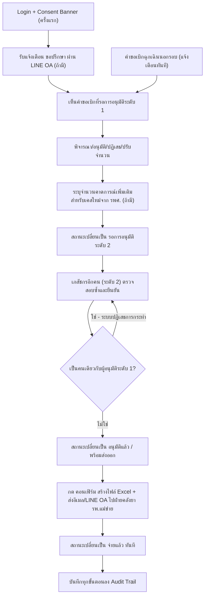

# User Journey — เภสัชกร (ผู้อนุมัติระดับ 1/2)

> อ้างอิงจาก backlog.md และ spec ที่เกี่ยวข้อง — ดู [Feature List](../02-feature-list.md) สำหรับมุมมองระดับ Feature
>
> หมายเหตุ: เภสัชกรผู้อนุมัติระดับ 1 และระดับ 2 เป็นบทบาท (role) ในกระบวนการอนุมัติ ไม่ใช่บุคคลตายตัวคนละคน — เภสัชกร รพ.แม่ข่ายคนใดคนหนึ่งอาจสลับทำหน้าที่ทั้งสองระดับได้ตามเวร (แต่ห้ามเป็นคนเดียวกันอนุมัติทั้งสองระดับในคำขอเดียวกัน) จึงรวมเป็น Journey เดียว ดู [001](../01-spec/20260816-001-project-scope-and-problem-background.md)

## Diagram

## คำอธิบายตามลำดับ

1. **Login + Consent Banner (ครั้งแรก)** — เภสัชกร login เข้าระบบด้วยสิทธิ์อ่าน/เขียนทั้งเครือข่าย และในการ login ครั้งแรกเห็น Consent Banner ตาม PDPA ที่ต้องกดยินยอมก่อน (อ้างอิง NFR Security/RBAC, BL-024; FR-6.3, BL-030)

2. **รับแจ้งเตือน "ขอปรึกษา" ผ่าน LINE OA (ถ้ามี)** — หากเจ้าหน้าที่ รพ.สต. กด "ขอปรึกษา" เพราะไม่เห็นด้วยกับยอดแนะนำเบิก กลุ่มเภสัชกรจะได้รับ alert ผ่าน LINE Official Account ทันที เพื่อช่วยพิจารณาก่อนเจ้าหน้าที่ยืนยันคำขอ (อ้างอิง FR-1.1b, US-1.1b, BL-003)

3. **เห็นคำขอเบิกที่รอการอนุมัติระดับ 1** — เภสัชกรผู้อนุมัติระดับ 1 เห็นคำขอเบิกทั้งหมดที่รอดำเนินการ (อ้างอิง US-1.2, BL-004)

4. **พิจารณา/อนุมัติ/ปฏิเสธ/ปรับจำนวน** — เภสัชกรระดับ 1 พิจารณาคำขอและอนุมัติ/ปฏิเสธ/ปรับจำนวนได้ (อ้างอิง FR-1.2, US-1.2, BL-004)

5. **ระบุจำนวนคาดการณ์เพิ่มเติมสำหรับเคสใหม่จาก รพศ. (ถ้ามี)** — ระหว่างพิจารณาคำขอ หากมีผู้ป่วยเคสใหม่ที่ รพศ. ส่งต่อกลับมารับยาที่ รพ.สต. ซึ่งยังไม่มีข้อมูลย้อนหลัง เภสัชกรระบุจำนวนคาดการณ์เพิ่มเติมเพื่อบวกเข้ากับเกณฑ์ safety stock ของหน่วยนั้น (อ้างอิง FR-2.4, US-2.3, BL-015)

6. **สถานะเปลี่ยนเป็น "รอการอนุมัติระดับ 2"** — เมื่อเภสัชกรระดับ 1 อนุมัติแล้ว สถานะคำขอเปลี่ยนเป็น "รอการอนุมัติระดับ 2" (อ้างอิง FR-1.2, BL-004)

7. **เภสัชกรอีกคน (ระดับ 2) ตรวจสอบซ้ำและยืนยัน** — เภสัชกรผู้ตรวจสอบระดับ 2 เห็นคำขอที่ผ่านระดับ 1 แล้ว และตรวจสอบซ้ำก่อนยืนยัน (อ้างอิง US-1.2b, BL-004)

8. **ตรวจสอบว่าเป็นคนเดียวกับผู้อนุมัติระดับ 1 หรือไม่** — หากเภสัชกรคนเดียวกันเป็นผู้อนุมัติระดับ 1 พยายามยืนยันระดับ 2 ของคำขอเดียวกัน ระบบต้องปฏิเสธการกระทำ (อ้างอิง US-1.2b, BL-004; NFR Security, BL-024)

9. **สถานะเปลี่ยนเป็น "อนุมัติแล้ว" / "พร้อมส่งออก"** — เมื่ออนุมัติครบสองระดับโดยคนละคน สถานะเปลี่ยนเป็น "อนุมัติแล้ว" และระบบเปลี่ยนต่อเป็น "พร้อมส่งออก" โดยอัตโนมัติ (อ้างอิง FR-1.2/FR-1.3, BL-004, BL-005)

10. **กด "คอนเฟิร์ม" สร้างไฟล์ Excel + ส่งอีเมล/LINE OA ไปฝ่ายคลังยา รพ.แม่ข่าย** — เภสัชกรผู้อนุมัติระดับ 2 กด "คอนเฟิร์ม" บนหน้าจอ ระบบสร้างไฟล์ Excel คำขอเบิกและส่งเข้าอีเมล + แจ้งเตือน LINE OA ไปยังฝ่ายคลังยา รพ.แม่ข่ายในขั้นตอนเดียว (อ้างอิง FR-4.1, FR-4.2, US-4.1, BL-020)

11. **สถานะเปลี่ยนเป็น "จ่ายแล้ว" ทันที** — ทันทีที่กดคอนเฟิร์ม ระบบเปลี่ยนสถานะคำขอเป็น "จ่ายแล้ว" โดยไม่ต้องรอการยืนยันย้อนกลับจากฝ่ายคลังยาว่านำเข้า INVC สำเร็จ (อ้างอิง FR-1.3, FR-4.1, BL-005, BL-020)

12. **บันทึกทุกขั้นตอนลง Audit Trail** — ทุกขั้นตอนของการอนุมัติและคอนเฟิร์มถูกบันทึกผู้กระทำ วันเวลา และรายละเอียดลง audit log ที่แก้ไขไม่ได้ (อ้างอิง FR-1.6, BL-008)

13. **คำขอเบิกฉุกเฉินนอกรอบ (แจ้งเตือนทันที)** — สำหรับคำขอเบิกฉุกเฉิน เภสัชกรได้รับ notify ทันทีเพื่อให้กระบวนการอนุมัติทั้งสองระดับเร็วขึ้นกว่าคำขอปกติ (อ้างอิง FR-1.7, US-1.4, BL-009)

## บันทึกการอัปเดต (Changelog)

- **20260816:** สร้าง User Journey ของเภสัชกร (รวมบทบาทผู้อนุมัติระดับ 1 และ 2 เป็น Journey เดียวตามที่ spec 001 ระบุว่าเป็นบทบาทที่สลับกันได้) ครั้งแรก ครอบคลุม Epic 1 (อนุมัติสองระดับ, ปรับ safety stock เคสใหม่, audit trail) และ Epic 4 (คอนเฟิร์มส่งออกไฟล์)
