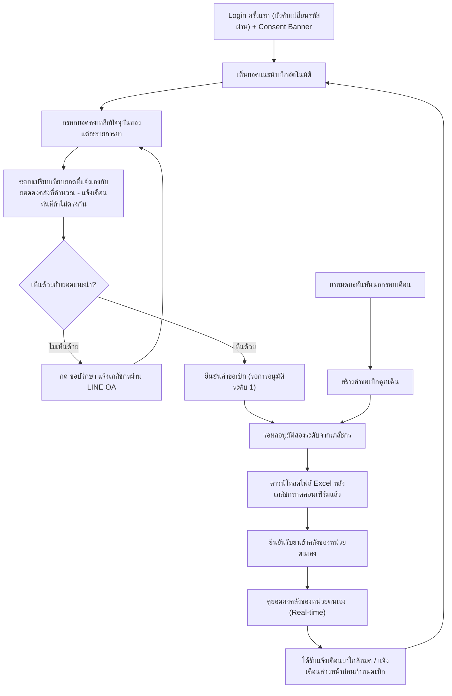

# User Journey — เจ้าหน้าที่ รพ.สต.

> อ้างอิงจาก backlog.md และ spec ที่เกี่ยวข้อง — ดู [Feature List](../02-feature-list.md) สำหรับมุมมองระดับ Feature

## Diagram

## คำอธิบายตามลำดับ

1. **Login ครั้งแรก (บังคับเปลี่ยนรหัสผ่าน) + Consent Banner** — เจ้าหน้าที่ รพ.สต. login เข้าระบบ เห็นเฉพาะข้อมูลของหน่วยตนเอง ในการ login ครั้งแรกระบบบังคับให้ตั้งรหัสผ่านใหม่ (อย่างน้อย 8 ตัวอักษร — ยืนยันแล้ว 20260825) ก่อนเข้าใช้งานหน้าจออื่น (อ้างอิง FR-6.6, BL-037 — เพิ่ม 20260824) และเห็น Consent Banner ตาม PDPA ที่ต้องกดยินยอมก่อนเข้าใช้งาน (อ้างอิง NFR Security/RBAC, BL-024; FR-6.3, BL-030)

2. **เห็นยอดแนะนำเบิกอัตโนมัติ** — เมื่อเปิดหน้าสร้างคำขอเบิกของเดือนนั้น ระบบแสดงยอดแนะนำเบิกต่อรายการยาที่คำนวณอัตโนมัติจากเกณฑ์ safety stock (อ้างอิง FR-1.1, US-1.0, BL-001)

3. **กรอกยอดคงเหลือปัจจุบันของแต่ละรายการยา** — เจ้าหน้าที่กรอกยอดคงเหลือปัจจุบัน ณ วันที่สร้างคำขอ เพื่อใช้คำนวณยอดแนะนำและเป็นข้อมูลนำเข้าต่อเนื่องของการปรับปรุง safety stock (อ้างอิง FR-1.1a, US-1.1, BL-002)

4. **ระบบเปรียบเทียบยอดที่แจ้งเองกับยอดคงคลังที่คำนวณ (แจ้งเตือนทันทีถ้าไม่ตรงกัน)** — หลังกรอกยอดคงเหลือ ระบบเปรียบเทียบยอดคงเหลือที่เจ้าหน้าที่แจ้งเอง (FR-1.1a) กับยอดคงคลังที่ระบบคำนวณอัตโนมัติ (FR-1.5) ของหน่วยเดียวกันในช่วงเวลาเดียวกัน เมื่อพบว่าไม่ตรงกัน (ไม่ว่าจะต่างกันเท่าใด — เปรียบเทียบแบบ exact-match/zero-tolerance) ระบบแสดงข้อความแจ้งเตือนทันที: "ยอดคงเหลือที่เจ้าหน้าที่แจ้งกับยอดคงคลังที่ระบบคำนวณอัตโนมัติ ไม่ตรงกัน โปรดตรวจสอบ หากไม่แน่ใจให้ปรึกษา รพศ.ชร. (แม่ข่าย)" — ยืนยันครบแล้ว 20260823 (รอบ 4) การตรวจสอบ/คอนเฟิร์มความคลาดเคลื่อนนี้เป็นหน้าที่ของ**เภสัชกร** (ไม่ใช่เจ้าหน้าที่ รพ.สต. ที่เห็นข้อความแจ้งเตือนในหน้าจอนี้) และเกิดขึ้นในภายหลังระหว่างขั้นตอนอนุมัติระดับ 1 (ดู [pharmacist-journey.md](pharmacist-journey.md) step 7) โดยเภสัชกรจะเป็นผู้กรอกยอดคงเหลือที่ถูกต้องเอง ซึ่งกลายเป็นค่าที่มีผลผูกพันต่อแทนยอดที่เจ้าหน้าที่รายงานไว้ในขั้นตอนนี้ (อ้างอิง FR-1.1a, FR-1.5, FR-1.9, FR-1.9a, FR-1.9b, US-1.6, BL-032, BL-004)

5. **(ทางเลือก) กด "ขอปรึกษา" แจ้งเภสัชกรผ่าน LINE OA** — หากไม่เห็นด้วยกับยอดแนะนำ เจ้าหน้าที่กดปุ่ม "ขอปรึกษา" ระบบส่ง alert แจ้งกลุ่มเภสัชกรผ่าน LINE Official Account ทันทีเพื่อช่วยพิจารณาก่อนยืนยันคำขอ (อ้างอิง FR-1.1b, US-1.1b, BL-003)

6. **ยืนยันคำขอเบิก (รอการอนุมัติระดับ 1)** — เจ้าหน้าที่กดยืนยันคำขอ ระบบบันทึกคำขอสถานะ "รอการอนุมัติระดับ 1" (อ้างอิง FR-1.1a, US-1.1, BL-002)

7. **รอผลอนุมัติสองระดับจากเภสัชกร** — คำขอเข้าสู่กระบวนการอนุมัติสองระดับของเภสัชกร (ดูรายละเอียดใน [pharmacist-journey.md](pharmacist-journey.md)) ก่อนเปลี่ยนสถานะเป็น "พร้อมส่งออก" (อ้างอิง FR-1.2/FR-1.3, BL-004, BL-005)

8. **ดาวน์โหลดไฟล์ Excel หลังเภสัชกรกดคอนเฟิร์มแล้ว** — เมื่อเภสัชกรผู้อนุมัติระดับ 2 กด "คอนเฟิร์ม" แล้วเท่านั้น เจ้าหน้าที่จึงดาวน์โหลดไฟล์ Excel คำขอเบิกฉบับที่ถูกคอนเฟิร์มล่าสุดได้ เพื่อเก็บไว้เป็นสำเนาของหน่วยตนเอง (อ้างอิง FR-4.1b, US-4.1b, BL-020b) — ถ้าคำขอของหน่วยตนเองมีรายการยาหมวด "บัญชีแพทย์" ปนอยู่ด้วย จะมีไฟล์ให้ดาวน์โหลด **2 ไฟล์** (`ใบเบิกยา{ชื่อหน่วย}.xls` และ `ใบเบิกยาบัญชีแพทย์{ชื่อหน่วย}.xls`) แทนที่จะเป็นไฟล์เดียว โดยทั้งสองไฟล์มีโครงสร้างคอลัมน์ตรงกับที่ INVC รับนำเข้าได้เหมือนกัน (อ้างอิง FR-4.3, FR-4.3a, FR-4.3b, US-4.2, BL-022, BL-034)

9. **ยืนยันรับยาเข้าคลังของหน่วยตนเอง** — เมื่อยาถูกจ่ายจาก รพ.แม่ข่ายแล้ว เจ้าหน้าที่ยืนยันการรับยาในระบบ ทำให้ยอดคงคลังของหน่วยอัปเดตทันที (อ้างอิง FR-1.4, US-1.3, BL-006)

10. **ดูยอดคงคลังของหน่วยตนเอง (Real-time)** — เจ้าหน้าที่เห็นยอดคงคลังของหน่วยตนเองอัปเดตภายใน 5 วินาทีหลังมีการบันทึกรับ/จ่าย เพื่อวางแผนเบิก-จ่ายได้แม่นยำ (อ้างอิง FR-1.5, BL-007)

11. **ได้รับแจ้งเตือนยาใกล้หมด / แจ้งเตือนล่วงหน้าก่อนกำหนดเบิก** — ระบบแจ้งเตือนเจ้าหน้าที่เมื่อยอดคงคลังต่ำกว่าเกณฑ์ safety stock (อ้างอิง FR-2.2, US-2.1, BL-013) และแจ้งเตือนล่วงหน้าก่อนถึงกำหนดส่งคำขอเบิกประจำเดือนเพื่อลดปัญหาลืมเบิกยา (อ้างอิง FR-1.8, US-1.5, BL-009b) ทั้งสองผ่านช่องทางอีเมล+LINE OA (อ้างอิง FR-2.3, BL-014) วนกลับเข้าสู่รอบเบิกถัดไป

12. **ยาหมดกะทันหันนอกรอบเดือน → สร้างคำขอเบิกฉุกเฉิน** — กรณียาหมดกะทันหันนอกรอบเดือนปกติ เจ้าหน้าที่สร้างคำขอเบิกฉุกเฉิน (Off-cycle) ซึ่งเข้าสู่ผังอนุมัติสองระดับเดียวกับคำขอปกติแต่มี notify ทันทีให้ผู้อนุมัติทั้งสองระดับ (อ้างอิง FR-1.7, US-1.4, BL-009)

## บันทึกการอัปเดต (Changelog)

- **20260816:** สร้าง User Journey ของเจ้าหน้าที่ รพ.สต. ครั้งแรก ครอบคลุม Epic 1 (สร้างคำขอ/ขอปรึกษา/อนุมัติ/รับยา/คงคลัง real-time/แจ้งเตือน/เบิกฉุกเฉิน) และ Epic 4 (ดาวน์โหลดไฟล์หลังคอนเฟิร์ม)
- **20260816 (เพิ่มเติม):** เพิ่ม step "ระบบกระทบยอดที่แจ้งเองกับยอดคงคลังที่คำนวณ" (BL-032) ต่อจาก step กรอกยอดคงเหลือ — คง `[รอยืนยัน]` ไว้ในคำอธิบายเนื่องจากพฤติกรรมหลักของ BL-032 (ต้องแจ้งเตือน/กระทบยอดหรือไม่ และเกณฑ์ความคลาดเคลื่อน) ยังไม่ยืนยันใน spec 002/backlog.md — เพิ่มตามที่ผู้ใช้เลือกหลังการตรวจสอบ feature-list/journey audit รอบที่สอง
- **20260823 (audit, stage 2 ของ /check-backlog-sync, หลัง backlog-sync-checker ยืนยัน BL-022 และเพิ่ม BL-034):** ขยายคำอธิบาย step 8 ("ดาวน์โหลดไฟล์ Excel") ให้สะท้อนรูปแบบไฟล์ INVC ที่ยืนยันแล้ว (FR-4.3) และกรณีได้รับไฟล์ 2 ไฟล์แยกกันเมื่อคำขอมีรายการยาบัญชีแพทย์ (FR-4.3a/FR-4.3b, BL-034) — ไม่แก้ไข diagram เนื่องจากยังเป็น node เดิม ไม่พบจุดอื่นในไฟล์นี้ที่ต้องแก้ไข
- **20260823 (audit รอบที่ 2, stage 2 ของ /check-backlog-sync, หลัง backlog-sync-checker ยืนยัน BL-032):** step 4 (BL-032, กระทบยอด FR-1.1a vs FR-1.5) เดิมยังคง `[รอยืนยัน]` ไว้ทั้ง diagram node C2 และคำอธิบาย ทั้งที่ backlog.md ปิดสถานะ resolved แล้ว (เภสัชกรเจ้าของระบบยืนยันตรงว่าต้องแจ้งเตือนด้วยข้อความคำต่อคำ ตีความ exact-match/zero-tolerance) — แก้ node C2 ในไดอะแกรมและคำอธิบาย step 4 ให้แสดงข้อความแจ้งเตือนจริงและระบุว่ายืนยันแล้ว พร้อมคงหมายเหตุไว้ว่าขอบเขตที่ยืนยันครอบคลุมเฉพาะการแจ้งเตือน (ขั้นตอนกระทบยอด/แก้ไขข้อมูลยังเป็น Open Item ใหม่ที่ไม่มี BL-ID) — ไม่พบจุดอื่นในไฟล์นี้ที่ต้องแก้ไขเพิ่ม
- **20260824 (audit, หลัง backlog-sync-checker ปิด Open Item สุดท้ายของ BL-032 เมื่อ 20260823 รอบ 4 — FR-1.9b, ผูกกับ BL-004):** คำอธิบาย step 4 ยังค้างข้อความรอบก่อนที่ระบุว่า "ขอบเขตครอบคลุมเฉพาะการแจ้งเตือนเท่านั้น ขั้นตอนกระทบยอด/แก้ไขข้อมูลต่อจากนั้นยังเป็น Open Item ใหม่ของ spec 002 ที่ยังไม่ยืนยัน" ทั้งที่ backlog.md ปิดสถานะ resolved ครบแล้วตั้งแต่ 20260823 รอบ 4 (เภสัชกรเป็นผู้ตรวจสอบ/คอนเฟิร์มระหว่างขั้นตอนอนุมัติระดับ 1 โดยกรอกยอดที่ถูกต้องเอง) — แก้คำอธิบาย step 4 ให้ระบุว่าการตรวจสอบ/คอนเฟิร์มนี้เป็นหน้าที่ของเภสัชกร (ไม่ใช่เจ้าหน้าที่ รพ.สต. ที่เพียงเห็นข้อความแจ้งเตือนในหน้าจอนี้) และเกิดขึ้นภายหลังในขั้นตอนอนุมัติระดับ 1 พร้อม cross-reference ไปยัง pharmacist-journey.md step 5 (step ใหม่ที่เพิ่มพร้อมกันในรอบนี้) — ไม่แก้ diagram ของไฟล์นี้ (node C2 ยังคงเป็น "แสดงข้อความแจ้งเตือน" ที่ฝั่งเจ้าหน้าที่เห็นเท่านั้น ส่วนขั้นตอนคอนเฟิร์มจริงอยู่ใน journey ของเภสัชกร) — ไม่พบจุดอื่นในไฟล์นี้ที่ต้องแก้ไขเพิ่ม
- **20260824 (audit รอบที่ 2, หลัง requirement-writer เพิ่ม BL-035 ถึง BL-043 — NFR เพิ่มเติม 10 หมวดใน Epic 5):** ตรวจสอบไฟล์นี้เทียบกับ backlog.md เวอร์ชันล่าสุด — พบว่า BL-037 (บังคับเปลี่ยนรหัสผ่านครั้งแรก + session timeout ทุก role) มีการกระทำที่เจ้าหน้าที่ รพ.สต. ลงมือทำได้จริง (ตั้งรหัสผ่านใหม่) แต่ยังไม่ปรากฏใน journey นี้ — แก้ node A ในไดอะแกรมและคำอธิบาย step 1 ให้รวมการบังคับเปลี่ยนรหัสผ่านครั้งแรกไว้ในขั้นตอน Login เดียวกับ Consent Banner (อ้างอิง FR-6.6, BL-037/FT-028) — ส่วน "session timeout" ไม่เพิ่มเป็น step เนื่องจากเป็นพฤติกรรม passive ไม่ใช่การกระทำของผู้ใช้ ตรวจสอบ BL-035/BL-036/BL-038/BL-039/BL-040/BL-041/BL-042/BL-043 อีก 8 รายการแล้วพบว่าไม่มีขั้นตอนใดที่เจ้าหน้าที่ รพ.สต. ลงมือทำโดยตรงตาม AC (BL-036 ผูกกับขั้นตอนอนุมัติของเภสัชกรเท่านั้น, BL-038 เฉพาะเภสัชกร, ที่เหลือเป็น NFR เชิงระบบ/infrastructure ล้วนๆ ไม่มีหน้าจอให้ผู้ใช้ role ใด role หนึ่งลงมือทำ) จึงไม่เพิ่ม step อื่นในไฟล์นี้ — ดู [Feature List](../02-feature-list.md) FT-026 ถึง FT-034 สำหรับเหตุผลแบบเต็มของแต่ละรายการ
- **20260825 (audit, หลังผู้ใช้ปิด `[รอยืนยัน]` ของ BL-037 = รหัสผ่านขั้นต่ำ 8 ตัวอักษร):** ตรวจสอบไฟล์นี้เทียบกับ backlog.md เวอร์ชันล่าสุด — step 1 (Login ครั้งแรก) เดิมไม่ระบุความยาวขั้นต่ำของรหัสผ่านใหม่เลย ทั้งที่ backlog.md ปิดสถานะ resolved แล้ว (20260825) — เพิ่มรายละเอียด "อย่างน้อย 8 ตัวอักษร" ในคำอธิบาย step 1 (enrichment, ไม่ใช่การแก้ข้อผิดพลาดเดิม เนื่องจาก step นี้ไม่เคยอ้าง `[รอยืนยัน]` มาก่อน แต่ backlog.md เพิ่งปิดค่านี้ให้ใหม่) ไม่พบจุดอื่นในไฟล์นี้ที่ต้องแก้ไข
