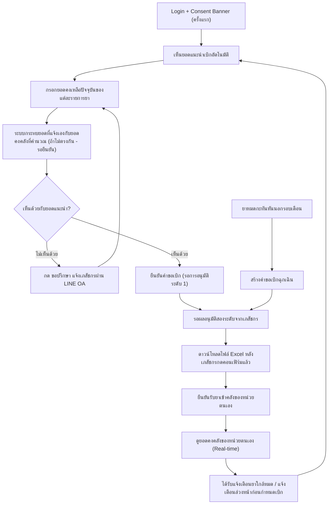

# User Journey — เจ้าหน้าที่ รพ.สต.

> อ้างอิงจาก backlog.md และ spec ที่เกี่ยวข้อง — ดู [Feature List](../02-feature-list.md) สำหรับมุมมองระดับ Feature

## Diagram

## คำอธิบายตามลำดับ

1. **Login + Consent Banner (ครั้งแรก)** — เจ้าหน้าที่ รพ.สต. login เข้าระบบ เห็นเฉพาะข้อมูลของหน่วยตนเอง และในการ login ครั้งแรกจะเห็น Consent Banner ตาม PDPA ที่ต้องกดยินยอมก่อนเข้าใช้งาน (อ้างอิง NFR Security/RBAC, BL-024; FR-6.3, BL-030)

2. **เห็นยอดแนะนำเบิกอัตโนมัติ** — เมื่อเปิดหน้าสร้างคำขอเบิกของเดือนนั้น ระบบแสดงยอดแนะนำเบิกต่อรายการยาที่คำนวณอัตโนมัติจากเกณฑ์ safety stock (อ้างอิง FR-1.1, US-1.0, BL-001)

3. **กรอกยอดคงเหลือปัจจุบันของแต่ละรายการยา** — เจ้าหน้าที่กรอกยอดคงเหลือปัจจุบัน ณ วันที่สร้างคำขอ เพื่อใช้คำนวณยอดแนะนำและเป็นข้อมูลนำเข้าต่อเนื่องของการปรับปรุง safety stock (อ้างอิง FR-1.1a, US-1.1, BL-002)

4. **ระบบกระทบยอดที่แจ้งเองกับยอดคงคลังที่ระบบคำนวณ** — หลังกรอกยอดคงเหลือ ระบบเปรียบเทียบยอดคงเหลือที่เจ้าหน้าที่แจ้งเอง (FR-1.1a) กับยอดคงคลังที่ระบบคำนวณอัตโนมัติ (FR-1.5) ของหน่วยเดียวกันในช่วงเวลาเดียวกัน `[รอยืนยัน]` ว่าเมื่อพบว่าไม่ตรงกันต้องแจ้งเตือน/มีขั้นตอนกระทบยอดอย่างไร และเกณฑ์ความคลาดเคลื่อนที่ยอมรับได้เท่าใด — ยังไม่ยืนยันทั้งใน spec 002 และ backlog.md (อ้างอิง FR-1.1a, FR-1.5, BL-032)

5. **(ทางเลือก) กด "ขอปรึกษา" แจ้งเภสัชกรผ่าน LINE OA** — หากไม่เห็นด้วยกับยอดแนะนำ เจ้าหน้าที่กดปุ่ม "ขอปรึกษา" ระบบส่ง alert แจ้งกลุ่มเภสัชกรผ่าน LINE Official Account ทันทีเพื่อช่วยพิจารณาก่อนยืนยันคำขอ (อ้างอิง FR-1.1b, US-1.1b, BL-003)

6. **ยืนยันคำขอเบิก (รอการอนุมัติระดับ 1)** — เจ้าหน้าที่กดยืนยันคำขอ ระบบบันทึกคำขอสถานะ "รอการอนุมัติระดับ 1" (อ้างอิง FR-1.1a, US-1.1, BL-002)

7. **รอผลอนุมัติสองระดับจากเภสัชกร** — คำขอเข้าสู่กระบวนการอนุมัติสองระดับของเภสัชกร (ดูรายละเอียดใน [pharmacist-journey.md](pharmacist-journey.md)) ก่อนเปลี่ยนสถานะเป็น "พร้อมส่งออก" (อ้างอิง FR-1.2/FR-1.3, BL-004, BL-005)

8. **ดาวน์โหลดไฟล์ Excel หลังเภสัชกรกดคอนเฟิร์มแล้ว** — เมื่อเภสัชกรผู้อนุมัติระดับ 2 กด "คอนเฟิร์ม" แล้วเท่านั้น เจ้าหน้าที่จึงดาวน์โหลดไฟล์ Excel คำขอเบิกฉบับที่ถูกคอนเฟิร์มล่าสุดได้ เพื่อเก็บไว้เป็นสำเนาของหน่วยตนเอง (อ้างอิง FR-4.1b, US-4.1b, BL-020b)

9. **ยืนยันรับยาเข้าคลังของหน่วยตนเอง** — เมื่อยาถูกจ่ายจาก รพ.แม่ข่ายแล้ว เจ้าหน้าที่ยืนยันการรับยาในระบบ ทำให้ยอดคงคลังของหน่วยอัปเดตทันที (อ้างอิง FR-1.4, US-1.3, BL-006)

10. **ดูยอดคงคลังของหน่วยตนเอง (Real-time)** — เจ้าหน้าที่เห็นยอดคงคลังของหน่วยตนเองอัปเดตภายใน 5 วินาทีหลังมีการบันทึกรับ/จ่าย เพื่อวางแผนเบิก-จ่ายได้แม่นยำ (อ้างอิง FR-1.5, BL-007)

11. **ได้รับแจ้งเตือนยาใกล้หมด / แจ้งเตือนล่วงหน้าก่อนกำหนดเบิก** — ระบบแจ้งเตือนเจ้าหน้าที่เมื่อยอดคงคลังต่ำกว่าเกณฑ์ safety stock (อ้างอิง FR-2.2, US-2.1, BL-013) และแจ้งเตือนล่วงหน้าก่อนถึงกำหนดส่งคำขอเบิกประจำเดือนเพื่อลดปัญหาลืมเบิกยา (อ้างอิง FR-1.8, US-1.5, BL-009b) ทั้งสองผ่านช่องทางอีเมล+LINE OA (อ้างอิง FR-2.3, BL-014) วนกลับเข้าสู่รอบเบิกถัดไป

12. **ยาหมดกะทันหันนอกรอบเดือน → สร้างคำขอเบิกฉุกเฉิน** — กรณียาหมดกะทันหันนอกรอบเดือนปกติ เจ้าหน้าที่สร้างคำขอเบิกฉุกเฉิน (Off-cycle) ซึ่งเข้าสู่ผังอนุมัติสองระดับเดียวกับคำขอปกติแต่มี notify ทันทีให้ผู้อนุมัติทั้งสองระดับ (อ้างอิง FR-1.7, US-1.4, BL-009)

## บันทึกการอัปเดต (Changelog)

- **20260816:** สร้าง User Journey ของเจ้าหน้าที่ รพ.สต. ครั้งแรก ครอบคลุม Epic 1 (สร้างคำขอ/ขอปรึกษา/อนุมัติ/รับยา/คงคลัง real-time/แจ้งเตือน/เบิกฉุกเฉิน) และ Epic 4 (ดาวน์โหลดไฟล์หลังคอนเฟิร์ม)
- **20260816 (เพิ่มเติม):** เพิ่ม step "ระบบกระทบยอดที่แจ้งเองกับยอดคงคลังที่คำนวณ" (BL-032) ต่อจาก step กรอกยอดคงเหลือ — คง `[รอยืนยัน]` ไว้ในคำอธิบายเนื่องจากพฤติกรรมหลักของ BL-032 (ต้องแจ้งเตือน/กระทบยอดหรือไม่ และเกณฑ์ความคลาดเคลื่อน) ยังไม่ยืนยันใน spec 002/backlog.md — เพิ่มตามที่ผู้ใช้เลือกหลังการตรวจสอบ feature-list/journey audit รอบที่สอง
