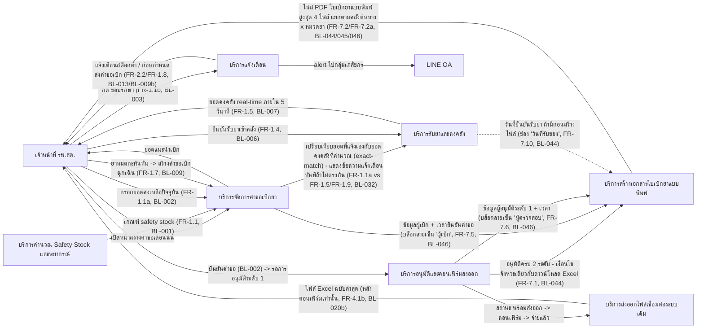
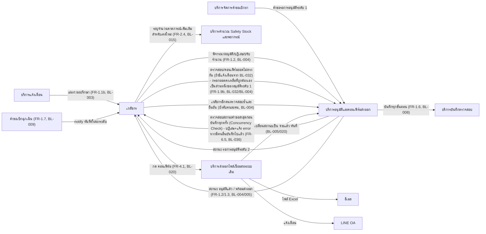
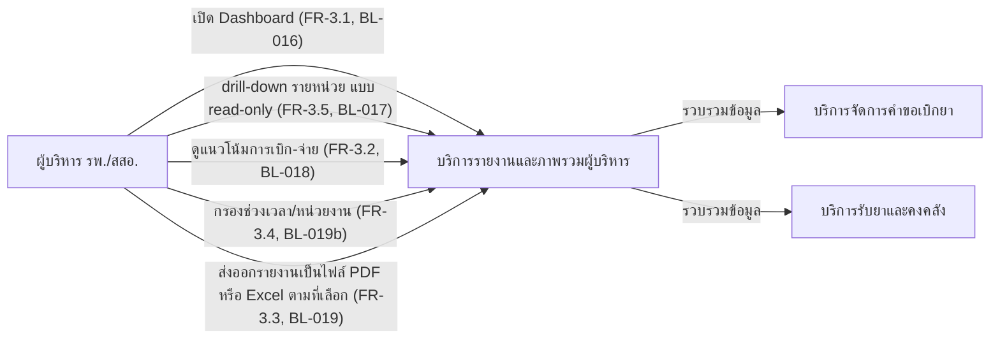
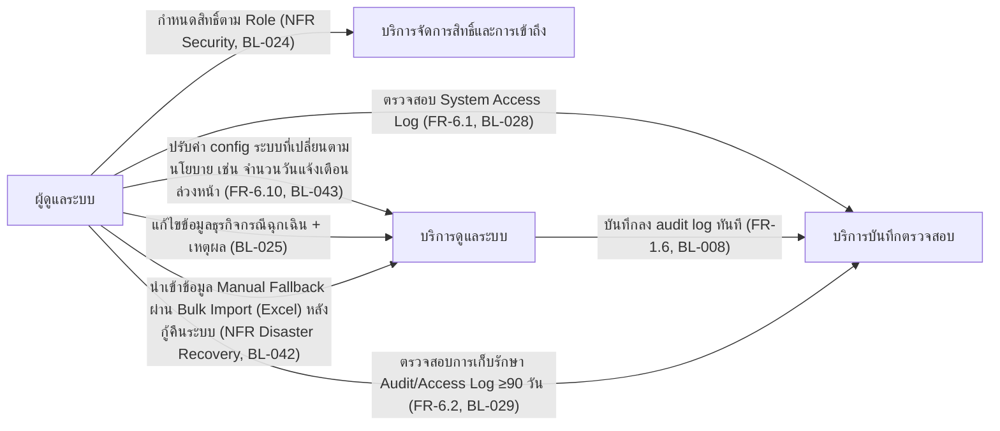

# High-Level Architecture — SmartSync

> เอกสารนี้เป็นมุมมองสถาปัตยกรรมระดับแนวคิด (conceptual) เท่านั้น **ยังไม่ผูกมัดกับ technology stack, framework, database, หรือ cloud/deployment platform ใดๆ** — ตาม CLAUDE.md เฟสปัจจุบันของโปรเจกต์คือการทำเอกสาร ยังไม่เข้าสู่เฟสพัฒนา เอกสารนี้จะถูกทบทวนอีกครั้งเมื่อเข้าสู่เฟสพัฒนาจริง
>
> อ้างอิงจาก [backlog.md](backlog.md), [Feature List](02-feature-list.md), [User Journey](03-user-journey/), และ spec ที่เกี่ยวข้องใน [01-spec/](01-spec/)

**วันที่สร้าง/อัปเดตล่าสุด:** 20260831

## 1. ภาพรวม (Overview)

SmartSync เป็นระบบสนับสนุนการเบิก-จ่ายยากลุ่มโรคไม่ติดต่อเรื้อรัง (NCD และยาโรคเรื้อรังอื่นที่เบิกจ่ายในช่องทางเดียวกัน) ระหว่างโรงพยาบาลเชียงรายประชานุเคราะห์ (รพ.แม่ข่าย) และเครือข่าย รพ.สต. 29 แห่งในอำเภอเมือง จังหวัดเชียงราย เป้าหมายเชิงแนวคิดของระบบคือการให้ "ผู้เบิก" (เจ้าหน้าที่ รพ.สต.) และ "ผู้คัดกรอง" (เภสัชกร) เห็นยอดแนะนำเบิกจากสูตรคำนวณเดียวกันแบบใกล้เคียงเรียลไทม์ แทนที่การใช้ดุลยพินิจแยกกันแบบเดิม ซึ่งเป็น Root Cause ของอัตราหมุนเวียนคงคลังที่สูงถึง 3 เดือน (เป้าหมาย ≤ 1.5 เดือน) ตาม [spec 001](01-spec/20260816-001-project-scope-and-problem-background.md)

ในมุมมองสถาปัตยกรรม ระบบประกอบด้วยกลุ่มความรับผิดชอบเชิงตรรกะ (logical building blocks) ที่ครอบคลุม 5 Epic ในขอบเขต ได้แก่ (1) การจัดการคำขอเบิกและการอนุมัติสองระดับ รวมถึงการออกเอกสารใบเบิกยาแบบพิมพ์เพื่อเซ็นชื่อเป็นหลักฐานประกอบการเบิก-จ่าย (เพิ่ม 20260831) (2) การพยากรณ์สต็อกและแจ้งเตือน (3) รายงาน/ภาพรวมสำหรับผู้บริหาร (4) การส่งออกไฟล์ไปยังระบบคลังยาเดิม (INVC) ผ่านช่องทาง manual batch เท่านั้น (ไม่มี API/real-time ในเฟสนี้) และ (5) กลุ่มความรับผิดชอบเชิงคุณภาพร่วม (RBAC, audit, PDPA, การจัดการ session/2FA, ความต่อเนื่องของระบบ (backup/disaster recovery), ฯลฯ — ขยายเพิ่มเมื่อ 20260824) เอกสารนี้แสดงองค์ประกอบเหล่านี้ในระดับ "ความรับผิดชอบ" เท่านั้น ยังไม่ตัดสินใจว่าจะแบ่งเป็นระบบย่อยกี่ระบบ หรือใช้เทคโนโลยีใดในการสร้างจริง

## 2. System Context Diagram

```mermaid
flowchart TD
    subgraph external["ระบบ/ช่องทางภายนอก"]
        JHCIS["JHCIS/myPCU (รพ.สต. 29 แห่ง)"]
        INVC["INVC (โปรแกรมคลังยา รพ.แม่ข่าย)"]
        EMAIL["อีเมล"]
        LINE["LINE Official Account"]
    end

    STAFF["เจ้าหน้าที่ รพ.สต. (29 แห่ง)"] -->|สร้างคำขอเบิก, ยืนยันรับยา| SYS
    PHARM["เภสัชกร (ผู้อนุมัติระดับ 1/2)"] -->|พิจารณา/อนุมัติ/คอนเฟิร์ม| SYS
    EXEC["ผู้บริหาร รพ./สสอ."] -->|ดู Dashboard (read-only)| SYS
    ADMIN["ผู้ดูแลระบบ"] -->|กำหนดสิทธิ์/ดูแลระบบ| SYS

    SYS["ระบบ SmartSync"] -->|ยอดแนะนำเบิก / ยอดคงคลัง / สถานะคำขอ| STAFF
    SYS -->|คำขอรออนุมัติ / แจ้งเตือนขอปรึกษา| PHARM
    SYS -->|ภาพรวม/รายงาน| EXEC
    SYS -->|log/สิทธิ์| ADMIN

    SYS -->|ไฟล์ Excel คำขอเบิก (manual batch, หลังคอนเฟิร์ม)| EMAIL
    SYS -->|แจ้งเตือนเหตุการณ์ (ขอปรึกษา, สต็อกต่ำ, ก่อนกำหนดเบิก, คอนเฟิร์มส่งออก)| LINE
    EMAIL -.->|นำไฟล์เข้า INVC เอง นอกระบบ SmartSync| INVC
    LINE -.->|แจ้งเตือนเท่านั้น ไม่ใช่การเชื่อมข้อมูล| INVC
```

> **หมายเหตุ:** JHCIS/myPCU ที่ รพ.สต. ทั้ง 29 แห่งใช้งานอยู่ **ไม่มีการแลกเปลี่ยนข้อมูลโดยตรงกับ SmartSync ในเฟสนี้** เนื่องจากยอดคงเหลือ/การเบิกได้มาจากการกรอกในระบบ SmartSync เอง (FR-1.1a) ไม่ใช่ดึงจาก JHCIS/myPCU (FR-4.4, [spec 005](01-spec/20260816-005-legacy-system-integration.md)) — วาดไว้ในไดอะแกรมเพื่อให้เห็นภาพรวมระบบข้างเคียงเท่านั้น จึงไม่มีลูกศรเชื่อมกับ SYS โดยตรง การเชื่อมต่อกับ INVC และช่องทางแจ้งเตือนเป็นแบบ **manual batch/notification เท่านั้น ไม่มี API หรือการเชื่อมต่อแบบ real-time**

## 3. องค์ประกอบเชิงตรรกะ (Conceptual / Logical Building Blocks)

> **ระดับความละเอียด:** เอกสารนี้เลือกระดับ "กลาง" (จัดกลุ่ม Feature/FT-ID ตามความรับผิดชอบทางธุรกิจ ไม่ใช่ 1 กล่องต่อ 1 Epic แบบหยาบ และไม่ใช่ 1 กล่องต่อ 1 FR แบบละเอียด) — เจ้าของข้อกำหนด**ยืนยันแล้ว** (20260823) ว่าใช้ระดับนี้ **ชื่อองค์ประกอบคือ "ความรับผิดชอบ" ไม่ใช่ชื่อ service/technology**

| องค์ประกอบ | ความรับผิดชอบ | Feature/Epic ที่เกี่ยวข้อง | ข้อมูลเชิงแนวคิดที่เกี่ยวข้อง |
|---|---|---|---|
| บริการจัดการคำขอเบิกยา | รับยอดคงเหลือที่แจ้งเอง, แสดงยอดแนะนำเบิกที่คำนวณจากเกณฑ์ safety stock, สร้าง/ติดตามสถานะคำขอ (ปกติ/ฉุกเฉิน), ส่งคำขอ "ขอปรึกษา", กระทบยอดที่แจ้งเองกับยอดคงคลังที่คำนวณ | FT-001, FT-006, FT-008 / Epic 1 | คำขอเบิกยา, ยอดคงเหลือที่แจ้งเอง |
| บริการอนุมัติและคอนเฟิร์มส่งออก | ควบคุมวงจรอนุมัติสองระดับ (คนละคนเสมอ), เปลี่ยนสถานะคำขอตามขั้น (รออนุมัติ 1 → รออนุมัติ 2 → อนุมัติแล้ว → พร้อมส่งออก → จ่ายแล้ว), รับค่าปรับเกณฑ์เพิ่มเติมสำหรับเคสใหม่จาก รพศ. ระหว่างพิจารณา, ตรวจสอบ/คอนเฟิร์มยอดคงเหลือที่ไม่ตรงกัน (กระทบยอด FR-1.1a vs FR-1.5) เป็นส่วนหนึ่งของการอนุมัติระดับ 1 พร้อมให้เภสัชกรกรอกยอดคงเหลือที่ถูกต้องเองแทนยอดเดิม (ยืนยันครบ 20260823 รอบ 4), ตรวจสอบสถานะล่าสุดของคำขอก่อนบันทึกทุกครั้งระหว่างขั้นตอนอนุมัติทั้งสองระดับ (Optimistic Concurrency Check) และปฏิเสธ/แจ้ง error ทันทีหากมีผู้อื่นแก้ไข/บันทึกคำขอเดียวกันไปแล้ว (เพิ่ม 20260824) | FT-002, FT-008, FT-013, FT-017, FT-027 / Epic 1, 2, 4, 5 | บันทึกการอนุมัติ, คำขอเบิกยา (สถานะ + ยอดคงเหลือที่ถูกต้อง) |
| บริการรับยาและคงคลัง | บันทึกการยืนยันรับยาเข้าคลังของแต่ละหน่วย, คำนวณ/แสดงยอดคงคลังแบบใกล้เคียงเรียลไทม์ | FT-003, FT-004 / Epic 1 | ยอดคงคลัง |
| บริการสร้างเอกสารใบเบิกยาแบบพิมพ์ (เพิ่ม 20260831) | สร้างไฟล์ PDF ใบเบิกยาแบบพิมพ์เพื่อเซ็นชื่อ เฉพาะหลังคำขอผ่านอนุมัติครบ 2 ระดับแล้ว (เงื่อนไขจังหวะเดียวกับการดาวน์โหลดไฟล์ Excel), แยกไฟล์ตามคลังต้นทาง (ตึกผลิต/คลังใต้ดิน) คูณหมวดยา (ปกติ/บัญชีแพทย์) แบบ cross-product เต็มรูปแบบ สูงสุด 4 ไฟล์ต่อคำขอ สร้างเฉพาะไฟล์ที่มีรายการยาจริง, ดึงข้อมูลผู้เบิก (จากการยืนยันคำขอ) และผู้อนุมัติระดับ 1 มาพิมพ์ชื่อ+วันเวลาไว้ล่วงหน้าในบล็อกลายเซ็น "ผู้เบิก"/"ผู้ตรวจสอบ" (ยังต้องเซ็นจริงบนเส้นด้วย), พิมพ์วันที่รับของไว้ล่วงหน้าถ้ามีการยืนยันรับยาแล้วก่อนสร้างไฟล์ — ขอบเขตของความรับผิดชอบนี้จบที่การสร้าง/ดาวน์โหลดไฟล์เท่านั้น ไม่ track สถานะการเซ็น/ส่งต่อใดๆ | FT-035 / Epic 1 | ใบเบิกยาแบบพิมพ์ |
| บริการคำนวณ Safety Stock และพยากรณ์ | นำเข้าข้อมูลประวัติย้อนหลัง (ครั้งเดียวตอนตั้งต้น), คำนวณเกณฑ์เริ่มต้นแบบเทียบช่วงเดือนเดียวกันของปี (year-over-year), ปรับปรุงเกณฑ์ต่อเนื่องอัตโนมัติจากยอดใช้จริง | FT-009, FT-010 / Epic 2 | เกณฑ์ Safety Stock, ประวัติการเบิก-จ่าย |
| บริการแจ้งเตือน | กระจายข้อความแจ้งเตือนผ่านช่องทางอีเมล+LINE OA พร้อมกันสำหรับทุกเหตุการณ์ (ขอปรึกษา, สต็อกต่ำ, ก่อนกำหนดเบิก, เบิกฉุกเฉิน, คอนเฟิร์มส่งออก) | FT-007, FT-011, FT-012 / Epic 1, 2, 4 | เหตุการณ์แจ้งเตือน |
| บริการรายงานและภาพรวมผู้บริหาร | รวบรวมยอดคงคลัง/คำขอทั้งเครือข่ายเป็นภาพรวมหน้าเดียว, รองรับ drill-down รายหน่วยแบบ read-only, แสดงแนวโน้ม, กรองตามช่วงเวลา/หน่วยงาน, ส่งออกรายงาน | FT-014, FT-015, FT-016 / Epic 3 | มุมมองภาพรวมเครือข่าย |
| บริการส่งออกไฟล์เชื่อมต่อระบบเดิม | สร้างไฟล์คำขอเบิกในรูปแบบที่ INVC นำเข้าได้ทันที (ยืนยันแล้ว 20260823 จากไฟล์ตัวอย่างจริง — โครงสร้างคอลัมน์คงที่ 3 คอลัมน์), แยกสร้างเป็น 1-2 ไฟล์ต่อหน่วยต่อรอบเมื่อมีรายการยาหมวด "บัญชีแพทย์", ส่งผ่านช่องทางอีเมล+LINE OA ให้ฝ่ายคลังยา รพ.แม่ข่าย, เก็บไฟล์เวอร์ชันล่าสุดให้ดาวน์โหลดได้เฉพาะหลังคอนเฟิร์ม | FT-017, FT-018 / Epic 4 | ไฟล์ส่งออก |
| บริการจัดการสิทธิ์และการเข้าถึง (Identity & Access) | กำหนด/ตรวจสอบสิทธิ์ตาม Role (เจ้าหน้าที่ รพ.สต. เห็นเฉพาะหน่วยตนเอง, ผู้บริหาร read-only ทั้งเครือข่าย, Admin สิทธิ์เต็ม), บังคับกฎห้ามอนุมัติระดับ 1/2 ด้วยคนเดียวกัน, บังคับให้เปลี่ยนรหัสผ่านเมื่อ login ครั้งแรกและตัด session อัตโนมัติเมื่อไม่มีการใช้งานต่อเนื่อง ~30 นาที (ทุก role), ยืนยันตัวตนเพิ่มเติมด้วยสองปัจจัย (2FA/OTP) เฉพาะบัญชีเภสัชกรผู้อนุมัติระดับ 1/2 เท่านั้น (เพิ่ม 20260824) | FT-020, FT-028, FT-029 / Epic 5 | บัญชีผู้ใช้และสิทธิ์ |
| บริการบันทึกตรวจสอบ (Audit & Access Log) | บันทึก Audit Trail ทางธุรกิจทุกเหตุการณ์ (เบิก/อนุมัติ/จ่าย/รับ/ขอปรึกษา) แบบแก้ไขไม่ได้, บันทึก System Access Log (login/logout+IP) แยกชุด, ควบคุมการเก็บรักษาตามกฎหมาย (≥90 วัน ไม่ลบอัตโนมัติ) | FT-005, FT-024 / Epic 1, 5 | Audit Trail (ธุรกิจ), System Access Log |
| บริการจัดการความยินยอมข้อมูลส่วนบุคคล (Consent/PDPA) | แสดง Consent Banner ตอน login ครั้งแรก, บันทึกวันเวลาที่ผู้ใช้กดยินยอม | FT-023 / Epic 5 | บันทึกความยินยอม |
| บริการดูแลระบบ (Admin Operations) | จัดการผู้ใช้/สิทธิ์ร่วมกับบริการจัดการสิทธิ์, แก้ไขข้อมูลธุรกิจกรณีฉุกเฉินพร้อมบันทึกเหตุผลลง Audit Trail, ปรับค่า config ของระบบที่เปลี่ยนตามนโยบายได้เองผ่านหน้าจอโดยไม่ต้องแก้โค้ด (เพิ่ม 20260824), นำเข้าข้อมูล Manual Fallback กลับเข้าระบบผ่านหน้าจอ Bulk Import จาก Excel หลังกู้คืนระบบจาก Disaster Recovery (เพิ่ม 20260825, BL-042) | FT-021, FT-033, FT-034 / Epic 5 | รายการแก้ไขฉุกเฉิน, ค่าตั้งค่าระบบ, ข้อมูล Bulk Import |

**หมายเหตุเรื่องขอบเขต RBAC และการอนุมัติสองระดับ:** เอกสารนี้แยก "บริการอนุมัติและคอนเฟิร์มส่งออก" (ความรับผิดชอบด้านกระบวนการธุรกิจ) ออกจาก "บริการจัดการสิทธิ์และการเข้าถึง" (ความรับผิดชอบด้านการควบคุมว่าใครมีสิทธิ์ทำอะไร) เป็น 2 องค์ประกอบแยกกัน — ไม่ใช่การตัดสินใจใหม่ของเอกสารนี้ แต่สอดคล้องกับ [Feature List](02-feature-list.md) ที่จัดกลุ่ม FT-002 (อนุมัติสองระดับ) และ FT-020 (RBAC) เป็น Feature คนละรายการอยู่แล้ว จึงยึดตามโครงสร้างที่มีอยู่แทนการตัดสินใจเอง

**หมายเหตุเรื่อง NFR เพิ่มเติม 20260824 (Backup, Concurrency, Auth/Session/2FA, Encryption, Browser Compatibility, Scalability, Disaster Recovery, Configurability):** เมื่อพิจารณาทีละหมวดตามหลักการเดียวกับที่เอกสารนี้ใช้อยู่แล้ว (ปฏิสัมพันธ์ที่ผู้ใช้สังเกตเห็น/ลงมือทำได้จริง → ผูกกับองค์ประกอบเชิงตรรกะที่มีอยู่แล้ว, พฤติกรรมเชิงระบบ/infrastructure ล้วนๆ ที่ไม่มีหน้าจอให้ผู้ใช้ role ใดลงมือทำ → ไม่สร้างองค์ประกอบใหม่ อยู่ในหัวข้อ 7 เท่านั้น เหมือนที่เคยทำกับ BL-026/Responsive และ BL-033/Availability): (1) **Optimistic Concurrency Check (BL-036)** ผูกกับ "บริการอนุมัติและคอนเฟิร์มส่งออก" โดยตรง เพราะเป็นพฤติกรรมที่เภสัชกรเห็น error จริงระหว่างขั้นตอนอนุมัติ (2) **บังคับเปลี่ยนรหัสผ่านครั้งแรก/Session Timeout/2FA (BL-037, BL-038)** ผูกกับ "บริการจัดการสิทธิ์และการเข้าถึง (Identity & Access)" เพราะเป็นส่วนขยายของกระบวนการ login/สิทธิ์ที่องค์ประกอบนี้ดูแลอยู่แล้ว (3) **Admin ปรับค่า Config ผ่านหน้าจอ (BL-043)** ผูกกับ "บริการดูแลระบบ (Admin Operations)" เพราะเป็น admin action ที่มีหน้าจอชัดเจน (4) **Backup รายวัน (BL-035), เข้ารหัสข้อมูลระหว่างส่ง (BL-039), รองรับเบราว์เซอร์ Evergreen (BL-040), ขอบเขต Scalability (BL-041)** ไม่ผูกกับองค์ประกอบใดเป็นการเฉพาะ เนื่องจากเป็น NFR เชิงระบบ/infrastructure ล้วนๆ ไม่มีปฏิสัมพันธ์ที่ผู้ใช้ role ใดต้องลงมือทำผ่านหน้าจอ (สอดคล้องกับที่ [Feature List](02-feature-list.md) และ user-journey ทั้ง 4 ไฟล์ระบุตรงกันว่าไม่มี step ใดใน journey ใดๆ รองรับรายการเหล่านี้) — ดูรายละเอียดที่หัวข้อ 7 แทน ไม่ใช่การตัดสินใจใหม่ของเอกสารนี้ แต่เป็นการนำผลสรุปที่ [Feature List](02-feature-list.md)/[03-user-journey/](03-user-journey/) ตัดสินใจไว้แล้วมาสะท้อนในโครงสร้างองค์ประกอบเชิงตรรกะให้ตรงกัน — **Disaster Recovery (BL-042)** เดิมอยู่ในกลุ่มนี้เช่นกัน แต่ **อัปเดต 20260825 (scope change):** ยืนยันแล้วว่าขั้นตอนนำข้อมูล Manual Fallback กลับเข้าระบบมีหน้าจอ Bulk Import จริง ดำเนินการโดย Admin จึงย้ายไปผูกกับ "บริการดูแลระบบ (Admin Operations)" แทน (ส่วน RTO/manual fallback เองยังคงเป็น infrastructure ล้วนๆ เหมือนเดิม)

**หมายเหตุเรื่องเอกสารใบเบิกยาแบบพิมพ์ (FT-035/BL-044/BL-045/BL-046, เพิ่ม 20260831):** เอกสารนี้แยก "บริการสร้างเอกสารใบเบิกยาแบบพิมพ์" เป็นองค์ประกอบใหม่ต่างหาก **ไม่ผูกรวมเข้ากับ "บริการส่งออกไฟล์เชื่อมต่อระบบเดิม"** แม้ทั้งสองมีรูปแบบผิวเผินคล้ายกัน (สร้างไฟล์เอกสารจากข้อมูลคำขอเบิก) เนื่องจาก [spec 007](01-spec/20260831-007-printable-signed-requisition-form.md) และ backlog.md ย้ำชัดเจนหลายจุดว่าเป็นคนละวัตถุประสงค์กับการเชื่อมต่อ INVC (Epic 4) โดยสิ้นเชิง: (1) ไฟล์ PDF นี้เจ้าหน้าที่ รพ.สต. ดาวน์โหลดเองเพื่อพิมพ์และเซ็นชื่อ/ส่งต่อทางกายภาพนอกระบบ — **ไม่ได้ถูกส่งผ่านช่องทางอีเมล/LINE OA ไปยังหน่วยงานภายนอกใดๆ เลย** ต่างจากไฟล์ Excel ของ "บริการส่งออกไฟล์เชื่อมต่อระบบเดิม" ที่ผูกกับ Epic 4/จุดเชื่อมต่อ INVC โดยตรง (2) รูปแบบไฟล์และผู้บริโภคผลลัพธ์ต่างกัน (PDF สำหรับเซ็นชื่อ ไม่ใช่ Excel สำหรับนำเข้าระบบภายนอก) (3) ขอบเขตจบที่การสร้าง/ดาวน์โหลดไฟล์เท่านั้น ไม่มีการ track สถานะการเซ็น/ส่งต่อใดๆ (FR-7.9) ต่างจากบริการส่งออกไฟล์เชื่อมต่อระบบเดิมที่ผูกกับสถานะคำขอ ("จ่ายแล้ว") — การแยกเป็นองค์ประกอบใหม่นี้ยังคงอยู่ในระดับความละเอียด "กลาง" ที่ยึดตามความรับผิดชอบทางธุรกิจตามที่เจ้าของข้อกำหนดยืนยันไว้แล้ว (ไม่ใช่การขยายขอบเขตของ "บริการส่งออกไฟล์เชื่อมต่อระบบเดิม" ให้ครอบคลุมสิ่งที่ spec เองแยกไว้ชัดเจนว่าไม่เกี่ยวข้องกัน) — **"ผู้รับรอง" (ผอ.รพ.สต.) และ "ผู้จ่ายของ" (เภสัชกรคลังยา รพ.แม่ข่าย)** ที่ปรากฏเป็นบล็อกลายเซ็นว่างเปล่าบนเอกสารนี้**ไม่มี role/actor/component ใดๆ ในระบบ SmartSync รองรับ** เนื่องจากทั้งสองไม่มีปฏิสัมพันธ์กับระบบเลย (เซ็นชื่อบนกระดาษที่พิมพ์ออกไปแล้วภายนอกระบบทั้งหมด — ยืนยันแล้ว 20260831) จึงไม่ปรากฏเป็น actor ในหัวข้อ 2 หรือ node ใดๆ ในไดอะแกรม data flow ของหัวข้อ 4 ทั้งสิ้น

**หมายเหตุเรื่อง Audit/Access log:** เอกสารนี้ให้ Audit Trail ทางธุรกิจและ System Access Log อยู่ในองค์ประกอบเดียวกัน ("บริการบันทึกตรวจสอบ") แต่แยกเป็นข้อมูลเชิงแนวคิด 2 ชุดต่างกัน (ดูหัวข้อ 5) — สอดคล้องกับที่ [Feature List](02-feature-list.md) และ backlog.md แยก FT-005 (BL-008, audit ธุรกิจ) ออกจาก FT-024 (BL-028/029, system access log) อย่างชัดเจนอยู่แล้ว ไม่ใช่การตัดสินใจใหม่

## 4. Data Flow ตาม User Journey

### 4.1 เจ้าหน้าที่ รพ.สต.



อ้างอิงลำดับขั้นตอนเต็มที่ [staff-hph-journey.md](03-user-journey/staff-hph-journey.md) — ทุกขั้นตอนในไดอะแกรมด้านบนตรงกับ step ในไฟล์ journey โดยตรง (ไม่มีการเพิ่มขั้นตอนที่ไม่มีหลักฐาน) — การแจ้งเตือนยอดไม่ตรงกัน (BL-032) ยืนยันครบแล้ว 20260823 (รอบ 4): เจ้าหน้าที่เห็นเฉพาะข้อความแจ้งเตือนในขั้นตอนนี้เท่านั้น ส่วนการตรวจสอบ/คอนเฟิร์ม/กรอกยอดที่ถูกต้องเป็นหน้าที่ของเภสัชกรที่เกิดขึ้นภายหลังระหว่างขั้นตอนอนุมัติระดับ 1 (ดูหัวข้อ 4.2) — ขั้นตอน Login ครั้งแรก (บังคับเปลี่ยนรหัสผ่าน, BL-037) ที่ journey เพิ่มเมื่อ 20260824 เป็นความรับผิดชอบของ "บริการจัดการสิทธิ์และการเข้าถึง" (หัวข้อ 3) ที่ครอบคลุมทุก role อยู่แล้ว จึงไม่แสดงเป็น node แยกในไดอะแกรมนี้ เช่นเดียวกับหลักการที่หัวข้อ 4.3 ใช้กับ RBAC — **เพิ่มเมื่อ 20260831 (FT-035/BL-044/BL-045/BL-046):** เพิ่มองค์ประกอบใหม่ "บริการสร้างเอกสารใบเบิกยาแบบพิมพ์" และลูกศรที่เกี่ยวข้องระหว่าง APPROVE/REQ/INV กับองค์ประกอบใหม่นี้ และจาก PRINTDOC ไปยัง STAFF ให้ตรงกับ step 9 ใหม่ของ journey ("ดาวน์โหลดใบเบิกยาแบบพิมพ์ (PDF) เพื่อเซ็นชื่อ" — อยู่ระหว่าง step 8 ดาวน์โหลด Excel กับ step 10 ยืนยันรับยา) — เอกสาร PDF นี้เป็นคนละไฟล์และคนละวัตถุประสงค์โดยสิ้นเชิงจากไฟล์ Excel ของ "บริการส่งออกไฟล์เชื่อมต่อระบบเดิม" (ดูหมายเหตุท้ายตารางหัวข้อ 3) เส้นประ (INV -.-> PRINTDOC) สื่อว่าเป็นความสัมพันธ์แบบมีเงื่อนไข (ใช้ข้อมูลวันที่รับยาเฉพาะกรณีที่ยืนยันรับยาไปแล้วก่อนสร้างไฟล์เท่านั้น) ไม่ใช่ทุกครั้ง

### 4.2 เภสัชกร



อ้างอิงลำดับขั้นตอนเต็มที่ [pharmacist-journey.md](03-user-journey/pharmacist-journey.md) — journey รวมบทบาทผู้อนุมัติระดับ 1 และ 2 เป็นไฟล์เดียวตามที่ [spec 001](01-spec/20260816-001-project-scope-and-problem-background.md) ระบุว่าเป็นบทบาทที่สลับกันได้ (ไม่ใช่บุคคลตายตัว) จึงแสดงเป็น actor เดียวในไดอะแกรมนี้เช่นกัน — **เพิ่มเมื่อ 20260831 (FT-035, ไม่แก้ diagram นี้):** ชื่อ+วันเวลาของเภสัชกรผู้อนุมัติระดับ 1 (ลูกศร "พิจารณา/อนุมัติ/ปฏิเสธ/ปรับจำนวน" ในไดอะแกรมนี้) ถูกส่งต่อไปยัง "บริการสร้างเอกสารใบเบิกยาแบบพิมพ์" (องค์ประกอบใหม่ในหัวข้อ 3) เพื่อพิมพ์ไว้ล่วงหน้าในบล็อกลายเซ็น "ผู้ตรวจสอบ" ของใบเบิกยาแบบพิมพ์ที่เจ้าหน้าที่ รพ.สต. ดาวน์โหลด (ดูลูกศร APPROVE → PRINTDOC ในหัวข้อ 4.1) — ไม่เพิ่ม node ใหม่ในไดอะแกรมนี้เนื่องจากเภสัชกรไม่ได้เป็นผู้ดาวน์โหลด/มีปฏิสัมพันธ์กับเอกสารนี้โดยตรง (สอดคล้องกับที่ [pharmacist-journey.md](03-user-journey/pharmacist-journey.md) เองก็ไม่เพิ่ม step/node ใหม่ เพียง enrichment คำอธิบายของ step เดิม) — เพิ่มลูกศร "ตรวจสอบ/คอนเฟิร์มยอดไม่ตรงกัน" (BL-032) ในรอบตรวจสอบนี้ (20260824) ให้ตรงกับ step 5 (node D2) ของไฟล์ journey ที่เพิ่มเมื่อ 20260824 — เดิมไดอะแกรมนี้ยังไม่มีขั้นตอนนี้แม้ backlog/feature-list ปิด Open Item ของ BL-032 ไปแล้วตั้งแต่ 20260823 — **เพิ่มเมื่อ 20260824 (รอบ NFR 10 หมวด):** เพิ่มลูกศร "ตรวจสอบสถานะคำขอล่าสุดก่อนบันทึกทุกครั้ง (Concurrency Check)" (BL-036) ให้ตรงกับ node P1 ของ journey ที่ครอบคลุมทั้งขั้นตอนอนุมัติระดับ 1 และ 2 — ส่วนขั้นตอน Login ครั้งแรก (บังคับเปลี่ยนรหัสผ่าน, BL-037) และการยืนยันตัวตนสองปัจจัย (2FA/OTP เฉพาะเภสัชกรผู้อนุมัติ, BL-038) เป็นความรับผิดชอบของ "บริการจัดการสิทธิ์และการเข้าถึง" (หัวข้อ 3) ที่ครอบคลุมทุก role อยู่แล้ว จึงไม่แสดงเป็น node แยกในไดอะแกรมนี้เพื่อลดความรก เช่นเดียวกับหลักการที่หัวข้อ 4.3 ใช้กับ RBAC

### 4.3 ผู้บริหาร รพ./สสอ.



อ้างอิงลำดับขั้นตอนเต็มที่ [executive-journey.md](03-user-journey/executive-journey.md) — สิทธิ์ read-only ทั้งหมดของผู้บริหารมาจากบริการจัดการสิทธิ์และการเข้าถึง (หัวข้อ 3) ไม่ได้แสดงเป็น node แยกในไดอะแกรมนี้เพื่อลดความรก แต่ครอบคลุมทุกลูกศรในภาพ — ขั้นตอน Login ครั้งแรก (บังคับเปลี่ยนรหัสผ่าน, BL-037) ที่ journey เพิ่มเมื่อ 20260824 อยู่ภายใต้ความรับผิดชอบเดียวกันนี้เช่นกัน จึงไม่แสดงเป็น node แยก

### 4.4 ผู้ดูแลระบบ



อ้างอิงลำดับขั้นตอนเต็มที่ [admin-journey.md](03-user-journey/admin-journey.md) — journey ของ Admin ไม่รวม NFR เชิงระบบล้วนๆ ที่ไม่ใช่ขั้นตอนที่ Admin ลงมือทำ (เช่น Responsive UI/BL-026, Availability เฉพาะเวลาราชการ/BL-033) ตามที่ระบุไว้ใน changelog ของไฟล์ journey นั้น จึงไม่ปรากฏในไดอะแกรมนี้เช่นกัน — ดูหัวข้อ 7 (NFR) แทน — **เพิ่มเมื่อ 20260824 (รอบ NFR 10 หมวด):** เพิ่มลูกศร "ปรับค่า config ระบบ" (BL-043, cross-ref BL-009b ที่ยังคง `[รอยืนยัน]` ตัวเลขวันแยกต่างหาก) ให้ตรงกับ node B2 ของ journey ที่เพิ่มเมื่อ 20260824 — ขั้นตอน Login ครั้งแรก (บังคับเปลี่ยนรหัสผ่าน, BL-037) ที่ journey เพิ่มพร้อมกันนั้นเป็นความรับผิดชอบของ "บริการจัดการสิทธิ์และการเข้าถึง" (หัวข้อ 3) เช่นเดียวกับ role อื่น จึงไม่แสดงเป็น node แยก ส่วน BL-035 (Backup)/BL-039 (Encryption)/BL-040 (Browser)/BL-041 (Scalability) ไม่มี step ใน journey นี้ (ยืนยันแล้วว่าไม่มีหน้าจอให้ Admin ลงมือทำ — ดูหัวข้อ 3 และ 7) — **อัปเดต 20260825 (scope change):** BL-042 (Disaster Recovery) ไม่อยู่ในกลุ่มนี้อีกต่อไป เนื่องจากยืนยันแล้วว่ามีหน้าจอ Bulk Import จริงที่ Admin ลงมือทำ จึงเพิ่มลูกศรใหม่ "นำเข้าข้อมูล Manual Fallback ผ่าน Bulk Import" ในไดอะแกรมข้างต้น ให้ตรงกับ step 7 ที่ [admin-journey.md](03-user-journey/admin-journey.md) เพิ่มไว้แล้ว

## 5. ข้อมูลเชิงแนวคิดหลัก (Key Conceptual Data Entities)

> ระดับ entity เชิงแนวคิดเท่านั้น (ไม่ใช่ schema/field-level) ตัวอย่างในเอกสารนี้ (ถ้ามี) ใช้ placeholder เช่น "ยา A", "หน่วย รพ.สต. ตัวอย่าง" — ไม่ใช้ชื่อยา NCD จริง

| Entity | คำอธิบาย | องค์ประกอบที่เป็นเจ้าของ/ใช้งาน | อ้างอิง |
|---|---|---|---|
| คำขอเบิกยา (Requisition) | หน่วยข้อมูลหลักของรอบเบิกแต่ละเดือน/ฉุกเฉิน ประกอบด้วยยอดแนะนำเบิก, ยอดคงเหลือที่แจ้งเอง (เภสัชกรอาจแก้ไขเป็นยอดที่ถูกต้อง/มีผลผูกพันแทนระหว่างอนุมัติระดับ 1 หากพบว่าไม่ตรงกับยอดคงคลังที่คำนวณ — ยืนยันแล้ว 20260823), และสถานะ (รอการอนุมัติระดับ 1 → ... → จ่ายแล้ว) — สถานะล่าสุดนี้ยังเป็นสิ่งที่ถูกตรวจสอบก่อนบันทึกทุกครั้งระหว่างขั้นตอนอนุมัติ (Optimistic Concurrency Check, เพิ่ม 20260824) เพื่อป้องกันการบันทึกซ้อนทับกันเมื่อมีผู้ใช้มากกว่า 1 คน | บริการจัดการคำขอเบิกยา, บริการอนุมัติและคอนเฟิร์มส่งออก | BL-001/002/004/005/009/032/036 |
| ยอดคงคลัง (Inventory Balance) | ยอดคงเหลือของแต่ละหน่วย ณ ช่วงเวลาหนึ่ง อัปเดตจากการยืนยันรับยา | บริการรับยาและคงคลัง | BL-006/007 |
| เกณฑ์ Safety Stock | ค่าที่คำนวณต่อหน่วย/รายการยา (เริ่มต้นแบบ year-over-year, ปรับต่อเนื่องอัตโนมัติ, บวกค่าปรับสำหรับเคสใหม่) ใช้เป็น input ของยอดแนะนำเบิก | บริการคำนวณ Safety Stock และพยากรณ์ | BL-010/011/012/015 |
| บันทึกการอนุมัติ (Approval Record) | ผู้อนุมัติระดับ 1/2, ผลการพิจารณา (อนุมัติ/ปฏิเสธ/ปรับจำนวน), วันเวลา | บริการอนุมัติและคอนเฟิร์มส่งออก | BL-004 |
| ไฟล์ส่งออก (Export File) | ไฟล์คำขอเบิกที่สร้างขึ้นหลังคอนเฟิร์ม พร้อมสถานะเวอร์ชันล่าสุดที่ดาวน์โหลดได้ — ต่อคำขอหนึ่งรายการอาจมี 1 ไฟล์ (ยาปกติเท่านั้น) หรือ 2 ไฟล์ (ยาปกติ + ยาบัญชีแพทย์แยกกัน) ขึ้นอยู่กับรายการยาที่อยู่ในคำขอนั้น (ยืนยันแล้ว 20260823) | บริการส่งออกไฟล์เชื่อมต่อระบบเดิม | BL-020/020b/022/034 |
| ใบเบิกยาแบบพิมพ์ (Printable Requisition Document, เพิ่ม 20260831) | เอกสาร PDF สำหรับเซ็นชื่อยืนยันการเบิก-จ่าย สร้างขึ้นหลังคำขอผ่านอนุมัติครบ 2 ระดับ แยกไฟล์ตามคลังต้นทาง (ตึกผลิต/คลังใต้ดิน) คูณหมวดยา (ปกติ/บัญชีแพทย์) แบบ cross-product สูงสุด 4 ไฟล์ต่อคำขอ มีบล็อกลายเซ็น 4 ตำแหน่ง ("ผู้เบิก"/"ผู้ตรวจสอบ" พิมพ์ชื่อ+วันเวลาไว้ล่วงหน้าจากข้อมูลที่มีอยู่แล้ว, "ผู้รับรอง"/"ผู้จ่ายของ" เว้นเส้นว่างเปล่า ไม่มี role ในระบบ) และช่อง "วันที่รับของ" ที่พิมพ์ล่วงหน้าถ้ายืนยันรับยาแล้วก่อนสร้างไฟล์ — เป็นคนละเอกสารและคนละวัตถุประสงค์โดยสิ้นเชิงจาก "ไฟล์ส่งออก (Export File)" ข้างต้นที่ใช้นำเข้า INVC ไม่มีการ track สถานะการเซ็น/ส่งต่อใดๆ | บริการสร้างเอกสารใบเบิกยาแบบพิมพ์ | BL-044/045/046 |
| เหตุการณ์แจ้งเตือน (Notification Event) | ข้อความ/เหตุการณ์ที่ต้องกระจายผ่านอีเมล+LINE OA (ขอปรึกษา, สต็อกต่ำ, ก่อนกำหนดเบิก, เบิกฉุกเฉิน, คอนเฟิร์มส่งออก) | บริการแจ้งเตือน | BL-003/009b/013/014 |
| Audit Trail (ธุรกิจ) | บันทึกทุกเหตุการณ์เบิก/อนุมัติ/จ่าย/รับ/ขอปรึกษา แบบแก้ไขไม่ได้ | บริการบันทึกตรวจสอบ | BL-008 |
| System Access Log | บันทึก login/logout + IP Address ของผู้ใช้ทุกคน แยกชุดจาก Audit Trail ทางธุรกิจ | บริการบันทึกตรวจสอบ | BL-028/029 |
| บันทึกความยินยอม (Consent Record) | วันเวลาที่ผู้ใช้แต่ละคนกดยินยอม Consent Banner ครั้งแรก | บริการจัดการความยินยอมข้อมูลส่วนบุคคล | BL-030/031 |
| บัญชีผู้ใช้และสิทธิ์ (User & Role) | ผู้ใช้แต่ละคนและ Role ที่กำหนด ซึ่งควบคุมขอบเขตข้อมูลที่มองเห็น/แก้ไขได้ — รวมถึงสถานะบังคับเปลี่ยนรหัสผ่านครั้งแรก/session ที่ใช้งานอยู่ (ทุก role) และการตั้งค่ายืนยันตัวตนสองปัจจัย (2FA/OTP) สำหรับบัญชีเภสัชกรผู้อนุมัติระดับ 1/2 โดยเฉพาะ (เพิ่ม 20260824) | บริการจัดการสิทธิ์และการเข้าถึง | BL-024/037/038 |
| ค่าตั้งค่าระบบ (System Configuration) | ค่าที่มีแนวโน้มเปลี่ยนตามนโยบายและ Admin ปรับได้เองผ่านหน้าจอโดยไม่ต้องแก้โค้ด เช่น จำนวนวันแจ้งเตือนล่วงหน้าก่อนกำหนดส่งคำขอเบิกประจำเดือน (ตัวเลขจริงยังคง `[รอยืนยัน]` แยกต่างหาก — ดู BL-009b) (เพิ่ม 20260824) | บริการดูแลระบบ (Admin Operations) | BL-043 |
| มุมมองภาพรวมเครือข่าย (Network Overview View) | ข้อมูลรวมของคำขอ/คงคลังทั้งเครือข่ายสำหรับ Dashboard, แนวโน้ม, และรายงานที่ส่งออกได้ | บริการรายงานและภาพรวมผู้บริหาร | BL-016/017/018/019/019b |

## 6. จุดเชื่อมต่อระบบภายนอก (External Integration Points)

| ระบบ/ช่องทาง | ทิศทาง | กลไก | สถานะรูปแบบข้อมูล | อ้างอิง |
|---|---|---|---|---|
| INVC (โปรแกรมคลังยา รพ.แม่ข่าย) | SmartSync → ฝ่ายคลังยา รพ.แม่ข่าย → นำเข้า INVC เอง (นอกระบบ SmartSync) | ไฟล์ Excel คำขอเบิกผ่านอีเมล + แจ้งเตือนผ่าน LINE OA (manual batch, ไม่มี API/real-time) — แยกเป็น 1-2 ไฟล์ต่อหน่วยต่อรอบ (ยาปกติ เสมอ + ยาบัญชีแพทย์ เมื่อมีรายการยาหมวดนี้) | resolved (20260823) — รูปแบบคอลัมน์ยืนยันแล้วจากไฟล์ตัวอย่างจริง 46 ไฟล์ (ครอบคลุมทั้ง 29 หน่วย) **ไม่บล็อกการพัฒนา Epic 4 อีกต่อไป** | FR-4.1–4.3/4.3a/4.3b, BL-020/022/034, [spec 005](01-spec/20260816-005-legacy-system-integration.md) |
| JHCIS/myPCU (รพ.สต. 29 แห่ง) | ไม่มีการเชื่อมต่อโดยตรงกับ SmartSync ในเฟสนี้ | — (ยอดคงเหลือ/การเบิกได้มาจากการกรอกในระบบ SmartSync เอง ตาม FR-1.1a) | resolved (20260823) — เจ้าของข้อกำหนดยืนยันโดยตรงว่าไม่เชื่อมต่อโดยตรงในเฟสนี้ (Won't) ไม่มี Open Item ค้าง | FR-4.4, BL-023 (Won't เฟสนี้), [spec 005](01-spec/20260816-005-legacy-system-integration.md) |
| อีเมล | SmartSync → ฝ่ายคลังยา รพ.แม่ข่าย | ช่องทางรับไฟล์ Excel คำขอเบิกที่คอนเฟิร์มแล้ว | resolved | FR-4.2, BL-021 |
| LINE Official Account (มีอยู่แล้ว) | SmartSync → กลุ่มเภสัชกร / เจ้าหน้าที่ รพ.สต. / ฝ่ายคลังยา รพ.แม่ข่าย | ช่องทางแจ้งเตือนเหตุการณ์ต่างๆ (ขอปรึกษา, สต็อกต่ำ, ก่อนกำหนดเบิก, คอนเฟิร์มส่งออก) — เป็นการแจ้งเตือนเท่านั้น ไม่ใช่การแลกเปลี่ยนข้อมูลเชิงโครงสร้าง | resolved | FR-1.1b/FR-2.3/FR-4.2, BL-003/BL-013/BL-014/BL-021 |

## 7. ประเด็นเชิงคุณภาพ / Cross-cutting Concerns (จาก NFR)

> ทุกหัวข้อด้านล่างเป็นระดับแนวคิดที่ต้องคำนึงถึงตอนออกแบบจริง — ไม่เลือกวิธีทำ/เทคโนโลยีใดๆ ในเฟสนี้ อ้างอิงจาก [spec 006](01-spec/20260816-006-rbac-and-security-nfr.md)

- **สิทธิ์การเข้าถึง (RBAC):** ทุกองค์ประกอบในหัวข้อ 3 ต้องเคารพขอบเขตสิทธิ์ตาม Role (เจ้าหน้าที่ รพ.สต. เห็น/แก้ไขได้เฉพาะหน่วยตนเอง, ผู้บริหาร read-only ทั้งเครือข่าย, Admin สิทธิ์เต็มด้านระบบ) รวมถึงกฎห้ามอนุมัติระดับ 1/2 ด้วยเภสัชกรคนเดียวกัน — ควบคุมโดยบริการจัดการสิทธิ์และการเข้าถึง แต่ต้องถูกตรวจสอบ ("enforce") ที่ทุกจุดที่มีการเข้าถึง/แก้ไขข้อมูล ไม่ใช่แค่จุดเดียว
- **ประสิทธิภาพ (Performance):** ยอดคงคลังต้องอัปเดตให้เห็นได้ภายใน 5 วินาทีหลังมีการบันทึกรับ/จ่าย โดยขนาดผู้ใช้งานพร้อมกันคาดว่าไม่เกินหลักสิบราย (29 รพ.สต. + รพ.แม่ข่าย)
- **ความพร้อมใช้งาน (Availability):** ระบบต้องพร้อมใช้งานเฉพาะเวลาราชการ (08:00-16:30 น. จันทร์-ศุกร์) เพียงพอ ไม่ต้องออกแบบให้รองรับ 24/7
- **การคุ้มครองข้อมูลส่วนบุคคล (PDPA):** ระดับพื้นฐาน (Basic compliance) — Consent Banner ตอน login ครั้งแรก + ประกาศ Privacy Policy เท่านั้น ไม่ต้องมี DPO/DPIA เป็นทางการ
- **การเก็บรักษาบันทึกตามกฎหมาย (Log Retention):** Audit Trail ทางธุรกิจและ System Access Log ต้องเก็บรักษาอย่างน้อย 90 วันตาม พ.ร.บ.คอมพิวเตอร์ฯ มาตรา 26 และหลังพ้น 90 วันให้เก็บต่อเนื่องไม่มีกำหนดลบ (ไม่มีกลไก auto-delete ในเฟสนี้)
- **ความเข้ากันได้ของรูปแบบไฟล์ (Compatibility):** ไฟล์ที่ส่งออกไปยัง INVC ต้องรองรับรูปแบบคอลัมน์ที่ INVC นำเข้าได้จริง — **ยืนยันแล้ว 20260823** จากไฟล์ตัวอย่างจริง 46 ไฟล์ (ดูหัวข้อ 6) ไม่ใช่ open item ที่บล็อกการพัฒนา Epic 4 อีกต่อไป
- **ช่องทางแจ้งเตือน (Notification Channel):** ทุกเหตุการณ์ที่ต้องแจ้งเตือนต้องส่งผ่านทั้งอีเมลและ LINE OA พร้อมกัน ไม่ใช่เลือกช่องทางใดช่องทางหนึ่ง
- **การใช้งานได้บนหลายอุปกรณ์ (Usability):** ระบบต้องใช้งานได้เหมาะสมบนอุปกรณ์หลายประเภท (คอมพิวเตอร์/โน้ตบุ๊ก, แท็บเล็ต, มือถือ) ครอบคลุมทั้ง 4 Role และทุกหน้าจอ — ระบุเป็นหมวดขนาดอุปกรณ์เชิงแนวคิด (mobile / tablet / desktop) เท่านั้น เอกสารนี้**ไม่รวมมุมมอง deployment/hosting** (เจ้าของข้อกำหนดยืนยันแล้ว 20260823 — ดูหัวข้อ 8)
- **ความน่าเชื่อถือของข้อมูล/การสำรองข้อมูล (Reliability / Backup & Recovery):** ระบบต้องมีการสำรองข้อมูลรายวันโดยอัตโนมัติ โดยกำหนดเป้าหมาย RPO (Recovery Point Objective) ≤ 24 ชั่วโมง — ข้อมูลที่กู้คืนได้เมื่อระบบล่มต้องไม่เก่ากว่าการสำรองครั้งล่าสุดเกิน 24 ชั่วโมง (เพิ่ม 20260824, BL-035) — ไม่เลือกกลไก/เทคโนโลยีการสำรองข้อมูลในเฟสนี้
- **ความถูกต้องของข้อมูลเมื่อใช้งานพร้อมกัน (Data Integrity / Concurrency Control):** เมื่อมีผู้ใช้มากกว่า 1 คนพยายามแก้ไข/อนุมัติคำขอเบิกเดียวกันพร้อมกัน ระบบต้องตรวจสอบสถานะล่าสุดของคำขอก่อนบันทึกทุกครั้ง (Optimistic Concurrency Check) และแสดง error แจ้งผู้ใช้ทันทีหากพบว่ามีผู้อื่นแก้ไข/บันทึกไปแล้ว — เกี่ยวพันโดยตรงกับกฎห้ามอนุมัติระดับ 1/2 ด้วยเภสัชกรคนเดียวกัน (เพิ่ม 20260824, BL-036 — ดูหัวข้อ 3 "บริการอนุมัติและคอนเฟิร์มส่งออก")
- **การยืนยันตัวตนและการจัดการ Session (Authentication & Session Management):** ผู้ใช้งานทุกคนต้องถูกบังคับเปลี่ยนรหัสผ่านเมื่อ login ครั้งแรก และถูกตัด session อัตโนมัติเมื่อไม่มีการใช้งานต่อเนื่องประมาณ 30 นาที เพิ่มเติมสำหรับบัญชีเภสัชกรผู้อนุมัติระดับ 1 และ 2 เท่านั้น ต้องมีการยืนยันตัวตนสองปัจจัย (2FA/OTP) เนื่องจากมีผลผูกพันทาง audit/กฎหมาย — role อื่นไม่บังคับ 2FA (เพิ่ม 20260824, BL-037/BL-038 — ดูหัวข้อ 3 "บริการจัดการสิทธิ์และการเข้าถึง")
- **การเข้ารหัสข้อมูล (Data Encryption):** ข้อมูลทุกประเภทที่รับส่งระหว่าง client กับระบบต้องถูกเข้ารหัสระหว่างทาง (in transit) เป็นอย่างน้อย — ไม่บังคับเข้ารหัสข้อมูลที่จัดเก็บ (at rest) เพิ่มเติมในเฟสนี้ สอดคล้องกับระดับ PDPA แบบพื้นฐานที่ยืนยันไว้แล้ว (เพิ่ม 20260824, BL-039)
- **ความเข้ากันได้ของเบราว์เซอร์ (Compatibility — Browser):** ระบบต้องรองรับเบราว์เซอร์สมัยใหม่ (Evergreen) 2 เวอร์ชันล่าสุดของแต่ละยี่ห้อหลัก — ไม่ต้องรองรับเบราว์เซอร์รุ่นเก่ากว่านั้น (เพิ่ม 20260824, BL-040)
- **ขอบเขตการรองรับปริมาณงาน (Scalability):** ออกแบบรองรับเฉพาะขนาดเครือข่ายปัจจุบัน (รพ.สต. 29 แห่ง + รพ.แม่ข่าย 1 แห่ง) — ไม่ต้องออกแบบเผื่อขยายเครือข่ายไปยังพื้นที่อื่นในอนาคต (เพิ่ม 20260824, BL-041)
- **การกู้คืนระบบเมื่อเกิดภัยพิบัติ (Disaster Recovery):** เมื่อระบบล่มในเวลาราชการ ต้องกู้คืนระบบได้ภายใน 4 ชั่วโมง (RTO ≤ 4 ชั่วโมง) พร้อมต้องมีขั้นตอนสำรองแบบ manual (fallback process เช่น กลับไปบันทึกด้วยมือ/Excel ชั่วคราว) ระหว่างรอระบบกลับมาใช้งานได้ — ขั้นตอนสำรองนี้อยู่นอกระบบ SmartSync เอง (เพิ่ม 20260824, BL-042) — **อัปเดต 20260825:** หลังระบบกลับมาใช้งานได้ ต้องมีหน้าจอ/เครื่องมือ Bulk Import จาก Excel เฉพาะให้ผู้ดูแลระบบ (Admin) นำข้อมูล Manual Fallback กลับเข้าระบบ (ยืนยันแล้ว ดูหัวข้อ 3 "บริการดูแลระบบ")
- **ความสามารถในการปรับแต่งค่าตั้งค่าระบบ (Maintainability / Configurability):** ผู้ดูแลระบบต้องปรับค่า config ของระบบที่มีแนวโน้มเปลี่ยนตามนโยบายได้เองผ่านหน้าจอ โดยไม่ต้องแก้โค้ด/รอรอบพัฒนาใหม่ — ตัวอย่าง: จำนวนวันแจ้งเตือนล่วงหน้าก่อนกำหนดส่งคำขอเบิกประจำเดือน (**ยืนยันแล้ว 20260825 = 2 วัน**, ขอบเขต 1-30 วัน — ดู BL-009b ในหัวข้อ 8) (เพิ่ม 20260824, BL-043 — ดูหัวข้อ 3 "บริการดูแลระบบ")
- **การเข้าถึงสำหรับผู้พิการ (Accessibility) และกฎหมายไซเบอร์เพิ่มเติม:** resolved-no-action — ไม่จำเป็นต้องออกแบบตามมาตรฐาน WCAG เนื่องจากเป็นระบบใช้งานภายในเครือข่าย รพ.สต./รพ.แม่ข่ายเท่านั้น และปัจจุบันไม่มีข้อกำหนดด้านความมั่นคงปลอดภัยไซเบอร์เพิ่มเติมนอกเหนือจาก พ.ร.บ.คอมพิวเตอร์ฯ ที่ระบุไว้แล้วข้างต้น (เพิ่ม 20260824 — ไม่มี BL-ID เนื่องจากเป็นมติ "ยืนยันว่าไม่ต้องทำเพิ่ม" ดู [spec 006](01-spec/20260816-006-rbac-and-security-nfr.md))

## 8. สิ่งที่ยังไม่ตัดสินใจ / Assumption ที่ต้องยืนยัน

**Open items ที่สืบทอดมาจาก spec/backlog (ไม่ใช่ประเด็นใหม่ของเอกสารนี้):**

- ~~`[ต้องยืนยัน — บล็อกการพัฒนา Epic 4]` รูปแบบคอลัมน์ไฟล์ที่ INVC รองรับการนำเข้า~~ — **ยืนยันแล้ว 20260823** จากไฟล์ตัวอย่างจริง 46 ไฟล์ที่เจ้าของข้อกำหนดตรวจสอบเอง (FR-4.3/FR-4.3a, BL-022/BL-034, [spec 005](01-spec/20260816-005-legacy-system-integration.md)) — ไม่บล็อกการพัฒนา Epic 4 อีกต่อไป รายละเอียดของ "บริการส่งออกไฟล์เชื่อมต่อระบบเดิม" (หัวข้อ 3) ปรับปรุงให้ตรงกับสถานะนี้แล้ว — ฟิลด์รองรับ (`WORKING_CODE`/`HOSP_CODE`/หมวด "บัญชีแพทย์") ในรายการยาก็ถูกเพิ่มอย่างเป็นทางการใน [06-data-model.md](06-data-model.md) หมวด 3.3/3.13 แล้วเช่นกัน (ผ่าน `/build-data-api-spec` รอบ 20260823)
- ~~`[ต้องยืนยัน]` ว่าเฟสนี้ไม่ต้องเชื่อมต่อกับ JHCIS/myPCU โดยตรงจริงหรือไม่~~ — **ยืนยันแล้ว 20260823**: เจ้าของข้อกำหนดยืนยันโดยตรงว่าไม่เชื่อมต่อในเฟสนี้ (BL-023, Won't) ไม่มี Open Item ค้าง (FR-4.4, [spec 005](01-spec/20260816-005-legacy-system-integration.md)) — สะท้อนในหัวข้อ 2/6 แล้ว
- ~~`[ต้องยืนยัน]` ต้องมีการแจ้งเตือน/กระทบยอดหรือไม่ระหว่างยอดคงเหลือที่แจ้งเอง (FR-1.1a) กับยอดคงคลังที่ระบบคำนวณ (FR-1.5) และเกณฑ์ความคลาดเคลื่อนที่ยอมรับได้~~ — **ยืนยันครบแล้ว 20260823 (4 รอบ)**: ต้องแจ้งเตือนด้วยข้อความคำต่อคำแบบ exact-match/zero-tolerance (หัวข้อ 3/4.1), เภสัชกรเป็นผู้ตรวจสอบ/คอนเฟิร์มระหว่างขั้นตอนอนุมัติระดับ 1 โดยกรอกยอดที่ถูกต้องเอง ซึ่งกลายเป็นค่าที่มีผลผูกพันต่อแทนยอดเดิม (หัวข้อ 4.2, BL-032/BL-004) — ไม่มี Open Item เชิงกฎธุรกิจค้างอีกต่อไป **แต่ยังเหลือ `[ส่งต่อ]` ด้าน data model** (ฟิลด์เก็บยอดคงเหลือ authoritative ที่เภสัชกรกรอก) รอ `/build-data-api-spec` เช่นเดียวกับที่เคยทำกับฟิลด์ `WORKING_CODE`/`HOSP_CODE`/flag "บัญชีแพทย์" ของ BL-022/BL-034 มาก่อน — ดู [002](01-spec/20260816-002-ncd-drug-requisition-core.md) FR-1.9/FR-1.9a/FR-1.9b
- ~~`[ต้องยืนยัน]` จำนวนวันล่วงหน้าที่ควรแจ้งเตือนก่อนกำหนดส่งคำขอเบิกประจำเดือน (FR-1.8, BL-009b)~~ — **ยืนยันแล้ว 20260825 = 2 วัน** (ขอบเขตที่ Admin ปรับได้ 1-30 วัน) ดู [002](01-spec/20260816-002-ncd-drug-requisition-core.md) FR-1.8 — ค่านี้ปรับผ่านหน้าจอ config ของ Admin ตาม FT-034/BL-043 ตามที่ "บริการดูแลระบบ" ในหัวข้อ 3 และ "ค่าตั้งค่าระบบ" ในหัวข้อ 5 รองรับไว้แล้ว ไม่ต้องแก้ไขโครงสร้างเอกสารสถาปัตยกรรมนี้เพิ่ม
- ~~`[ต้องยืนยัน]` รูปแบบไฟล์ส่งออกรายงานผู้บริหาร (Excel/PDF/ทั้งสอง)~~ — **ยืนยันแล้ว 20260823**: รองรับทั้งสองรูปแบบ ให้ผู้บริหารเลือกตอนส่งออก (FR-3.3, BL-019, [004](01-spec/20260816-004-management-dashboard.md)) — สะท้อนในหัวข้อ 4.3 แล้ว

**การตัดสินใจเชิงสถาปัตยกรรมของเอกสารนี้เอง — เจ้าของข้อกำหนดยืนยันแล้ว (20260823):**

- **ระดับความละเอียดขององค์ประกอบเชิงตรรกะ (หัวข้อ 3):** ยืนยันใช้ "ระดับกลาง" (จัดกลุ่มตามความรับผิดชอบทางธุรกิจ ~11 องค์ประกอบ) แทนระดับหยาบ (~5-6 กล่องต่อ Epic) หรือระดับละเอียด (1 กล่องต่อ FR)
- **มุมมอง deployment/hosting เชิงแนวคิด:** ยืนยัน**ไม่รวม**มุมมองนี้เลยในเอกสาร (ไม่มีการพูดถึง on-premise/hosted/hybrid แม้ในระดับแนวคิด) — สอดคล้องกับที่โปรเจกต์ยังไม่ตัดสินใจเรื่อง stack/infra ใดๆ ตาม CLAUDE.md

หากบริบทเปลี่ยน (เช่น ใกล้เข้าเฟสพัฒนาจริงและต้องการมุมมอง deployment) ให้แจ้งเพื่อปรับในรอบเรียก `/build-architecture` ครั้งต่อไป

---

## บันทึกการอัปเดต (Changelog)

- **20260823:** สร้าง High-Level Architecture ครั้งแรก — ครอบคลุมทุกหัวข้อ (System Context, องค์ประกอบเชิงตรรกะ 11 รายการที่ระดับความละเอียด "กลาง", Data Flow ต่อ role ทั้ง 4 role ที่ derive จาก User Journey ทั้ง 4 ไฟล์, ข้อมูลเชิงแนวคิดหลัก 11 entity, จุดเชื่อมต่อระบบภายนอก 4 รายการ, ประเด็น NFR cross-cutting) โดยยึด backlog.md/02-feature-list.md/03-user-journey/*.md/01-spec/*.md ทั้งหมดเป็นต้นทาง เนื่องจากเครื่องมือถามยืนยันแบบโต้ตอบไม่พร้อมใช้งานในรอบสร้างเอกสารครั้งแรก จึงเลือกค่าเริ่มต้นที่ระมัดระวังที่สุดไว้ก่อนสำหรับ 2 ประเด็น แล้วนำมาถามผู้ใช้ในขั้นตอนถัดไปของ session เดียวกัน — เจ้าของข้อกำหนด**ยืนยันทั้งสองค่าเริ่มต้นแล้ว**: (1) ระดับความละเอียดขององค์ประกอบเชิงตรรกะ = ระดับกลาง และ (2) มุมมอง deployment/hosting = ไม่รวมมุมมองนี้เลย ส่วนประเด็นการแสดง RBAC/การอนุมัติสองระดับ (แยกเป็น 2 องค์ประกอบ) และการแยกที่จัดเก็บ Audit Trail/Access Log ไม่ต้องถามเพิ่มเนื่องจาก [Feature List](02-feature-list.md) จัดกลุ่ม FT-002/FT-020 และ FT-005/FT-024 แยกจากกันไว้อยู่แล้ว
- **20260823 (sync check, หลัง backlog/spec 005/feature-list/data-model/detailed-design ยืนยันรูปแบบไฟล์ INVC):** ตรวจสอบทั้งฉบับเทียบกับ backlog.md, 02-feature-list.md, 03-user-journey/*.md, และ 01-spec/*.md เวอร์ชันล่าสุด — พบ 1 จุด drift ที่ต้องแก้ (เอกสารยังค้างสถานะ "ยังไม่ยืนยัน/บล็อก Epic 4" ของรูปแบบไฟล์ INVC ทั้งที่ spec 005 ยืนยันแล้วตั้งแต่ 20260823 จากไฟล์ตัวอย่างจริง 46 ไฟล์ที่เจ้าของข้อกำหนดตรวจสอบเอง FR-4.3/FR-4.3a/FR-4.3b, BL-022 resolved + BL-034 ใหม่) แก้ไข 5 จุด (auto-fixed ทั้งหมด ไม่มีจุดกำกวมที่ต้องถามผู้ใช้): (1) หัวข้อ 3 แถว "บริการส่งออกไฟล์เชื่อมต่อระบบเดิม" — เปลี่ยนจาก "ยังไม่ยืนยันรูปแบบคอลัมน์" เป็นยืนยันแล้ว พร้อมเพิ่มตรรกะแยก 1-2 ไฟล์ (2) หัวข้อ 5 entity "ไฟล์ส่งออก (Export File)" — เพิ่มคำอธิบายกรณี 1/2 ไฟล์ และอ้างอิง BL-034 เพิ่ม (3) หัวข้อ 6 แถว INVC — เปลี่ยนสถานะจาก `[ต้องยืนยัน — บล็อกการพัฒนา Epic 4]` เป็น resolved พร้อมอ้างอิง FR-4.3a/FR-4.3b และ BL-034 เพิ่ม (4) หัวข้อ 7 NFR "ความเข้ากันได้ของรูปแบบไฟล์ (Compatibility)" — ปิดสถานะ open item/บล็อก (5) หัวข้อ 8 open items — ขีดฆ่ารายการ INVC เดิม เปลี่ยนเป็นยืนยันแล้ว พร้อมระบุว่าฟิลด์รองรับ (`WORKING_CODE`/`HOSP_CODE`/หมวด "บัญชีแพทย์") ถูกเพิ่มใน [06-data-model.md](06-data-model.md) แล้วเช่นกัน — ตรวจสอบส่วนที่เหลือทั้งหมด (องค์ประกอบเชิงตรรกะอื่น, data flow ทั้ง 4 role, entity อื่น, จุดเชื่อมต่อ JHCIS/myPCU/อีเมล/LINE OA, NFR อื่น, open items ที่เหลือ — JHCIS/myPCU BL-023, กระทบยอด BL-032, แจ้งเตือนล่วงหน้า BL-009b, รูปแบบไฟล์รายงานผู้บริหาร BL-019) ไม่พบ drift เพิ่มเติม ทุกจุดยังคง open ตรงกับสถานะปัจจุบันของ backlog/spec — ไม่มีการเอ่ยชื่อ technology/framework ใดๆ หลุดเข้ามาในรอบนี้
- **20260824 (sync check เต็มรูปแบบ, ตรวจสอบเฉพาะการปิด BL-032/BL-019/BL-023 ที่เกิดขึ้นในวันก่อนหน้าและวันนี้):** ตรวจสอบทั้งฉบับเทียบกับ backlog.md, 02-feature-list.md, 03-user-journey/*.md (ทั้ง 4 ไฟล์), และ 01-spec/*.md (ทั้ง 6 ไฟล์) เวอร์ชันล่าสุด โดยเน้นตรวจ BL-032 ที่ทราบล่วงหน้าว่ายังค้าง label "BL-032 - รอยืนยัน" ในไดอะแกรม data flow แม้ backlog.md/02-feature-list.md ปิด Open Item เชิงธุรกิจครบแล้วตั้งแต่ 20260823 (4 รอบ) — พบ 3 จุด drift ที่เป็นรูปแบบเดียวกัน (backlog/feature-list/journey ปิดสถานะ resolved ไปแล้ว แต่เอกสารนี้ไม่เคยถูก sync ตาม เนื่องจากรอบ sync ก่อนหน้า 20260823 โฟกัสเฉพาะ INVC/BL-022/BL-034 เท่านั้น) แก้ไขทั้งหมด 9 จุด (auto-fixed ทั้งหมด ไม่มีจุดกำกวมที่ต้องถามผู้ใช้ เพราะมีหลักฐานตรงตัวจาก backlog.md/02-feature-list.md/03-user-journey/*.md เอง): **(ก) BL-032 (กระทบยอด FR-1.1a vs FR-1.5, resolved ครบ 4 รอบ ผูกกับ BL-004)** — (1) หัวข้อ 3 แถว "บริการอนุมัติและคอนเฟิร์มส่งออก" เพิ่มความรับผิดชอบ "ตรวจสอบ/คอนเฟิร์มยอดคงเหลือที่ไม่ตรงกัน...เป็นส่วนหนึ่งของอนุมัติระดับ 1" และเพิ่ม FT-008 ในคอลัมน์ Feature (2) หัวข้อ 4.1 (data flow เจ้าหน้าที่ รพ.สต.) แก้ label edge REQ→INV จาก "BL-032 - รอยืนยัน" เป็นข้อความที่สะท้อนสถานะ resolved (เปรียบเทียบ exact-match, แสดงข้อความแจ้งเตือนทันที) และแก้คำอธิบายท้ายไดอะแกรมให้ระบุว่าการตรวจสอบ/คอนเฟิร์มจริงเกิดที่หัวข้อ 4.2 (3) หัวข้อ 4.2 (data flow เภสัชกร) เพิ่มลูกศรใหม่ "ตรวจสอบ/คอนเฟิร์มยอดไม่ตรงกัน - กรอกยอดคงเหลือที่ถูกต้องเอง" ระหว่าง PHARM กับ APPROVE ที่ไดอะแกรมเดิมไม่มีเลย (journey ของเภสัชกรเพิ่ง เพิ่ม step นี้เมื่อ 20260824) พร้อมแก้คำอธิบายท้ายไดอะแกรม (4) หัวข้อ 5 entity "คำขอเบิกยา (Requisition)" เพิ่มคำอธิบายว่ายอดคงเหลือที่แจ้งเองอาจถูกเภสัชกรแก้ไขเป็นค่าที่มีผลผูกพันระหว่างอนุมัติระดับ 1 และเพิ่ม BL-032 ในคอลัมน์อ้างอิง (5) หัวข้อ 8 open items ขีดฆ่ารายการเดิม เปลี่ยนเป็นยืนยันแล้วครบเชิงธุรกิจ พร้อมคงหมายเหตุ `[ส่งต่อ]` เฉพาะด้าน data model (ฟิลด์ยอดคงเหลือ authoritative) ที่ยังรอ `/build-data-api-spec` ไว้เหมือนรูปแบบที่เคยใช้กับ BL-022/BL-034 **(ข) BL-019 (รูปแบบไฟล์รายงานผู้บริหาร, resolved 20260823 — รองรับทั้ง PDF/Excel)** — (6) หัวข้อ 4.3 แก้ label edge EXEC→REPORT จาก "BL-019 - รอยืนยันรูปแบบไฟล์" เป็นระบุรูปแบบที่ยืนยันแล้ว (7) หัวข้อ 8 ขีดฆ่ารายการเดิม เปลี่ยนเป็นยืนยันแล้ว **(ค) BL-023 (เชื่อมต่อ JHCIS/myPCU โดยตรง, resolved 20260823 — Won't เฟสนี้ ไม่มี Open Item ค้างใน spec 005)** — (8) หัวข้อ 6 แถว JHCIS/myPCU ลบข้อความ "แต่ยังมี `[ต้องยืนยัน]` ว่าเป็นมติที่ไม่ต้องทบทวนอีกในอนาคตหรือไม่" ที่ไม่มีหลักฐานอ้างอิงใน backlog/spec 005 (spec 005 หัวข้อ "สิ่งที่ยังไม่ยืนยัน" มีเพียงรายการ INVC ที่ resolved แล้วเท่านั้น ไม่มีข้อสงสัยเรื่อง JHCIS/myPCU ค้างอยู่) เปลี่ยนเป็น resolved เต็มรูปแบบ (9) หัวข้อ 8 ขีดฆ่ารายการเดิม เปลี่ยนเป็นยืนยันแล้ว — ตรวจสอบส่วนที่เหลือทั้งหมด (BL-009b แจ้งเตือนล่วงหน้ายังคง `[รอยืนยัน]` จริงทั้งฝั่ง spec 002/backlog.md จึงไม่แก้, journey ของผู้บริหาร/ผู้ดูแลระบบตรงกับไดอะแกรมหัวข้อ 4.3/4.4 อยู่แล้วไม่พบ drift, ไม่มีการเอ่ยชื่อ technology/framework ใดๆ หลุดเข้ามาในรอบนี้) — ไม่พบจุดอื่นที่ต้องแก้ไขเพิ่มหรือต้องถามผู้ใช้ในรอบนี้ (9 finding auto-fixed, 0 finding ต้องตัดสินใจ)
- **20260824 (รอบที่ 2 — sync กับ NFR เพิ่มเติม 10 หมวด/BL-035 ถึง BL-043, Epic 5):** ตรวจสอบทั้งฉบับเทียบกับ backlog.md, 02-feature-list.md (FT-026 ถึง FT-034 ใหม่), 03-user-journey/*.md (ทั้ง 4 ไฟล์ที่เพิ่ม step Login/บังคับเปลี่ยนรหัสผ่าน + pharmacist-journey.md เพิ่ม OTP/2FA และ Concurrency Check + admin-journey.md เพิ่มปรับ config), และ [spec 006](01-spec/20260816-006-rbac-and-security-nfr.md) เวอร์ชันล่าสุด — พิจารณาทีละหมวดว่าควรผูกกับองค์ประกอบเชิงตรรกะที่มีอยู่แล้วหรือเป็นองค์ประกอบใหม่ โดยใช้เกณฑ์เดียวกับที่เอกสารนี้ยึดถืออยู่แล้ว (ปฏิสัมพันธ์ที่ผู้ใช้ role ใดสังเกต/ลงมือทำได้จริงตาม journey → ผูกกับองค์ประกอบที่มีอยู่, พฤติกรรมเชิงระบบ/infrastructure ล้วนๆ ไม่มี step ใน journey ใดรองรับ → ไม่สร้างองค์ประกอบใหม่ อยู่ในหัวข้อ 7 (NFR) เท่านั้น เหมือนบรรทัดฐานเดิมของ BL-026/Responsive และ BL-033/Availability) สรุปว่าไม่มีจุดใดกำกวมพอต้องถาม AskUserQuestion เนื่องจาก [Feature List](02-feature-list.md)/[03-user-journey/](03-user-journey/) ได้ตัดสินใจไว้ล่วงหน้าแล้วอย่างชัดเจนว่าแต่ละ BL-ID มี step ที่ผู้ใช้ role ใดลงมือทำหรือไม่ (ตรวจสอบได้จากหมายเหตุ changelog ของแต่ละไฟล์ journey เอง) เอกสารนี้จึงเพียงนำผลตัดสินใจนั้นมาสะท้อนในโครงสร้างองค์ประกอบ ไม่ใช่การตัดสินใจสถาปัตยกรรมใหม่ — แก้ไขทั้งหมด 12 จุด (auto-fixed ทั้งหมด): **หัวข้อ 3 (องค์ประกอบเชิงตรรกะ)** (1) แถว "บริการอนุมัติและคอนเฟิร์มส่งออก" เพิ่มความรับผิดชอบ Optimistic Concurrency Check (BL-036) และเพิ่ม FT-027 ในคอลัมน์ Feature (2) แถว "บริการจัดการสิทธิ์และการเข้าถึง" เพิ่มความรับผิดชอบบังคับเปลี่ยนรหัสผ่านครั้งแรก/session timeout ~30 นาที (ทุก role, BL-037) และ 2FA/OTP เฉพาะเภสัชกรผู้อนุมัติ (BL-038) พร้อมเพิ่ม FT-028/FT-029 (3) แถว "บริการดูแลระบบ (Admin Operations)" เพิ่มความรับผิดชอบปรับค่า config ผ่านหน้าจอ (BL-043) พร้อมเพิ่ม FT-034 และ entity "ค่าตั้งค่าระบบ" (4) เพิ่มหมายเหตุใหม่ท้ายตารางอธิบายเหตุผลการจับคู่/ไม่จับคู่องค์ประกอบของ NFR ใหม่ทั้ง 8 หมวด (BL-035 ถึง BL-043 ยกเว้น BL-034 ที่มีอยู่แล้ว) — ระบุชัดว่า BL-035/BL-039/BL-040/BL-041/BL-042 ไม่ผูกกับองค์ประกอบใดเพราะเป็น NFR เชิงระบบล้วนๆ **หัวข้อ 4 (Data Flow)** (5) 4.1 (staff) เพิ่มประโยคอธิบายว่า Login/บังคับเปลี่ยนรหัสผ่าน (BL-037) ไม่แสดงเป็น node แยก (6) 4.2 (pharmacist) เพิ่ม edge ใหม่ "ตรวจสอบสถานะคำขอล่าสุดก่อนบันทึกทุกครั้ง (Concurrency Check)" (BL-036) ระหว่าง APPROVE กับ PHARM ให้ตรงกับ node P1 ที่ journey เพิ่มเมื่อ 20260824 พร้อมเพิ่มประโยคอธิบายว่า Login/2FA (BL-037/038) ไม่แสดงเป็น node แยก (7) 4.3 (executive) เพิ่มประโยคอธิบาย Login/บังคับเปลี่ยนรหัสผ่าน (8) 4.4 (admin) เพิ่ม edge ใหม่ "ปรับค่า config ระบบ" (BL-043) ระหว่าง ADMIN กับ ADMINOPS ให้ตรงกับ node B2 ที่ journey เพิ่ม พร้อมประโยคอธิบาย **หัวข้อ 5 (Entities)** (9) entity "คำขอเบิกยา (Requisition)" เพิ่มคำอธิบาย Concurrency Check และ BL-036 ในอ้างอิง (10) entity "บัญชีผู้ใช้และสิทธิ์" เพิ่มคำอธิบายสถานะรหัสผ่าน/2FA และ BL-037/038 ในอ้างอิง (11) เพิ่ม entity ใหม่ "ค่าตั้งค่าระบบ (System Configuration)" อ้างอิง BL-043 **หัวข้อ 7 (NFR)** (12) เพิ่มบูลเล็ตใหม่ 9 รายการ: Reliability/Backup (BL-035), Concurrency Control (BL-036), Authentication & Session Management (BL-037/038), Data Encryption (BL-039), Browser Compatibility (BL-040), Scalability (BL-041), Disaster Recovery (BL-042), Configurability (BL-043), และ Accessibility/กฎหมายไซเบอร์เพิ่มเติม (resolved-no-action ไม่มี BL-ID) **หัวข้อ 1 และ 8** เพิ่มวลีสั้นในภาพรวม (หัวข้อ 1) ระบุการขยาย NFR และเพิ่ม cross-reference ใน open item ของ BL-009b (หัวข้อ 8) ชี้ไปยัง FT-034/BL-043 — ไม่มีการเอ่ยชื่อ technology/framework/database ใดๆ หลุดเข้ามาในรอบนี้ (ทุกคำที่ใช้ เช่น "Optimistic Concurrency Check", "2FA/OTP", "session" เป็นศัพท์เชิงแนวคิด/มาตรฐานทั่วไปที่ปรากฏตรงตัวใน spec 006/backlog.md อยู่แล้ว ไม่ใช่ชื่อผลิตภัณฑ์)
- **20260831 (sync check เต็มรูปแบบ, หลังเพิ่ม BL-044/BL-045/BL-046/FT-035 จาก spec ใหม่ 007 "ใบเบิกยาและเวชภัณฑ์แบบพิมพ์เพื่อเซ็นชื่อ"):** ตรวจสอบทั้งฉบับเทียบกับ backlog.md, 02-feature-list.md, 03-user-journey/*.md (ทั้ง 4 ไฟล์), และ 01-spec/*.md (ทั้ง 7 ไฟล์ รวม [spec 007](01-spec/20260831-007-printable-signed-requisition-form.md) ที่สร้างใหม่วันนี้) เวอร์ชันล่าสุด — พบว่า FT-035 (ดาวน์โหลดใบเบิกยาแบบพิมพ์เพื่อเซ็นชื่อ, BL-044/045/046) ยังไม่ปรากฏในเอกสารนี้เลย ทั้งที่ [staff-hph-journey.md](03-user-journey/staff-hph-journey.md) เพิ่ม step ใหม่ (step 9) และ [pharmacist-journey.md](03-user-journey/pharmacist-journey.md) enrichment step อนุมัติระดับ 1 ไปแล้วตั้งแต่วันนี้เช่นกัน — **ตัดสินใจเชิงสถาปัตยกรรม (ไม่ต้องถามผู้ใช้ เนื่องจากมีหลักฐานชัดเจนจาก spec 007/backlog.md/02-feature-list.md เองว่าเป็นคนละวัตถุประสงค์):** สร้างองค์ประกอบเชิงตรรกะใหม่ **"บริการสร้างเอกสารใบเบิกยาแบบพิมพ์"** แยกต่างหากจาก "บริการส่งออกไฟล์เชื่อมต่อระบบเดิม" (ไม่ผูกรวมเป็นความรับผิดชอบเดียวกัน) เพราะแม้ทั้งสองมีรูปแบบผิวเผินคล้ายกัน (สร้างไฟล์เอกสารจากข้อมูลคำขอเบิก) แต่ spec 007/backlog.md ระบุชัดเจนหลายจุดว่าเป็นคนละวัตถุประสงค์กับการเชื่อมต่อ INVC (Epic 4) โดยสิ้นเชิง — ไม่ได้ส่งผ่านช่องทางอีเมล/LINE OA ไปยังหน่วยงานภายนอกใดๆ เลย, รูปแบบไฟล์/ผู้บริโภคผลลัพธ์ต่างกัน (PDF สำหรับเซ็นชื่อ ไม่ใช่ Excel นำเข้าระบบภายนอก), ไม่มีการ track สถานะการเซ็น/ส่งต่อใดๆ (FR-7.9) ต่างจากบริการส่งออกไฟล์ที่ผูกกับสถานะคำขอ "จ่ายแล้ว" — ยังคงอยู่ในระดับความละเอียด "กลาง" ที่ยึดตามความรับผิดชอบทางธุรกิจตามที่เจ้าของข้อกำหนดยืนยันไว้แล้ว (20260823) แก้ไขทั้งหมด 7 จุด (auto-fixed ทั้งหมด ไม่มีจุดกำกวมที่ต้องถามผู้ใช้): (1) หัวข้อ 1 (ภาพรวม) เพิ่มวลีสั้นในลิสต์ Epic 1 ระบุการขยายไปถึงเอกสารใบเบิกยาแบบพิมพ์ (2) หัวข้อ 3 เพิ่มแถวองค์ประกอบใหม่ "บริการสร้างเอกสารใบเบิกยาแบบพิมพ์" (FT-035/Epic 1) พร้อมความรับผิดชอบเต็ม (3) หัวข้อ 3 เพิ่มหมายเหตุท้ายตารางอธิบายเหตุผลการแยกองค์ประกอบนี้จาก "บริการส่งออกไฟล์เชื่อมต่อระบบเดิม" และย้ำว่า "ผู้รับรอง" (ผอ.รพ.สต.)/"ผู้จ่ายของ" (เภสัชกรคลังยา รพ.แม่ข่าย) ไม่มี role/actor/component ใดๆ รองรับในระบบ ไม่ปรากฏในหัวข้อ 2 หรือ 4 ใดๆ ทั้งสิ้น (ตามคำสั่งชัดเจนของ orchestrator) (4) หัวข้อ 4.1 (data flow เจ้าหน้าที่ รพ.สต.) เพิ่มองค์ประกอบ PRINTDOC และลูกศรที่เกี่ยวข้อง (APPROVE/REQ/INV → PRINTDOC → STAFF) ให้ตรงกับ step 9 ใหม่ของ journey ระหว่าง step 8 (ดาวน์โหลด Excel) กับ step 10 (ยืนยันรับยา) พร้อมแก้คำอธิบายท้ายไดอะแกรม (5) หัวข้อ 4.2 (data flow เภสัชกร) เพิ่มประโยคอธิบาย cross-reference ว่าข้อมูลผู้อนุมัติระดับ 1 ถูกส่งต่อไปยัง PRINTDOC โดยไม่เพิ่ม node ใหม่ในไดอะแกรมนี้ (ตรงกับที่ pharmacist-journey.md เองก็ไม่เพิ่ม step ใหม่ เป็นเพียง enrichment) (6) หัวข้อ 5 เพิ่ม entity ใหม่ "ใบเบิกยาแบบพิมพ์ (Printable Requisition Document)" อ้างอิง BL-044/045/046 พร้อมระบุว่าเป็นคนละเอกสารจาก "ไฟล์ส่งออก (Export File)" เดิม (7) ตรวจสอบหัวข้อ 2 (System Context), 6 (External Integration Points), 7 (NFR), 8 (Open Items) แล้วยืนยันว่า**ไม่ต้องแก้ไข** — Section 2/6 ไม่เพิ่ม node/แถวใหม่สำหรับ "ผู้รับรอง"/"ผู้จ่ายของ" เนื่องจากทั้งสองไม่มีปฏิสัมพันธ์กับระบบเลย (ไม่ใช่ระบบ/ช่องทางแลกเปลี่ยนข้อมูลเหมือน INVC/JHCIS/อีเมล/LINE OA ที่มีอยู่แล้วในหัวข้อ 2 — ต่างจากคนเหล่านั้นตรงที่นี่คือมนุษย์รับเอกสารกระดาษที่พิมพ์และส่งต่อกันเองภายนอกระบบทั้งหมด ไม่ใช่ "ช่องทาง" เชิงระบบ) Section 7 ไม่มี NFR ใหม่ที่เกี่ยวข้องกับ FT-035 โดยเฉพาะ (ครอบคลุมด้วย RBAC/Audit ที่มีอยู่แล้ว) Section 8 ไม่มี Open Item เชิงสถาปัตยกรรมใหม่ที่ต้องเปิด (Open Item รอง 2 จุดของ spec 007 — ชื่อไฟล์ PDF และสิทธิ์ download ของ role อื่น — เป็นรายละเอียดระดับ implementation/data-model ที่ยังไม่กระทบโครงสร้างองค์ประกอบเชิงตรรกะของเอกสารนี้ จึงไม่ต้องเปิด Open Item ใหม่ในหัวข้อ 8) — ตรวจสอบส่วนที่เหลือทั้งหมดของเอกสาร (BL-001 ถึง BL-043 ที่ sync ไว้แล้วจนถึง 20260825) ไม่พบ drift เพิ่มเติม ไม่มีการเอ่ยชื่อ technology/framework/database ใดๆ หลุดเข้ามาในรอบนี้
- **20260825 (sync check, ปิด `[ต้องยืนยัน]` ของ BL-009b + scope change ของ BL-042):** ตรวจสอบทั้งฉบับเทียบกับ backlog.md/02-feature-list.md/03-user-journey/*.md/spec 002/006 เวอร์ชันล่าสุด แก้ไข 6 จุด (auto-fixed ทั้งหมด มีหลักฐานตรงตัวจากเอกสารเหล่านั้นเอง ไม่กำกวม): (1) หัวข้อ 8 ปิด `[ต้องยืนยัน]` ของ BL-009b เป็นยืนยันแล้ว = 2 วัน (ขอบเขต 1-30 วัน) (2) หัวข้อ 7 บูลเล็ต Configurability ปิด `[รอยืนยัน]` เดียวกัน (3) หัวข้อ 7 บูลเล็ต Disaster Recovery เพิ่มรายละเอียด Bulk Import (BL-042 scope change — ยืนยันแล้วว่ามีหน้าจอในแอปจริง ดำเนินการโดย Admin) (4) หัวข้อ 3 แถว "บริการดูแลระบบ" เพิ่มความรับผิดชอบ Bulk Import และ FT-033 ในคอลัมน์ Feature พร้อมย้าย BL-042 ออกจากกลุ่ม "NFR เชิงระบบล้วนๆ ไม่ผูกองค์ประกอบใด" ในหมายเหตุท้ายตาราง (5) หัวข้อ 4.4 (admin data flow) เพิ่มลูกศรใหม่ "นำเข้าข้อมูล Manual Fallback ผ่าน Bulk Import" ระหว่าง ADMIN กับ ADMINOPS พร้อมแก้คำอธิบายท้ายไดอะแกรมที่เคยระบุว่า BL-042 ไม่มีหน้าจอให้ Admin ลงมือทำ (6) ไม่พบจุดอื่นที่ต้องแก้ไขหรือต้องถามผู้ใช้เพิ่มในรอบนี้ — คู่กับการปิด `[ถือว่า]`/`[รอยืนยัน]` เดียวกันใน backlog.md/02-feature-list.md/03-user-journey/admin-journey.md/08-detailed-design/disaster-recovery.md ในวันเดียวกัน
