# Data Model / Database Schema (Conceptual) — SmartSync

> เอกสารนี้เป็น data model ระดับแนวคิด (conceptual) เท่านั้น **ยังไม่ผูกมัดกับ database engine, ORM, หรือชนิดข้อมูลเชิง technical ใดๆ** — ตาม CLAUDE.md เฟสปัจจุบันของโปรเจกต์คือการทำเอกสาร ยังไม่เข้าสู่เฟสพัฒนา เอกสารนี้จะถูกทบทวนอีกครั้งเมื่อเข้าสู่เฟสพัฒนาจริง
>
> อ้างอิงจาก [backlog.md](backlog.md), [Feature List](02-feature-list.md), [User Journey](03-user-journey/), [High-Level Architecture](05-architecture.md), และ spec ที่เกี่ยวข้องใน [01-spec/](01-spec/) — คู่กับ [API Spec](07-api-spec.md)

**วันที่สร้าง/อัปเดตล่าสุด:** 20260915

## 1. ภาพรวม (Overview)

เอกสารนี้ derive มาจาก [05-architecture.md](05-architecture.md) หัวข้อ 5 (ข้อมูลเชิงแนวคิดหลัก, ปัจจุบัน 12 entity หลังเพิ่มเอกสารใบเบิกยาแบบพิมพ์เมื่อ 20260831) เป็นฐานตั้งต้น แล้วขยายเป็นระดับฟิลด์ (field-level) พร้อมแตก entity เพิ่มเติมเท่าที่จำเป็นตามหลักฐานใน backlog/spec/acceptance-criteria — **ไม่มี entity ใดในเอกสารนี้ที่ไม่สามารถโยงกลับไปยัง FR/US/BL-ID หรือ entity ที่ระบุไว้แล้วใน architecture.md**

**ระดับความละเอียด (granularity) ที่เลือกใช้: ระดับกลาง (Medium — header/detail split)** เหตุผล: acceptance-criteria หลายจุด (เช่น BL-001 Scenario 3 "ระบบแสดงยอดแนะนำแยกต่อรายการยาทุกรายการ ไม่ใช่ยอดรวมเดียว") และ FR-1.1/FR-1.1a ยืนยันชัดเจนว่าคำขอเบิกหนึ่งใบมีได้หลายรายการยา จึงแยก "คำขอเบิกยา" (header) ออกจาก "รายการยาที่เบิก" (detail) และแยก "บันทึกการอนุมัติ"/"รายการรับยา"/"เกณฑ์ Safety Stock" เป็น entity ของตัวเองตามที่ architecture.md ระบุไว้แล้ว — ไม่แตกละเอียดถึงระดับแยกตาราง per lifecycle-stage (เช่น ไม่แยกตารางอนุมัติระดับ 1 กับระดับ 2 ออกจากกัน แต่ใช้ฟิลด์ "ระดับการอนุมัติ" แยกแยะภายในตารางเดียว) เพื่อลดความเสี่ยงเรื่อง drift ที่มากเกินจำเป็นในเฟสเอกสาร

**หมายเหตุสำคัญเรื่องกระบวนการตัดสินใจของรอบนี้:** เครื่องมือถามยืนยันแบบโต้ตอบ (AskUserQuestion) ไม่พร้อมใช้งานในรอบสร้างเอกสารครั้งแรกนี้ จึงเลือกแนวทางที่มีหลักฐานสนับสนุนชัดเจนที่สุดจากเอกสารที่มีอยู่แล้วแทนการเดาแบบเปิดกว้าง (ดูเหตุผลประกอบในแต่ละหัวข้อ) แล้วบันทึกเป็นข้อสมมติที่ต้องให้ผู้ใช้ยืนยัน/ปรับได้ในหัวข้อ 6 ด้านล่าง — ไม่ใช่ข้อสรุปทางธุรกิจ/คลินิกที่เอกสารนี้ตัดสินใจแทนผู้ใช้

**ข้อมูลอ้างอิง/รายการคงที่ (reference data):** เลือกแนวทาง**ผสม (Mixed)** — "หน่วยงาน (Unit)" ได้เป็น entity แยก (มี attribute ของตัวเองและมีโอกาสเปลี่ยนแปลง เช่น หน่วยใหม่เข้าร่วมเครือข่าย ตาม AC ของ BL-016 Scenario 3) ส่วนรายการคงที่แท้ๆ เช่น บทบาทผู้ใช้ (4 บทบาทตาย ตัวตาม stakeholder table ของ [spec 001](01-spec/20260816-001-project-scope-and-problem-background.md)) และสถานะคำขอ ถูกอธิบายเป็น prose enum ในหัวข้อ 5 แทนการสร้างตารางแยก

**ชื่อฟิลด์:** ใช้ป้ายชื่อภาษาไทยเป็นหลักพร้อมคำศัพท์ภาษาอังกฤษกำกับในวงเล็บเมื่อช่วยความชัดเจน (ไม่มีคอลัมน์ "รหัส/identifier" แยกต่างหาก) เพื่อคงความเป็นแนวคิดล้วนๆ โดยไม่บ่งชี้รูปแบบการตั้งชื่อ schema ที่จะใช้จริงในเฟสพัฒนา — ส่วนชื่อ entity ใน ER Diagram (หัวข้อ 2) ใช้อักษรละติน (PascalCase) เนื่องจากข้อจำกัดทางไวยากรณ์ของ Mermaid `erDiagram` เท่านั้น ไม่ใช่การตัดสินใจเรื่อง naming convention ของ schema จริง

## 2. ER Diagram

```mermaid
erDiagram
    Unit ||--o{ UserAccount : "ผู้ใช้ (จนท. รพ.สต.) สังกัดหน่วยงาน"
    Unit ||--o{ Requisition : "หน่วยงานเป็นผู้สร้างคำขอ"
    Unit ||--o{ InventoryBalance : "มียอดคงคลังต่อหน่วย"
    Unit ||--o{ SafetyStockThreshold : "มีเกณฑ์ต่อหน่วย"
    Unit ||--o{ HistoricalUsageRecord : "มีข้อมูลย้อนหลังต่อหน่วย"
    Unit ||--o{ GoodsReceiptRecord : "มีรายการรับยาต่อหน่วย"
    Unit ||--o{ ManualForecastAdjustment : "ได้รับการปรับเกณฑ์"
    DrugItem ||--o{ RequisitionLineItem : "ถูกเบิกในรายการยา"
    DrugItem ||--o{ InventoryBalance : "มียอดคงคลัง"
    DrugItem ||--o{ SafetyStockThreshold : "มีเกณฑ์"
    DrugItem ||--o{ HistoricalUsageRecord : "มีข้อมูลย้อนหลัง"
    DrugItem ||--o{ GoodsReceiptRecord : "ถูกรับเข้า"
    DrugItem ||--o{ ManualForecastAdjustment : "ถูกปรับเกณฑ์"
    Requisition ||--|{ RequisitionLineItem : "มีรายการยาอย่างน้อย 1 รายการ"
    Requisition ||--o{ ApprovalRecord : "มีบันทึกอนุมัติสองระดับ"
    Requisition ||--o{ ManualForecastAdjustment : "อาจมีการปรับระหว่างพิจารณา"
    Requisition ||--o| ExportFile : "สร้างไฟล์เมื่อคอนเฟิร์ม"
    Requisition ||--o{ GoodsReceiptRecord : "อ้างอิงตอนยืนยันรับยา"
    Requisition ||--o{ NotificationEvent : "มีเหตุการณ์แจ้งเตือนที่เกี่ยวข้อง"
    UserAccount ||--o{ ApprovalRecord : "เป็นผู้อนุมัติ"
    UserAccount ||--o{ Requisition : "เป็นผู้สร้างคำขอ"
    UserAccount ||--o{ GoodsReceiptRecord : "เป็นผู้ยืนยันรับยา"
    UserAccount ||--o{ ManualForecastAdjustment : "เป็นผู้ระบุจำนวนคาดการณ์"
    UserAccount ||--o{ ExportFile : "เป็นผู้คอนเฟิร์ม"
    UserAccount ||--o{ AuditTrail : "เป็นผู้กระทำ"
    UserAccount ||--o{ SystemAccessLog : "เจ้าของ session"
    UserAccount ||--o{ ConsentRecord : "เจ้าของความยินยอม"
    UserAccount ||--o{ EmergencyDataEditRecord : "เป็นผู้แก้ไข (Admin)"
    EmergencyDataEditRecord ||--|| AuditTrail : "สร้างบันทึกลง audit trail คู่กันเสมอ"
    UserAccount ||--o{ SystemConfiguration : "เป็นผู้แก้ไขค่าตั้งค่าล่าสุด (Admin)"
    Requisition ||--o{ PrintableRequisitionDocument : "สร้างไฟล์ PDF เมื่ออนุมัติครบ 2 ระดับ (สูงสุด 4 ไฟล์)"
    UserAccount ||--o{ AiAssistantUsageLog : "เป็นผู้เรียกใช้ผู้ช่วย AI (บันทึกการใช้งาน)"
    Requisition ||--o{ AiAssistantUsageLog : "ถูกอ้างอิงในบันทึกการใช้งานผู้ช่วย AI"
```

## 3. รายละเอียดแต่ละตาราง/Entity

### 3.1 หน่วยงาน (Unit)

**คำอธิบาย:** รพ.สต. 29 แห่ง หรือ รพ.แม่ข่าย 1 แห่ง — หน่วยงานที่มีคำขอเบิก/ยอดคงคลัง/สิทธิ์การเข้าถึงเป็นของตนเอง
**อ้างอิง:** [spec 001](01-spec/20260816-001-project-scope-and-problem-background.md) stakeholder table; BL-024 (RBAC); AC ของ BL-016 Scenario 3 (หน่วยใหม่เข้าร่วมเครือข่าย)

| ฟิลด์ | ชนิดข้อมูล (เชิงแนวคิด) | จำเป็น? | คำอธิบาย | หมายเหตุ (key/reference) |
|---|---|---|---|---|
| ตัวระบุหลักของหน่วยงาน (Unit ID) | ข้อความ (Text) | ใช่ | ระบุหน่วยงานแต่ละแห่ง | ตัวระบุหลัก |
| ชื่อหน่วยงาน (Unit Name) | ข้อความ (Text) | ใช่ | เช่น "รพ.สต. ตัวอย่าง" (placeholder — ไม่ใช้ชื่อจริง) | |
| ประเภทหน่วยงาน (Unit Type) | ข้อความ (Text, enum) | ใช่ | "รพ.สต." หรือ "รพ.แม่ข่าย" — ดูหัวข้อ 5 | |
| สถานะการใช้งาน (Active Status) | ใช่/ไม่ใช่ (Boolean) | ใช่ | รองรับหน่วยใหม่เข้าร่วม/หน่วยที่หยุดใช้งาน | |

### 3.2 บัญชีผู้ใช้ (User Account)

**คำอธิบาย:** ผู้ใช้งานระบบทุกคนทั้ง 4 บทบาท
**อ้างอิง:** BL-024, FT-020, [spec 001](01-spec/20260816-001-project-scope-and-problem-background.md) stakeholder table

| ฟิลด์ | ชนิดข้อมูล (เชิงแนวคิด) | จำเป็น? | คำอธิบาย | หมายเหตุ (key/reference) |
|---|---|---|---|---|
| ตัวระบุหลักของผู้ใช้ (User ID) | ข้อความ (Text) | ใช่ | | ตัวระบุหลัก |
| ชื่อที่แสดง (Display Name) | ข้อความ (Text) | ใช่ | | |
| บทบาท (Role) | ข้อความ (Text, enum) | ใช่ | เจ้าหน้าที่ รพ.สต. / เภสัชกร / ผู้บริหาร / ผู้ดูแลระบบ — ดูหัวข้อ 5 | |
| หน่วยงานที่สังกัด (Unit) | รายการอ้างอิง → Unit | ไม่บังคับ | บังคับกรอกเฉพาะบทบาท "เจ้าหน้าที่ รพ.สต." (สังกัดหน่วยเดียว); เภสัชกร/ผู้บริหาร/Admin ไม่สังกัดหน่วยใดหน่วยหนึ่งเป็นการเฉพาะ | รายการอ้างอิง → Unit |
| ช่องทางติดต่อสำหรับแจ้งเตือน (อีเมล) | ข้อความ (Text) | ใช่ | ใช้โดยบริการแจ้งเตือน — LINE OA เป็นช่องทางระดับกลุ่ม/องค์กร (กลุ่มเภสัชกร, ฝ่ายคลังยา) ไม่ใช่ต่อผู้ใช้รายบุคคล จึงไม่มีฟิลด์ LINE ต่อ User ในเอกสารนี้ | FR-2.3, BL-014 |
| สถานะการใช้งานบัญชี (Active Status) | ใช่/ไม่ใช่ (Boolean) | ใช่ | | |
| ต้องเปลี่ยนรหัสผ่านก่อนใช้งานหรือไม่ (Must Change Password Flag) | ใช่/ไม่ใช่ (Boolean) | ใช่ | ค่าเริ่มต้น = จริง ตอนสร้างบัญชีใหม่/รีเซ็ตรหัสผ่าน — ระบบบังคับให้เปลี่ยนรหัสผ่านก่อนเข้าใช้งานหน้าจออื่นเมื่อค่านี้เป็นจริง แล้วเปลี่ยนเป็นเท็จหลังเปลี่ยนรหัสผ่านสำเร็จ ใช้กับผู้ใช้ทุกบทบาท (เพิ่ม 20260825) | FR-6.6, BL-037 |
| เปิดใช้งานการยืนยันตัวตนสองปัจจัย (Two-Factor Authentication Enabled) | ใช่/ไม่ใช่ (Boolean) | ใช่ | ค่าเริ่มต้นตามบทบาท: จริงเฉพาะบัญชีที่ทำหน้าที่เภสัชกรผู้อนุมัติระดับ 1/2 เท่านั้น, เท็จสำหรับบทบาทอื่นทั้งหมด — กำหนดว่าบัญชีนี้ต้องยืนยันตัวตนเพิ่มเติมด้วย OTP หลัง login ด้วย username/password สำเร็จหรือไม่ (เพิ่ม 20260825) | FR-6.8, BL-038 |

### 3.3 รายการยา (Drug/Item Master)

**คำอธิบาย:** รายการยา/เวชภัณฑ์ที่เบิก-จ่ายจริงในเครือข่าย (ไม่จำกัดเฉพาะกลุ่ม NCD ทางการแพทย์ ตามขอบเขตที่ระบุใน spec 001) — **entity นี้จงใจเก็บฟิลด์คลินิก/หน่วยนับน้อยที่สุด** เนื่องจากรูปแบบยา/หน่วยนับ/กลุ่มยาทางการแพทย์ เป็นการตัดสินใจเฉพาะทางของเภสัชกรเจ้าของระบบที่ agent นี้ห้ามสมมติเอง (ดู CLAUDE.md) — **ข้อยกเว้น (เพิ่ม 20260823):** ฟิลด์ `รหัสยามาตรฐาน`, `รหัสยาเฉพาะหน่วย`, และ `หมวดบัญชีแพทย์` ด้านล่าง **ไม่ใช่ฟิลด์คลินิก** แต่เป็นข้อมูลรองรับการส่งออกไฟล์ไปยัง INVC ที่ได้รับการยืนยันจากเจ้าของข้อกำหนดโดยตรงจากไฟล์ตัวอย่างจริง 46 ไฟล์ (ไม่ใช่การสมมติของ agent นี้) — ดู [spec 005](01-spec/20260816-005-legacy-system-integration.md) FR-4.3/FR-4.3a/FR-4.3b — **ข้อยกเว้นเพิ่มเติม (เพิ่ม 20260831):** ฟิลด์ `คลังต้นทาง` ด้านล่างก็ไม่ใช่ฟิลด์คลินิกเช่นกัน แต่เป็นข้อมูลรองรับการแยกไฟล์ใบเบิกยาแบบพิมพ์ (PDF) ตาม [spec 007](01-spec/20260831-007-printable-signed-requisition-form.md) — รูปแบบข้อมูลนี้เป็นฟิลด์ enum เดี่ยวบน DrugItem **ยืนยันแล้วโดยเจ้าของระบบผ่าน `AskUserQuestion` เมื่อ 20260831** (เลือกแนวทาง (ก) ตามค่าเริ่มต้นที่เสนอไว้ — ดูหัวข้อ 6)
**อ้างอิง:** FR-1.1, FR-1.1a, [spec 001](01-spec/20260816-001-project-scope-and-problem-background.md) ขอบเขตรายการยา; FR-4.3, FR-4.3a, FR-4.3b, BL-022, BL-034 ([spec 005](01-spec/20260816-005-legacy-system-integration.md)); FR-7.2, FR-7.2a, BL-045 ([spec 007](01-spec/20260831-007-printable-signed-requisition-form.md), เพิ่ม 20260831)

| ฟิลด์ | ชนิดข้อมูล (เชิงแนวคิด) | จำเป็น? | คำอธิบาย | หมายเหตุ (key/reference) |
|---|---|---|---|---|
| ตัวระบุหลักของรายการยา (Drug Item ID) | ข้อความ (Text) | ใช่ | | ตัวระบุหลัก |
| ชื่อรายการยา (Drug Item Name) | ข้อความ (Text) | ใช่ | placeholder เช่น "ยา A" — ไม่ใช้ชื่อยา NCD จริง | |
| สถานะการใช้งาน (Active Status) | ใช่/ไม่ใช่ (Boolean) | ใช่ | ยังเบิก-จ่ายอยู่ในเครือข่ายหรือไม่ | |
| รหัสยามาตรฐาน (Working Code) | ข้อความ (Text) — ตัวเลข 7 หลัก เก็บเป็นข้อความ | ใช่ | รหัสยามาตรฐานของแต่ละรายการยา — เป็น**คีย์หลักที่ระบบใช้จับคู่กับไฟล์ส่งออกไป INVC** (คอลัมน์ `WORKING_CODE`) แทน "รหัสยาเฉพาะหน่วย" เนื่องจากรหัสเฉพาะหน่วยว่างได้ | ต้องไม่ซ้ำกันระหว่างรายการยาทุกรายการ (unique) — ไม่ใช่ตัวระบุหลักของ entity นี้ (ตัวระบุหลักคือ Drug Item ID) — FR-4.3, BL-022 |
| รหัสยาเฉพาะหน่วย (Hospital Code) | ข้อความ (Text) — 4-6 ตัวอักษร (ตัวอักษร+ตัวเลขผสมกันได้) | ไม่บังคับ | รหัสยาเฉพาะของหน่วย/รพ. เช่น "AMOXT2" (placeholder รูปแบบเดียวกับตัวอย่างจริง) ใช้เป็นคอลัมน์ `HOSP_CODE` ในไฟล์ส่งออก | อนุญาตให้ว่างได้ (ยืนยันจากไฟล์ตัวอย่างจริงว่าพบว่าง ~4.3% ของรายการ เป็นกรณีปกติไม่ใช่ข้อผิดพลาด) — FR-4.3, BL-022 |
| หมวดบัญชีแพทย์ (Physician-Account Category Flag) | ใช่/ไม่ใช่ (Boolean) | ใช่ (ค่าเริ่มต้น = ไม่ใช่) | ระบุว่ารายการยานี้จัดอยู่ในหมวด "บัญชีแพทย์" หรือไม่ ใช้ตัดสินใจว่ารายการยานี้ต้องถูกแยกไปยังไฟล์ส่งออกที่สอง (`ใบเบิกยาบัญชีแพทย์{หน่วย}.xls`) เมื่อคำขอเบิกของหน่วยนั้นมีรายการยาหมวดนี้อย่างน้อย 1 รายการ — เป็นคุณสมบัติของรายการยาเอง (ไม่ผันแปรตามหน่วยงานที่เบิก) ตามแนวทางที่ยืนยันแล้วในหัวข้อ 6 | FR-4.3a, FR-4.3b, BL-034 |
| คลังต้นทาง (Source Warehouse) | ข้อความ (Text, enum) | ใช่ | "ตึกผลิต" หรือ "คลังใต้ดิน" — ดูหัวข้อ 5 — ใช้ร่วมกับ "หมวดบัญชีแพทย์" ด้านบนเพื่อกำหนดว่ารายการยานี้ต้องปรากฏในไฟล์ใบเบิกยาแบบพิมพ์ (PDF) ไฟล์ใดจาก 4 ไฟล์ที่เป็นไปได้ (cross-product) — เป็นคุณสมบัติตายตัวของรายการยาเอง (ไม่ผันแปรตามคำขอ/หน่วยงานที่เบิก) ตามหลักฐานจากไฟล์ตัวอย่างต้นฉบับที่แต่ละยาสังกัด sheet เดียวคงที่ — **ยืนยันแล้วโดยเจ้าของระบบ 20260831** (ดูหัวข้อ 6) | FR-7.2, FR-7.2a, BL-045 (เพิ่ม 20260831, ยืนยันแล้ว 20260831) |

> `[รอยืนยัน]` ฟิลด์เพิ่มเติมอื่นที่อาจจำเป็นในเชิงคลินิก เช่น รูปแบบยา (dosage form), หน่วยนับ (unit of measure), กลุ่มยาทางการแพทย์ — **ต้องถามเภสัชกรเจ้าของระบบก่อนเพิ่ม** ไม่ใช่การสมมติของ agent นี้ (ประเด็นนี้ยังไม่ได้รับการแก้ไขในรอบนี้ — แยกจาก 3 ฟิลด์ที่ยืนยันแล้วด้านบน)

### 3.4 คำขอเบิกยา (Requisition)

**คำอธิบาย:** header ของรอบเบิกแต่ละครั้ง (ปกติรายเดือน หรือฉุกเฉินนอกรอบ)
**อ้างอิง:** FR-1.1a, FR-1.2, FR-1.3, FR-1.7; BL-001/002/004/005/009; FR-6.5, BL-036 (เพิ่ม 20260825); BL-047 (เพิ่ม 20260915 — ผู้ช่วย AI อ่านคำขอนี้แบบอ่านอย่างเดียวระหว่างขั้นตอนอนุมัติระดับ 1 เพื่อประกอบการสรุปเหตุผลความเบี่ยงเบน/ร่างข้อความเหตุผล ไม่มีฟิลด์ใหม่บน entity นี้เอง)

| ฟิลด์ | ชนิดข้อมูล (เชิงแนวคิด) | จำเป็น? | คำอธิบาย | หมายเหตุ (key/reference) |
|---|---|---|---|---|
| ตัวระบุหลักของคำขอ (Requisition ID) | ข้อความ (Text) | ใช่ | | ตัวระบุหลัก |
| หน่วยงานที่เบิก (Requesting Unit) | รายการอ้างอิง → Unit | ใช่ | | FR-1.1a |
| ผู้สร้างคำขอ (Created By) | รายการอ้างอิง → UserAccount | ใช่ | | |
| ประเภทคำขอ (Requisition Type) | ข้อความ (Text, enum) | ใช่ | "ปกติ (รายเดือน)" หรือ "ฉุกเฉิน (นอกรอบ)" — ดูหัวข้อ 5 | FR-1.7, BL-009 |
| รอบเดือนที่เบิก (Requisition Period) | วันที่ (Date, เดือน-ปี) | ไม่บังคับ | บังคับเฉพาะคำขอประเภทปกติ; คำขอฉุกเฉินใช้วันที่สร้างคำขอแทน | FR-1.1 |
| สถานะคำขอ (Requisition Status) | ข้อความ (Text, enum) | ใช่ | รอการอนุมัติระดับ 1 → รอการอนุมัติระดับ 2 → อนุมัติแล้ว → พร้อมส่งออก → จ่ายแล้ว (หรือ ปฏิเสธ) — ดูหัวข้อ 5 | FR-1.2/1.3 |
| วันที่-เวลาที่สร้างคำขอ (Created At) | วันที่-เวลา (Date-time) | ใช่ | | |
| วันที่-เวลาที่ยืนยันคำขอ (Confirmed by Staff At) | วันที่-เวลา (Date-time) | ไม่บังคับ | ว่างจนกว่าเจ้าหน้าที่จะกดยืนยันคำขอ | FR-1.1a |
| วันที่-เวลาที่เปลี่ยนเป็น "จ่ายแล้ว" (Dispensed At) | วันที่-เวลา (Date-time) | ไม่บังคับ | ตั้งค่าทันทีที่เภสัชกรระดับ 2 กดคอนเฟิร์ม (ไม่รอ INVC ยืนยันกลับ) | FR-1.3, BL-005/020 |
| เวอร์ชันของบันทึก (Record Version) | ตัวเลข จำนวนเต็ม (Integer) | ใช่ | เริ่มต้นที่ 1 เมื่อสร้างคำขอ และเพิ่มค่าขึ้นทุกครั้งที่มีการบันทึกเปลี่ยนแปลงสถานะ/ข้อมูลของคำขอ (เช่น อนุมัติ/ปฏิเสธ/ปรับจำนวนที่ระดับ 1 หรือ 2) — ใช้ตรวจสอบว่ามีผู้อื่นบันทึกคำขอเดียวกันไปแล้วหรือไม่ก่อนบันทึกทุกครั้ง (Optimistic Concurrency Check) การพยายามบันทึกด้วยเวอร์ชันที่ไม่ตรงกับค่าปัจจุบันต้องถูกปฏิเสธพร้อม error (เพิ่ม 20260825) | FR-6.5, BL-036, BL-004 |

### 3.5 รายการยาที่เบิก (Requisition Line Item)

**คำอธิบาย:** รายละเอียดต่อรายการยาภายในคำขอเบิกยาหนึ่งใบ (header/detail split)
**อ้างอิง:** FR-1.1, FR-1.1a, FR-1.2; AC ของ BL-001 Scenario 3; FR-1.9/FR-1.9a/FR-1.9b, BL-032 (เพิ่ม 20260825); FR-1.1a/FR-1.1b/FR-1.1c, BL-003 (แก้ไข 20260915 — กลไกที่มาของ "ยอดขอเบิก" ยืนยันแล้ว ดูหมายเหตุฟิลด์ด้านล่าง); FR-8.3/FR-8.4, BL-047 (เพิ่ม 20260915)

| ฟิลด์ | ชนิดข้อมูล (เชิงแนวคิด) | จำเป็น? | คำอธิบาย | หมายเหตุ (key/reference) |
|---|---|---|---|---|
| ตัวระบุหลักของรายการ (Line Item ID) | ข้อความ (Text) | ใช่ | | ตัวระบุหลัก |
| คำขอเบิกยาที่สังกัด (Requisition) | รายการอ้างอิง → Requisition | ใช่ | | |
| รายการยา (Drug Item) | รายการอ้างอิง → DrugItem | ใช่ | | |
| ยอดแนะนำเบิก (Suggested Quantity) | ตัวเลข จำนวนเต็ม (Integer) | ใช่ | คำนวณอัตโนมัติจากเกณฑ์ Safety Stock | FR-1.1 |
| ยอดขอเบิก (Requested Quantity) | ตัวเลข จำนวนเต็ม (Integer) | ใช่ | **ค่าเริ่มต้นเท่ากับ "ยอดแนะนำเบิก" ข้างต้นเสมอ (auto-filled, FR-1.1c)** — เปลี่ยนเป็นค่าอื่นได้เฉพาะเมื่อเจ้าหน้าที่ รพ.สต. กดปุ่ม **"ขอปรึกษา" (FR-1.1b)** เท่านั้น ซึ่งจะแสดงช่องกรอก "ยอดที่ต้องการขอเบิกจริง" ขึ้นในหน้าเดียวกัน (เป็นส่วนหนึ่งของ interaction เดียวกับการส่ง alert LINE OA ไปกลุ่มเภสัชกร ไม่ใช่ขั้นตอนแยก) — ค่าที่เจ้าหน้าที่กรอกในช่องนี้จะกลายเป็นค่าของฟิลด์นี้แทนยอดแนะนำเบิกเดิม เมื่อเจ้าหน้าที่ยืนยันคำขอ (FR-1.1a) — ถ้าไม่เคยกดปุ่ม "ขอปรึกษา" เลยสำหรับรายการยานั้น ค่านี้เท่ากับยอดแนะนำเบิกเสมอ ไม่มีการเปลี่ยนแปลง — **ยืนยันกลไกที่มาแล้วโดยเจ้าของระบบผ่าน `AskUserQuestion` เมื่อ 20260915** (เลือกตัวเลือก (c) จาก 3 ทางที่เสนอ — ผูกกับปุ่ม "ขอปรึกษา" เดิม แทนทางเลือกอื่นที่เคยพิจารณา คือ (a) เพิ่มความสามารถ "แก้ไขก่อนส่ง" ใหม่ทั้งหมด หรือ (b) นิยามความเบี่ยงเบนใหม่ให้ใช้ "ยอดที่อนุมัติจริง" แทน) ไม่ใช่ assumption ที่รออีกต่อไป — ดู [002](01-spec/20260816-002-ncd-drug-requisition-core.md) FR-1.1a/FR-1.1b/FR-1.1c และหัวข้อ "เพิ่มเติม 20260915" ท้ายไฟล์นั้น — validation เชิงโครงสร้าง (จำนวนเต็มไม่ติดลบ, ไม่บังคับว่าต้องต่างจากยอดแนะนำเบิก) เป็น `[ถือว่า]` ที่ spec 002 ระบุไว้แล้ว ไม่ใช่เกณฑ์คลินิก/นโยบาย | FR-1.1a, FR-1.1b, FR-1.1c, BL-003; FR-8.3, FR-8.4, BL-047 (เพิ่ม 20260915) |
| ยอดคงเหลือปัจจุบันที่แจ้งเอง (Self-Reported Balance) | ตัวเลข จำนวนเต็ม (Integer) | ใช่ | เจ้าหน้าที่กรอกเอง ณ วันที่สร้างคำขอ — เก็บไว้ไม่ถูกเขียนทับแม้ภายหลังมีการกระทบยอด (ดูฟิลด์ "ยอดคงเหลือที่เภสัชกรยืนยัน/แก้ไข" ด้านล่าง) เพื่อรักษาประวัติสำหรับ audit | FR-1.1a |
| ยอดคงเหลือที่เภสัชกรยืนยัน/แก้ไข (Pharmacist-Confirmed Balance) | ตัวเลข จำนวนเต็ม (Integer) | ไม่บังคับ | ว่างถ้าไม่พบข้อความแจ้งเตือนยอดไม่ตรงกัน (BL-032) ระหว่างขั้นตอนอนุมัติระดับ 1 หรือยังไม่ผ่านขั้นตอนนี้ — เภสัชกรผู้อนุมัติระดับ 1 กรอกค่านี้เองเมื่อระบบแสดงข้อความแจ้งเตือนว่ายอดคงเหลือที่แจ้งเองไม่ตรงกับยอดคงคลังที่ระบบคำนวณ (InventoryBalance) ณ เวลานั้น — เมื่อมีค่านี้ ถือเป็นยอดคงเหลือที่ถูกต้อง/มีผลผูกพันต่อแทนยอดเดิมที่เจ้าหน้าที่ รพ.สต. รายงาน (การพิจารณาว่า "พบยอดไม่ตรงกัน" หรือไม่ ใช้การมี/ไม่มีค่าในฟิลด์นี้เป็นตัวบ่งชี้ ไม่ได้เพิ่มฟิลด์ Boolean แยกต่างหาก เพื่อลดข้อมูลซ้ำซ้อน) (เพิ่ม 20260825) | FR-1.9, FR-1.9a, FR-1.9b, BL-032, BL-004 |
| ยอดที่อนุมัติจริง (Approved Quantity) | ตัวเลข จำนวนเต็ม (Integer) | ไม่บังคับ | ว่างจนกว่าจะผ่านอนุมัติระดับ 1 (อาจต่างจากยอดแนะนำถ้าเภสัชกรปรับจำนวน) | FR-1.2 |

> **หมายเหตุ (เพิ่ม 20260915):** "เปอร์เซ็นต์ความเบี่ยงเบน" ที่ FR-8.4 ใช้ตัดสินว่าคำขอนี้ควรเน้น/แสดง badge บนปุ่มเรียกดูผู้ช่วย AI หรือไม่ **ไม่ใช่ฟิลด์ที่จัดเก็บแยกในตารางนี้** — เป็นค่าที่คำนวณสด (on-demand) จาก "ยอดขอเบิก" เทียบกับ "ยอดแนะนำเบิก" ข้างต้น ทุกครั้งที่เปิดหน้าพิจารณาคำขอ/เรียกใช้ผู้ช่วย AI (สอดคล้องกับหลักการ on-demand ของ FR-8.5 — ไม่มีการแคช/บันทึกค่าเปอร์เซ็นต์ไว้ถาวร) ดู [07-api-spec.md](07-api-spec.md) หัวข้อ 3.4/3.13

### 3.6 บันทึกการอนุมัติ (Approval Record)

**คำอธิบาย:** บันทึกผลการพิจารณาของเภสัชกรแต่ละระดับต่อคำขอเบิกยาหนึ่งใบ
**อ้างอิง:** FR-1.2; BL-004; US-1.2/US-1.2b; FR-8.6, BL-047 (เพิ่ม 20260915 — ดูหมายเหตุฟิลด์ "เหตุผล" ด้านล่าง)

| ฟิลด์ | ชนิดข้อมูล (เชิงแนวคิด) | จำเป็น? | คำอธิบาย | หมายเหตุ (key/reference) |
|---|---|---|---|---|
| ตัวระบุหลักของบันทึก (Approval Record ID) | ข้อความ (Text) | ใช่ | | ตัวระบุหลัก |
| คำขอเบิกยาที่เกี่ยวข้อง (Requisition) | รายการอ้างอิง → Requisition | ใช่ | | |
| ระดับการอนุมัติ (Approval Level) | ตัวเลข จำนวนเต็ม (Integer) | ใช่ | 1 หรือ 2 | FR-1.2 |
| ผู้อนุมัติ (Approver) | รายการอ้างอิง → UserAccount | ใช่ | ต้องไม่ใช่ผู้ใช้เดียวกับระดับอื่นของคำขอเดียวกัน (บังคับที่ระดับ operation ใน [07-api-spec.md](07-api-spec.md)) | BL-004, NFR Security |
| ผลการพิจารณา (Decision) | ข้อความ (Text, enum) | ใช่ | อนุมัติ / ปฏิเสธ / ปรับจำนวน — ดูหัวข้อ 5 | |
| เหตุผล (Reason) | ข้อความ (Text) | ไม่บังคับ | บังคับกรอกเฉพาะกรณีปฏิเสธ/ปรับจำนวน — **เพิ่ม 20260915:** เมื่อเภสัชกรผู้อนุมัติระดับ 1 ใช้ความสามารถ (ข) ของผู้ช่วย AI (ร่างข้อความเหตุผล, FR-8.6) ค่าที่บันทึกในฟิลด์นี้คือข้อความหลังจากเภสัชกรตรวจสอบ/แก้ไขแล้วเท่านั้น — **ไม่มีฟิลด์แยกเก็บข้อความร่างดิบที่ AI สร้างให้** (ข้อความร่างเป็นเพียงค่าตั้งต้นชั่วคราวในช่องกรอกก่อนบันทึก ไม่ persist แยกต่างหาก สอดคล้องกับการที่ FR-8.6 บังคับให้ต้องแก้ไขก่อนส่งเสมอ) | FR-1.2, BL-004; FR-8.6, BL-047 |
| วันที่-เวลาที่พิจารณา (Decided At) | วันที่-เวลา (Date-time) | ใช่ | | |

### 3.7 การปรับเกณฑ์ Safety Stock สำหรับเคสใหม่ (Manual Forecast Adjustment)

**คำอธิบาย:** จำนวนคาดการณ์เพิ่มเติมที่เภสัชกรระดับ 1 ระบุระหว่างพิจารณาอนุมัติ สำหรับเคสส่งต่อใหม่จาก รพศ. ที่ยังไม่มีข้อมูลย้อนหลัง
**อ้างอิง:** FR-2.4, US-2.3, BL-015

| ฟิลด์ | ชนิดข้อมูล (เชิงแนวคิด) | จำเป็น? | คำอธิบาย | หมายเหตุ (key/reference) |
|---|---|---|---|---|
| ตัวระบุหลัก (Adjustment ID) | ข้อความ (Text) | ใช่ | | ตัวระบุหลัก |
| คำขอเบิกยาที่ระบุระหว่างพิจารณา (Requisition) | รายการอ้างอิง → Requisition | ใช่ | | |
| หน่วยงานที่ได้รับการปรับ (Unit) | รายการอ้างอิง → Unit | ใช่ | | |
| รายการยาที่เกี่ยวข้อง (Drug Item) | รายการอ้างอิง → DrugItem | ใช่ | | |
| จำนวนคาดการณ์เพิ่มเติม (Additional Forecast Quantity) | ตัวเลข จำนวนเต็ม (Integer) | ใช่ | บวกเข้ากับเกณฑ์ Safety Stock ของหน่วยนั้น | FR-2.4 |
| ผู้ระบุ (Specified By) | รายการอ้างอิง → UserAccount | ใช่ | เภสัชกรระดับ 1 | |
| วันที่-เวลาที่ระบุ (Specified At) | วันที่-เวลา (Date-time) | ใช่ | | |

### 3.8 เกณฑ์ Safety Stock (Safety Stock Threshold)

**คำอธิบาย:** ค่าเกณฑ์ต่อหน่วย/รายการยา/เดือน ใช้เป็น input ของยอดแนะนำเบิก
**อ้างอิง:** FR-2.1, FR-2.1b; BL-010/011/012/015; FR-8.3, BL-047 (เพิ่ม 20260915 — ผู้ช่วย AI อ่าน entity นี้แบบอ่านอย่างเดียวเป็นส่วนหนึ่งของ "ประวัติของหน่วยเดียวกันย้อนหลังไม่เกิน 3 ปี" ที่ใช้สรุปเหตุผลความเบี่ยงเบน — window เดียวกับ FR-2.1 ไม่มีฟิลด์ใหม่บน entity นี้เอง)

| ฟิลด์ | ชนิดข้อมูล (เชิงแนวคิด) | จำเป็น? | คำอธิบาย | หมายเหตุ (key/reference) |
|---|---|---|---|---|
| ตัวระบุหลัก (Threshold ID) | ข้อความ (Text) | ใช่ | | ตัวระบุหลัก |
| หน่วยงาน (Unit) | รายการอ้างอิง → Unit | ใช่ | | |
| รายการยา (Drug Item) | รายการอ้างอิง → DrugItem | ใช่ | | |
| เดือนอ้างอิง (Reference Month) | วันที่ (Date, เดือน-ปี) | ใช่ | | FR-2.1 |
| ค่าเกณฑ์ Safety Stock (Threshold Value) | ตัวเลข จำนวนเต็ม (Integer) | ใช่ | | |
| ที่มาของค่า (Calculation Source) | ข้อความ (Text, enum) | ใช่ | "คำนวณเริ่มต้น (Year-over-year)" หรือ "ปรับปรุงต่อเนื่องอัตโนมัติ" — ดูหัวข้อ 5 | FR-2.1/2.1b |
| ยอดใช้จริงที่คำนวณได้ล่าสุด (Latest Actual Usage) | ตัวเลข จำนวนเต็ม (Integer) | ไม่บังคับ | = ยอดคงเหลือต้นเดือน + ยอดรับเข้า − ยอดคงเหลือปลายเดือน (input ของการปรับต่อเนื่อง) | FR-2.1b |
| วันที่-เวลาที่คำนวณ/ปรับปรุงล่าสุด (Last Calculated At) | วันที่-เวลา (Date-time) | ใช่ | | |

### 3.9 ข้อมูลประวัติการใช้ยาย้อนหลัง (Historical Usage Record)

**คำอธิบาย:** ข้อมูลนำเข้าครั้งเดียวตอนตั้งต้นระบบ (data migration) ใช้เป็นฐานคำนวณเกณฑ์ Safety Stock เริ่มต้น
**อ้างอิง:** FR-2.1, BL-010 — งานตั้งต้นครั้งเดียว (one-off); FR-8.3, BL-047 (เพิ่ม 20260915 — อาจเป็นส่วนหนึ่งของ "ประวัติของหน่วยเดียวกันย้อนหลังไม่เกิน 3 ปี" ที่ผู้ช่วย AI อ่านแบบอ่านอย่างเดียวเช่นกัน สำหรับหน่วยที่ข้อมูล 3 ปีบางส่วนยังอยู่ในช่วงที่มาจาก data migration ครั้งแรก)

| ฟิลด์ | ชนิดข้อมูล (เชิงแนวคิด) | จำเป็น? | คำอธิบาย | หมายเหตุ (key/reference) |
|---|---|---|---|---|
| ตัวระบุหลัก (Record ID) | ข้อความ (Text) | ใช่ | | ตัวระบุหลัก |
| หน่วยงาน (Unit) | รายการอ้างอิง → Unit | ใช่ | | |
| รายการยา (Drug Item) | รายการอ้างอิง → DrugItem | ใช่ | | |
| เดือน/ปีของข้อมูล (Data Month) | วันที่ (Date, เดือน-ปี) | ใช่ | | |
| ยอดใช้จริงในช่วงนั้น (Historical Actual Usage) | ตัวเลข จำนวนเต็ม (Integer) | ใช่ | จากไฟล์ที่นำเข้า | |
| แหล่งที่มา/รอบการนำเข้า (Import Batch Reference) | ข้อความ (Text) | ไม่บังคับ | สำหรับ traceability ของงาน one-off | |

> **จัดการผ่าน batch import ครั้งเดียวเท่านั้น** — ไม่มี operation แก้ไข/สร้างทีละแถวใน [07-api-spec.md](07-api-spec.md)

### 3.10 รายการรับยา (Goods Receipt Record)

**คำอธิบาย:** บันทึกธุรกรรมการยืนยันรับยาแต่ละครั้ง (แยกจากยอดคงคลังซึ่งเป็น snapshot ปัจจุบัน) — เป็น input ของสูตรคำนวณยอดใช้จริง (FR-2.1b)
**อ้างอิง:** FR-1.4, FR-2.1b; BL-006

| ฟิลด์ | ชนิดข้อมูล (เชิงแนวคิด) | จำเป็น? | คำอธิบาย | หมายเหตุ (key/reference) |
|---|---|---|---|---|
| ตัวระบุหลัก (Receipt ID) | ข้อความ (Text) | ใช่ | | ตัวระบุหลัก |
| คำขอเบิกยาที่อ้างอิง (Requisition) | รายการอ้างอิง → Requisition | ใช่ | ต้องเป็นคำขอที่อยู่ในสถานะ "จ่ายแล้ว" เท่านั้น | FR-1.4 |
| รายการยา (Drug Item) | รายการอ้างอิง → DrugItem | ใช่ | | |
| หน่วยงานผู้รับ (Receiving Unit) | รายการอ้างอิง → Unit | ใช่ | | |
| จำนวนที่รับจริง (Received Quantity) | ตัวเลข จำนวนเต็ม (Integer) | ใช่ | | |
| ผู้ยืนยันรับ (Confirmed By) | รายการอ้างอิง → UserAccount | ใช่ | | |
| วันที่-เวลาที่ยืนยันรับ (Confirmed At) | วันที่-เวลา (Date-time) | ใช่ | | |

### 3.11 ยอดคงคลัง (Inventory Balance)

**คำอธิบาย:** ยอดคงเหลือปัจจุบัน (snapshot) ของแต่ละหน่วย/รายการยา อัปเดตจากรายการรับยา
**อ้างอิง:** FR-1.5; BL-007; NFR Performance ([spec 006](01-spec/20260816-006-rbac-and-security-nfr.md))

| ฟิลด์ | ชนิดข้อมูล (เชิงแนวคิด) | จำเป็น? | คำอธิบาย | หมายเหตุ (key/reference) |
|---|---|---|---|---|
| ตัวระบุหลัก (Balance ID) | ข้อความ (Text) | ใช่ | | ตัวระบุหลัก |
| หน่วยงาน (Unit) | รายการอ้างอิง → Unit | ใช่ | | |
| รายการยา (Drug Item) | รายการอ้างอิง → DrugItem | ใช่ | | |
| จำนวนคงเหลือปัจจุบัน (Current Quantity) | ตัวเลข จำนวนเต็ม (Integer) | ใช่ | | FR-1.5 |
| วันที่-เวลาที่ปรับปรุงล่าสุด (Last Updated At) | วันที่-เวลา (Date-time) | ใช่ | ต้องอัปเดตภายใน 5 วินาทีหลังมีรายการรับ/จ่าย (NFR Performance) | |

### 3.12 เหตุการณ์แจ้งเตือน (Notification Event)

**คำอธิบาย:** เหตุการณ์ที่ต้องกระจายผ่านทั้งอีเมลและ LINE OA พร้อมกัน (ขอปรึกษา, สต็อกต่ำ, ก่อนกำหนดเบิก, เบิกฉุกเฉิน, คอนเฟิร์มส่งออก)
**อ้างอิง:** FR-1.1b, FR-1.7, FR-1.8, FR-2.2, FR-2.3, FR-4.1/4.2; BL-003/009/009b/013/014/020

| ฟิลด์ | ชนิดข้อมูล (เชิงแนวคิด) | จำเป็น? | คำอธิบาย | หมายเหตุ (key/reference) |
|---|---|---|---|---|
| ตัวระบุหลัก (Event ID) | ข้อความ (Text) | ใช่ | | ตัวระบุหลัก |
| ประเภทเหตุการณ์ (Event Type) | ข้อความ (Text, enum) | ใช่ | ขอปรึกษา / สต็อกต่ำ / ก่อนกำหนดเบิก / เบิกฉุกเฉิน / คอนเฟิร์มส่งออก — ดูหัวข้อ 5 | |
| คำขอเบิกยาที่เกี่ยวข้อง (Requisition) | รายการอ้างอิง → Requisition | ไม่บังคับ | เหตุการณ์บางประเภท (เช่น สต็อกต่ำ) อาจไม่ผูกกับคำขอใดคำขอหนึ่งโดยตรง | |
| หน่วยงานที่เกี่ยวข้อง (Unit) | รายการอ้างอิง → Unit | ไม่บังคับ | | |
| ผู้เกี่ยวข้อง (Related User) | รายการอ้างอิง → UserAccount | ไม่บังคับ | บางเหตุการณ์เกิดจากระบบเอง (เช่น สต็อกต่ำ) ไม่มีผู้ใช้เป็นผู้ก่อ | |
| สถานะการส่งทางอีเมล (Email Delivery Status) | ข้อความ (Text, enum) | ใช่ | สำเร็จ / ไม่สำเร็จ | AC ของ BL-014 Scenario 2 |
| สถานะการส่งทาง LINE OA (LINE OA Delivery Status) | ข้อความ (Text, enum) | ใช่ | สำเร็จ / ไม่สำเร็จ | AC ของ BL-014 Scenario 2 |
| วันที่-เวลาที่เกิดเหตุการณ์ (Occurred At) | วันที่-เวลา (Date-time) | ใช่ | | |

### 3.13 ไฟล์ส่งออก (Export File)

**คำอธิบาย:** ไฟล์คำขอเบิกที่สร้างขึ้นเมื่อเภสัชกรระดับ 2 กดคอนเฟิร์ม พร้อมสถานะการส่ง/ดาวน์โหลด — **อัปเดต 20260823:** คำขอเบิกยาหนึ่งใบอาจสร้างไฟล์ได้ 2 ไฟล์ (ไม่ใช่ 1 ไฟล์เสมอไปแล้ว) เมื่อมีรายการยาหมวด "บัญชีแพทย์" ปะปนอยู่ ตาม FR-4.3a
**อ้างอิง:** FR-4.1, FR-4.1b, FR-4.2, FR-4.3, FR-4.3a; BL-020/020b/021/022/034

| ฟิลด์ | ชนิดข้อมูล (เชิงแนวคิด) | จำเป็น? | คำอธิบาย | หมายเหตุ (key/reference) |
|---|---|---|---|---|
| ตัวระบุหลัก (Export File ID) | ข้อความ (Text) | ใช่ | | ตัวระบุหลัก |
| คำขอเบิกยาที่เกี่ยวข้อง (Requisition) | รายการอ้างอิง → Requisition | ใช่ | ความสัมพันธ์ 1 ต่อ N (สูงสุด 2 ไฟล์ต่อคำขอ — สร้างครั้งเดียวเมื่อคอนเฟิร์ม): ไฟล์ประเภท "ปกติ" สร้างเสมอ 1 ไฟล์ทุกคำขอ, ไฟล์ประเภท "บัญชีแพทย์" สร้างเพิ่มเติมเฉพาะเมื่อคำขอนั้นมีรายการยาที่มีหมวดบัญชีแพทย์ (DrugItem) อย่างน้อย 1 รายการ | FR-4.3a, BL-034 |
| ประเภทไฟล์ (File Type) | ข้อความ (Text, enum) | ใช่ | "ปกติ" หรือ "บัญชีแพทย์" — ดูหัวข้อ 5 — กำหนดว่ารายการยาใดถูกบรรจุในไฟล์นี้ (กรองจาก RequisitionLineItem ตามหมวดบัญชีแพทย์ของ DrugItem ที่อ้างถึง) | FR-4.3a, BL-034 |
| ผู้คอนเฟิร์ม (Confirmed By) | รายการอ้างอิง → UserAccount | ใช่ | ต้องเป็นเภสัชกรระดับ 2 ของคำขอเดียวกัน — ไฟล์ทั้งสองประเภท (ถ้ามี) มีผู้คอนเฟิร์มคนเดียวกันในขั้นตอนเดียวกัน | FR-4.1 |
| วันที่-เวลาที่คอนเฟิร์ม/สร้างไฟล์ (Confirmed At) | วันที่-เวลา (Date-time) | ใช่ | | |
| สถานะการส่งทางอีเมลไปฝ่ายคลังยา (Email Delivery Status) | ข้อความ (Text, enum) | ใช่ | สำเร็จ / ไม่สำเร็จ | FR-4.2 |
| สถานะการแจ้งเตือนทาง LINE OA ไปฝ่ายคลังยา (LINE OA Delivery Status) | ข้อความ (Text, enum) | ใช่ | สำเร็จ / ไม่สำเร็จ | FR-4.2 |
| โครงสร้างคอลัมน์ของไฟล์ (Column Structure) | ข้อความ (Text, โครงสร้างตายตัว) | ใช่ | **ยืนยันแล้ว 20260823** จากไฟล์ตัวอย่างจริง 46 ไฟล์ที่เจ้าของข้อกำหนดตรวจสอบเอง (ไม่ใช่การสมมติของ agent นี้) — รูปแบบไฟล์ Excel 97-2003 (`.xls`), 1 sheet ต่อไฟล์ (ชื่อ sheet = ชื่อหน่วย), แถวแรกเป็น header, ไม่มี merge cell/format พิเศษ, มี 3 คอลัมน์เรียงลำดับตายตัว: `HOSP_CODE` (จาก DrugItem.รหัสยาเฉพาะหน่วย, ว่างได้), `QTY_DISP` (จาก RequisitionLineItem.ยอดที่อนุมัติจริง, ห้ามว่าง), `WORKING_CODE` (จาก DrugItem.รหัสยามาตรฐาน, ห้ามว่าง/ห้ามซ้ำในไฟล์เดียวกัน) — ค่าทั้งสามคอลัมน์เป็นค่าที่**ฉาย (project)** มาจาก RequisitionLineItem + DrugItem ตอนสร้างไฟล์ ไม่ใช่ฟิลด์ที่จัดเก็บแยกใน ExportFile เอง | FR-4.3, BL-022 |
| ดาวน์โหลดแล้วโดย จนท. รพ.สต. หรือไม่ (Downloaded by Staff) | ใช่/ไม่ใช่ (Boolean) | ไม่บังคับ | พร้อมวันที่-เวลาที่ดาวน์โหลดล่าสุด — ดาวน์โหลดได้เฉพาะหลังคอนเฟิร์มแล้วเท่านั้น (ต่อไฟล์แต่ละไฟล์แยกกัน ถ้ามี 2 ไฟล์) | FR-4.1b |

> **หมายเหตุเรื่อง Data Integrity ที่เกี่ยวข้อง (แก้ open item เดิม):** เนื่องจาก `รหัสยามาตรฐาน (Working Code)` ของ DrugItem (หัวข้อ 3.3) ถูกกำหนดเป็นฟิลด์ที่**จำเป็นและไม่ซ้ำกันเสมอ**ที่ระดับ entity แล้ว จึงถือว่ากลไก "ป้องกันที่ต้นทาง" ที่เคยเป็น open item ของ AC BL-022 Scenario 3 (บังคับให้รายการยาทุกตัวมี `WORKING_CODE` ก่อนใช้เบิกได้) **ได้รับคำตอบเชิงแนวคิดแล้ว**: การบังคับนี้เกิดขึ้นที่ operation "เพิ่ม/แก้ไขรายการยา" ใน [07-api-spec.md](07-api-spec.md) ไม่ใช่ที่ operation สร้างไฟล์ส่งออก — ควรแจ้ง `/build-test-design` รอบถัดไปให้ปรับปรุง acceptance-criteria.md/test-case ที่เกี่ยวข้องให้ตรงกัน (ไม่ได้แก้ในรอบนี้ เนื่องจากไฟล์เหล่านั้นดูแลโดย `/build-test-design`)

### 3.14 Audit Trail (ธุรกิจ)

**คำอธิบาย:** บันทึกทุกเหตุการณ์ทางธุรกิจ (เบิก/อนุมัติ/จ่าย/รับ/ขอปรึกษา/แก้ไขฉุกเฉิน) แบบแก้ไขไม่ได้
**อ้างอิง:** FR-1.6; BL-008

| ฟิลด์ | ชนิดข้อมูล (เชิงแนวคิด) | จำเป็น? | คำอธิบาย | หมายเหตุ (key/reference) |
|---|---|---|---|---|
| ตัวระบุหลัก (Audit Entry ID) | ข้อความ (Text) | ใช่ | | ตัวระบุหลัก |
| ผู้กระทำ (Actor) | รายการอ้างอิง → UserAccount | ใช่ | | |
| ประเภทเหตุการณ์ (Event Type) | ข้อความ (Text) | ใช่ | เช่น เบิก/อนุมัติ/จ่าย/รับ/ขอปรึกษา/แก้ไขฉุกเฉิน | |
| เอนทิตี/รายการที่เกี่ยวข้อง (Related Entity Reference) | ข้อความ (Text) | ใช่ | การอ้างอิงเชิงแนวคิดไปยัง entity ที่ถูกกระทำ อาจชี้ไปยังหลายชนิด entity แล้วแต่ประเภทเหตุการณ์ — กลไกอ้างอิงแบบนี้ในทางเทคนิค (เช่น polymorphic reference) ยังไม่ตัดสินใจในเฟสนี้ | |
| รายละเอียดเหตุการณ์ (Event Detail) | ข้อความ (Text) | ใช่ | | |
| วันที่-เวลาที่เกิดเหตุการณ์ (Occurred At) | วันที่-เวลา (Date-time) | ใช่ | | |

### 3.15 รายการแก้ไขข้อมูลธุรกิจกรณีฉุกเฉิน (Emergency Data Edit Record)

**คำอธิบาย:** บันทึกการแก้ไขข้อมูลธุรกิจ (เบิก/จ่าย/ยอดคงคลัง) โดย Admin เฉพาะกรณีฉุกเฉิน
**อ้างอิง:** BL-025; ต่อกับ FR-1.6 (BL-008)

| ฟิลด์ | ชนิดข้อมูล (เชิงแนวคิด) | จำเป็น? | คำอธิบาย | หมายเหตุ (key/reference) |
|---|---|---|---|---|
| ตัวระบุหลัก (Edit Record ID) | ข้อความ (Text) | ใช่ | | ตัวระบุหลัก |
| ผู้แก้ไข (Edited By) | รายการอ้างอิง → UserAccount | ใช่ | ต้องเป็นบทบาท Admin | |
| เอนทิตี/รายการที่แก้ไข (Target Entity Reference) | ข้อความ (Text) | ใช่ | การอ้างอิงเชิงแนวคิด (เช่นเดียวกับ Audit Trail) | |
| ค่าก่อนแก้ไข (Value Before) | ข้อความ (Text) | ใช่ | | |
| ค่าหลังแก้ไข (Value After) | ข้อความ (Text) | ใช่ | | |
| เหตุผลการแก้ไข (Reason) | ข้อความ (Text) | ใช่ | บังคับกรอกเสมอ | BL-025 |
| วันที่-เวลาที่แก้ไข (Edited At) | วันที่-เวลา (Date-time) | ใช่ | | |
| รายการ Audit Trail ที่เกี่ยวข้อง (Related Audit Trail Entry) | รายการอ้างอิง → AuditTrail | ใช่ | ทุกการแก้ไขฉุกเฉินต้องมี Audit Trail entry คู่กันเสมอ | BL-008 |

### 3.16 System Access Log

**คำอธิบาย:** บันทึก login/logout + IP Address ของผู้ใช้ทุกคน แยกชุดจาก Audit Trail ทางธุรกิจ
**อ้างอิง:** FR-6.1; BL-028

| ฟิลด์ | ชนิดข้อมูล (เชิงแนวคิด) | จำเป็น? | คำอธิบาย | หมายเหตุ (key/reference) |
|---|---|---|---|---|
| ตัวระบุหลัก (Access Log ID) | ข้อความ (Text) | ใช่ | | ตัวระบุหลัก |
| ผู้ใช้ (User) | รายการอ้างอิง → UserAccount | ไม่บังคับ | ไม่บังคับกรณี login ไม่สำเร็จที่ยังไม่ทราบว่าเป็นใคร | AC ของ BL-028 Scenario 2 |
| ประเภทเหตุการณ์ (Event Type) | ข้อความ (Text, enum) | ใช่ | login สำเร็จ / login ไม่สำเร็จ / logout / ตัดการเชื่อมต่ออัตโนมัติ (session timeout) — ดูหัวข้อ 5 (ค่าสุดท้ายเพิ่ม 20260825 รองรับ FR-6.7) | |
| IP Address | ข้อความ (Text) | ใช่ | | FR-6.1 |
| วันที่-เวลา (Occurred At) | วันที่-เวลา (Date-time) | ใช่ | | |

### 3.17 บันทึกความยินยอม (Consent Record)

**คำอธิบาย:** วันเวลาที่ผู้ใช้แต่ละคนกดยินยอม Consent Banner ครั้งแรก
**อ้างอิง:** FR-6.4; BL-030/031

| ฟิลด์ | ชนิดข้อมูล (เชิงแนวคิด) | จำเป็น? | คำอธิบาย | หมายเหตุ (key/reference) |
|---|---|---|---|---|
| ตัวระบุหลัก (Consent Record ID) | ข้อความ (Text) | ใช่ | | ตัวระบุหลัก |
| ผู้ใช้ (User) | รายการอ้างอิง → UserAccount | ใช่ | | |
| วันที่-เวลาที่ยินยอม (Consented At) | วันที่-เวลา (Date-time) | ใช่ | บันทึกเพียงครั้งเดียวตอนยินยอมจริง (ไม่สร้างซ้ำ) | FR-6.4, BL-031 |

### 3.18 ค่าตั้งค่าระบบ (System Configuration)

**คำอธิบาย:** ค่าที่มีแนวโน้มเปลี่ยนตามนโยบายและผู้ดูแลระบบ (Admin) ปรับได้เองผ่านหน้าจอโดยไม่ต้องแก้โค้ด/รอรอบพัฒนาใหม่ — entity ใหม่ที่ต่อยอดจาก [05-architecture.md](05-architecture.md) หัวข้อ 5 "ค่าตั้งค่าระบบ (System Configuration)" ที่เพิ่มเมื่อ 20260824 (เพิ่ม 20260825)
**อ้างอิง:** FR-6.10, BL-043; cross-ref BL-009b (ตัวอย่างค่าที่ยังไม่ปิด — ตัวเลขจำนวนวันแจ้งเตือนล่วงหน้ายังคง `[รอยืนยัน]` แยกต่างหาก); FR-8.4, BL-047 (เพิ่ม 20260915 — เกณฑ์ % ความเบี่ยงเบนที่ trigger การเน้นปุ่มผู้ช่วย AI เป็น Config Key อีกตัวอย่างหนึ่งของ entity นี้ ไม่ต้องเพิ่มโครงสร้างใหม่ใดๆ)

| ฟิลด์ | ชนิดข้อมูล (เชิงแนวคิด) | จำเป็น? | คำอธิบาย | หมายเหตุ (key/reference) |
|---|---|---|---|---|
| ตัวระบุหลักของค่าตั้งค่า (Config Key) | ข้อความ (Text) | ใช่ | เช่น "จำนวนวันแจ้งเตือนล่วงหน้าก่อนกำหนดส่งคำขอเบิกประจำเดือน" (BL-009b) หรือ "เปอร์เซ็นต์ความเบี่ยงเบนที่ trigger การเน้นปุ่มผู้ช่วย AI สำหรับเภสัชกรผู้อนุมัติระดับ 1" (ค่าเริ่มต้น 25%, ขอบเขตปรับได้ 5-100% — BL-047, เพิ่ม 20260915) — รายการค่าตั้งค่าที่แน่นอนทั้งหมดยังไม่ได้รับการยืนยันครบถ้วนจากเจ้าของระบบ (ยืนยันแล้วเฉพาะสองตัวอย่างนี้ผ่าน BL-009b/BL-047) | ตัวระบุหลัก |
| ค่าปัจจุบัน (Current Value) | ข้อความ (Text) | ใช่ | เก็บเป็นข้อความทั่วไปเพื่อรองรับค่าตั้งค่าหลายประเภทที่อาจเพิ่มในอนาคต แม้ค่าที่ทราบตอนนี้ (เช่น BL-009b) จะมีความหมายเป็นตัวเลขจำนวนวัน | FR-6.10 |
| คำอธิบาย (Description) | ข้อความ (Text) | ใช่ | คำอธิบายความหมาย/ผลของค่านี้ต่อระบบ แสดงประกอบหน้าจอตั้งค่าของ Admin | |
| ผู้แก้ไขล่าสุด (Last Updated By) | รายการอ้างอิง → UserAccount | ไม่บังคับ | ว่างถ้ายังไม่เคยถูกแก้ไขจากค่าเริ่มต้นของระบบ — ต้องเป็นบทบาทผู้ดูแลระบบ (Admin) เท่านั้น | BL-043 |
| วันที่-เวลาที่แก้ไขล่าสุด (Last Updated At) | วันที่-เวลา (Date-time) | ไม่บังคับ | ว่างถ้ายังไม่เคยถูกแก้ไข | |

### 3.19 ใบเบิกยาแบบพิมพ์ (Printable Requisition Document, เพิ่ม 20260831)

**คำอธิบาย:** เอกสาร PDF สำหรับเซ็นชื่อยืนยันการเบิก-จ่าย สร้างขึ้นเฉพาะหลังคำขอผ่านอนุมัติครบ 2 ระดับแล้ว (เงื่อนไขจังหวะเดียวกับ ExportFile) — **เป็นคนละเอกสารและคนละวัตถุประสงค์โดยสิ้นเชิงจาก "ไฟล์ส่งออก (Export File)" หัวข้อ 3.13** ที่ใช้นำเข้า INVC (ดู [05-architecture.md](05-architecture.md) หัวข้อ 3 หมายเหตุท้ายตาราง) — ต่อคำขอหนึ่งใบอาจมีได้สูงสุด 4 ระเบียน (cross-product ของคลังต้นทาง × หมวดยา) สร้างเฉพาะประเภทที่มีรายการยาเข้าเงื่อนไขจริงในคำขอนั้น (ไม่สร้างระเบียนว่าง) — **ขอบเขตจบที่การสร้าง/ให้ดาวน์โหลดเท่านั้น ไม่มีฟิลด์ใดๆ ที่ track สถานะการเซ็น/ส่งต่อ/ดาวน์โหลดซ้ำ** (ต่างจาก ExportFile ที่มีฟิลด์ "ดาวน์โหลดแล้วหรือไม่") เนื่องจาก FR-7.9 ยืนยันชัดเจนว่าระบบไม่ต้องรู้/ไม่ต้องเก็บสถานะใดๆ หลังสร้างไฟล์แล้ว
**อ้างอิง:** FR-7.1, FR-7.2, FR-7.2a, FR-7.9, FR-7.10, FR-7.11; BL-044, BL-045, BL-046 ([spec 007](01-spec/20260831-007-printable-signed-requisition-form.md))

| ฟิลด์ | ชนิดข้อมูล (เชิงแนวคิด) | จำเป็น? | คำอธิบาย | หมายเหตุ (key/reference) |
|---|---|---|---|---|
| ตัวระบุหลักของเอกสาร (Document ID) | ข้อความ (Text) | ใช่ | | ตัวระบุหลัก |
| คำขอเบิกยาที่เกี่ยวข้อง (Requisition) | รายการอ้างอิง → Requisition | ใช่ | ความสัมพันธ์ 1 ต่อ N (สูงสุด 4 ระเบียนต่อคำขอ — สร้างเมื่อคำขอผ่านอนุมัติครบ 2 ระดับแล้วเท่านั้น) | FR-7.1 |
| ประเภทเอกสาร (Document Category) | ข้อความ (Text, enum) | ใช่ | "เบิกตึกผลิต" / "เบิกคลังใต้ดิน" / "บัญชีแพทย์NPCUตึกผลิต" / "บัญชีแพทย์NPCUใต้ดิน" — ดูหัวข้อ 5 — กำหนดว่ารายการยาใดถูกบรรจุในไฟล์นี้ (กรองจาก RequisitionLineItem ตาม "คลังต้นทาง" × "หมวดบัญชีแพทย์" ของ DrugItem ที่อ้างถึง — เหมือนหลักการเดียวกับ ExportFile.ประเภทไฟล์ ในหัวข้อ 3.13) | FR-7.2, FR-7.2a, BL-045 |
| วันที่-เวลาที่สร้างเอกสาร (Generated At) | วันที่-เวลา (Date-time) | ใช่ | ใช้เป็นเวลาอ้างอิงตัดสินว่าช่อง "วันที่รับของ" ท้ายฟอร์มจะพิมพ์วันที่ล่วงหน้าหรือไม่ (ดูหมายเหตุด้านล่าง) | FR-7.10 |

> **หมายเหตุสำคัญ — ฟิลด์ที่ "ฉาย (project)" มาจาก entity อื่น ไม่ใช่ฟิลด์ที่จัดเก็บแยกใน entity นี้** (เหมือนหลักการเดียวกับ ExportFile.โครงสร้างคอลัมน์ของไฟล์ ในหัวข้อ 3.13): ชื่อ+วันเวลาที่พิมพ์ล่วงหน้าในบล็อกลายเซ็น **"ผู้เบิก"** มาจาก Requisition.ผู้สร้างคำขอ + Requisition.วันที่-เวลาที่ยืนยันคำขอ (หัวข้อ 3.4, FR-7.5); ชื่อ+วันเวลาในบล็อกลายเซ็น **"ผู้ตรวจสอบ"** มาจาก ApprovalRecord ระดับ 1 ของคำขอนั้น — ฟิลด์ผู้อนุมัติ + วันที่-เวลาที่พิจารณา (หัวข้อ 3.6, FR-7.6); ค่าในช่อง **"วันที่รับของ"** มาจาก GoodsReceiptRecord ของคำขอนั้นถ้ามีการยืนยันรับยาแล้วก่อนเวลาที่สร้างเอกสารนี้ (เทียบกับ Generated At ด้านบน) มิฉะนั้นเว้นว่าง (หัวข้อ 3.10, FR-7.10) — **บล็อกลายเซ็น "ผู้รับรอง" (ผอ.รพ.สต.) และ "ผู้จ่ายของ" (เภสัชกรคลังยา รพ.แม่ข่าย) ไม่มีฟิลด์ใดๆ รองรับใน entity นี้เลย** ทั้งสองตำแหน่งเป็นเพียง label ตายตัวที่พิมพ์อยู่บนฟอร์ม ไม่ผูกกับบัญชีผู้ใช้/role ใดๆ ในระบบ (FR-7.7, FR-7.8, FR-7.9, BL-046 — ยืนยันชัดเจนแล้วว่าไม่มี role ใหม่ใดๆ ถูกสร้างขึ้นเพื่อรองรับสองตำแหน่งนี้)

### 3.20 บันทึกการใช้งานผู้ช่วย AI (AI Assistant Usage Log, implementation-only, เพิ่ม 20260915)

**คำอธิบาย:** บันทึกทุกครั้งที่เภสัชกรผู้อนุมัติระดับ 1 เรียกใช้ผู้ช่วย AI (FT-036/BL-047) สำเร็จ ไม่ว่าความสามารถ (ก) สรุปเหตุผลความเบี่ยงเบน หรือ (ข) ร่างข้อความเหตุผล — **entity นี้เป็น implementation-only ล้วนๆ ไม่ใช่ entity เชิงธุรกิจที่มาจาก spec หลัก 001-007 โดยตรง** (ต่างจาก AuditTrail หัวข้อ 3.14 และ System Access Log หัวข้อ 3.16 ที่ครอบคลุมเหตุการณ์ทางธุรกิจ/การเข้าใช้งานระบบทั้งหมด) — เหตุผลที่ entity นี้ถูกบันทึกแยกต่างหากในเอกสารนี้ (ต่างจากกรณี "ตัวนับรหัสคำขอ" — `counters` ตามที่ระบุใน `app/README.md` — ซึ่งเป็น implementation-only เช่นกันแต่**จงใจไม่ถูกบันทึกเป็น entity เชิงแนวคิดในเอกสารนี้**): counters เป็นกลไกทางเทคนิคล้วนๆ (atomic increment กันเลขซ้ำ) ไม่มีที่มาจาก FR/BL-ID ใดๆ และไม่มีนัยยะทางธุรกิจให้ผู้ใช้งาน/ผู้บริหารต้องรับรู้ ในขณะที่ entity นี้มีที่มาจาก **backlog item ที่ formalize ครบทุกประเด็นแล้ว (BL-048)** พร้อม User Story/Functional Requirement/Acceptance Criteria ของตัวเอง (US-8.3, FR-8.7-FR-8.11) จึงมีนัยยะทางธุรกิจ/การกำกับดูแล (audit การใช้ผู้ช่วย AI โดย Admin) ชัดเจนพอที่จะ formalize — ทั้งสองกรณีจึงสอดคล้องกับหลักการเดียวกันของเอกสารนี้ (formalize เฉพาะสิ่งที่มีหลักฐาน/นัยยะทางธุรกิจรองรับชัดเจน) ไม่ใช่ความไม่สอดคล้องกัน
**อ้างอิง:** BL-048, US-8.3, FR-8.7, FR-8.8, FR-8.9, FR-8.10, FR-8.11 ([spec 008](01-spec/20260914-008-pharmacist-approval-ai-assistant.md) หัวข้อ "เพิ่มเติม 20260915 (รอบ 5)")

| ฟิลด์ | ชนิดข้อมูล (เชิงแนวคิด) | จำเป็น? | คำอธิบาย | หมายเหตุ (key/reference) |
|---|---|---|---|---|
| ตัวระบุหลักของบันทึก (Log ID) | ข้อความ (Text) | ใช่ | หนึ่งระเบียนต่อการเรียกใช้ผู้ช่วย AI หนึ่งครั้งที่สำเร็จ | ตัวระบุหลัก — FR-8.7 |
| ผู้เรียกใช้งาน (Caller) | รายการอ้างอิง → UserAccount | ใช่ | ต้องตรงกับผู้ใช้ที่ login อยู่จริงเสมอ (ห้ามบันทึกแทนผู้ใช้อื่น) | FR-8.9 |
| บทบาทผู้เรียก ณ ขณะเรียก (Caller Role Snapshot) | ข้อความ (Text, enum) | ใช่ | ปัจจุบันมีค่าเดียวคือ "เภสัชกร" ตามขอบเขต FR-8.1 (เฉพาะผู้อนุมัติระดับ 1) — เก็บแยกจากฟิลด์ "บทบาท" บน UserAccount เผื่อ audit ชัดเจนขึ้นหากขอบเขตขยายในอนาคต (เช่น เปิดให้ระดับ 2 ใช้ด้วย) | FR-8.9 |
| คำขอเบิกยาที่เกี่ยวข้อง (Requisition) | รายการอ้างอิง → Requisition | ใช่ | คำขอที่กำลังพิจารณาอยู่ขณะเรียกใช้ผู้ช่วย AI | FR-8.8 |
| ความสามารถที่เรียกใช้ (Capability) | ข้อความ (Text, enum) | ใช่ | "สรุปเหตุผลความเบี่ยงเบน" หรือ "ร่างข้อความเหตุผล" — ดูหัวข้อ 5 | FR-8.3, FR-8.6, FR-8.8 |
| ข้อมูลนำเข้าที่ส่งให้ผู้ช่วย AI (Input Payload) | ข้อความ (Text) | ใช่ | เนื้อหา/ข้อมูลที่ใช้สร้างคำขอไปยังผู้ช่วย AI — รูปแบบ/โครงสร้างที่แน่นอน (เช่น plain text หรือ JSON) เป็นรายละเอียดเชิงเทคนิคของเฟสพัฒนา ไม่ใช่การตัดสินใจของเอกสารนี้ | FR-8.8 |
| ผลลัพธ์ที่ได้รับ (Output Text) | ข้อความ (Text) | ใช่ | เนื้อหาที่แสดงให้เภสัชกรดู/ pre-fill ลงฟอร์มจริง | FR-8.8 |
| วันที่-เวลาที่เรียกใช้ (Called At) | วันที่-เวลา (Date-time) | ใช่ | เวลาที่ระบบบันทึก log หลังได้รับผลลัพธ์สำเร็จ | FR-8.11 |

> **หมายเหตุสำคัญ:** entity นี้**แก้ไข/ลบไม่ได้เลยแม้แต่ผู้ดูแลระบบ (Admin)** (immutable ตาม FR-8.9) และ**ไม่มีนโยบายลบ/หมดอายุใดๆ** (เก็บถาวรตาม FR-8.10) — เป็นการตัดสินใจแยกต่างหากเฉพาะของ BL-048 เอง (ดู [spec 008](01-spec/20260914-008-pharmacist-approval-ai-assistant.md) FR-8.10) ไม่ใช่การ derive จากนโยบายกลางที่ใช้กับ AuditTrail/System Access Log — **ไม่มีช่องทางอ่านผ่านแอป** ผู้ดูแลระบบ (Admin) เข้าถึงได้เฉพาะผ่านช่องทางจัดการข้อมูลโดยตรง (นอกขอบเขตของ operation ในเอกสารคู่กัน [07-api-spec.md](07-api-spec.md)) ตาม FR-8.9/US-8.3

## 4. ความสัมพันธ์ระหว่าง Entity (สรุป)

| Entity ต้นทาง | Cardinality | Entity ปลายทาง | คำอธิบาย | อ้างอิง |
|---|---|---|---|---|
| Unit | 1 ต่อ N | UserAccount | หน่วยงานมีผู้ใช้ (เจ้าหน้าที่) สังกัดได้หลายคน | BL-024 |
| Unit | 1 ต่อ N | Requisition | หน่วยงานสร้างคำขอได้หลายใบ | FR-1.1a |
| Unit | 1 ต่อ N | InventoryBalance | หน่วยงานมียอดคงคลังต่อรายการยา | FR-1.5 |
| Unit | 1 ต่อ N | SafetyStockThreshold | หน่วยงานมีเกณฑ์ต่อรายการยา/เดือน | FR-2.1 |
| DrugItem | 1 ต่อ N | RequisitionLineItem | รายการยาถูกเบิกในหลายรายการยาที่เบิก | FR-1.1 |
| Requisition | 1 ต่อ N (อย่างน้อย 1) | RequisitionLineItem | คำขอหนึ่งใบมีรายการยาอย่างน้อย 1 รายการ | AC ของ BL-001 |
| Requisition | 1 ต่อ N | ApprovalRecord | คำขอหนึ่งใบมีบันทึกอนุมัติ 2 ระดับ | FR-1.2, BL-004 |
| Requisition | 1 ต่อ 0..2 | ExportFile | คำขอสร้างไฟล์เมื่อคอนเฟิร์ม — เสมอ 1 ไฟล์ประเภท "ปกติ" + เพิ่มไฟล์ประเภท "บัญชีแพทย์" อีก 1 ไฟล์เมื่อคำขอนั้นมีรายการยาหมวดบัญชีแพทย์อย่างน้อย 1 รายการ | FR-4.1, FR-4.3a, BL-020, BL-034 |
| Requisition | 1 ต่อ N | GoodsReceiptRecord | คำขอหนึ่งใบอาจมีการรับยาหลายรายการยา | FR-1.4, BL-006 |
| UserAccount | 1 ต่อ N | ApprovalRecord | ผู้ใช้ (เภสัชกร) อนุมัติได้หลายคำขอ | BL-004 |
| UserAccount | 1 ต่อ N | AuditTrail | ผู้ใช้เป็นผู้กระทำในหลายเหตุการณ์ | FR-1.6, BL-008 |
| EmergencyDataEditRecord | 1 ต่อ 1 | AuditTrail | ทุกการแก้ไขฉุกเฉินต้องมี audit entry คู่กัน | BL-025, BL-008 |
| UserAccount | 1 ต่อ N | SystemConfiguration | ผู้ดูแลระบบ (Admin) แก้ไขค่าตั้งค่าได้หลายรายการ | BL-043 (เพิ่ม 20260825) |
| Requisition | 1 ต่อ 0..4 | PrintableRequisitionDocument | คำขอสร้างไฟล์ PDF เมื่ออนุมัติครบ 2 ระดับ — cross-product คลังต้นทาง (DrugItem) × หมวดบัญชีแพทย์ (DrugItem) สร้างเฉพาะประเภทที่มีรายการยาจริง | FR-7.1/7.2/7.2a, BL-044/045 (เพิ่ม 20260831) |
| UserAccount | 1 ต่อ N | AiAssistantUsageLog | ผู้ใช้ (เภสัชกรผู้อนุมัติระดับ 1) เรียกใช้ผู้ช่วย AI ได้หลายครั้ง แต่ละครั้งเป็นบันทึกแยก | BL-048 (เพิ่ม 20260915) |
| Requisition | 1 ต่อ N | AiAssistantUsageLog | คำขอเบิกยาหนึ่งใบอาจถูกอ้างอิงในบันทึกการใช้งานผู้ช่วย AI ได้หลายครั้ง | BL-048 (เพิ่ม 20260915) |

## 5. ข้อมูลอ้างอิง/รายการคงที่ (Reference Data)

> รายการด้านล่างเป็น prose enum ตามการตัดสินใจ "ผสม (Mixed)" ในหัวข้อ 1 — ไม่สร้างเป็นตารางแยกเนื่องจากเป็นค่าคงที่ตายตัวตามที่ spec ระบุไว้ชัดเจนแล้ว

- **บทบาทผู้ใช้ (Role)** — คงที่ 4 บทบาท ([spec 001](01-spec/20260816-001-project-scope-and-problem-background.md)): เจ้าหน้าที่ รพ.สต., เภสัชกร (ทำหน้าที่อนุมัติระดับ 1 หรือ 2 ได้ตามเวร ไม่ใช่บุคคลตายตัว), ผู้บริหาร รพ./สสอ., ผู้ดูแลระบบ (Admin)
- **ประเภทหน่วยงาน (Unit Type)** — รพ.สต., รพ.แม่ข่าย
- **สถานะคำขอเบิกยา (Requisition Status)** — รอการอนุมัติระดับ 1, รอการอนุมัติระดับ 2, อนุมัติแล้ว, พร้อมส่งออก, จ่ายแล้ว, ปฏิเสธ (FR-1.2/1.3)
- **ประเภทคำขอ (Requisition Type)** — ปกติ (รายเดือน), ฉุกเฉิน (นอกรอบ) (FR-1.7)
- **ผลการพิจารณาอนุมัติ (Approval Decision)** — อนุมัติ, ปฏิเสธ, ปรับจำนวน (FR-1.2)
- **ที่มาของเกณฑ์ Safety Stock (Calculation Source)** — คำนวณเริ่มต้น (Year-over-year), ปรับปรุงต่อเนื่องอัตโนมัติ (FR-2.1/2.1b)
- **ประเภทเหตุการณ์แจ้งเตือน (Notification Event Type)** — ขอปรึกษา, สต็อกต่ำ, ก่อนกำหนดเบิก, เบิกฉุกเฉิน, คอนเฟิร์มส่งออก (FR-1.1b/1.7/1.8/2.2/4.1)
- **ประเภทเหตุการณ์ System Access Log** — login สำเร็จ, login ไม่สำเร็จ, logout, ตัดการเชื่อมต่ออัตโนมัติ (session timeout) (FR-6.1; ค่าสุดท้ายเพิ่ม 20260825 รองรับ FR-6.7/BL-037)
- **สถานะการส่งการแจ้งเตือน (Delivery Status)** — สำเร็จ, ไม่สำเร็จ (ต่อช่องทางอีเมล/LINE OA แยกกัน) (FR-2.3, AC ของ BL-014)
- **ประเภทไฟล์ส่งออก (Export File Type)** — ปกติ, บัญชีแพทย์ (FR-4.3a, BL-034) — เพิ่ม 20260823
- **คลังต้นทาง (Source Warehouse)** — ตึกผลิต, คลังใต้ดิน (FR-7.2, BL-045) — เพิ่ม 20260831 — **ยืนยันแล้วโดยเจ้าของระบบ 20260831** ดูหัวข้อ 6
- **ประเภทเอกสารใบเบิกยาแบบพิมพ์ (Printable Requisition Document Category)** — เบิกตึกผลิต, เบิกคลังใต้ดิน, บัญชีแพทย์NPCUตึกผลิต, บัญชีแพทย์NPCUใต้ดิน (FR-7.2a, BL-045) — เพิ่ม 20260831
- **ความสามารถของผู้ช่วย AI ที่เรียกใช้ (AI Assistant Capability)** — สรุปเหตุผลความเบี่ยงเบน, ร่างข้อความเหตุผล (FR-8.3, FR-8.6, FR-8.8, BL-047/048) — เพิ่ม 20260915
- **บทบาทผู้เรียกใช้ผู้ช่วย AI ณ ขณะเรียก (AI Assistant Caller Role Snapshot)** — เภสัชกร (ค่าเดียวในปัจจุบัน ตามขอบเขต FR-8.1/FR-8.9, BL-048) — เพิ่ม 20260915

> **มุมมองภาพรวมเครือข่าย (Network Overview)** ที่ [05-architecture.md](05-architecture.md) หัวข้อ 5 กล่าวถึง **ไม่ใช่ entity ที่จัดเก็บแยก** — เป็นมุมมองที่ประมวลผล ณ เวลาที่ร้องขอจาก Requisition + InventoryBalance + Unit ทุกหน่วยงานรวมกัน (ดู [07-api-spec.md](07-api-spec.md) กลุ่ม "รายงานและภาพรวมผู้บริหาร")

## 6. สิ่งที่ยังไม่ตัดสินใจ / Assumption ที่ต้องยืนยัน

**ตัดสินใจแล้ว (ยืนยันโดยผู้ใช้ 20260823):**

- ระดับความละเอียด (granularity) = ระดับกลาง (header/detail split) — ดูเหตุผลในหัวข้อ 1 — **ยืนยันแล้ว**
- การจัดการข้อมูลอ้างอิง/รายการคงที่ = แบบผสม (Mixed) — Unit เป็น entity, ส่วนที่เหลือเป็น prose enum — **ยืนยันแล้ว**
- รูปแบบชื่อฟิลด์ = ป้ายไทยหลัก + คำศัพท์อังกฤษกำกับ ไม่มีคอลัมน์ "รหัส" แยก
- แยก "รายการรับยา (Goods Receipt Record)" ออกจาก "ยอดคงคลัง (Inventory Balance)" เป็น 2 entity (ธุรกรรม vs snapshot) เพื่อรองรับสูตร FR-2.1b — เป็นการขยายจาก 11 entity ของ architecture.md ที่มีเหตุผลรองรับชัดเจน ไม่ใช่การเดา
- role ที่มีสิทธิ์จัดการ (เพิ่ม/แก้ไข) รายการยา (Drug/Item Master) = **ผู้ดูแลระบบ (Admin) เท่านั้น** — ดู [07-api-spec.md](07-api-spec.md) หัวข้อ 3.1/4

**ตัดสินใจเพิ่มเติม (ยืนยันโดยผู้ใช้ผ่าน `AskUserQuestion` เมื่อ 20260823):**

- **รูปแบบข้อมูลของ "หมวดบัญชีแพทย์" บน DrugItem** (รองรับ FR-4.3a/FR-4.3b, BL-034) — เคยพิจารณา 3 แนวทาง (ฟิลด์ Boolean เดี่ยวบน DrugItem / แยก entity "หมวดยา" ต่างหาก / join entity ระหว่าง DrugItem × Unit) ผู้ใช้ยืนยัน **แนวทางที่ 1: ฟิลด์ Boolean เดี่ยวบน DrugItem** ตามค่าเริ่มต้นที่เสนอไว้ — **ยืนยันแล้ว** ไม่ใช่ assumption ที่รออีกต่อไป (หากในอนาคตพบหลักฐานว่ายาตัวเดียวกันจัดหมวด "บัญชีแพทย์" ต่างกันตามหน่วยจริง ต้องเปิดประเด็นนี้ใหม่และปรับเป็น join entity แทน)

**ตัดสินใจเพิ่มเติม (เพิ่ม 20260825, ยืนยันโดยผู้ใช้ผ่าน `AskUserQuestion` ในวันเดียวกัน):**

- **กลไก data model รองรับ Optimistic Concurrency Check (BL-036/FR-6.5)** — ใช้ฟิลด์ "เวอร์ชันของบันทึก (Record Version)" แบบตัวเลขนับเพิ่มบน Requisition (หัวข้อ 3.4) แทนทางเลือกอื่นที่เคยพิจารณา ได้แก่ (ก) ใช้ "วันที่-เวลาที่แก้ไขล่าสุด" เป็นตัวเปรียบเทียบแทนเลขเวอร์ชัน — ข้อเสีย: ความละเอียดของเวลาอาจไม่พอแยกแยะการบันทึกที่เกิดเร็วมากในบางกรณี และเป็นการอ้างอิงเวลาที่มาจากเครื่องต่างกันได้ (ข) ไม่เพิ่มฟิลด์ใดๆ แล้วปล่อยให้ operation ระดับ [07-api-spec.md](07-api-spec.md) ตรวจสอบจากสถานะคำขอ (Requisition Status) อย่างเดียว — ข้อเสีย: สถานะเปลี่ยนเป็น value เดียวกันได้จากหลาย transition ทำให้แยกไม่ออกว่า "ใครบันทึกก่อน" ระหว่างการกระทำสองครั้งที่ไม่เปลี่ยนสถานะ (เช่น ปรับจำนวนซ้ำในระดับเดียวกัน) — **ยืนยันแล้ว: แนวทางเลขเวอร์ชัน**
- **ฟิลด์สถานะรหัสผ่าน/2FA บน UserAccount (BL-037/BL-038)** — เพิ่ม 2 ฟิลด์ Boolean ("ต้องเปลี่ยนรหัสผ่านก่อนใช้งานหรือไม่" และ "เปิดใช้งานการยืนยันตัวตนสองปัจจัย") แทนการรวมเป็นฟิลด์ enum เดียว ("สถานะความปลอดภัยบัญชี") เนื่องจากทั้งสองเรื่องเป็นอิสระต่อกัน (ผู้ใช้ role ใดก็ตามต้องเปลี่ยนรหัสผ่านครั้งแรกได้ ไม่ว่าจะเปิด 2FA หรือไม่) — ไม่เพิ่มฟิลด์เก็บ "ช่องทางรับ OTP" เนื่องจากยังไม่มีหลักฐานจาก spec/backlog ว่า OTP ส่งผ่านช่องทางใด (อาจเป็นอีเมลที่มีอยู่แล้วในฟิลด์ "ช่องทางติดต่อสำหรับแจ้งเตือน" หรือช่องทางอื่น) — **ยืนยันแล้ว: 2 ฟิลด์ Boolean แยกอิสระ**
- **ระดับความละเอียดของ "ค่าตั้งค่าระบบ (System Configuration)" (BL-043)** — ใช้โมเดลแบบ key-value entity ทั่วไป (Config Key + Current Value เป็นข้อความ) แทนทางเลือกอื่นที่เคยพิจารณา ได้แก่ (ก) สร้างฟิลด์เฉพาะเจาะจงทีละค่า config บน entity ที่เกี่ยวข้องโดยตรง (เช่น ฟิลด์ "จำนวนวันแจ้งเตือนล่วงหน้า" อยู่บน Unit หรือเป็น entity settings แยกเฉพาะ BL-009b) — ข้อเสีย: ต้องแก้โครงสร้าง entity ทุกครั้งที่ Admin ต้องการเพิ่มค่า config ใหม่ในอนาคต ขัดกับเจตนาของ FR-6.10 ที่ต้องการให้ปรับได้ผ่านหน้าจอโดยไม่ต้องแก้โค้ด/โครงสร้าง (ข) ไม่สร้าง entity แยก แต่ผูกค่า config ไว้เป็นค่าคงที่ในเอกสาร prose (หัวข้อ 5) เหมือนรายการอ้างอิงอื่น — ข้อเสีย: ขัดกับ FR-6.10 ที่ต้องการให้ Admin แก้ไขค่าได้จริงผ่านหน้าจอ (prose enum ไม่มี operation แก้ไขได้) — **ยืนยันแล้ว: key-value entity**

**ตัดสินใจเพิ่มเติม (เพิ่ม 20260831, ยืนยันโดยผู้ใช้ผ่าน `AskUserQuestion` เมื่อ 20260831):**

- **รูปแบบข้อมูลของ "คลังต้นทาง (Source Warehouse)" สำหรับรองรับการแยกไฟล์ใบเบิกยาแบบพิมพ์ (FR-7.2/FR-7.2a, BL-045)** — เคยพิจารณา 3 แนวทาง: **(ก) ฟิลด์ enum เดี่ยวบน DrugItem** — ข้อดี: ง่าย สอดคล้องกับ pattern เดิมที่ใช้กับ "หมวดบัญชีแพทย์" (BL-034) ซึ่งยืนยันแล้ว, มีหลักฐานสนับสนุนจากไฟล์ตัวอย่างต้นฉบับ (แต่ละยาสังกัด sheet เดียวคงที่); ข้อเสีย: สมมติว่าคลังต้นทางเป็นคุณสมบัติตายตัวของยาแต่ละรายการ ไม่ผันแปรตามคำขอ/สถานการณ์ (ข) แยก entity "คลังต้นทาง (Warehouse)" ต่างหาก ให้ DrugItem อ้างอิงมา — ข้อดี: ขยายต่อได้ในอนาคตถ้าต้องเก็บ attribute อื่นของคลังเพิ่ม; ข้อเสีย: เพิ่มความซับซ้อนเกินจำเป็นสำหรับรายการคงที่เพียง 2 ค่าที่ไม่มีหลักฐานว่าต้องเก็บ attribute อื่น (ค) ฟิลด์บน RequisitionLineItem แทน DrugItem — ข้อดี: ยืดหยุ่นกว่าถ้ายาตัวเดียวกันเบิกจากคนละคลังได้ตามคำขอ; ข้อเสีย: ไม่มีหลักฐานใน spec 007 ว่าคลังต้นทางผันแปรตามคำขอ (ตรงข้าม ไฟล์ตัวอย่างต้นฉบับแสดงว่ายาแต่ละตัวสังกัด sheet เดียวคงที่) จะเพิ่มภาระซ้ำซ้อนให้ผู้กรอกทุกครั้ง — ผู้ใช้ยืนยัน **แนวทาง (ก): ฟิลด์ enum เดี่ยวบน DrugItem** ("เป็นคุณสมบัติตายตัวของยา") ตรงกับค่าเริ่มต้นที่เสนอไว้ — **ยืนยันแล้ว** ไม่ใช่ assumption ที่รออีกต่อไป (หากในอนาคตพบหลักฐานว่ายาตัวเดียวกันเบิกจากคนละคลังได้ตามคำขอ/หน่วยงานจริง ต้องเปิดประเด็นนี้ใหม่และปรับเป็นแนวทาง (ค) แทน)

**ตัดสินใจของ agent นี้เอง (เพิ่ม 20260915, BL-047/FT-036 — เครื่องมือ `AskUserQuestion` ไม่พร้อมใช้งานสำหรับ agent นี้ในรอบนี้ จึงเลือกแนวทางที่ระมัดระวังที่สุดพร้อมบันทึกเป็น assumption ที่ต้องยืนยัน แทนการเดาแบบเปิดกว้าง):**

- **ไม่สร้าง entity ใหม่สำหรับผลลัพธ์ของผู้ช่วย AI (สรุปเหตุผลความเบี่ยงเบน/ข้อความร่าง)** — สอดคล้องกับการตัดสินใจของ [05-architecture.md](05-architecture.md) หัวข้อ 3/8 ที่ไม่สร้างองค์ประกอบ/entity สำหรับผลลัพธ์ AI เนื่องจาก [spec 008](01-spec/20260914-008-pharmacist-approval-ai-assistant.md) ไม่เคยยืนยันว่ามีการจัดเก็บผลลัพธ์เหล่านี้อย่างถาวรหรือไม่ (FR-8.5 ย้ำว่าเป็น on-demand เสมอ) — เคยพิจารณา 3 แนวทาง: **(ก) ไม่ persist เลย (แนวทางที่เลือก)** — ข้อดี: ไม่เดา/ไม่สร้างโครงสร้างข้อมูลที่ไม่มีหลักฐานรองรับ สอดคล้องกับหลักการ "ห้ามสมมติข้อมูลทางคลินิก/นโยบาย" ของ `CLAUDE.md` และตรงกับที่ 05-architecture.md ตัดสินใจไว้แล้ว; ข้อเสีย: ถ้าในอนาคตต้องการ audit ว่าเภสัชกรเห็นเนื้อหา AI อะไรบ้างก่อนตัดสินใจ จะไม่มีข้อมูลย้อนหลังให้ตรวจสอบ **(ข)** persist เป็น entity ใหม่ ("AI Assistant Output Log") เก็บทุกครั้งที่เรียกใช้ — ข้อดี: มี audit trail ของการใช้งาน AI; ข้อเสีย: เป็นการสมมติ requirement การเก็บ log ที่ spec 008 ไม่เคยระบุ ขัดกับหลักการห้ามสมมติ **(ค)** persist เฉพาะข้อความร่างเหตุผล (ความสามารถ ข) แยกจากเนื้อหาสรุปเหตุผลความเบี่ยงเบน (ความสามารถ ก) — ข้อดี: ตรงกับ FR-8.6 ที่มีผลต่อค่าที่บันทึกจริงใน ApprovalRecord.เหตุผล; ข้อเสีย: ยังคงต้องเดาว่าต้องเก็บ "ร่างดิบก่อนแก้ไข" แยกจาก "ข้อความสุดท้ายหลังแก้ไข" หรือไม่ ซึ่งไม่มีหลักฐานยืนยัน — **ยังไม่ได้รับการยืนยันจากเจ้าของระบบ** เนื่องจากเครื่องมือ `AskUserQuestion` ไม่พร้อมใช้งานสำหรับ agent นี้ในรอบนี้
- **เพิ่มฟิลด์ "ยอดขอเบิก (Requested Quantity)" บน RequisitionLineItem (หัวข้อ 3.5) แยกจาก "ยอดแนะนำเบิก (Suggested Quantity)" เดิม** เพื่อ formalize คำที่ FR-8.4 ใช้เปรียบเทียบหาเปอร์เซ็นต์ความเบี่ยงเบน — เคยพิจารณา 3 แนวทาง (ดู log/20260915-log.md รายการที่ 4 สำหรับรายละเอียดเต็ม): **(ก) ถือว่าเป็นค่าเดียวกับ Suggested Quantity เสมอ** — ข้อเสีย: ทำให้เปอร์เซ็นต์ความเบี่ยงเบนเท่ากับ 0% เสมอ ขัดกับเจตนาของฟีเจอร์ **(ข) เพิ่มฟิลด์ใหม่แยกต่างหากที่ปรับได้เอง** **(ค) ผูกกลไกที่มากับปุ่ม "ขอปรึกษา" (FR-1.1b) เดิม (แนวทางที่เลือกในที่สุด)** — เจ้าของระบบยืนยันผ่าน `AskUserQuestion` เมื่อ 20260915 ว่าเลือกแนวทาง **(ค)**: ฟิลด์นี้เท่ากับ "ยอดแนะนำเบิก" เป็นค่าเริ่มต้นเสมอ (FR-1.1c) เปลี่ยนเป็นค่าอื่นได้เฉพาะผ่านช่องกรอก "ยอดที่ต้องการขอเบิกจริง" ที่ปรากฏขึ้นเมื่อกดปุ่ม "ขอปรึกษา" เท่านั้น (FR-1.1b) — **ยืนยันแล้ว ไม่ใช่ assumption ที่รออีกต่อไป** — spec 002 ถูกแก้ไข (20260915) ให้รองรับกลไกนี้แล้วผ่าน FR-1.1a/FR-1.1b/FR-1.1c ที่แก้ไข/เพิ่มใหม่ (ดู [002](01-spec/20260816-002-ncd-drug-requisition-core.md) หัวข้อ "เพิ่มเติม 20260915") — validation เชิงโครงสร้าง (จำนวนเต็มไม่ติดลบ, ไม่บังคับต่างจากยอดแนะนำ) เป็น `[ถือว่า]` ของ spec 002 เอง ไม่ใช่ของไฟล์นี้

**ตัดสินใจแล้ว (formalize ตามคำสั่งเจาะจงของผู้ใช้ 20260915 — ฟิลด์/enum/สิทธิ์เข้าถึงอ้างอิงตรงจาก spec 008 ที่ยืนยันครบแล้วและจากโค้ดจริงที่ deploy แล้ว ไม่ใช่ assumption ใหม่ของ agent นี้):**

- **เพิ่ม entity ใหม่ implementation-only "บันทึกการใช้งานผู้ช่วย AI (AI Assistant Usage Log)"** (หัวข้อ 3.20) — formalize จากกลไกที่ implement จริงแล้วตาม BL-048/FR-8.7-FR-8.11 ([spec 008](01-spec/20260914-008-pharmacist-approval-ai-assistant.md) หัวข้อ "เพิ่มเติม 20260915 (รอบ 5)" — ยืนยันขอบเขตครบทุกประเด็นแล้ว ไม่มี Open Item ค้าง) — **หมายเหตุเรื่องความสอดคล้องกับ "ตัวนับรหัสคำขอ" (`counters`):** entity ใหม่นี้ต่างจาก counters (implementation-only เช่นกัน) ที่จงใจไม่ถูกบันทึกเป็น entity ในเอกสารนี้ เนื่องจาก counters เป็นกลไกทางเทคนิคล้วนๆ ไม่มีที่มาจาก FR/BL-ID และไม่มีนัยยะทางธุรกิจ ในขณะที่ entity ใหม่นี้มีที่มาจาก backlog item ที่ formalize ครบถ้วนแล้ว (BL-048) พร้อมนัยยะด้านการกำกับดูแล/audit การใช้งานผู้ช่วย AI — ทั้งสองกรณีจึงสอดคล้องกับหลักการเดียวกันของเอกสารนี้ (formalize เฉพาะสิ่งที่มีหลักฐาน/นัยยะทางธุรกิจรองรับชัดเจน) ไม่ใช่ความไม่สอดคล้องกัน — **ยืนยันแล้ว**

**Open items ที่สืบทอดมาจาก spec/backlog/architecture (ไม่ใช่ประเด็นใหม่ของเอกสารนี้):**

- **[สืบทอดจาก spec 008/05-architecture.md — ไม่ใช่ open item ใหม่ของไฟล์นี้]** กลไก PDPA แบบละเอียด (point-of-use consent/notice) สำหรับกรณีที่ข้อมูลคำขอเบิก/ประวัติหน่วยงานถูกส่งออกนอกระบบไปยังผู้ให้บริการ AI ภายนอกจริงในทางเทคนิค (BL-047/FT-036) — ยังไม่กระทบโครงสร้าง entity ใดๆ ในเอกสารนี้ (ไม่มีการวาด entity/องค์ประกอบสำหรับผู้ให้บริการ AI ภายนอก ดู [05-architecture.md](05-architecture.md) หัวข้อ 6/8) — ไม่บล็อกงานเอกสารเฟสปัจจุบัน
- `[ถือว่า]` สิทธิ์การดาวน์โหลดใบเบิกยาแบบพิมพ์ (PDF) ครบทุก role หรือไม่ (FR-7.12, [spec 007](01-spec/20260831-007-printable-signed-requisition-form.md)) — spec เองยังคงสถานะนี้เป็น `[ถือว่า]` (อย่างน้อยเจ้าหน้าที่ รพ.สต. เจ้าของคำขอ เหมือน BL-020b) ยังไม่ยืนยันว่าเภสัชกรผู้อนุมัติระดับ 1/2 หรือ role อื่นควรดาวน์โหลดได้ด้วยหรือไม่ — ไม่กระทบโครงสร้าง entity ของเอกสารนี้ (เป็นประเด็นระดับสิทธิ์การเข้าถึง ดู [07-api-spec.md](07-api-spec.md) หัวข้อ 5)

- ~~`[รอยืนยัน — บล็อกการพัฒนา Epic 4]` โครงสร้างคอลัมน์ของไฟล์ส่งออก (Export File) ที่ INVC รองรับการนำเข้า~~ — **ยืนยันแล้ว 20260823** จากไฟล์ตัวอย่างจริง 46 ไฟล์ (ดูหัวข้อ 3.3 และ 3.13) — ไม่บล็อก Epic 4 อีกต่อไป — FR-4.3, BL-022
- `[รอยืนยัน]` ฟิลด์เพิ่มเติมของ "รายการยา (Drug/Item Master)" ในเชิงคลินิก (รูปแบบยา/หน่วยนับ/กลุ่มยาทางการแพทย์) — ต้องถามเภสัชกรเจ้าของระบบก่อนเพิ่ม ไม่ใช่สมมติของ agent (แยกจาก 3 ฟิลด์ WORKING_CODE/HOSP_CODE/หมวดบัญชีแพทย์ ที่ยืนยันแล้วในหัวข้อ 3.3 — ฟิลด์เหล่านั้นไม่ใช่ฟิลด์คลินิก)
- ~~`[รอยืนยัน]` พฤติกรรมกระทบยอด/เกณฑ์ความคลาดเคลื่อนที่ยอมรับได้ระหว่าง "ยอดคงเหลือปัจจุบันที่แจ้งเอง" (RequisitionLineItem) กับ "ยอดคงคลัง" ที่ระบบคำนวณ (InventoryBalance)~~ — **ยืนยันครบแล้ว 20260823 (4 รอบ) ทั้งด้านกฎเชิงธุรกิจ และปิดด้าน data model แล้ว 20260825**: เพิ่มฟิลด์ "ยอดคงเหลือที่เภสัชกรยืนยัน/แก้ไข (Pharmacist-Confirmed Balance)" บน RequisitionLineItem (หัวข้อ 3.5) — BL-032, FR-1.9b — ไม่มี `[ส่งต่อ]` ด้าน data model ค้างอีกต่อไป
- ~~`[รอยืนยัน]` จำนวนวันล่วงหน้าที่ควรแจ้งเตือนก่อนกำหนดส่งคำขอเบิกประจำเดือน~~ — **ยืนยันแล้ว 20260825 = 2 วัน** ดู [002](01-spec/20260816-002-ncd-drug-requisition-core.md) FR-1.8 — BL-009b (ไม่กระทบโครงสร้าง entity เป็นเพียงค่าที่จะเก็บเป็นแถวหนึ่งใน SystemConfiguration หัวข้อ 3.18)
- ~~`[รอยืนยัน]` รูปแบบไฟล์ส่งออกรายงานผู้บริหาร (Excel/PDF/ทั้งสอง)~~ — **ยืนยันแล้ว 20260823: รองรับทั้งสองรูปแบบ** — BL-019 (ไม่กระทบโครงสร้าง entity เนื่องจากเป็น derived output ไม่ใช่ entity ที่จัดเก็บ)

---

## บันทึกการอัปเดต (Changelog)

- **20260823:** สร้าง Data Model ครั้งแรก — 17 entity (ต่อยอดจาก 11 entity เชิงแนวคิดใน [05-architecture.md](05-architecture.md) โดยแตกเพิ่ม 6 entity ที่มีหลักฐานรองรับชัดเจน: Unit, DrugItem, RequisitionLineItem, ManualForecastAdjustment, HistoricalUsageRecord, GoodsReceiptRecord) พร้อม ER Diagram และรายละเอียดฟิลด์ครบทุกตาราง — เลือกระดับความละเอียด "กลาง" (header/detail split), การจัดการข้อมูลอ้างอิงแบบผสม (Mixed), และรูปแบบชื่อฟิลด์แบบป้ายไทย+อังกฤษกำกับ โดยไม่ได้ใช้เครื่องมือถามยืนยันแบบโต้ตอบ (ไม่พร้อมใช้งานในรอบนี้) — เลือกแนวทางที่มีหลักฐานสนับสนุนชัดเจนที่สุดจากเอกสารที่มีอยู่แทน และบันทึกไว้เป็น assumption ที่ต้องยืนยันในหัวข้อ 6 ทั้งหมด
- **20260823 (ต่อเนื่อง):** ผู้ใช้ยืนยันแล้วผ่าน `AskUserQuestion` ในรอบเดียวกัน — ระดับความละเอียด "กลาง" ✅ และการจัดการข้อมูลอ้างอิงแบบผสม ✅ ยืนยันตามเดิม; แก้ไข open item "role ที่มีสิทธิ์จัดการรายการยา" → **ผู้ดูแลระบบ (Admin) เท่านั้น** (สอดคล้องกับ [07-api-spec.md](07-api-spec.md) ที่แก้พร้อมกัน)
- **20260823 (audit จาก trigger spec 005 FR-4.3/4.3a/4.3b ยืนยันรูปแบบไฟล์ INVC จากไฟล์ตัวอย่างจริง 46 ไฟล์, BL-022 resolved + BL-034 ใหม่):** เพิ่ม 3 ฟิลด์ในหัวข้อ 3.3 "รายการยา (Drug/Item Master)" — `รหัสยามาตรฐาน (Working Code)` (จำเป็น, unique, คีย์หลักผูกกับไฟล์ export), `รหัสยาเฉพาะหน่วย (Hospital Code)` (ไม่บังคับ, ว่างได้ ~4.3% ของรายการ), `หมวดบัญชีแพทย์ (Physician-Account Category Flag)` (Boolean, ใช้แยกไฟล์ส่งออกตาม FR-4.3a) — อัปเดตหัวข้อ 3.13 "ไฟล์ส่งออก (Export File)": ความสัมพันธ์กับ Requisition เปลี่ยนจาก 1:1 เป็น 1:0..2, เพิ่มฟิลด์ "ประเภทไฟล์ (File Type)", แก้ "โครงสร้างคอลัมน์ของไฟล์" จาก `[รอยืนยัน — บล็อก Epic 4]` เป็นโครงสร้างที่ยืนยันแล้ว (3 คอลัมน์ `HOSP_CODE`/`QTY_DISP`/`WORKING_CODE`) — อัปเดตหัวข้อ 4 (ความสัมพันธ์ Requisition↔ExportFile) และหัวข้อ 5 (เพิ่ม enum "ประเภทไฟล์ส่งออก") — หัวข้อ 6: ปิด open item เดิมเรื่องโครงสร้างคอลัมน์ INVC (resolved), เพิ่มการวิเคราะห์ 3 แนวทางสำหรับโมเดล "หมวดบัญชีแพทย์" พร้อมข้อดี/ข้อเสีย (เลือกแนวทาง Boolean เดี่ยวบน DrugItem เป็นค่าเริ่มต้น เนื่องจากเครื่องมือ `AskUserQuestion` ไม่พร้อมใช้งานในรอบนี้เช่นกัน) — คู่กับการอัปเดต [07-api-spec.md](07-api-spec.md) ในรอบเดียวกัน
- **20260823 (ยืนยัน):** ผู้ใช้ยืนยันแล้วผ่าน `AskUserQuestion` ในการสนทนาหลัก — เลือก **แนวทางที่ 1: ฟิลด์ Boolean เดี่ยวบน DrugItem** สำหรับ "หมวดบัญชีแพทย์" ตามค่าเริ่มต้นที่เสนอไว้ — แก้หัวข้อ 6 และหมายเหตุของฟิลด์ในหัวข้อ 3.3 ให้สะท้อนว่าเป็นการยืนยันแล้ว ไม่ใช่ assumption ที่รออีกต่อไป
- **20260825 (audit + เพิ่มฟิลด์/entity ใหม่ ตาม BL-032 `[ส่งต่อ]` เดิม และ BL-035 ถึง BL-043 ที่เพิ่มเมื่อ 20260824):** ตรวจสอบทั้งฉบับเทียบกับ backlog.md/02-feature-list.md/03-user-journey/*.md/05-architecture.md เวอร์ชันล่าสุด แล้วเพิ่ม/แก้ไข 6 จุด: (1) **ปิด `[ส่งต่อ]` ของ BL-032 (FR-1.9b)** — เพิ่มฟิลด์ "ยอดคงเหลือที่เภสัชกรยืนยัน/แก้ไข (Pharmacist-Confirmed Balance)" บน RequisitionLineItem (หัวข้อ 3.5) เก็บค่าที่เภสัชกรกรอกเองระหว่างอนุมัติระดับ 1 เมื่อพบยอดไม่ตรงกัน โดยคง "ยอดคงเหลือปัจจุบันที่แจ้งเอง" เดิมไว้เพื่อ audit ไม่เขียนทับ (2) เพิ่มฟิลด์ "เวอร์ชันของบันทึก (Record Version)" บน Requisition (หัวข้อ 3.4) รองรับ Optimistic Concurrency Check (BL-036/FR-6.5) (3) เพิ่ม 2 ฟิลด์ Boolean บน UserAccount (หัวข้อ 3.2) — "ต้องเปลี่ยนรหัสผ่านก่อนใช้งานหรือไม่" (BL-037/FR-6.6) และ "เปิดใช้งานการยืนยันตัวตนสองปัจจัย" (BL-038/FR-6.8) (4) ขยาย enum "ประเภทเหตุการณ์ System Access Log" (หัวข้อ 3.16/5) ให้ครอบคลุม "ตัดการเชื่อมต่ออัตโนมัติ (session timeout)" รองรับ FR-6.7 (5) เพิ่ม entity ใหม่ **3.18 ค่าตั้งค่าระบบ (System Configuration)** ต่อยอดจาก entity ที่ [05-architecture.md](05-architecture.md) เพิ่มไว้แล้วเมื่อ 20260824 (BL-043/FR-6.10) พร้อมความสัมพันธ์ใหม่กับ UserAccount ใน ER Diagram/หัวข้อ 4 (6) อัปเดตหัวข้อ 6 — ปิด open item ของ BL-032 ด้าน data model, เพิ่มการวิเคราะห์แนวทางพร้อมข้อดี/ข้อเสียสำหรับฟิลด์ concurrency/password-2FA/System Configuration (เครื่องมือ `AskUserQuestion` ไม่พร้อมใช้งานในรอบนี้ เลือกแนวทางที่มีหลักฐานสนับสนุนชัดเจนที่สุดแทน บันทึกเป็น assumption ที่ต้องยืนยัน) — ตรวจสอบว่า BL-035 (Backup)/BL-039 (Encryption)/BL-040 (Browser)/BL-041 (Scalability)/BL-042 (Disaster Recovery) ไม่กระทบโครงสร้าง entity/ฟิลด์ใดๆ (เป็น NFR เชิงระบบ/infrastructure ล้วนๆ ตรงกับที่ [05-architecture.md](05-architecture.md) สรุปไว้แล้ว) จึงไม่เพิ่มฟิลด์/entity สำหรับ 5 รายการนี้
- **20260825 (ยืนยัน):** ผู้ใช้ยืนยันแล้วผ่าน `AskUserQuestion` ในการสนทนาหลัก — ทั้ง 3 แนวทางที่เพิ่มในรอบก่อนหน้าของวันเดียวกันตามค่าเริ่มต้นที่เสนอไว้ทุกจุด: **เลขเวอร์ชัน (Version Number)** สำหรับ Optimistic Concurrency Check (BL-036), **2 ฟิลด์ Boolean แยกอิสระ** สำหรับสถานะรหัสผ่าน/2FA (BL-037/BL-038), และ **key-value entity** สำหรับ System Configuration (BL-043) — แก้หัวข้อ 6 ให้สะท้อนว่ายืนยันแล้ว ไม่ใช่ assumption ที่รออีกต่อไป
- **20260825 (ยืนยันรอบ 2 — ปิด BL-009b):** ผู้ใช้ยืนยันจำนวนวันแจ้งเตือนล่วงหน้าของ BL-009b = 2 วัน ผ่าน `AskUserQuestion` — ปิดใน [002](01-spec/20260816-002-ncd-drug-requisition-core.md) FR-1.8 โดยตรง (ไม่กระทบโครงสร้าง entity ใดๆ ในไฟล์นี้ เป็นเพียงค่าที่จะเก็บเป็นแถวหนึ่งใน SystemConfiguration หัวข้อ 3.18) — แก้หัวข้อ 6 ปิด open item
- **20260825 (housekeeping, พบระหว่างสำรวจ open item ทั้งหมด):** หัวข้อ 6 ยังมี `[รอยืนยัน]` รูปแบบไฟล์รายงานผู้บริหาร (BL-019) ทั้งที่ backlog.md/spec 004 ปิดไปแล้วตั้งแต่ 20260823 ว่ารองรับทั้งสองรูปแบบ (PDF และ Excel) — แก้ให้ตรงกับสถานะจริง
- **20260831 (sync check เต็มรูปแบบ, หลังเพิ่ม BL-044/BL-045/BL-046/FT-035/spec 007 "ใบเบิกยาและเวชภัณฑ์แบบพิมพ์เพื่อเซ็นชื่อ" — คู่กับการอัปเดต [05-architecture.md](05-architecture.md) ในวันเดียวกัน):** ตรวจสอบทั้งฉบับเทียบกับ backlog.md, 02-feature-list.md, 03-user-journey/*.md, 05-architecture.md เวอร์ชันล่าสุด (ที่เพิ่ม entity "ใบเบิกยาแบบพิมพ์" และ component "บริการสร้างเอกสารใบเบิกยาแบบพิมพ์" ไปแล้ว) พบว่าเอกสารนี้ยังไม่มี entity รองรับ FT-035 เลย — เพิ่ม/แก้ไข 6 จุด: (1) เพิ่ม entity ใหม่ **3.19 ใบเบิกยาแบบพิมพ์ (Printable Requisition Document)** อ้างอิง BL-044/045/046 พร้อมย้ำชัดเจนว่าไม่มีฟิลด์ track สถานะการเซ็น/ส่งต่อ/ดาวน์โหลด (FR-7.9) และมีหมายเหตุอธิบายว่าฟิลด์ชื่อ+เวลาในบล็อกลายเซ็น "ผู้เบิก"/"ผู้ตรวจสอบ" และ "วันที่รับของ" เป็นค่าที่ฉาย (project) จาก Requisition/ApprovalRecord/GoodsReceiptRecord ที่มีอยู่แล้ว ไม่ใช่ฟิลด์ใหม่ที่ต้องจัดเก็บซ้ำ และย้ำว่าบล็อกลายเซ็น "ผู้รับรอง"/"ผู้จ่ายของ" ไม่มีฟิลด์ใดๆ รองรับเลย ไม่ผูกกับบัญชีผู้ใช้/role ใดๆ (2) เพิ่มฟิลด์ใหม่ **"คลังต้นทาง (Source Warehouse)"** บนหัวข้อ 3.3 (Drug/Item Master) รองรับการแยกไฟล์ตาม FR-7.2/FR-7.2a — **เป็น assumption เริ่มต้นของ agent นี้ ยังไม่ยืนยันโดยเจ้าของระบบ** เนื่องจากเครื่องมือ `AskUserQuestion` ไม่พร้อมใช้งานสำหรับ subagent นี้ในรอบนี้ (ต่างจากฟิลด์ WORKING_CODE/HOSP_CODE/หมวดบัญชีแพทย์ก่อนหน้าที่ผ่านการยืนยันแล้ว) — วิเคราะห์ 3 แนวทางพร้อมข้อดี/ข้อเสียไว้ในหัวข้อ 6 (3) เพิ่มความสัมพันธ์ใหม่ใน ER Diagram (หัวข้อ 2) และตารางความสัมพันธ์ (หัวข้อ 4): Requisition 1 ต่อ 0..4 PrintableRequisitionDocument (4) เพิ่ม enum ใหม่ 2 รายการในหัวข้อ 5: "คลังต้นทาง" และ "ประเภทเอกสารใบเบิกยาแบบพิมพ์" (5) หัวข้อ 6 เพิ่มการวิเคราะห์แนวทางของฟิลด์ "คลังต้นทาง" (ยังไม่ยืนยัน) และเพิ่ม open item ที่สืบทอดจาก spec 007 (สิทธิ์การดาวน์โหลดครบทุก role หรือไม่ — FR-7.12, `[ถือว่า]` เดิม) (6) หัวข้อ 1 อัปเดตจำนวน entity อ้างอิงใน architecture.md จาก 11 เป็น 12 — ตรวจสอบส่วนที่เหลือทั้งหมด (17 entity เดิมถึง BL-043) ไม่พบ drift เพิ่มเติม ไม่มีการเอ่ยชื่อ database engine/ORM/เทคโนโลยีใดๆ หลุดเข้ามาในรอบนี้ — คู่กับการอัปเดต [07-api-spec.md](07-api-spec.md) ในรอบเดียวกัน
- **20260831 (ปิด open item "คลังต้นทาง" — ยืนยันโดยผู้ใช้ผ่าน `AskUserQuestion` ในการสนทนาหลัก):** เจ้าของระบบยืนยัน **แนวทาง (ก): ฟิลด์ enum เดี่ยวบน DrugItem** สำหรับ "คลังต้นทาง (Source Warehouse)" (FR-7.2/FR-7.2a, BL-045) ตรงกับค่าเริ่มต้นที่เสนอไว้ในรอบสร้างเอกสารก่อนหน้า — แก้หัวข้อ 3.3 (คำอธิบาย entity + หมายเหตุฟิลด์), หัวข้อ 5 (enum), และหัวข้อ 6 ให้สะท้อนว่ายืนยันแล้ว ไม่ใช่ assumption ที่รออีกต่อไป — คู่กับการปิดเดียวกันใน [07-api-spec.md](07-api-spec.md) หัวข้อ 5
- **20260915 (audit เต็มรูปแบบ, ปิดช่องว่าง FT-036/BL-047 — ผู้ช่วย AI สำหรับเภสัชกรผู้อนุมัติระดับ 1 — ที่ตรวจพบว่าขาดหายไปทั้งหมดจากเอกสารนี้ เช่นเดียวกับที่ตรวจพบใน [05-architecture.md](05-architecture.md) และ [07-api-spec.md](07-api-spec.md) ในรอบเดียวกัน):** ตรวจสอบทั้งฉบับเทียบกับ backlog.md, 02-feature-list.md, 03-user-journey/pharmacist-journey.md, [05-architecture.md](05-architecture.md) (เพิ่งเพิ่มองค์ประกอบ "บริการผู้ช่วย AI สำหรับการอนุมัติระดับ 1" ในรอบก่อนหน้าของวันเดียวกัน), และ [01-spec/20260914-008-pharmacist-approval-ai-assistant.md](01-spec/20260914-008-pharmacist-approval-ai-assistant.md) เวอร์ชันล่าสุด — พบว่า **BL-047/FT-036 ไม่ปรากฏในเอกสารนี้เลย** (0 การอ้างอิงก่อนรอบนี้) ทั้งที่ [08-detailed-design/pharmacist-approval-ai-assistant.md](08-detailed-design/pharmacist-approval-ai-assistant.md) เองก็ตั้งข้อสังเกตไว้แล้วว่าขาดฟิลด์ "ยอดขอเบิก"/Config Key ที่ตั้งชื่อทางการ — แก้ไข/เพิ่ม 8 จุด: (1) เพิ่มฟิลด์ใหม่ **"ยอดขอเบิก (Requested Quantity)"** บน RequisitionLineItem (หัวข้อ 3.5) พร้อมหมายเหตุยาวระบุชัดว่าเป็น assumption ที่ยังไม่ยืนยันกลไกที่มาของความแตกต่างจาก "ยอดแนะนำเบิก" (2) เพิ่มหมายเหตุ "เปอร์เซ็นต์ความเบี่ยงเบนไม่ persist แยก คำนวณ on-demand เสมอ" ท้ายตาราง 3.5 (3) เพิ่ม BL-047 เข้า "อ้างอิง" ของ Requisition (3.4), ApprovalRecord (3.6, พร้อมหมายเหตุฟิลด์ "เหตุผล" ว่าไม่มีฟิลด์แยกเก็บร่างดิบของ AI), SafetyStockThreshold (3.8), HistoricalUsageRecord (3.9) — ทุก entity ที่ผู้ช่วย AI อ่านแบบอ่านอย่างเดียวเท่านั้น ไม่มีฟิลด์ใหม่เพิ่มใน 4 entity นี้ (4) เพิ่มตัวอย่าง Config Key ใหม่ ("เปอร์เซ็นต์ความเบี่ยงเบนที่ trigger การเน้นปุ่มผู้ช่วย AI") ใน SystemConfiguration (3.18) — ใช้โครงสร้าง key-value เดิมที่มีอยู่แล้ว ไม่ต้องเพิ่ม entity/ฟิลด์ใหม่ (5) หัวข้อ 6 เพิ่มการวิเคราะห์ 3 แนวทางพร้อมข้อดี/ข้อเสียเต็มรูปแบบสำหรับ 2 ประเด็น — (ก) ไม่สร้าง entity ใหม่สำหรับผลลัพธ์ผู้ช่วย AI (สอดคล้องกับ 05-architecture.md) และ (ข) ฟิลด์ "ยอดขอเบิก" ใหม่ — ทั้งสองยังไม่ได้รับการยืนยันจากเจ้าของระบบเนื่องจากเครื่องมือ `AskUserQuestion` ไม่พร้อมใช้งานสำหรับ agent นี้ (subagent) ในรอบนี้ (6) เพิ่ม open item ใหม่ 2 รายการในหัวข้อ 6 — กลไกที่มาของ "ยอดขอเบิก" (ของไฟล์นี้เอง, ต้องยืนยันก่อนเข้าเฟสพัฒนา) และ PDPA point-of-use consent (สืบทอดจาก spec 008/05-architecture.md ไม่ใช่ของไฟล์นี้) (7) ไม่แก้ไข ER Diagram (หัวข้อ 2) และตารางความสัมพันธ์ (หัวข้อ 4) เนื่องจากไม่มี entity ใหม่/ความสัมพันธ์ใหม่เกิดขึ้น (8) ไม่แก้ไขหัวข้อ 5 (enum) เนื่องจาก "ยอดขอเบิก" เป็นตัวเลข ไม่ใช่ enum — ตรวจสอบส่วนที่เหลือทั้งหมด (19 entity เดิมถึง BL-046) ไม่พบ drift เพิ่มเติม ไม่มีการเอ่ยชื่อ database engine/ORM/เทคโนโลยี AI ใดๆ หลุดเข้ามาในรอบนี้ — คู่กับการอัปเดต [07-api-spec.md](07-api-spec.md) ในรอบเดียวกัน
- **20260915 (ปิด open item "ยอดขอเบิก" — เจ้าของระบบยืนยันผ่าน `AskUserQuestion` ในการสนทนาหลัก, requirement-writer แก้ spec 002 ตามคำตอบแล้ว):** เจ้าของระบบเลือก **ตัวเลือก (c)** จาก 3 ทางที่เสนอ — ผูกกลไกที่มาของ "ยอดขอเบิก" กับปุ่ม "ขอปรึกษา" เดิม (FR-1.1b) แทนทางเลือกอื่น (เพิ่มความสามารถ "แก้ไขก่อนส่ง" ใหม่ทั้งหมด, หรือนิยามความเบี่ยงเบนใหม่ให้ใช้ "ยอดที่อนุมัติจริง" แทน) — [002](01-spec/20260816-002-ncd-drug-requisition-core.md) ถูกแก้ไขแล้ว (FR-1.1a/FR-1.1b revised, FR-1.1c ใหม่) โดย requirement-writer ในรอบเดียวกัน — แก้ไข 3 จุดในไฟล์นี้: (1) หัวข้อ 3.5 เขียนหมายเหตุฟิลด์ "ยอดขอเบิก" ใหม่ทั้งหมดให้สะท้อนกลไกที่ยืนยันแล้ว (ค่าเริ่มต้น = ยอดแนะนำเบิก เปลี่ยนได้เฉพาะผ่าน "ขอปรึกษา") แทนกรอบ "assumption ที่ต้องยืนยัน" เดิม พร้อมอัปเดต "อ้างอิง" ของหัวข้อ 3.5 ให้ชี้ไปยัง FR-1.1a/FR-1.1b/FR-1.1c/BL-003 (2) หัวข้อ 6 แก้บล็อก "ตัดสินใจของ agent นี้เอง" ของประเด็นนี้เป็นสรุปการยืนยันแล้ว ลบกรอบ "ยังไม่ยืนยัน"/`AskUserQuestion` ไม่พร้อมใช้งานออก (3) ลบ open item `[ส่งต่อ — ยังไม่ยืนยัน 20260915]` ของประเด็นนี้ออกจากหัวข้อ 6 — **คงรายการ open item PDPA point-of-use consent (สืบทอดจาก spec 008) ไว้ตามเดิมทุกประการ ไม่แตะต้อง** เนื่องจากยังเป็นประเด็นเปิดจริงที่ไม่เกี่ยวข้องกับการยืนยันรอบนี้ — คู่กับการปิดเดียวกันใน [07-api-spec.md](07-api-spec.md) หัวข้อ 5
- **20260915 (formalize entity implementation-only ใหม่ ตามคำขอเจาะจงของผู้ใช้ — บันทึกการใช้งานผู้ช่วย AI, BL-048/FR-8.7-FR-8.11, คู่กับการอัปเดต [07-api-spec.md](07-api-spec.md) ในรอบเดียวกัน — ขอบเขตจำกัดเฉพาะ entity นี้ ไม่ใช่ full sync check):** เพิ่ม entity ใหม่ **3.20 บันทึกการใช้งานผู้ช่วย AI (AI Assistant Usage Log, implementation-only)** พร้อมฟิลด์ 7 ฟิลด์ (ผู้เรียกใช้งาน, บทบาทผู้เรียก ณ ขณะเรียก, คำขอเบิกยาที่เกี่ยวข้อง, ความสามารถที่เรียกใช้, ข้อมูลนำเข้า, ผลลัพธ์, เวลาที่เรียกใช้) อ้างอิงตรงจาก [spec 008](01-spec/20260914-008-pharmacist-approval-ai-assistant.md) FR-8.7-FR-8.11 ที่ยืนยันขอบเขตครบแล้ว (20260915 รอบ 5) และจากโค้ดจริงที่ deploy แล้ว (`app/README.md`) ไม่ใช่ assumption ใหม่ — เพิ่มความสัมพันธ์ใหม่ 2 เส้นใน ER Diagram (หัวข้อ 2) และตารางความสัมพันธ์ (หัวข้อ 4): UserAccount 1:N และ Requisition 1:N ไปยัง entity ใหม่ — เพิ่ม enum ใหม่ 2 รายการในหัวข้อ 5 ("ความสามารถของผู้ช่วย AI ที่เรียกใช้", "บทบาทผู้เรียกใช้ผู้ช่วย AI ณ ขณะเรียก") — หัวข้อ 6 เพิ่มเหตุผลว่าทำไม entity นี้ถูก formalize ในขณะที่ `counters` (implementation-only เช่นกัน, ดู `app/README.md`) ไม่ถูกบันทึกเป็น entity ในเอกสารนี้ (counters ไม่มีที่มาจาก FR/BL-ID และไม่มีนัยยะธุรกิจ ต่างจาก entity ใหม่นี้ที่มาจาก BL-048 ครบทุกประเด็นแล้ว) — จำนวน entity รวมเพิ่มจาก 19 เป็น 20 — ไม่พบ drift อื่นเพิ่มเติมในขอบเขตที่ตรวจสอบรอบนี้ ไม่มีการเอ่ยชื่อ database engine/ORM/เทคโนโลยีใดๆ หลุดเข้ามา
