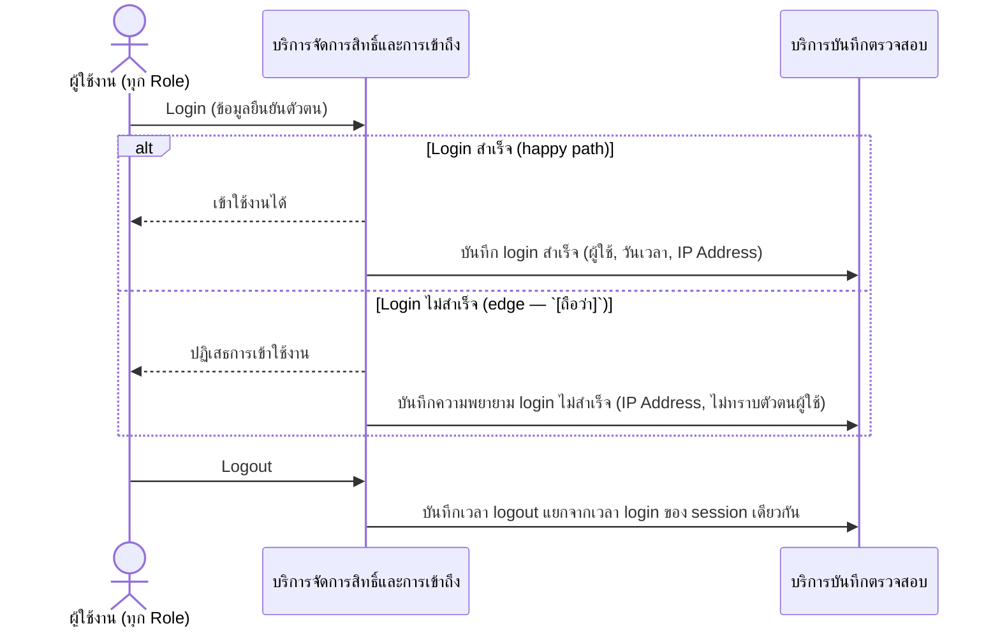
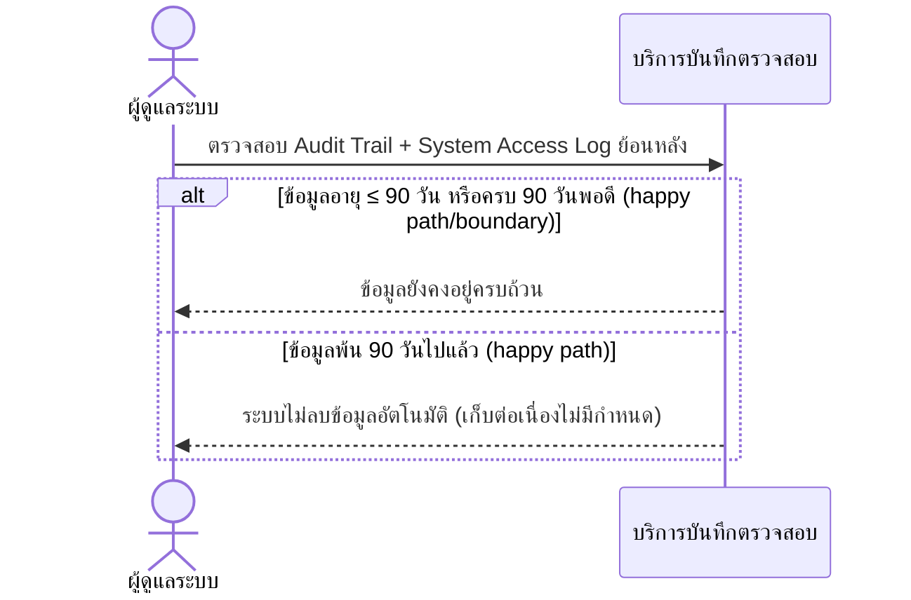

# Detailed Design (Conceptual) — System Access Log และการเก็บรักษาข้อมูลตามกฎหมาย (≥90 วัน) (FT-024)

> เอกสารนี้เป็น detailed design ระดับแนวคิด (conceptual) เท่านั้น **ยังไม่ผูกมัดกับ technology stack, protocol, หรือเทคนิคการ implement ใดๆ** — ตาม CLAUDE.md เฟสปัจจุบันของโปรเจกต์คือการทำเอกสาร ยังไม่เข้าสู่เฟสพัฒนา เอกสารนี้จะถูกทบทวนอีกครั้งเมื่อเข้าสู่เฟสพัฒนาจริง
>
> อ้างอิงจาก [backlog.md](../backlog.md), [Feature List](../02-feature-list.md), [User Journey](../03-user-journey/), [Acceptance Criteria](../04-test-design/acceptance-criteria.md), [High-Level Architecture](../05-architecture.md), [Data Model](../06-data-model.md), [API Spec](../07-api-spec.md) — ดูนโยบาย granularity/exception/state-diagram ที่ใช้ร่วมกันทุกไฟล์ใน [README.md](README.md)

**วันที่สร้าง/อัปเดตล่าสุด:** 20260823
**Feature:** FT-024 — System Access Log และการเก็บรักษาข้อมูลตามกฎหมาย (≥90 วัน)
**Backlog item ที่เกี่ยวข้อง:** BL-028, BL-029

## 1. ภาพรวม (Overview)

ระบบบันทึก System Access Log (login/logout + IP Address) แยกจาก Audit Trail ทางธุรกิจ ([requisition-audit-trail.md](requisition-audit-trail.md) FT-005) และเก็บรักษาไว้อย่างน้อย 90 วันตาม พ.ร.บ.คอมพิวเตอร์ฯ มาตรา 26 โดยหลังพ้น 90 วันเก็บต่อเนื่องไม่มีกำหนดลบ ตาม [admin-journey.md](../03-user-journey/admin-journey.md) step 3, 5 — 2 ไดอะแกรมต่อ BL-ID

## 2. Sequence Diagram(s)

### 2.1 BL-028 — บันทึก Login/Logout พร้อม IP Address

**อ้างอิง:** Acceptance Criteria BL-028 Scenario 1-3

### 2.2 BL-029 — เก็บรักษา Audit Trail + Access Log อย่างน้อย 90 วัน

**อ้างอิง:** Acceptance Criteria BL-029 Scenario 1-3

## 3. Lifecycle / State Diagram

ไม่เกี่ยวข้อง — SystemAccessLog เขียนครั้งเดียว ไม่มีสถานะหลายขั้น

## 4. องค์ประกอบและ Operation ที่เกี่ยวข้อง (Cross-reference)

| องค์ประกอบ/Entity/Operation | มาจากเอกสาร | บทบาทใน Feature นี้ |
|---|---|---|
| บริการจัดการสิทธิ์และการเข้าถึง | 05-architecture.md §3 | ยืนยันตัวตนก่อนสร้าง log entry |
| บริการบันทึกตรวจสอบ | 05-architecture.md §3 | จัดเก็บ/ควบคุมการเก็บรักษาตามกฎหมาย |
| SystemAccessLog | 06-data-model.md §3.16 | entity หลักของ Feature นี้ |
| เข้าสู่ระบบ; ออกจากระบบ; ดู System Access Log | 07-api-spec.md §3.2/§3.10 | operation หลักของ Feature นี้ |

## 5. สิ่งที่ยังไม่ตัดสินใจ / Assumption ที่ต้องยืนยัน

- Scenario "login ไม่สำเร็จ" เป็น `[ถือว่า]` จาก acceptance-criteria.md ไม่ใช่การตัดสินใจใหม่ของไฟล์นี้

---

## บันทึกการอัปเดต (Changelog)

- **20260823:** สร้างไฟล์ครั้งแรก — 2 ไดอะแกรมต่อ BL-ID (BL-028 login/logout, BL-029 การเก็บรักษา)
