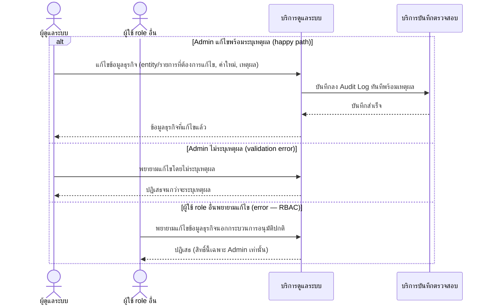

# Detailed Design (Conceptual) — Admin แก้ไขข้อมูลธุรกิจกรณีฉุกเฉิน (FT-021)

> เอกสารนี้เป็น detailed design ระดับแนวคิด (conceptual) เท่านั้น **ยังไม่ผูกมัดกับ technology stack, protocol, หรือเทคนิคการ implement ใดๆ** — ตาม CLAUDE.md เฟสปัจจุบันของโปรเจกต์คือการทำเอกสาร ยังไม่เข้าสู่เฟสพัฒนา เอกสารนี้จะถูกทบทวนอีกครั้งเมื่อเข้าสู่เฟสพัฒนาจริง
>
> อ้างอิงจาก [backlog.md](../backlog.md), [Feature List](../02-feature-list.md), [User Journey](../03-user-journey/), [Acceptance Criteria](../04-test-design/acceptance-criteria.md), [High-Level Architecture](../05-architecture.md), [Data Model](../06-data-model.md), [API Spec](../07-api-spec.md) — ดูนโยบาย granularity/exception/state-diagram ที่ใช้ร่วมกันทุกไฟล์ใน [README.md](README.md)

**วันที่สร้าง/อัปเดตล่าสุด:** 20260823
**Feature:** FT-021 — Admin แก้ไขข้อมูลธุรกิจกรณีฉุกเฉิน
**Backlog item ที่เกี่ยวข้อง:** BL-025

## 1. ภาพรวม (Overview)

ผู้ดูแลระบบแก้ไขข้อมูลธุรกิจ (เบิก/จ่าย/ยอดคงคลัง) ได้เฉพาะกรณีฉุกเฉิน โดยระบบต้องบันทึกลง Audit Log ทันทีพร้อมเหตุผลการแก้ไข ตาม [admin-journey.md](../03-user-journey/admin-journey.md) step 4 — เป็นทางเดียวที่ข้อมูลธุรกิจถูกแก้ไขนอกกระบวนการอนุมัติปกติ ([requisition-audit-trail.md](requisition-audit-trail.md) FT-005 อ้างอิงกลับมาที่ Feature นี้)

## 2. Sequence Diagram(s)

### 2.1 BL-025 — แก้ไขข้อมูลธุรกิจกรณีฉุกเฉิน

**อ้างอิง:** Acceptance Criteria BL-025 Scenario 1-3

## 3. Lifecycle / State Diagram

ไม่เกี่ยวข้อง

## 4. องค์ประกอบและ Operation ที่เกี่ยวข้อง (Cross-reference)

| องค์ประกอบ/Entity/Operation | มาจากเอกสาร | บทบาทใน Feature นี้ |
|---|---|---|
| บริการดูแลระบบ | 05-architecture.md §3 | ดำเนินการแก้ไขข้อมูลธุรกิจกรณีฉุกเฉิน |
| บริการบันทึกตรวจสอบ | 05-architecture.md §3 | บันทึก Audit Trail คู่กันเสมอ |
| EmergencyDataEditRecord, AuditTrail | 06-data-model.md §3.14/3.15 | ความสัมพันธ์ 1 ต่อ 1 บังคับคู่กันเสมอ |
| แก้ไขข้อมูลธุรกิจกรณีฉุกเฉิน | 07-api-spec.md §3.11 | operation หลักของ Feature นี้ |

## 5. สิ่งที่ยังไม่ตัดสินใจ / Assumption ที่ต้องยืนยัน

- ไม่มี open item ใหม่ — AC ของ BL-025 resolved ครบ

---

## บันทึกการอัปเดต (Changelog)

- **20260823:** สร้างไฟล์ครั้งแรก — 1 ไดอะแกรม happy path พร้อม inline `alt` 2 exception (ไม่ระบุเหตุผล, RBAC)
