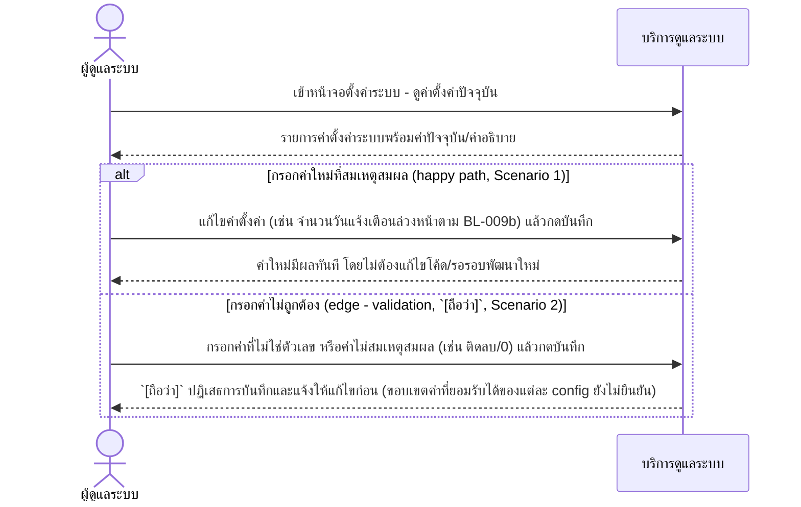
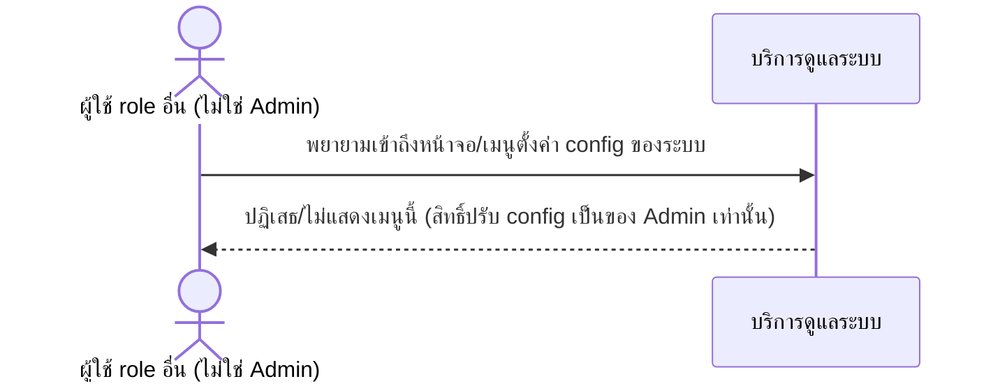

# Detailed Design (Conceptual) — Admin ปรับค่า Config ผ่านหน้าจอระบบ (FT-034)

> เอกสารนี้เป็น detailed design ระดับแนวคิด (conceptual) เท่านั้น **ยังไม่ผูกมัดกับ technology stack, protocol, หรือเทคนิคการ implement ใดๆ** — ตาม CLAUDE.md เฟสปัจจุบันของโปรเจกต์คือการทำเอกสาร ยังไม่เข้าสู่เฟสพัฒนา เอกสารนี้จะถูกทบทวนอีกครั้งเมื่อเข้าสู่เฟสพัฒนาจริง
>
> อ้างอิงจาก [backlog.md](../backlog.md), [Feature List](../02-feature-list.md), [User Journey](../03-user-journey/), [Acceptance Criteria](../04-test-design/acceptance-criteria.md), [High-Level Architecture](../05-architecture.md), [Data Model](../06-data-model.md), [API Spec](../07-api-spec.md) — ดูนโยบาย granularity/exception/state-diagram ที่ใช้ร่วมกันทุกไฟล์ใน [README.md](README.md)

**วันที่สร้าง/อัปเดตล่าสุด:** 20260825
**Feature:** FT-034 — Admin ปรับค่า Config ผ่านหน้าจอระบบ
**Backlog item ที่เกี่ยวข้อง:** BL-043

## 1. ภาพรวม (Overview)

ผู้ดูแลระบบ (Admin) ปรับค่า config ของระบบที่มีแนวโน้มเปลี่ยนตามนโยบาย (เช่น จำนวนวันแจ้งเตือนล่วงหน้าก่อนกำหนดส่งคำขอเบิกประจำเดือนตาม BL-009b) ได้เองผ่านหน้าจอ โดยไม่ต้องแก้ไขโค้ด/รอรอบพัฒนาใหม่ ตาม [admin-journey.md](../03-user-journey/admin-journey.md) step 3 (node B2) — ใช้ entity ใหม่ SystemConfiguration ([06-data-model.md](../06-data-model.md) §3.18) และ operation คู่ "ดูค่าตั้งค่าระบบ"/"แก้ไขค่าตั้งค่าระบบ" ([07-api-spec.md](../07-api-spec.md) §3.11)

แบ่งเป็น 2 ไดอะแกรม: (2.1) Admin ปรับค่า config สำเร็จ/ไม่สำเร็จจากการ validation (2 branch, inline `alt`) และ (2.2) role อื่นพยายามเข้าถึงหน้าจอนี้ (RBAC denial ที่มีลักษณะต่างจาก 2 scenario แรกอย่างมีนัยสำคัญ — เป็นความพยายามเข้าถึงนอกสิทธิ์ ไม่ใช่การกรอกข้อมูลผิด — แยกไดอะแกรมตามรูปแบบเดียวกับ [rbac-access-control.md](rbac-access-control.md) §2.2 และ [admin-emergency-data-correction.md](admin-emergency-data-correction.md) §2.1)

## 2. Sequence Diagram(s)

### 2.1 BL-043 — Admin ปรับค่า Config ผ่านหน้าจอ

**อ้างอิง:** Acceptance Criteria BL-043 Scenario 1-2

### 2.2 BL-043 — Role อื่นพยายามเข้าถึงหน้าจอตั้งค่า (error — RBAC)

**อ้างอิง:** Acceptance Criteria BL-043 Scenario 3

## 3. Lifecycle / State Diagram

ไม่เกี่ยวข้อง — SystemConfiguration เก็บค่าปัจจุบันเพียงค่าเดียวต่อ Config Key ไม่มีสถานะหลายขั้นแบบ workflow

## 4. องค์ประกอบและ Operation ที่เกี่ยวข้อง (Cross-reference)

| องค์ประกอบ/Entity/Operation | มาจากเอกสาร | บทบาทใน Feature นี้ |
|---|---|---|
| บริการดูแลระบบ (Admin Operations) | 05-architecture.md §3 | ดำเนินการปรับค่า config ของระบบผ่านหน้าจอ |
| SystemConfiguration | 06-data-model.md §3.18 | entity หลักของ Feature นี้ (Config Key, ค่าปัจจุบัน, ผู้แก้ไขล่าสุด) |
| ดูค่าตั้งค่าระบบ; แก้ไขค่าตั้งค่าระบบ | 07-api-spec.md §3.11 | operation หลักของ Feature นี้ |

## 5. สิ่งที่ยังไม่ตัดสินใจ / Assumption ที่ต้องยืนยัน

ไม่มีสำหรับ Config Key ที่มีอยู่ในปัจจุบัน — **cross-ref BL-009b (ยืนยันแล้ว 20260825):** ค่าเริ่มต้น = 2 วัน, ขอบเขต min/max = 1 ถึง 30 วัน — ขอบเขต min/max ของ Config Key อื่นที่จะเพิ่มในอนาคตยังต้องยืนยันเป็นรายตัวเมื่อเพิ่มจริง (หลักการ "กำหนดแยกทีละ Config Key" ยืนยันแล้ว ดู [07-api-spec.md](../07-api-spec.md) §5)

---

## บันทึกการอัปเดต (Changelog)

- **20260825:** สร้างไฟล์ครั้งแรก — 2 ไดอะแกรม (2.1 ปรับค่า config สำเร็จ/validation error แบบ inline `alt`, 2.2 RBAC denial ของ role อื่นแยกไดอะแกรมต่างหากตามรูปแบบเดียวกับ [rbac-access-control.md](rbac-access-control.md)) — คง `[รอยืนยัน]` ของ BL-009b (ตัวเลขจำนวนวัน) ไว้ตรงจุดเดิม ไม่สมมติค่าขึ้นเอง
- **20260825 (ต่อเนื่อง):** BL-009b ยืนยันแล้ว = 2 วัน, ขอบเขต min/max = 1-30 วัน — ปิดหัวข้อ 5 สำหรับ Config Key ที่มีอยู่
