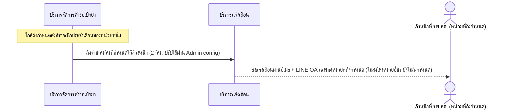

# Detailed Design (Conceptual) — แจ้งเตือนล่วงหน้าก่อนกำหนดส่งคำขอเบิกประจำเดือน (FT-007)

> เอกสารนี้เป็น detailed design ระดับแนวคิด (conceptual) เท่านั้น **ยังไม่ผูกมัดกับ technology stack, protocol, หรือเทคนิคการ implement ใดๆ** — ตาม CLAUDE.md เฟสปัจจุบันของโปรเจกต์คือการทำเอกสาร ยังไม่เข้าสู่เฟสพัฒนา เอกสารนี้จะถูกทบทวนอีกครั้งเมื่อเข้าสู่เฟสพัฒนาจริง
>
> อ้างอิงจาก [backlog.md](../backlog.md), [Feature List](../02-feature-list.md), [User Journey](../03-user-journey/), [Acceptance Criteria](../04-test-design/acceptance-criteria.md), [High-Level Architecture](../05-architecture.md), [Data Model](../06-data-model.md), [API Spec](../07-api-spec.md) — ดูนโยบาย granularity/exception/state-diagram ที่ใช้ร่วมกันทุกไฟล์ใน [README.md](README.md)

**วันที่สร้าง/อัปเดตล่าสุด:** 20260823
**Feature:** FT-007 — แจ้งเตือนล่วงหน้าก่อนกำหนดส่งคำขอเบิกประจำเดือน
**Backlog item ที่เกี่ยวข้อง:** BL-009b

## 1. ภาพรวม (Overview)

ระบบแจ้งเตือนเจ้าหน้าที่ รพ.สต. ล่วงหน้า**2 วัน**ก่อนถึงกำหนดส่งคำขอเบิกประจำเดือน (ยืนยันแล้ว 20260825, BL-009b — เป็นค่าเริ่มต้นที่ Admin ปรับได้ผ่านหน้าจอ "ตั้งค่าระบบ" ตาม BL-043 ในขอบเขต 1-30 วัน) เพื่อลดปัญหา "ลืมเบิกยา" ซึ่งเป็นหนึ่งใน Root Cause ของการเบิกด่วนนอกรอบ ตาม [staff-hph-journey.md](../03-user-journey/staff-hph-journey.md) step 11

## 2. Sequence Diagram(s)

### 2.1 BL-009b — แจ้งเตือนล่วงหน้าก่อนกำหนด

**อ้างอิง:** Acceptance Criteria BL-009b Scenario 1-2

## 3. Lifecycle / State Diagram

ไม่เกี่ยวข้อง — ไม่มี entity สถานะหลายขั้นของ Feature นี้เอง

## 4. องค์ประกอบและ Operation ที่เกี่ยวข้อง (Cross-reference)

| องค์ประกอบ/Entity/Operation | มาจากเอกสาร | บทบาทใน Feature นี้ |
|---|---|---|
| บริการจัดการคำขอเบิกยา | 05-architecture.md §3 | ตรวจจับกำหนดส่งคำขอเบิกของแต่ละหน่วย |
| บริการแจ้งเตือน | 05-architecture.md §3 | กระจายแจ้งเตือนผ่านอีเมล+LINE OA |
| NotificationEvent | 06-data-model.md §3.12 | ประเภทเหตุการณ์ "ก่อนกำหนดเบิก" |
| (trigger ภายใน ไม่มี operation ตรง) | 07-api-spec.md §3.7 | จำนวนวันล่วงหน้าเป็นค่า config ของ trigger |

## 5. สิ่งที่ยังไม่ตัดสินใจ / Assumption ที่ต้องยืนยัน

ไม่มี — จำนวนวันล่วงหน้ายืนยันแล้ว (20260825) ดูหัวข้อ 1

---

## บันทึกการอัปเดต (Changelog)

- **20260823:** สร้างไฟล์ครั้งแรก — 1 ไดอะแกรม happy path เดียว คงค่า `[รอยืนยัน]` จำนวนวันไว้ตามต้นทาง ไม่สมมติตัวเลขเอง
- **20260825:** จำนวนวันล่วงหน้ายืนยันแล้ว = 2 วัน (BL-009b, cross-ref BL-043 ขอบเขต 1-30 วัน) — แก้หัวข้อ 1, sequence diagram, และหัวข้อ 5 ให้สะท้อนค่าที่ยืนยันแล้วแทน `[รอยืนยัน]`
