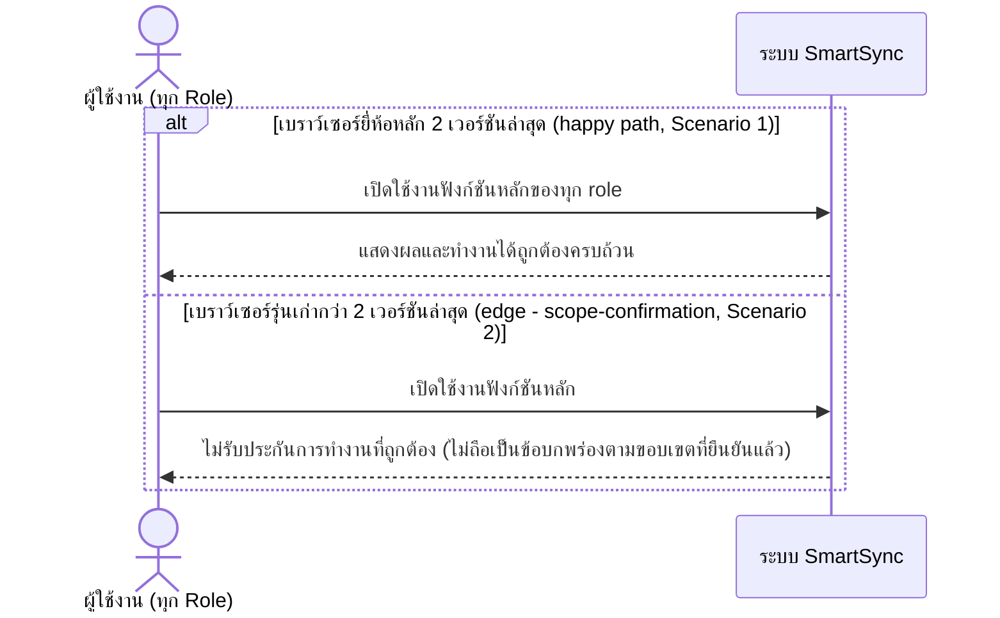

# Detailed Design (Conceptual) — รองรับเบราว์เซอร์ Evergreen 2 เวอร์ชันล่าสุด (FT-031)

> เอกสารนี้เป็น detailed design ระดับแนวคิด (conceptual) เท่านั้น **ยังไม่ผูกมัดกับ technology stack, protocol, หรือเทคนิคการ implement ใดๆ** — ตาม CLAUDE.md เฟสปัจจุบันของโปรเจกต์คือการทำเอกสาร ยังไม่เข้าสู่เฟสพัฒนา เอกสารนี้จะถูกทบทวนอีกครั้งเมื่อเข้าสู่เฟสพัฒนาจริง
>
> อ้างอิงจาก [backlog.md](../backlog.md), [Feature List](../02-feature-list.md), [User Journey](../03-user-journey/), [Acceptance Criteria](../04-test-design/acceptance-criteria.md), [High-Level Architecture](../05-architecture.md), [Data Model](../06-data-model.md), [API Spec](../07-api-spec.md) — ดูนโยบาย granularity/exception/state-diagram ที่ใช้ร่วมกันทุกไฟล์ใน [README.md](README.md)

**วันที่สร้าง/อัปเดตล่าสุด:** 20260825
**Feature:** FT-031 — รองรับเบราว์เซอร์ Evergreen 2 เวอร์ชันล่าสุด
**Backlog item ที่เกี่ยวข้อง:** BL-040

## 1. ภาพรวม (Overview)

**หมายเหตุเรื่องความเหมาะสมของ sequence diagram:** เช่นเดียวกับ [responsive-ui-all-devices.md](responsive-ui-all-devices.md) (FT-022) — BL-040 เป็นข้อกำหนดเชิงขอบเขตการรองรับ (compatibility) ไม่ใช่ workflow ที่ต่างกันตาม scenario สิ่งที่ต่างกันคือ "ระบบทำงานถูกต้องหรือไม่" ไม่ใช่ "ใครโต้ตอบกับใคร" จึงแสดงเป็นไดอะแกรมแนวคิดเดียวครอบคลุมทั้ง 2 scenario ไม่แยกไดอะแกรมย่อยตาม role/หน้าจอ — ไม่ระบุชื่อเบราว์เซอร์/เวอร์ชันจริงหรือกลไกตรวจจับใดๆ

## 2. Sequence Diagram(s)

### 2.1 BL-040 — ขอบเขตการรองรับเบราว์เซอร์

**อ้างอิง:** Acceptance Criteria BL-040 Scenario 1-2

## 3. Lifecycle / State Diagram

ไม่เกี่ยวข้อง

## 4. องค์ประกอบและ Operation ที่เกี่ยวข้อง (Cross-reference)

| องค์ประกอบ/Entity/Operation | มาจากเอกสาร | บทบาทใน Feature นี้ |
|---|---|---|
| ระบบ SmartSync (ภาพรวม, ไม่ระบุองค์ประกอบเจาะจง) | 05-architecture.md §3 (หมายเหตุ NFR เพิ่มเติม 20260824) | BL-040 ครอบคลุมทุกหน้าจอ/องค์ประกอบ ไม่ผูกกับองค์ประกอบใดเป็นการเฉพาะ |
| NFR ความเข้ากันได้ของเบราว์เซอร์ (Compatibility — Browser) | 05-architecture.md §7 | ขอบเขต evergreen 2 เวอร์ชันล่าสุดของแต่ละยี่ห้อหลัก |

## 5. สิ่งที่ยังไม่ตัดสินใจ / Assumption ที่ต้องยืนยัน

- ไม่มี open item ใหม่ — AC ของ BL-040 resolved ครบ (scope-confirmation)

---

## บันทึกการอัปเดต (Changelog)

- **20260825:** สร้างไฟล์ครั้งแรก — 1 ไดอะแกรมแนวคิดล้วนๆ ครอบคลุมทั้ง 2 scenario ตามหลักการเดียวกับ FT-022 (ข้อยกเว้นนโยบาย exception-per-scenario เนื่องจากต่างกันแค่ขอบเขตการรองรับ ไม่ใช่ลำดับการโต้ตอบ)
