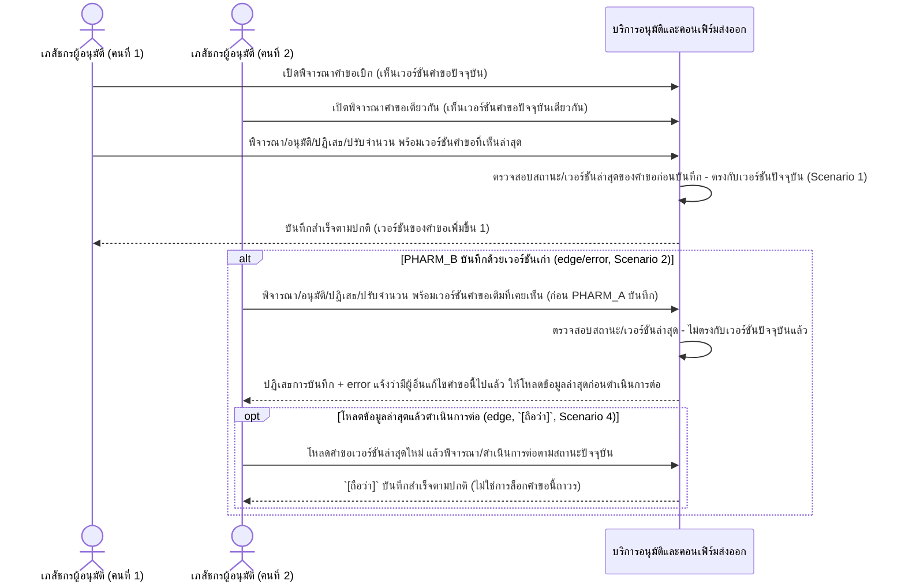

# Detailed Design (Conceptual) — ตรวจสอบสถานะคำขอซ้ำก่อนบันทึกทุกครั้ง (Optimistic Concurrency Check) (FT-027)

> เอกสารนี้เป็น detailed design ระดับแนวคิด (conceptual) เท่านั้น **ยังไม่ผูกมัดกับ technology stack, protocol, หรือเทคนิคการ implement ใดๆ** — ตาม CLAUDE.md เฟสปัจจุบันของโปรเจกต์คือการทำเอกสาร ยังไม่เข้าสู่เฟสพัฒนา เอกสารนี้จะถูกทบทวนอีกครั้งเมื่อเข้าสู่เฟสพัฒนาจริง
>
> อ้างอิงจาก [backlog.md](../backlog.md), [Feature List](../02-feature-list.md), [User Journey](../03-user-journey/), [Acceptance Criteria](../04-test-design/acceptance-criteria.md), [High-Level Architecture](../05-architecture.md), [Data Model](../06-data-model.md), [API Spec](../07-api-spec.md) — ดูนโยบาย granularity/exception/state-diagram ที่ใช้ร่วมกันทุกไฟล์ใน [README.md](README.md)

**วันที่สร้าง/อัปเดตล่าสุด:** 20260825
**Feature:** FT-027 — ตรวจสอบสถานะคำขอซ้ำก่อนบันทึกทุกครั้ง (Optimistic Concurrency Check)
**Backlog item ที่เกี่ยวข้อง:** BL-036

## 1. ภาพรวม (Overview)

เมื่อเภสัชกรมากกว่า 1 คนเปิดพิจารณา/อนุมัติคำขอเบิกยาเดียวกันพร้อมกัน (ระดับ 1 หรือระดับ 2) ระบบต้องตรวจสอบเวอร์ชันล่าสุดของคำขอก่อนบันทึกทุกครั้ง (Optimistic Concurrency Check) และปฏิเสธพร้อมแสดง error ทันทีหากพบว่ามีผู้อื่นบันทึกคำขอเดียวกันไปแล้ว ตาม [pharmacist-journey.md](../03-user-journey/pharmacist-journey.md) step 5 (node P1) — กลไกนี้ผูกอยู่กับ operation "พิจารณา/อนุมัติ/ปฏิเสธ/ปรับจำนวน (ระดับ 1)" และ "ตรวจสอบซ้ำและยืนยัน (ระดับ 2)" ใน [07-api-spec.md](../07-api-spec.md) §3.4 โดยตรง ไม่ใช่ operation แยก และใช้ฟิลด์ "เวอร์ชันของบันทึก (Record Version)" บน Requisition ([06-data-model.md](../06-data-model.md) §3.4) เป็นตัวตรวจสอบ

**ขอบเขตของไฟล์นี้:** ไดอะแกรมด้านล่างครอบคลุม Scenario 1, 2 และ 4 ของ AC (บันทึกสำเร็จตามปกติ / ถูกปฏิเสธเมื่อเวอร์ชันไม่ตรง / โหลดใหม่แล้วบันทึกซ้ำได้) เป็นไดอะแกรมเดียว — **Scenario 3** (เชื่อมโยงกับกฎห้ามอนุมัติคนเดียวกันสองระดับ) **ไม่วาดซ้ำที่นี่** เนื่องจากเป็น RBAC denial ที่มีไดอะแกรมของตัวเองอยู่แล้วที่ [two-level-requisition-approval.md](two-level-requisition-approval.md) §2.3 (BL-004) — Scenario 3 เพียงยืนยันว่ากลไกทั้งสอง (RBAC ของ BL-004 + Concurrency Check ของ BL-036) ทำงานร่วมกันในสถานการณ์นั้น ไม่ใช่ลำดับการโต้ตอบใหม่ที่ต้องวาดเพิ่ม

## 2. Sequence Diagram(s)

### 2.1 BL-036 — Optimistic Concurrency Check ระหว่างพิจารณา/อนุมัติ

**อ้างอิง:** Acceptance Criteria BL-036 Scenario 1, 2, 4

**หมายเหตุ Scenario 3 (ไม่วาดในไฟล์นี้):** เมื่อเภสัชกรคนเดียวกันเป็นผู้อนุมัติระดับ 1 พยายามอนุมัติระดับ 2 ของคำขอเดียวกัน ระบบต้องปฏิเสธการกระทำจากทั้งกฎ RBAC (BL-004) และกลไกตรวจสอบเวอร์ชันนี้ (BL-036) ที่ทำงานร่วมกัน — ดูลำดับการโต้ตอบเต็มที่ [two-level-requisition-approval.md](two-level-requisition-approval.md) §2.3

## 3. Lifecycle / State Diagram

ไม่เกี่ยวข้อง — สถานะคำขอเบิกยาทั้งวงจรเป็นของ [two-level-requisition-approval.md](two-level-requisition-approval.md) §3 อยู่แล้ว ฟิลด์ "เวอร์ชันของบันทึก" ที่ Feature นี้ใช้เป็นตัวนับจำนวนเต็มเพิ่มขึ้นเรื่อยๆ ไม่ใช่สถานะแบบ enum ที่มีลำดับขั้น จึงไม่ใช่ lifecycle diagram

## 4. องค์ประกอบและ Operation ที่เกี่ยวข้อง (Cross-reference)

| องค์ประกอบ/Entity/Operation | มาจากเอกสาร | บทบาทใน Feature นี้ |
|---|---|---|
| บริการอนุมัติและคอนเฟิร์มส่งออก | 05-architecture.md §3 | ดำเนินการตรวจสอบเวอร์ชันคำขอก่อนบันทึกทุกครั้งระหว่างขั้นตอนอนุมัติทั้งสองระดับ |
| Requisition (เวอร์ชันของบันทึก / Record Version) | 06-data-model.md §3.4 | ฟิลด์ตัวเลขที่ใช้ตรวจสอบว่ามีผู้อื่นบันทึกคำขอเดียวกันไปแล้วหรือไม่ |
| พิจารณา/อนุมัติ/ปฏิเสธ/ปรับจำนวน (ระดับ 1); ตรวจสอบซ้ำและยืนยัน (ระดับ 2) | 07-api-spec.md §3.4 | operation ที่รับ/ตรวจเวอร์ชันคำขอก่อนบันทึกทุกครั้ง (ไม่ใช่ operation แยก) |

## 5. สิ่งที่ยังไม่ตัดสินใจ / Assumption ที่ต้องยืนยัน

- ไม่มี open item ใหม่ — AC ของ BL-036 resolved ครบเชิงกฎธุรกิจ (20260824) รวมถึง Scenario 4 ที่เป็น `[ถือว่า]` มาจาก acceptance-criteria.md เอง (พฤติกรรมหลัง error ควรเป็นอย่างไร ยังไม่ได้รับการยืนยันจากเจ้าของระบบโดยตรง แต่ไม่ใช่ประเด็นใหม่ที่ไฟล์นี้เพิ่มขึ้นเอง)

---

## บันทึกการอัปเดต (Changelog)

- **20260825:** สร้างไฟล์ครั้งแรก — 1 ไดอะแกรมครอบคลุม Scenario 1/2/4 ของ BL-036 (บันทึกสำเร็จ/ถูกปฏิเสธเมื่อเวอร์ชันไม่ตรง/โหลดใหม่แล้วบันทึกซ้ำได้) พร้อม cross-reference ไปยัง [two-level-requisition-approval.md](two-level-requisition-approval.md) §2.3 สำหรับ Scenario 3 (RBAC denial ที่มีไดอะแกรมอยู่แล้ว ไม่วาดซ้ำ) — ไม่แก้ไขไฟล์ two-level-requisition-approval.md ตามขอบเขตงานที่ระบุว่า FT-001–025 ไม่ต้องแตะในรอบนี้
