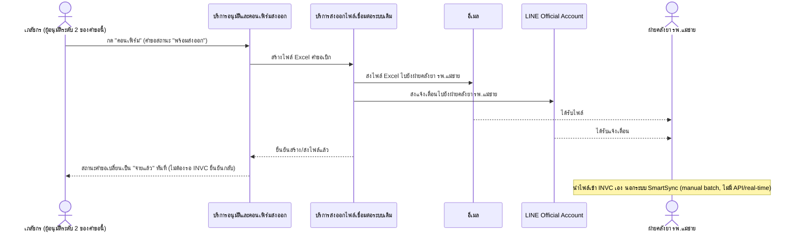
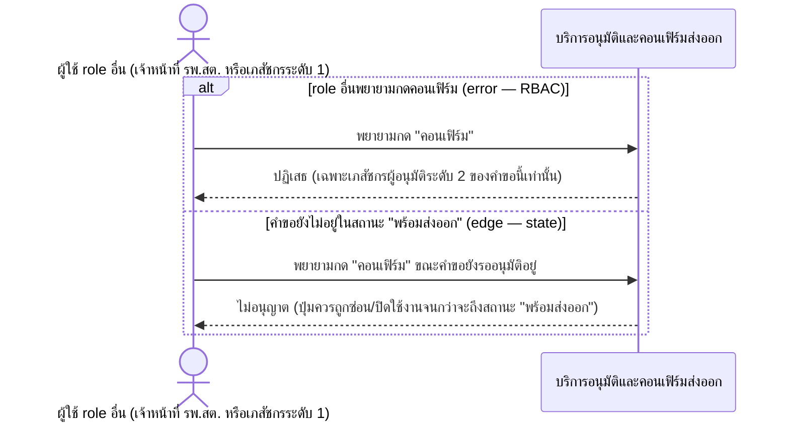
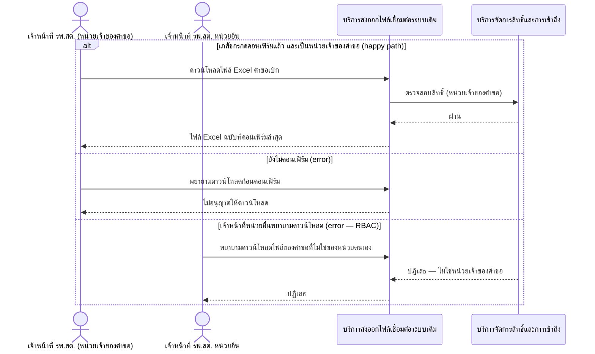
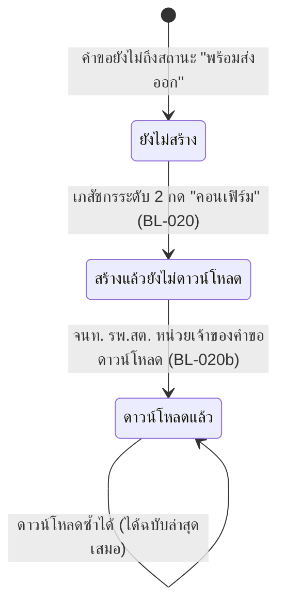

# Detailed Design (Conceptual) — คอนเฟิร์มส่งออกไฟล์เบิกยาและดาวน์โหลดสำเนา (FT-017)

> เอกสารนี้เป็น detailed design ระดับแนวคิด (conceptual) เท่านั้น **ยังไม่ผูกมัดกับ technology stack, protocol, หรือเทคนิคการ implement ใดๆ** — ตาม CLAUDE.md เฟสปัจจุบันของโปรเจกต์คือการทำเอกสาร ยังไม่เข้าสู่เฟสพัฒนา เอกสารนี้จะถูกทบทวนอีกครั้งเมื่อเข้าสู่เฟสพัฒนาจริง
>
> อ้างอิงจาก [backlog.md](../backlog.md), [Feature List](../02-feature-list.md), [User Journey](../03-user-journey/), [Acceptance Criteria](../04-test-design/acceptance-criteria.md), [High-Level Architecture](../05-architecture.md), [Data Model](../06-data-model.md), [API Spec](../07-api-spec.md) — ดูนโยบาย granularity/exception/state-diagram ที่ใช้ร่วมกันทุกไฟล์ใน [README.md](README.md)

**วันที่สร้าง/อัปเดตล่าสุด:** 20260823
**Feature:** FT-017 — คอนเฟิร์มส่งออกไฟล์เบิกยาและดาวน์โหลดสำเนา
**Backlog item ที่เกี่ยวข้อง:** BL-020, BL-020b, BL-021

## 1. ภาพรวม (Overview)

เมื่อคำขออยู่ในสถานะ "พร้อมส่งออก" (ต่อจาก [two-level-requisition-approval.md](two-level-requisition-approval.md) FT-002) เภสัชกรผู้อนุมัติระดับ 2 กด "คอนเฟิร์ม" เพื่อสร้างไฟล์ Excel คำขอเบิกและส่งเข้าอีเมล + LINE OA ไปยังฝ่ายคลังยา รพ.แม่ข่ายในขั้นตอนเดียว พร้อมเปลี่ยนสถานะเป็น "จ่ายแล้ว" ทันที (BL-020, รวม BL-021 ที่ resolved แล้ว) จากนั้นเจ้าหน้าที่ รพ.สต. จึงดาวน์โหลดไฟล์ฉบับที่คอนเฟิร์มล่าสุดได้ (BL-020b) ตาม [pharmacist-journey.md](../03-user-journey/pharmacist-journey.md) step 10-11 และ [staff-hph-journey.md](../03-user-journey/staff-hph-journey.md) step 8

**การเชื่อมต่อกับ INVC เป็นแบบ manual batch เท่านั้น** ([05-architecture.md](../05-architecture.md) §2/§6) — ไม่มี API/real-time ไปยัง INVC โดยตรง ไดอะแกรมด้านล่างจึงแสดงการนำไฟล์เข้า INVC เป็นขั้นตอน "นอกระบบ SmartSync" เสมอ ไม่ใช่การเรียกซิงโครนัส

**Feature นี้เป็นเจ้าของ state diagram ของ ExportFile download-gate (หัวข้อ 3)** ร่วมกับ [invc-file-format-compatibility.md](invc-file-format-compatibility.md) (FT-018)

## 2. Sequence Diagram(s)

### 2.1 BL-020 — กดคอนเฟิร์มสำเร็จ (happy path)

**อ้างอิง:** Acceptance Criteria BL-020 Scenario 1

### 2.2 BL-020 — คอนเฟิร์มไม่สำเร็จ (error/edge)

**อ้างอิง:** Acceptance Criteria BL-020 Scenario 2-3

### 2.3 BL-020b — ดาวน์โหลดไฟล์ Excel หลังคอนเฟิร์ม

**อ้างอิง:** Acceptance Criteria BL-020b Scenario 1-3

## 3. Lifecycle / State Diagram — ExportFile Download-Gate

**อ้างอิง:** [06-data-model.md](../06-data-model.md) §3.13, FR-4.1/4.1b, BL-020/020b

โครงสร้างคอลัมน์ภายในไฟล์ (Column Structure) ยังเป็น `[รอยืนยัน]` ตาม [invc-file-format-compatibility.md](invc-file-format-compatibility.md) (FT-018) — ไม่กระทบสถานะ download-gate นี้ (เป็นคนละมิติกัน)

## 4. องค์ประกอบและ Operation ที่เกี่ยวข้อง (Cross-reference)

| องค์ประกอบ/Entity/Operation | มาจากเอกสาร | บทบาทใน Feature นี้ |
|---|---|---|
| บริการส่งออกไฟล์เชื่อมต่อระบบเดิม | 05-architecture.md §3 | สร้างไฟล์ + ส่งช่องทาง + ควบคุมการดาวน์โหลด |
| บริการอนุมัติและคอนเฟิร์มส่งออก | 05-architecture.md §3 | รับคำสั่งคอนเฟิร์ม เปลี่ยนสถานะคำขอ |
| ExportFile | 06-data-model.md §3.13 | entity หลักของ Feature นี้ |
| คอนเฟิร์มส่งออกไฟล์เบิกยา (§3.4); ดาวน์โหลดไฟล์ Excel คำขอเบิกที่คอนเฟิร์มแล้ว (§3.9) | 07-api-spec.md | operation หลักของ Feature นี้ |

## 5. สิ่งที่ยังไม่ตัดสินใจ / Assumption ที่ต้องยืนยัน

- โครงสร้างคอลัมน์ของไฟล์ที่ INVC รองรับ ยังเป็น `[รอยืนยัน — บล็อกการพัฒนา Epic 4]` — รายละเอียดเต็มอยู่ที่ [invc-file-format-compatibility.md](invc-file-format-compatibility.md) ไม่ใช่ประเด็นใหม่ของไฟล์นี้ (ไม่กระทบลำดับการโต้ตอบที่แสดงในไดอะแกรมข้างต้น)

---

## บันทึกการอัปเดต (Changelog)

- **20260823:** สร้างไฟล์ครั้งแรก — BL-020 แยกเป็น 2 ไดอะแกรม (happy/error) เนื่องจากมีทั้ง external recipient (ฝ่ายคลังยา) และ RBAC/state exception ร่วมกัน, BL-020b แสดง inline (3 branch แต่เป็นรูปแบบ RBAC/timing check ชุดเดียวกัน ไม่ใช่ workflow ที่แตกต่างกันจริง) พร้อม state diagram ของ ExportFile download-gate (หัวข้อ 3)
