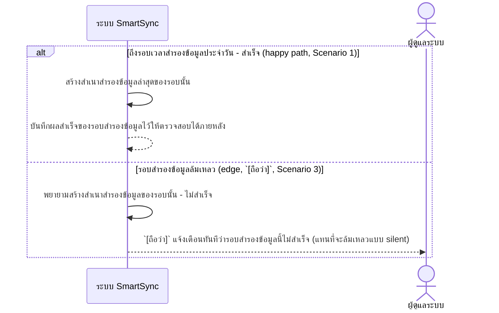
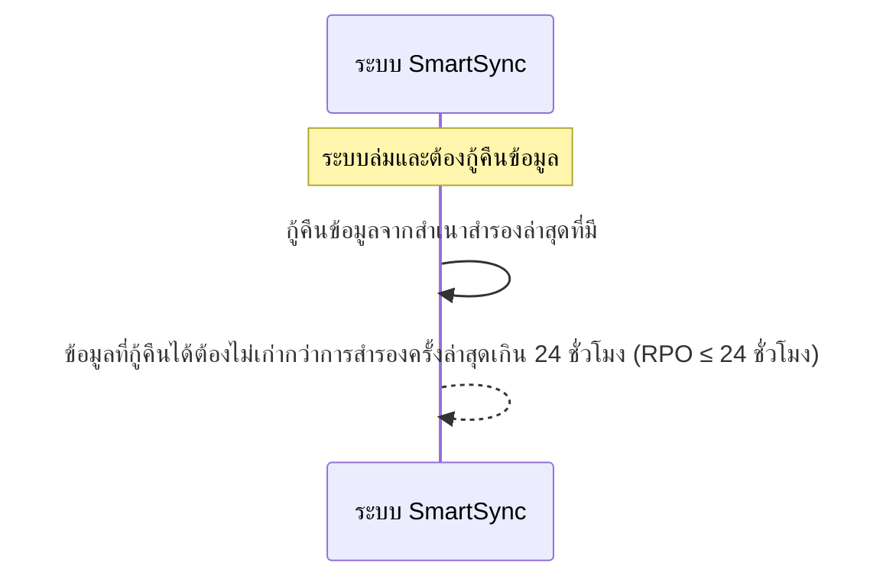

# Detailed Design (Conceptual) — สำรองข้อมูลรายวัน (Backup, RPO ≤ 24 ชั่วโมง) (FT-026)

> เอกสารนี้เป็น detailed design ระดับแนวคิด (conceptual) เท่านั้น **ยังไม่ผูกมัดกับ technology stack, protocol, หรือเทคนิคการ implement ใดๆ** — ตาม CLAUDE.md เฟสปัจจุบันของโปรเจกต์คือการทำเอกสาร ยังไม่เข้าสู่เฟสพัฒนา เอกสารนี้จะถูกทบทวนอีกครั้งเมื่อเข้าสู่เฟสพัฒนาจริง
>
> อ้างอิงจาก [backlog.md](../backlog.md), [Feature List](../02-feature-list.md), [User Journey](../03-user-journey/), [Acceptance Criteria](../04-test-design/acceptance-criteria.md), [High-Level Architecture](../05-architecture.md), [Data Model](../06-data-model.md), [API Spec](../07-api-spec.md) — ดูนโยบาย granularity/exception/state-diagram ที่ใช้ร่วมกันทุกไฟล์ใน [README.md](README.md)

**วันที่สร้าง/อัปเดตล่าสุด:** 20260825
**Feature:** FT-026 — สำรองข้อมูลรายวัน (Backup, RPO ≤ 24 ชั่วโมง)
**Backlog item ที่เกี่ยวข้อง:** BL-035

## 1. ภาพรวม (Overview)

**หมายเหตุเรื่องความเหมาะสมของ sequence diagram:** เช่นเดียวกับ [office-hours-availability.md](office-hours-availability.md) (FT-025) และ [responsive-ui-all-devices.md](responsive-ui-all-devices.md) (FT-022) — BL-035 เป็น NFR ด้าน Reliability/Backup & Recovery ล้วนๆ ไม่มีหน้าจอ/ปฏิสัมพันธ์ที่ผู้ใช้ role ใดต้องลงมือทำผ่านระบบ SmartSync (ยืนยันตรงกันทั้ง [Feature List](../02-feature-list.md) FT-026 และ [05-architecture.md](../05-architecture.md) §3 หมายเหตุ NFR เพิ่มเติม 20260824 ว่าไม่ผูกกับองค์ประกอบเชิงตรรกะใดเป็นการเฉพาะ) ไดอะแกรมด้านล่างจึงแสดงเป็นการโต้ตอบภายในระบบเอง (system-to-system) เป็นหลัก ไม่มีการวาดกลไก backup/storage/replication ทางเทคนิคใดๆ — ผู้ดูแลระบบปรากฏเป็นเพียง**ผู้รับการแจ้งเตือน** เมื่อรอบสำรองข้อมูลล้มเหลว (Scenario 3) ไม่ใช่ผู้ลงมือกระทำผ่านหน้าจอ

แบ่งเป็น 2 ไดอะแกรมตาม AC เนื่องจากเป็นคนละช่วงเวลา/บริบทของ NFR เดียวกัน (รอบสำรองข้อมูลประจำวัน vs. เหตุการณ์กู้คืนเมื่อระบบล่ม)

## 2. Sequence Diagram(s)

### 2.1 BL-035 — รอบสำรองข้อมูลประจำวัน (สำเร็จ/ล้มเหลว)

**อ้างอิง:** Acceptance Criteria BL-035 Scenario 1, 3

Scenario 3 (การแจ้งเตือนเมื่อล้มเหลว) เป็นสมมติฐาน QA มาตรฐานทั่วไปที่ acceptance-criteria.md ทำเครื่องหมาย `[ถือว่า]` ไว้แล้ว — ยังไม่ได้รับการยืนยันจากเจ้าของระบบว่าต้องมีกลไกแจ้งเตือนนี้จริงหรือไม่ ไดอะแกรมนี้คงเครื่องหมายไว้ตรงจุดเดิม ไม่ตัดสินใจเพิ่มเติมเอง

### 2.2 BL-035 — กู้คืนข้อมูลภายในเป้าหมาย RPO

**อ้างอิง:** Acceptance Criteria BL-035 Scenario 2

ไดอะแกรมนี้จงใจไม่ระบุ "ใคร" เป็นผู้ลงมือกู้คืน (ทีมผู้ดูแลระบบ/กระบวนการอัตโนมัติ) เนื่องจาก AC ของ BL-035 เองไม่ได้ระบุผู้กระทำไว้ชัดเจน (ต่างจาก BL-042/[disaster-recovery.md](disaster-recovery.md) ที่ AC ระบุชัดว่า "ทีมผู้ดูแลระบบดำเนินการกู้คืน") — ไม่สมมติผู้กระทำขึ้นเอง

## 3. Lifecycle / State Diagram

ไม่เกี่ยวข้อง

## 4. องค์ประกอบและ Operation ที่เกี่ยวข้อง (Cross-reference)

| องค์ประกอบ/Entity/Operation | มาจากเอกสาร | บทบาทใน Feature นี้ |
|---|---|---|
| ระบบ SmartSync (ภาพรวม, ไม่ระบุองค์ประกอบเจาะจง) | 05-architecture.md §3 (หมายเหตุ NFR เพิ่มเติม 20260824) | BL-035 ไม่ผูกกับองค์ประกอบเชิงตรรกะใดเป็นการเฉพาะ — เป็น NFR เชิงระบบ/infrastructure ครอบคลุมทุกองค์ประกอบ |
| NFR ความน่าเชื่อถือของข้อมูล/การสำรองข้อมูล (Reliability / Backup & Recovery) | 05-architecture.md §7 | เกณฑ์ RPO ≤ 24 ชั่วโมงที่ไดอะแกรมนี้แสดงผลลัพธ์ |

## 5. สิ่งที่ยังไม่ตัดสินใจ / Assumption ที่ต้องยืนยัน

- `[ถือว่า]` Scenario 3 (แจ้งเตือนผู้ดูแลระบบทันทีเมื่อรอบสำรองข้อมูลล้มเหลว) เป็นสมมติฐาน QA มาตรฐานทั่วไปที่ยังไม่ได้รับการยืนยันจากเจ้าของระบบ — สืบทอดมาจาก acceptance-criteria.md ไม่ใช่การตัดสินใจใหม่ของไฟล์นี้
- ไม่รวมมุมมองกลไก/เทคโนโลยีการสำรองข้อมูลใดๆ ตามที่ [05-architecture.md](../05-architecture.md) §7 ระบุไว้แล้วว่าไม่เลือกกลไกในเฟสนี้

---

## บันทึกการอัปเดต (Changelog)

- **20260825:** สร้างไฟล์ครั้งแรก — 2 ไดอะแกรมแนวคิดล้วนๆ แบบ system-to-system (รอบสำรองข้อมูลประจำวัน + กู้คืนภายใน RPO) ไม่มีผู้ใช้ role ใดลงมือทำผ่านหน้าจอ ตามหลักการเดียวกับ FT-022/FT-025 — ADMIN ปรากฏเฉพาะในฐานะผู้รับแจ้งเตือนเมื่อรอบสำรองข้อมูลล้มเหลว (Scenario 3, `[ถือว่า]`)
