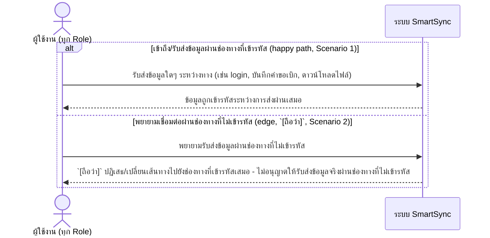

# Detailed Design (Conceptual) — เข้ารหัสข้อมูลระหว่างส่งผ่านเครือข่าย (Data Encryption in Transit) (FT-030)

> เอกสารนี้เป็น detailed design ระดับแนวคิด (conceptual) เท่านั้น **ยังไม่ผูกมัดกับ technology stack, protocol, หรือเทคนิคการ implement ใดๆ** — ตาม CLAUDE.md เฟสปัจจุบันของโปรเจกต์คือการทำเอกสาร ยังไม่เข้าสู่เฟสพัฒนา เอกสารนี้จะถูกทบทวนอีกครั้งเมื่อเข้าสู่เฟสพัฒนาจริง
>
> อ้างอิงจาก [backlog.md](../backlog.md), [Feature List](../02-feature-list.md), [User Journey](../03-user-journey/), [Acceptance Criteria](../04-test-design/acceptance-criteria.md), [High-Level Architecture](../05-architecture.md), [Data Model](../06-data-model.md), [API Spec](../07-api-spec.md) — ดูนโยบาย granularity/exception/state-diagram ที่ใช้ร่วมกันทุกไฟล์ใน [README.md](README.md)

**วันที่สร้าง/อัปเดตล่าสุด:** 20260825
**Feature:** FT-030 — เข้ารหัสข้อมูลระหว่างส่งผ่านเครือข่าย (Data Encryption in Transit)
**Backlog item ที่เกี่ยวข้อง:** BL-039

## 1. ภาพรวม (Overview)

**หมายเหตุเรื่องความเหมาะสมของ sequence diagram:** เช่นเดียวกับ [daily-backup-recovery.md](daily-backup-recovery.md) (FT-026) — BL-039 เป็น NFR เชิงระบบล้วนๆ ที่เกิดขึ้นเบื้องหลังทุกการรับส่งข้อมูลระหว่าง client กับระบบ ไม่มีปฏิสัมพันธ์ที่ผู้ใช้ role ใดต้องลงมือทำ (ไม่ผูกกับองค์ประกอบเชิงตรรกะใดเป็นการเฉพาะตาม [05-architecture.md](../05-architecture.md) §3 หมายเหตุ NFR เพิ่มเติม 20260824) — ไดอะแกรมด้านล่างจึงเป็นแนวคิดล้วนๆ แสดงเพียง "ข้อมูลเข้ารหัสหรือไม่" ไม่ใช่ "ใครโต้ตอบกับใคร" ไม่มีการวาดกลไก/โพรโทคอลการเข้ารหัสใดๆ (รายละเอียดทางเทคนิคยังไม่ตัดสินใจในเฟสนี้) — ไม่ครอบคลุมการเข้ารหัสข้อมูลที่จัดเก็บ (at rest) ตามขอบเขตที่ยืนยันแล้ว

## 2. Sequence Diagram(s)

### 2.1 BL-039 — เข้ารหัสข้อมูลระหว่างส่งเสมอ

**อ้างอิง:** Acceptance Criteria BL-039 Scenario 1-2

## 3. Lifecycle / State Diagram

ไม่เกี่ยวข้อง

## 4. องค์ประกอบและ Operation ที่เกี่ยวข้อง (Cross-reference)

| องค์ประกอบ/Entity/Operation | มาจากเอกสาร | บทบาทใน Feature นี้ |
|---|---|---|
| ระบบ SmartSync (ภาพรวม, ไม่ระบุองค์ประกอบเจาะจง) | 05-architecture.md §3 (หมายเหตุ NFR เพิ่มเติม 20260824) | BL-039 ครอบคลุมทุกการสื่อสารระหว่าง client กับระบบ ไม่ผูกกับองค์ประกอบใดเป็นการเฉพาะ |
| NFR การเข้ารหัสข้อมูล (Data Encryption) | 05-architecture.md §7 | ขอบเขต in transit เท่านั้น ไม่รวม at rest ในเฟสนี้ |

## 5. สิ่งที่ยังไม่ตัดสินใจ / Assumption ที่ต้องยืนยัน

- `[ถือว่า]` พฤติกรรมปฏิเสธ/เปลี่ยนเส้นทางเมื่อพยายามเชื่อมต่อผ่านช่องทางไม่เข้ารหัส (Scenario 2) เป็นสมมติฐาน security มาตรฐานทั่วไปที่ยังไม่ได้รับการยืนยันรายละเอียดทางเทคนิคจากเจ้าของระบบ — สืบทอดมาจาก acceptance-criteria.md ไม่ใช่การตัดสินใจใหม่ของไฟล์นี้

---

## บันทึกการอัปเดต (Changelog)

- **20260825:** สร้างไฟล์ครั้งแรก — 1 ไดอะแกรมแนวคิดล้วนๆ (เข้ารหัสเสมอ vs. พยายามผ่านช่องทางไม่เข้ารหัส) ตามหลักการเดียวกับ NFR เชิงระบบล้วนๆ อื่นในชุดนี้ (FT-022/FT-025/FT-026)
