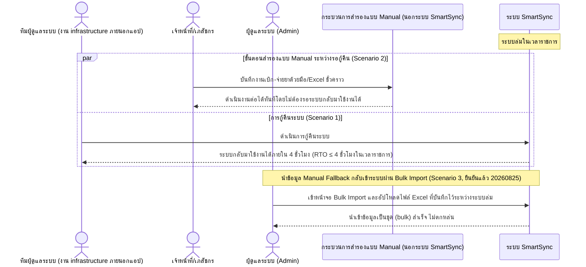

# Detailed Design (Conceptual) — Disaster Recovery (RTO ≤ 4 ชั่วโมง + ขั้นตอนสำรองแบบ Manual) (FT-033)

> เอกสารนี้เป็น detailed design ระดับแนวคิด (conceptual) เท่านั้น **ยังไม่ผูกมัดกับ technology stack, protocol, หรือเทคนิคการ implement ใดๆ** — ตาม CLAUDE.md เฟสปัจจุบันของโปรเจกต์คือการทำเอกสาร ยังไม่เข้าสู่เฟสพัฒนา เอกสารนี้จะถูกทบทวนอีกครั้งเมื่อเข้าสู่เฟสพัฒนาจริง
>
> อ้างอิงจาก [backlog.md](../backlog.md), [Feature List](../02-feature-list.md), [User Journey](../03-user-journey/), [Acceptance Criteria](../04-test-design/acceptance-criteria.md), [High-Level Architecture](../05-architecture.md), [Data Model](../06-data-model.md), [API Spec](../07-api-spec.md) — ดูนโยบาย granularity/exception/state-diagram ที่ใช้ร่วมกันทุกไฟล์ใน [README.md](README.md)

**วันที่สร้าง/อัปเดตล่าสุด:** 20260825
**Feature:** FT-033 — Disaster Recovery (RTO ≤ 4 ชั่วโมง + ขั้นตอนสำรองแบบ Manual)
**Backlog item ที่เกี่ยวข้อง:** BL-042

## 1. ภาพรวม (Overview)

**หมายเหตุเรื่องความเหมาะสมของ sequence diagram:** เมื่อระบบล่มในเวลาราชการ ทีมผู้ดูแลระบบดำเนินการกู้คืนให้กลับมาใช้งานได้ภายใน 4 ชั่วโมง (RTO ≤ 4 ชั่วโมง) ขณะเดียวกันเจ้าหน้าที่/เภสัชกรต้องมีขั้นตอนสำรองแบบ manual (เช่น บันทึกด้วยมือ/Excel ชั่วคราว) ให้ใช้งานต่อได้ทันที — งานกู้คืนระบบเป็นงาน infrastructure ภายนอกแอป SmartSync เอง และขั้นตอนสำรอง manual คือการ**ออกจากระบบ SmartSync ไปใช้วิธีเดิมชั่วคราว** ไม่ใช่การใช้งานหน้าจอของ SmartSync ไดอะแกรมจึงแทนทั้งสองส่วนนี้เป็น participant แยกต่างหาก ("กระบวนการสำรองแบบ Manual — นอกระบบ SmartSync") คล้ายกับวิธีแทนระบบภายนอก (JHCIS/myPCU/INVC) ตามนโยบายในหัวข้อ README — **อัปเดต 20260825 (scope change):** ขั้นตอนถัดจากนั้น (นำข้อมูล Manual Fallback กลับเข้าระบบ) ยืนยันแล้วว่า**มีหน้าจอ/เครื่องมือ Bulk Import จาก Excel จริงในแอป** ดำเนินการโดย**ผู้ดูแลระบบ (Admin)** — จึงวาดเป็น operation ปกติที่มีต่อ SYS โดยตรง ไม่ใช่ participant ภายนอกอีกต่อไป — ไม่วาดกลไกกู้คืนระบบทางเทคนิคของทีม infrastructure ใดๆ เพิ่มเติม

## 2. Sequence Diagram(s)

### 2.1 BL-042 — กู้คืนระบบภายใน RTO พร้อมขั้นตอนสำรองแบบ Manual ขนาน

**อ้างอิง:** Acceptance Criteria BL-042 Scenario 1-2

## 3. Lifecycle / State Diagram

ไม่เกี่ยวข้อง

## 4. องค์ประกอบและ Operation ที่เกี่ยวข้อง (Cross-reference)

| องค์ประกอบ/Entity/Operation | มาจากเอกสาร | บทบาทใน Feature นี้ |
|---|---|---|
| ระบบ SmartSync (ภาพรวม, ไม่ระบุองค์ประกอบเจาะจง) | 05-architecture.md §3 (หมายเหตุ NFR เพิ่มเติม 20260824) | BL-042 ไม่ผูกกับองค์ประกอบเชิงตรรกะใดเป็นการเฉพาะสำหรับส่วน RTO/manual fallback |
| NFR การกู้คืนระบบเมื่อเกิดภัยพิบัติ (Disaster Recovery) | 05-architecture.md §7 | RTO ≤ 4 ชั่วโมง + ขั้นตอนสำรองแบบ manual นอกระบบ |
| บริการดูแลระบบ (Admin Operations) | 05-architecture.md §3 | ดำเนินการนำเข้าข้อมูล Bulk Import หลังกู้คืนระบบ (Scenario 3) |

## 5. สิ่งที่ยังไม่ตัดสินใจ / Assumption ที่ต้องยืนยัน

ไม่มี — รายละเอียดขั้นตอนนำข้อมูล Manual Fallback กลับเข้าระบบยืนยันแล้ว 20260825: มีหน้าจอ/เครื่องมือ Bulk Import จาก Excel เฉพาะ ดำเนินการโดยผู้ดูแลระบบ (Admin)

---

## บันทึกการอัปเดต (Changelog)

- **20260825:** สร้างไฟล์ครั้งแรก — 1 ไดอะแกรมแทนงานกู้คืนระบบ (ทีมผู้ดูแลระบบ, infrastructure ภายนอกแอป) และขั้นตอนสำรองแบบ manual (นอกระบบ SmartSync) เป็น participant แยกกันทำงานขนานกัน (`par`) ตามหลักการแทนระบบ/กระบวนการภายนอกแบบ manual/asynchronous เดียวกับที่ใช้กับ JHCIS/myPCU/INVC พร้อม `opt` สำหรับขั้นตอนนำข้อมูลกลับเข้าระบบ (`[ถือว่า]`)
- **20260825 (แก้ไข scope change สำคัญ):** ผู้ใช้ยืนยันผ่าน `AskUserQuestion` ว่าขั้นตอนนำข้อมูล Manual Fallback กลับเข้าระบบมีหน้าจอ/เครื่องมือ Bulk Import จาก Excel จริงในแอป ดำเนินการโดยผู้ดูแลระบบ (Admin) — แก้ไดอะแกรมจาก `opt`/`[ถือว่า]` ที่มีเจ้าหน้าที่/เภสัชกรเป็นผู้กระทำ เป็น operation ปกติระหว่าง Admin กับระบบ SmartSync โดยตรง เพิ่ม actor ADMIN ใหม่ อัปเดตหัวข้อ 1 (overview), หัวข้อ 4 (cross-reference เพิ่มบริการดูแลระบบ), และหัวข้อ 5 (ปิด assumption)
