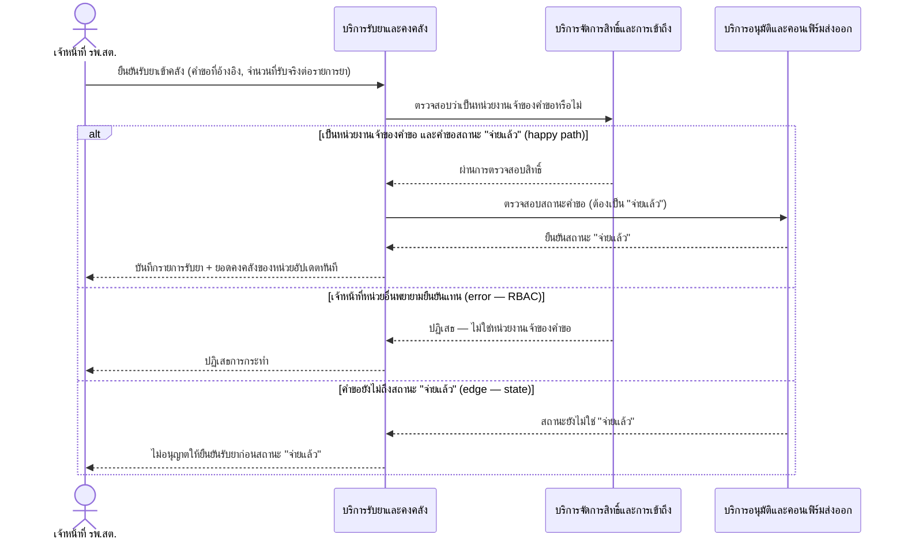

# Detailed Design (Conceptual) — ยืนยันรับยาเข้าคลัง (FT-003)

> เอกสารนี้เป็น detailed design ระดับแนวคิด (conceptual) เท่านั้น **ยังไม่ผูกมัดกับ technology stack, protocol, หรือเทคนิคการ implement ใดๆ** — ตาม CLAUDE.md เฟสปัจจุบันของโปรเจกต์คือการทำเอกสาร ยังไม่เข้าสู่เฟสพัฒนา เอกสารนี้จะถูกทบทวนอีกครั้งเมื่อเข้าสู่เฟสพัฒนาจริง
>
> อ้างอิงจาก [backlog.md](../backlog.md), [Feature List](../02-feature-list.md), [User Journey](../03-user-journey/), [Acceptance Criteria](../04-test-design/acceptance-criteria.md), [High-Level Architecture](../05-architecture.md), [Data Model](../06-data-model.md), [API Spec](../07-api-spec.md) — ดูนโยบาย granularity/exception/state-diagram ที่ใช้ร่วมกันทุกไฟล์ใน [README.md](README.md)

**วันที่สร้าง/อัปเดตล่าสุด:** 20260823
**Feature:** FT-003 — ยืนยันรับยาเข้าคลัง
**Backlog item ที่เกี่ยวข้อง:** BL-006

## 1. ภาพรวม (Overview)

เมื่อคำขอเบิกยาอยู่ในสถานะ "จ่ายแล้ว" (ต่อจาก [confirm-export-and-download.md](confirm-export-and-download.md) FT-017) เจ้าหน้าที่ รพ.สต. ยืนยันการรับยาในระบบเพื่อให้ยอดคงคลังของหน่วยตนเองถูกต้องทันที ตาม [staff-hph-journey.md](../03-user-journey/staff-hph-journey.md) step 9 — มี 1 BL-ID, 1 ไดอะแกรม happy path พร้อม `alt` แสดง 2 exception (RBAC ข้ามหน่วย, ยืนยันก่อนถึงสถานะ "จ่ายแล้ว")

## 2. Sequence Diagram(s)

### 2.1 BL-006 — ยืนยันรับยาเข้าคลัง

**อ้างอิง:** Acceptance Criteria BL-006 Scenario 1-3

ยอดคงคลังที่อัปเดตต่อเนื่องไปยัง [realtime-inventory-balance.md](realtime-inventory-balance.md) (FT-004) และเป็น input ของสูตรคำนวณยอดใช้จริงใน [safety-stock-calculation.md](safety-stock-calculation.md) (FT-010, BL-012)

## 3. Lifecycle / State Diagram

ไม่เกี่ยวข้อง — Feature นี้ไม่มี entity ที่มีสถานะหลายขั้นเป็นของตัวเอง (ใช้สถานะคำขอเบิกยาที่ [two-level-requisition-approval.md](two-level-requisition-approval.md) เป็นเงื่อนไขเท่านั้น)

## 4. องค์ประกอบและ Operation ที่เกี่ยวข้อง (Cross-reference)

| องค์ประกอบ/Entity/Operation | มาจากเอกสาร | บทบาทใน Feature นี้ |
|---|---|---|
| บริการรับยาและคงคลัง | 05-architecture.md §3 | บันทึกรับยา, อัปเดตยอดคงคลัง |
| บริการจัดการสิทธิ์และการเข้าถึง | 05-architecture.md §3 | ตรวจสอบสิทธิ์เฉพาะหน่วยเจ้าของคำขอ |
| GoodsReceiptRecord, InventoryBalance | 06-data-model.md §3.10/3.11 | ธุรกรรมรับยา (transaction) และยอดคงเหลือปัจจุบัน (snapshot) |
| ยืนยันรับยาเข้าคลัง | 07-api-spec.md §3.5 | operation หลักของ Feature นี้ |

## 5. สิ่งที่ยังไม่ตัดสินใจ / Assumption ที่ต้องยืนยัน

- ไม่มี open item ใหม่ — AC ของ BL-006 resolved ครบทั้ง 3 scenario

---

## บันทึกการอัปเดต (Changelog)

- **20260823:** สร้างไฟล์ครั้งแรก — 1 ไดอะแกรม happy path พร้อม inline `alt` 2 exception (RBAC, state-order)
