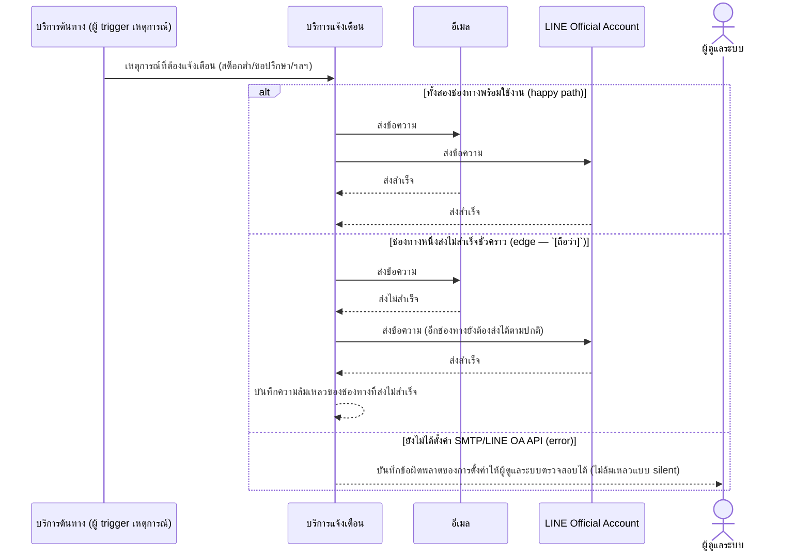

# Detailed Design (Conceptual) — ช่องทางแจ้งเตือนผ่านอีเมลและ LINE OA (FT-012)

> เอกสารนี้เป็น detailed design ระดับแนวคิด (conceptual) เท่านั้น **ยังไม่ผูกมัดกับ technology stack, protocol, หรือเทคนิคการ implement ใดๆ** — ตาม CLAUDE.md เฟสปัจจุบันของโปรเจกต์คือการทำเอกสาร ยังไม่เข้าสู่เฟสพัฒนา เอกสารนี้จะถูกทบทวนอีกครั้งเมื่อเข้าสู่เฟสพัฒนาจริง
>
> อ้างอิงจาก [backlog.md](../backlog.md), [Feature List](../02-feature-list.md), [User Journey](../03-user-journey/), [Acceptance Criteria](../04-test-design/acceptance-criteria.md), [High-Level Architecture](../05-architecture.md), [Data Model](../06-data-model.md), [API Spec](../07-api-spec.md) — ดูนโยบาย granularity/exception/state-diagram ที่ใช้ร่วมกันทุกไฟล์ใน [README.md](README.md)

**วันที่สร้าง/อัปเดตล่าสุด:** 20260823
**Feature:** FT-012 — ช่องทางแจ้งเตือนผ่านอีเมลและ LINE OA
**Backlog item ที่เกี่ยวข้อง:** BL-014

## 1. ภาพรวม (Overview)

โครงสร้างพื้นฐานการแจ้งเตือนกลางที่ Feature อื่นเรียกใช้ร่วมกัน ([monthly-requisition-request.md](monthly-requisition-request.md) ขอปรึกษา, [off-cycle-emergency-requisition.md](off-cycle-emergency-requisition.md) เบิกฉุกเฉิน, [advance-requisition-reminder.md](advance-requisition-reminder.md) แจ้งก่อนกำหนด, [low-stock-alert.md](low-stock-alert.md) สต็อกต่ำ, [confirm-export-and-download.md](confirm-export-and-download.md) คอนเฟิร์มส่งออก) — ทุกเหตุการณ์ต้องส่งผ่านทั้งอีเมลและ LINE OA พร้อมกันเสมอ ไม่ใช่เลือกช่องทางใดช่องทางหนึ่ง

## 2. Sequence Diagram(s)

### 2.1 BL-014 — ส่งแจ้งเตือนพร้อมกันสองช่องทาง

**อ้างอิง:** Acceptance Criteria BL-014 Scenario 1-3

## 3. Lifecycle / State Diagram

ไม่เกี่ยวข้อง

## 4. องค์ประกอบและ Operation ที่เกี่ยวข้อง (Cross-reference)

| องค์ประกอบ/Entity/Operation | มาจากเอกสาร | บทบาทใน Feature นี้ |
|---|---|---|
| บริการแจ้งเตือน | 05-architecture.md §3 | กระจายข้อความผ่านทั้งสองช่องทางพร้อมกัน |
| NotificationEvent | 06-data-model.md §3.12 | มีฟิลด์สถานะการส่งแยกต่อช่องทาง (อีเมล/LINE OA) |
| ดูประวัติเหตุการณ์แจ้งเตือน | 07-api-spec.md §3.7 | operation สำหรับ Admin ตรวจสอบความล้มเหลว (`[ถือว่า]` ยังไม่ยืนยันเป็น FR ชัดเจน) |

## 5. สิ่งที่ยังไม่ตัดสินใจ / Assumption ที่ต้องยืนยัน

- ต้องตั้งค่า SMTP และ LINE OA API/Webhook ก่อนเริ่มพัฒนา item นี้ — สืบทอดจาก backlog.md ไม่ใช่ประเด็นใหม่ของไฟล์นี้
- operation "ดูประวัติเหตุการณ์แจ้งเตือน" ยังเป็น `[ถือว่า]` ตาม 07-api-spec.md §5 — ควรยืนยันก่อนถือเป็นขอบเขตจริง

---

## บันทึกการอัปเดต (Changelog)

- **20260823:** สร้างไฟล์ครั้งแรก — 1 ไดอะแกรมแสดงรูปแบบการ trigger ทั่วไปจากบริการอื่น พร้อม inline `alt` 2 exception (ช่องทางเดียวล้มเหลว, ยังไม่ตั้งค่า)
