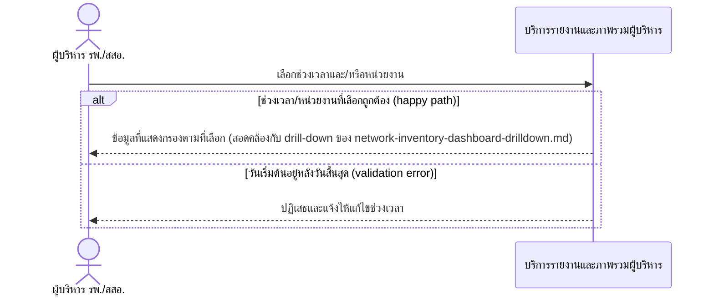
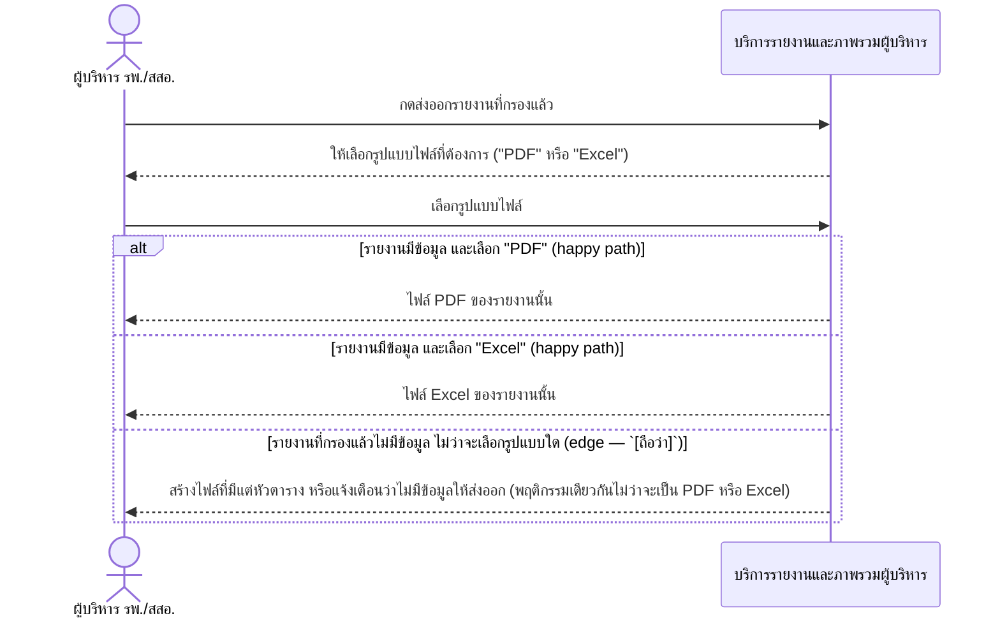

# Detailed Design (Conceptual) — ส่งออกรายงานพร้อมตัวกรองช่วงเวลา/หน่วยงาน (FT-016)

> เอกสารนี้เป็น detailed design ระดับแนวคิด (conceptual) เท่านั้น **ยังไม่ผูกมัดกับ technology stack, protocol, หรือเทคนิคการ implement ใดๆ** — ตาม CLAUDE.md เฟสปัจจุบันของโปรเจกต์คือการทำเอกสาร ยังไม่เข้าสู่เฟสพัฒนา เอกสารนี้จะถูกทบทวนอีกครั้งเมื่อเข้าสู่เฟสพัฒนาจริง
>
> อ้างอิงจาก [backlog.md](../backlog.md), [Feature List](../02-feature-list.md), [User Journey](../03-user-journey/), [Acceptance Criteria](../04-test-design/acceptance-criteria.md), [High-Level Architecture](../05-architecture.md), [Data Model](../06-data-model.md), [API Spec](../07-api-spec.md) — ดูนโยบาย granularity/exception/state-diagram ที่ใช้ร่วมกันทุกไฟล์ใน [README.md](README.md)

**วันที่สร้าง/อัปเดตล่าสุด:** 20260823
**Feature:** FT-016 — ส่งออกรายงานพร้อมตัวกรองช่วงเวลา/หน่วยงาน
**Backlog item ที่เกี่ยวข้อง:** BL-019, BL-019b

## 1. ภาพรวม (Overview)

ผู้บริหารเลือกช่วงเวลาและ/หรือหน่วยงานที่ต้องการ (BL-019b) แล้วส่งออกรายงานที่กรองแล้วเป็นไฟล์ (BL-019) ตาม [executive-journey.md](../03-user-journey/executive-journey.md) step 5-6 — **รูปแบบไฟล์ส่งออกยืนยันแล้ว 20260823:** รองรับ**ทั้ง PDF และ Excel** โดยให้ผู้บริหารเลือกรูปแบบตอนกดส่งออกแต่ละครั้ง (ไม่ใช่รูปแบบเดียวตายตัว) — ดู [004](../01-spec/20260816-004-management-dashboard.md) FR-3.3 และหัวข้อ "เพิ่มเติม 20260823" 2 ไดอะแกรมต่อ BL-ID เหมือนเดิม

## 2. Sequence Diagram(s)

### 2.1 BL-019b — กรอง/เลือกช่วงเวลาและหน่วยงาน

**อ้างอิง:** Acceptance Criteria BL-019b Scenario 1-3

### 2.2 BL-019 — ส่งออกรายงานเป็นไฟล์ (เลือกรูปแบบ PDF หรือ Excel)

**อ้างอิง:** Acceptance Criteria BL-019 Scenario 1-3 — resolved 20260823

## 3. Lifecycle / State Diagram

ไม่เกี่ยวข้อง — ไฟล์รายงานเป็น derived output ไม่ใช่ entity ที่จัดเก็บแยก (ดู [06-data-model.md](../06-data-model.md) §5)

## 4. องค์ประกอบและ Operation ที่เกี่ยวข้อง (Cross-reference)

| องค์ประกอบ/Entity/Operation | มาจากเอกสาร | บทบาทใน Feature นี้ |
|---|---|---|
| บริการรายงานและภาพรวมผู้บริหาร | 05-architecture.md §3 | กรองและสร้างไฟล์รายงาน |
| กรอง/เลือกช่วงเวลาและหน่วยงานในรายงาน; ส่งออกรายงานเป็นไฟล์ | 07-api-spec.md §3.8 | operation หลักของ Feature นี้ |

## 5. สิ่งที่ยังไม่ตัดสินใจ / Assumption ที่ต้องยืนยัน

- **ยืนยันแล้ว (20260823):** รูปแบบไฟล์ส่งออกรายงานรองรับทั้ง PDF และ Excel ให้ผู้บริหารเลือกได้ตอนส่งออก — ดู [004](../01-spec/20260816-004-management-dashboard.md) FR-3.3 — ไม่มี `[รอยืนยัน]` ค้างอีกต่อไปในหัวข้อนี้
- พฤติกรรมกรณีรายงานไม่มีข้อมูล (`[ถือว่า]` ใน 2.2) ยังเป็นสมมติฐานมาตรฐาน QA ทั่วไป ยังไม่ได้รับการยืนยันจากเจ้าของข้อกำหนดโดยตรงว่าเลือกพฤติกรรมใด (สร้างไฟล์เปล่า vs. แจ้งเตือน) — สืบทอดจาก acceptance-criteria.md BL-019 Scenario 3

---

## บันทึกการอัปเดต (Changelog)

- **20260823:** สร้างไฟล์ครั้งแรก — 2 ไดอะแกรมต่อ BL-ID คงเครื่องหมาย `[รอยืนยัน]` รูปแบบไฟล์ไว้ตามต้นทาง ไม่สมมติรูปแบบไฟล์เอง
- **20260823 (audit, หลังยืนยัน BL-019):** เภสัชกรเจ้าของระบบยืนยันแล้วว่ารองรับทั้ง PDF และ Excel ให้เลือกได้ตอนส่งออก (ดู [004](../01-spec/20260816-004-management-dashboard.md) FR-3.3) — แก้ไขไดอะแกรม 2.2 เพิ่มขั้นตอนเลือกรูปแบบไฟล์และแยก branch ผลลัพธ์เป็น PDF/Excel/ไม่มีข้อมูล แทนค่าตัวแปร `[รอยืนยัน]` เดิม อัปเดตหัวข้อ 1 และ 5 ให้สะท้อนสถานะ resolved — ไม่แก้ไดอะแกรม 2.1 (BL-019b, การกรอง) เนื่องจากไม่เกี่ยวข้องกับรูปแบบไฟล์
