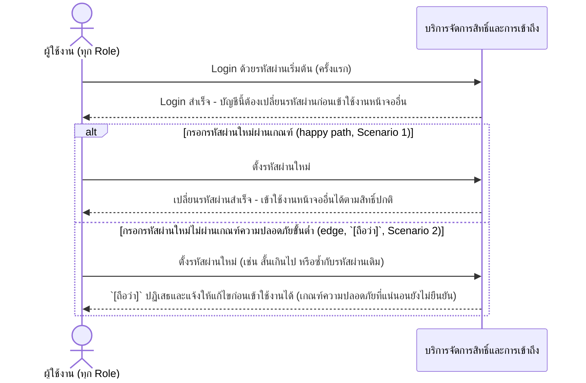
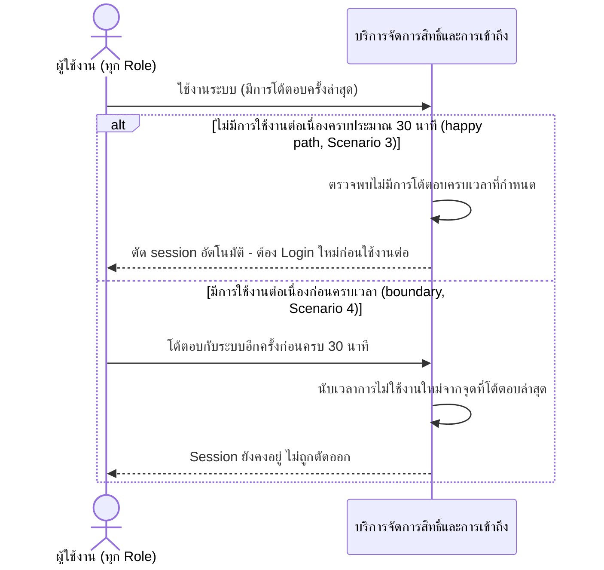

# Detailed Design (Conceptual) — บังคับเปลี่ยนรหัสผ่านครั้งแรก + Session Timeout อัตโนมัติ (ทุก Role) (FT-028)

> เอกสารนี้เป็น detailed design ระดับแนวคิด (conceptual) เท่านั้น **ยังไม่ผูกมัดกับ technology stack, protocol, หรือเทคนิคการ implement ใดๆ** — ตาม CLAUDE.md เฟสปัจจุบันของโปรเจกต์คือการทำเอกสาร ยังไม่เข้าสู่เฟสพัฒนา เอกสารนี้จะถูกทบทวนอีกครั้งเมื่อเข้าสู่เฟสพัฒนาจริง
>
> อ้างอิงจาก [backlog.md](../backlog.md), [Feature List](../02-feature-list.md), [User Journey](../03-user-journey/), [Acceptance Criteria](../04-test-design/acceptance-criteria.md), [High-Level Architecture](../05-architecture.md), [Data Model](../06-data-model.md), [API Spec](../07-api-spec.md) — ดูนโยบาย granularity/exception/state-diagram ที่ใช้ร่วมกันทุกไฟล์ใน [README.md](README.md)

**วันที่สร้าง/อัปเดตล่าสุด:** 20260825
**Feature:** FT-028 — บังคับเปลี่ยนรหัสผ่านครั้งแรก + Session Timeout อัตโนมัติ (ทุก Role)
**Backlog item ที่เกี่ยวข้อง:** BL-037

## 1. ภาพรวม (Overview)

ผู้ใช้งานทุก role ถูกบังคับให้ตั้งรหัสผ่านใหม่เมื่อ login ครั้งแรก (ก่อนเข้าใช้งานหน้าจออื่นใด) และถูกตัด session อัตโนมัติเมื่อไม่มีการใช้งานต่อเนื่องประมาณ 30 นาที ตามที่ทั้ง 4 ไฟล์ user-journey (staff-hph/pharmacist/executive/admin) เพิ่ม step "Login ครั้งแรก (บังคับเปลี่ยนรหัสผ่าน)" ไว้ตรงกัน — ไฟล์นี้ต่อยอดจากขั้นตอน Login พื้นฐานที่มีอยู่แล้วใน [access-log-retention.md](access-log-retention.md) §2.1 (FT-024, บันทึก login/logout+IP) โดยไม่วาดขั้นตอนบันทึก log ซ้ำ

แบ่งเป็น 2 ไดอะแกรมตาม AC เนื่องจากเป็นคนละพฤติกรรม: (1) การบังคับเปลี่ยนรหัสผ่านเป็นการกระทำที่ผู้ใช้ลงมือทำจริง และ (2) session timeout เป็นพฤติกรรมเชิงระบบที่เกิดขึ้นแบบ passive (ไม่ปรากฏเป็น step แยกในไฟล์ user-journey ใดๆ ตามที่ทุกไฟล์ journey ระบุตรงกัน) แต่ยังคุ้มค่าที่จะแสดงเป็นไดอะแกรมเนื่องจากมี AC scenario ของตัวเอง (Scenario 3-4)

## 2. Sequence Diagram(s)

### 2.1 BL-037 — บังคับเปลี่ยนรหัสผ่านเมื่อ Login ครั้งแรก

**อ้างอิง:** Acceptance Criteria BL-037 Scenario 1-2

การบันทึกเหตุการณ์ login/logout + IP Address ของขั้นตอนนี้เป็นความรับผิดชอบเดียวกับที่ [access-log-retention.md](access-log-retention.md) §2.1 วาดไว้แล้ว — ไม่วาดซ้ำในไดอะแกรมนี้

### 2.2 BL-037 — Session Timeout อัตโนมัติ

**อ้างอิง:** Acceptance Criteria BL-037 Scenario 3-4

การตัด session อัตโนมัติเป็นเหตุการณ์หนึ่งที่บันทึกลง System Access Log เช่นเดียวกับ logout ปกติ (ประเภทเหตุการณ์ "ตัดการเชื่อมต่ออัตโนมัติ (session timeout)" ที่ [06-data-model.md](../06-data-model.md) §5 เพิ่มไว้แล้วเพื่อรองรับ FR-6.7) — ไม่วาดการเรียก AUDIT/SystemAccessLog ซ้ำในไดอะแกรมนี้ (ดู [access-log-retention.md](access-log-retention.md) รูปแบบเดียวกัน)

## 3. Lifecycle / State Diagram

ไม่เกี่ยวข้อง — สถานะ "ต้องเปลี่ยนรหัสผ่านก่อนใช้งานหรือไม่" บน UserAccount เป็น Boolean เดี่ยว (จริง/เท็จ) ไม่ใช่ลำดับสถานะแบบ workflow และ session ไม่มี entity/สถานะที่จัดเก็บถาวรตามการออกแบบเอกสารชุดนี้

## 4. องค์ประกอบและ Operation ที่เกี่ยวข้อง (Cross-reference)

| องค์ประกอบ/Entity/Operation | มาจากเอกสาร | บทบาทใน Feature นี้ |
|---|---|---|
| บริการจัดการสิทธิ์และการเข้าถึง | 05-architecture.md §3 | บังคับเปลี่ยนรหัสผ่านครั้งแรกและตัด session อัตโนมัติ ~30 นาที (ทุก role) |
| UserAccount (Must Change Password Flag) | 06-data-model.md §3.2 | ฟิลด์บ่งชี้ว่าบัญชีนี้ต้องเปลี่ยนรหัสผ่านก่อนใช้งานหรือไม่ |
| เข้าสู่ระบบ; เปลี่ยนรหัสผ่าน (บังคับครั้งแรก); ออกจากระบบ | 07-api-spec.md §3.2 | operation หลักของ Feature นี้ (ออกจากระบบครอบคลุมทั้ง logout ปกติและ session timeout อัตโนมัติ) |
| SystemAccessLog | 06-data-model.md §3.16 / §5 | เก็บประเภทเหตุการณ์ "ตัดการเชื่อมต่ออัตโนมัติ (session timeout)" |

## 5. สิ่งที่ยังไม่ตัดสินใจ / Assumption ที่ต้องยืนยัน

ไม่มี — เกณฑ์ความยาวขั้นต่ำของรหัสผ่านใหม่ยืนยันแล้ว (20260825) = 8 ตัวอักษร ไม่บังคับอักขระพิเศษ/ตัวเลขเพิ่มเติม ดู [07-api-spec.md](../07-api-spec.md) §5

---

## บันทึกการอัปเดต (Changelog)

- **20260825:** สร้างไฟล์ครั้งแรก — 2 ไดอะแกรมต่อ BL-ID เดียวกัน (2.1 บังคับเปลี่ยนรหัสผ่านครั้งแรก พร้อม inline exception การกรอกรหัสผ่านไม่ผ่านเกณฑ์, 2.2 session timeout อัตโนมัติ พร้อม boundary case การใช้งานต่อเนื่อง) — cross-reference [access-log-retention.md](access-log-retention.md) §2.1 (FT-024) สำหรับขั้นตอน login/logout พื้นฐานที่มีอยู่แล้ว โดยไม่แก้ไขไฟล์นั้นตามขอบเขตงานที่ระบุว่า FT-001–025 ไม่ต้องแตะในรอบนี้
- **20260825 (ต่อเนื่อง):** เกณฑ์ความยาวขั้นต่ำของรหัสผ่านใหม่ยืนยันแล้ว = 8 ตัวอักษร — ปิดหัวข้อ 5
