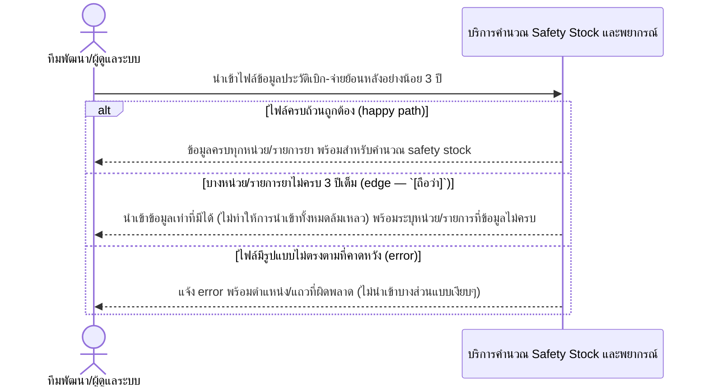

# Detailed Design (Conceptual) — นำเข้าข้อมูลประวัติเบิก-จ่ายย้อนหลัง (Data Migration ครั้งเดียว) (FT-009)

> เอกสารนี้เป็น detailed design ระดับแนวคิด (conceptual) เท่านั้น **ยังไม่ผูกมัดกับ technology stack, protocol, หรือเทคนิคการ implement ใดๆ** — ตาม CLAUDE.md เฟสปัจจุบันของโปรเจกต์คือการทำเอกสาร ยังไม่เข้าสู่เฟสพัฒนา เอกสารนี้จะถูกทบทวนอีกครั้งเมื่อเข้าสู่เฟสพัฒนาจริง
>
> อ้างอิงจาก [backlog.md](../backlog.md), [Feature List](../02-feature-list.md), [User Journey](../03-user-journey/), [Acceptance Criteria](../04-test-design/acceptance-criteria.md), [High-Level Architecture](../05-architecture.md), [Data Model](../06-data-model.md), [API Spec](../07-api-spec.md) — ดูนโยบาย granularity/exception/state-diagram ที่ใช้ร่วมกันทุกไฟล์ใน [README.md](README.md)

**วันที่สร้าง/อัปเดตล่าสุด:** 20260823
**Feature:** FT-009 — นำเข้าข้อมูลประวัติเบิก-จ่ายย้อนหลัง (Data Migration ครั้งเดียว)
**Backlog item ที่เกี่ยวข้อง:** BL-010

## 1. ภาพรวม (Overview)

งานตั้งต้นครั้งเดียว (one-off) นำเข้าข้อมูลประวัติการเบิก-จ่ายย้อนหลังอย่างน้อย 3 ปี เพื่อใช้เป็นฐานคำนวณ safety stock เริ่มต้น ([safety-stock-calculation.md](safety-stock-calculation.md), FT-010) — ไม่ใช่ FR ที่ใช้ซ้ำ ผู้กระทำคือทีมพัฒนา/ผู้ดูแลระบบ ไม่ใช่ role ปฏิบัติการปกติ 1 BL-ID มี 3 AC scenario (happy, ข้อมูลไม่ครบ 3 ปี, ไฟล์ผิดรูปแบบ) — ทั้งสอง exception มีผู้กระทำ/องค์ประกอบเดียวกัน จึงแสดง inline

**ที่มาของไฟล์ข้อมูล (ยืนยันแล้ว 20260823):** ไฟล์ข้อมูลประวัติย้อนหลัง 3 ปีที่ทีมพัฒนา/ผู้ดูแลระบบนำเข้าในไดอะแกรมด้านล่างได้มาจาก**การขอไฟล์ด้วยมือ/ประสานงานตรงกับ รพ.สต. ทุกแห่ง (29 แห่ง)** ไม่ใช่การเชื่อมต่อระบบ JHCIS/myPCU อัตโนมัติ — สอดคล้องกับ [jhcis-mypcu-direct-integration.md](jhcis-mypcu-direct-integration.md) (FT-019/BL-023) ที่ยืนยันไม่เชื่อมต่อโดยตรงในเฟสนี้เช่นกัน — ดู [005](../01-spec/20260816-005-legacy-system-integration.md) FR-4.4a ไม่กระทบกลไกการนำเข้าไฟล์ในไดอะแกรม 2.1 (ยังเป็น batch import ครั้งเดียวเหมือนเดิมไม่ว่าที่มาของไฟล์จะเป็นวิธีใด) จึงไม่ปรับไดอะแกรม

## 2. Sequence Diagram(s)

### 2.1 BL-010 — นำเข้าข้อมูลประวัติย้อนหลัง (batch, ครั้งเดียว)

**อ้างอิง:** Acceptance Criteria BL-010 Scenario 1-3

## 3. Lifecycle / State Diagram

ไม่เกี่ยวข้อง — HistoricalUsageRecord ไม่มีสถานะหลายขั้น (จัดการผ่าน batch import ครั้งเดียวเท่านั้น ตาม [06-data-model.md](../06-data-model.md) §3.9)

## 4. องค์ประกอบและ Operation ที่เกี่ยวข้อง (Cross-reference)

| องค์ประกอบ/Entity/Operation | มาจากเอกสาร | บทบาทใน Feature นี้ |
|---|---|---|
| บริการคำนวณ Safety Stock และพยากรณ์ | 05-architecture.md §3 | รับ/ประมวลผลข้อมูลประวัติที่นำเข้า |
| HistoricalUsageRecord | 06-data-model.md §3.9 | entity หลัก — จัดการผ่าน batch import เท่านั้น |
| นำเข้าข้อมูลประวัติเบิก-จ่ายย้อนหลัง (batch, ครั้งเดียว) | 07-api-spec.md §3.6 | operation หลักของ Feature นี้ |

## 5. สิ่งที่ยังไม่ตัดสินใจ / Assumption ที่ต้องยืนยัน

- **ยืนยันแล้ว (20260823):** ที่มาของไฟล์ข้อมูลย้อนหลัง 3 ปีคือการขอไฟล์ด้วยมือจาก รพ.สต. ทุกแห่ง (29 แห่ง) ไม่ใช่การเชื่อมต่อระบบอัตโนมัติ — ดู [005](../01-spec/20260816-005-legacy-system-integration.md) FR-4.4a — งานนี้ยังคงต้องรอได้รับไฟล์จริงจากเจ้าของข้อกำหนด/รพ.สต. ก่อนเริ่มนำเข้าจริง (ขั้นตอนประสานงานเชิงบริหาร ไม่ใช่ประเด็นออกแบบเชิงแนวคิดของไฟล์นี้)

---

## บันทึกการอัปเดต (Changelog)

- **20260823:** สร้างไฟล์ครั้งแรก — 1 ไดอะแกรม happy path พร้อม inline `alt` 2 exception (ข้อมูลไม่ครบ, ไฟล์ผิดรูปแบบ)
- **20260823 (audit, หลังยืนยัน BL-023/BL-010 เรื่องที่มาข้อมูล):** เพิ่มหมายเหตุที่มาของไฟล์ข้อมูลย้อนหลัง 3 ปีในหัวข้อ 1 และ 5 (การขอไฟล์ด้วยมือจาก รพ.สต. ทุกแห่ง 29 แห่ง ไม่ใช่การเชื่อมต่อระบบ JHCIS/myPCU อัตโนมัติ — ดู [005](../01-spec/20260816-005-legacy-system-integration.md) FR-4.4a) พร้อม cross-reference ไปยัง [jhcis-mypcu-direct-integration.md](jhcis-mypcu-direct-integration.md)/FT-019 — ไม่แก้ไดอะแกรม 2.1 เนื่องจากกลไกการนำเข้า (batch import ครั้งเดียว) ไม่เปลี่ยนแปลงตามที่มาของไฟล์
