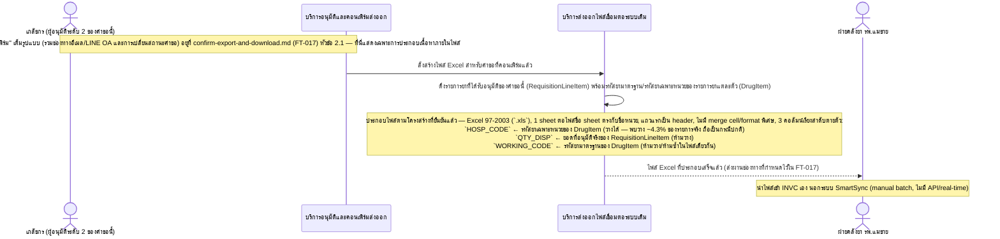
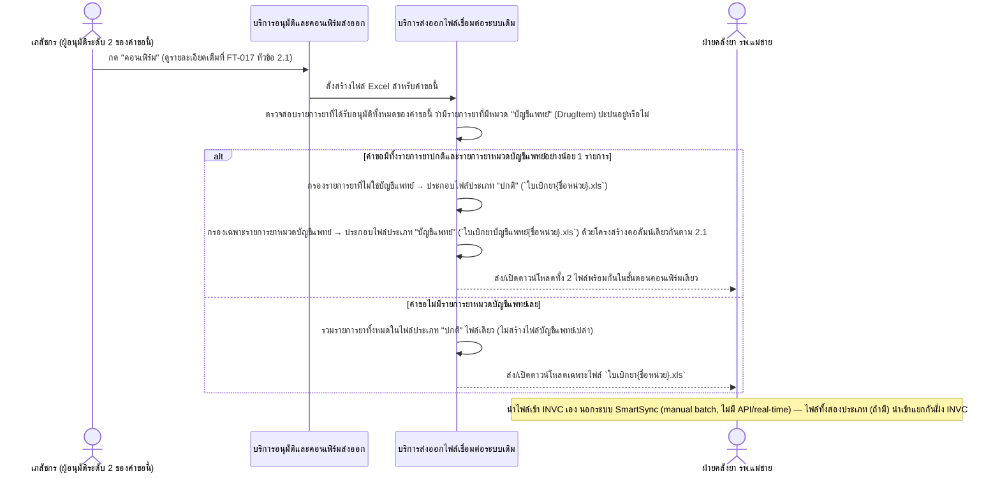

# Detailed Design (Conceptual) — รูปแบบไฟล์ Excel ให้ตรงกับ INVC (FT-018)

> เอกสารนี้เป็น detailed design ระดับแนวคิด (conceptual) เท่านั้น **ยังไม่ผูกมัดกับ technology stack, protocol, หรือเทคนิคการ implement ใดๆ** — ตาม CLAUDE.md เฟสปัจจุบันของโปรเจกต์คือการทำเอกสาร ยังไม่เข้าสู่เฟสพัฒนา เอกสารนี้จะถูกทบทวนอีกครั้งเมื่อเข้าสู่เฟสพัฒนาจริง
>
> อ้างอิงจาก [backlog.md](../backlog.md), [Feature List](../02-feature-list.md), [User Journey](../03-user-journey/), [Acceptance Criteria](../04-test-design/acceptance-criteria.md), [High-Level Architecture](../05-architecture.md), [Data Model](../06-data-model.md), [API Spec](../07-api-spec.md) — ดูนโยบาย granularity/exception/state-diagram ที่ใช้ร่วมกันทุกไฟล์ใน [README.md](README.md)

**วันที่สร้าง/อัปเดตล่าสุด:** 20260823
**Feature:** FT-018 — รูปแบบไฟล์ Excel ให้ตรงกับ INVC
**Backlog item ที่เกี่ยวข้อง:** BL-022, BL-034

## 1. ภาพรวม (Overview)

**อัปเดต 20260823 — open item เดิมที่เคยบล็อกการพัฒนาทั้งหมดของ Feature นี้ได้รับการยืนยันแล้ว** เจ้าของข้อกำหนดตรวจสอบไฟล์ตัวอย่างจริง 46 ไฟล์ที่ INVC (โปรแกรมคลังยา รพ.แม่ข่าย) รับนำเข้าได้ (ครอบคลุมทั้ง 29 หน่วย รวมเรือนจำ) แล้วยืนยันโครงสร้างคอลัมน์ครบทุกประเด็น (FR-4.3, BL-022 — ดู [005](../01-spec/20260816-005-legacy-system-integration.md) หัวข้อ "เพิ่มเติม 20260823") — Feature นี้จึง**ไม่ถูกบล็อกอีกต่อไป**

**ขอบเขตของไฟล์นี้เทียบกับ [confirm-export-and-download.md](confirm-export-and-download.md) (FT-017):** ลำดับการโต้ตอบของ "การกดคอนเฟิร์ม → สร้างไฟล์ → ส่งอีเมล/LINE OA → เปลี่ยนสถานะ" เต็มรูปแบบยังคงออกแบบไว้ที่ FT-017 หัวข้อ 2.1 เช่นเดิม (ไม่ซ้ำในไฟล์นี้) — **ไฟล์นี้โฟกัสเฉพาะสิ่งที่เป็นความรับผิดชอบเฉพาะของ FT-018 สองเรื่อง:** (1) การประกอบโครงสร้าง/คอลัมน์ภายในไฟล์ที่สร้างขึ้น (BL-022) และ (2) ตรรกะตัดสินใจแยกไฟล์เป็น 1 หรือ 2 ชุดต่อคำขอ ตามหมวด "บัญชีแพทย์" ของรายการยา (BL-034, FR-4.3a)

## 2. Sequence Diagram(s)

### 2.1 BL-022 — ประกอบโครงสร้างคอลัมน์ไฟล์ Excel ให้ตรงกับ INVC

**อ้างอิง:** Acceptance Criteria BL-022 Scenario 1-3 (โครงสร้างไฟล์/คอลัมน์, `HOSP_CODE` ว่างได้, `QTY_DISP`/`WORKING_CODE` ห้ามว่าง/ห้ามซ้ำ)

ที่มาข้อมูลแต่ละคอลัมน์อ้างอิงตรงกับ [06-data-model.md](../06-data-model.md) §3.13 (หมายเหตุ "ค่าทั้งสามคอลัมน์เป็นค่าที่ฉาย (project) มาจาก RequisitionLineItem + DrugItem ตอนสร้างไฟล์ ไม่ใช่ฟิลด์ที่จัดเก็บแยกใน ExportFile เอง") และ §3.3 (นิยามฟิลด์ รหัสยามาตรฐาน/รหัสยาเฉพาะหน่วยของ DrugItem)

### 2.2 BL-034 — ตัดสินใจแยกไฟล์เป็น 1 หรือ 2 ชุดตามหมวด "บัญชีแพทย์"

**อ้างอิง:** Acceptance Criteria BL-034 Scenario 1-2 (มี/ไม่มีรายการยาบัญชีแพทย์)

การตัดสินใจแยกไฟล์อ้างอิงหมวด "บัญชีแพทย์" (Physician-Account Category Flag) ของ DrugItem ([06-data-model.md](../06-data-model.md) §3.3) ซึ่งเป็น**คุณสมบัติของรายการยาเอง ไม่ผันแปรตามหน่วยงานที่เบิก** — ผลลัพธ์การสร้างไฟล์บันทึกลง ExportFile ฟิลด์ "ประเภทไฟล์ (File Type)" ([06-data-model.md](../06-data-model.md) §3.13) ความสัมพันธ์ 1 คำขอต่อ 0-2 ไฟล์

## 3. Lifecycle / State Diagram

ไม่เกี่ยวข้องกับไฟล์นี้โดยตรง — สถานะ download-gate ของ ExportFile เป็นของ [confirm-export-and-download.md](confirm-export-and-download.md) (FT-017) หัวข้อ 3 การที่คำขอหนึ่งอาจมีไฟล์ 1-2 ไฟล์ (ตามหัวข้อ 2.2 ข้างต้น) เป็นมิติของ "จำนวน/ประเภทไฟล์" ไม่ใช่สถานะใหม่ของวงจร — ไฟล์แต่ละไฟล์ (ถ้ามี 2 ไฟล์) ยังคงเดินตาม state diagram เดียวกันของ FT-017 อย่างอิสระต่อกัน

## 4. องค์ประกอบและ Operation ที่เกี่ยวข้อง (Cross-reference)

| องค์ประกอบ/Entity/Operation | มาจากเอกสาร | บทบาทใน Feature นี้ |
|---|---|---|
| บริการส่งออกไฟล์เชื่อมต่อระบบเดิม | 05-architecture.md §3 | ประกอบโครงสร้าง/คอลัมน์ไฟล์ และตัดสินใจแยกไฟล์เป็น 1 หรือ 2 ชุด |
| บริการอนุมัติและคอนเฟิร์มส่งออก | 05-architecture.md §3 | สั่งให้เริ่มสร้างไฟล์เมื่อเภสัชกรกดคอนเฟิร์ม (ลำดับเต็มอยู่ที่ FT-017) |
| DrugItem (รหัสยามาตรฐาน/Working Code, รหัสยาเฉพาะหน่วย/Hospital Code, หมวดบัญชีแพทย์/Physician-Account Flag) | 06-data-model.md §3.3 | แหล่งข้อมูลคอลัมน์ `WORKING_CODE`/`HOSP_CODE` และตัวกรองเพื่อแยกไฟล์บัญชีแพทย์ |
| RequisitionLineItem (ยอดที่อนุมัติจริง) | 06-data-model.md §3.5 | แหล่งข้อมูลคอลัมน์ `QTY_DISP` |
| ExportFile (ฟิลด์ "โครงสร้างคอลัมน์ของไฟล์", "ประเภทไฟล์") | 06-data-model.md §3.13 | entity ที่บันทึกผลลัพธ์การสร้างไฟล์ (1-2 ไฟล์ต่อคำขอ) |
| เพิ่ม/แก้ไขรายการยา | 07-api-spec.md §3.1 | operation ที่บังคับ "รหัสยามาตรฐาน" จำเป็นและไม่ซ้ำ **ที่ต้นทาง** (ก่อนรายการยาถูกใช้เบิกได้จริง) — ดูหัวข้อ 5 |
| คอนเฟิร์มส่งออกไฟล์เบิกยา; ดาวน์โหลดไฟล์ Excel คำขอเบิกที่คอนเฟิร์มแล้ว | 07-api-spec.md §3.4/3.9 | operation ที่ผลิต/ให้ดาวน์โหลดไฟล์ 1-2 ไฟล์ตามผลการกรองในหัวข้อ 2.2 |

## 5. สิ่งที่ยังไม่ตัดสินใจ / Assumption ที่ต้องยืนยัน

- **resolved (20260823):** โครงสร้างคอลัมน์ไฟล์ที่ INVC รองรับ (BL-022) — ยืนยันจากไฟล์ตัวอย่างจริง 46 ไฟล์ ไม่ใช่ open item อีกต่อไป ดู [005](../01-spec/20260816-005-legacy-system-integration.md) FR-4.3
- **resolved (20260823):** "กลไกป้องกันที่ต้นทาง" สำหรับ `WORKING_CODE` ห้ามว่าง/ห้ามซ้ำ (เดิมเป็น `[รอยืนยัน]` ใน AC BL-022 Scenario 3 / TC-102) — ได้รับคำตอบเชิงแนวคิดแล้วตาม [06-data-model.md](../06-data-model.md) §3.13 หมายเหตุ "Data Integrity ที่เกี่ยวข้อง": การบังคับนี้เกิดขึ้นที่ operation **"เพิ่ม/แก้ไขรายการยา"** ([07-api-spec.md](../07-api-spec.md) §3.1 — ปฏิเสธการบันทึก DrugItem ถ้ารหัสยามาตรฐานว่างหรือซ้ำ) ไม่ใช่ที่ operation สร้างไฟล์ส่งออก (หัวข้อ 2.1 ข้างต้นจึงไม่มี branch ตรวจสอบ/ปฏิเสธ ณ ตอนสร้างไฟล์) — **หมายเหตุส่งต่อ:** `04-test-design/test-cases/invc-file-format-compatibility.md` (TC-102) ยังคงข้อความ `[รอยืนยัน]` เดิมค้างอยู่ ณ เวลาที่แก้ไขไฟล์นี้ ควรให้ `/build-test-design` ปรับปรุงให้ตรงกันในรอบถัดไป (ไม่ได้แก้ในรอบนี้เนื่องจากไฟล์นั้นดูแลโดย subagent อื่น)
- **ทราบแต่ไม่ใช่ประเด็นใหม่:** [05-architecture.md](../05-architecture.md) §8 (จุดที่ยังไม่ยืนยัน) และ §5 NFR ยังมีประโยคเดิมที่ระบุว่ารูปแบบไฟล์ INVC "ยังเป็น open item ที่บล็อกการพัฒนา Epic 4" ซึ่งล้าสมัยแล้วหลัง 20260823 — ไม่ได้แก้ไขในรอบนี้เนื่องจากอยู่นอกขอบเขตของไฟล์นี้ (05-architecture.md ดูแลโดย `/build-architecture`) ควรแจ้งให้รัน `/build-architecture` เพื่อ sync จุดนี้ในรอบถัดไป
- ไม่มี open item เชิงนโยบาย/คลินิกที่ค้างอยู่สำหรับ Feature นี้อีก (นอกเหนือจากรายการข้างต้นที่เป็นงานส่งต่อเชิงเอกสารล้วนๆ)

---

## บันทึกการอัปเดต (Changelog)

- **20260823 (สร้างครั้งแรก):** สร้างไฟล์ครั้งแรก — เนื่องจาก BL-022 เป็น open item ที่บล็อกการพัฒนาทั้งหมดและมีเพียง 1 scenario ที่ตัวมันเองยังไม่ยืนยันผลลัพธ์ จึงไม่สร้างไดอะแกรมใหม่ที่ซ้ำกับ confirm-export-and-download.md แต่ทำหน้าที่ชี้ตำแหน่งที่ถูกบล็อกไว้อย่างชัดเจนแทน — ไม่ได้สมมติโครงสร้างคอลัมน์ใดๆ
- **20260823 (แก้ไขหลังยืนยันรูปแบบไฟล์ INVC และเพิ่ม BL-034):** ปลดบล็อกไฟล์นี้ทั้งหมด — เพิ่ม BL-034 เป็น backlog item ที่เกี่ยวข้อง เขียนไดอะแกรม 2.1 ใหม่แสดงการประกอบคอลัมน์ `HOSP_CODE`/`QTY_DISP`/`WORKING_CODE` จาก DrugItem/RequisitionLineItem ตามรูปแบบที่ยืนยันแล้ว และเพิ่มไดอะแกรม 2.2 ใหม่แสดงตรรกะแยกไฟล์ 1-2 ชุดตามหมวดบัญชีแพทย์ (FR-4.3a) พร้อมอัปเดตหัวข้อ 4/5 ให้สะท้อนสถานะ resolved และคง cross-reference กลับไปยัง FT-017 สำหรับลำดับการโต้ตอบเต็มรูปแบบของขั้นตอนคอนเฟิร์ม (ไม่ซ้ำไดอะแกรม) — แก้ไขจุดที่เคยระบุว่า "กลไกป้องกันที่ต้นทาง" ยังไม่ยืนยัน ให้สะท้อนคำตอบที่มีอยู่แล้วใน 06-data-model.md §3.13 พร้อมชี้ pointer ค้างที่ test-case (TC-102) และ 05-architecture.md ที่ยังไม่ sync (นอกขอบเขตของไฟล์นี้)
