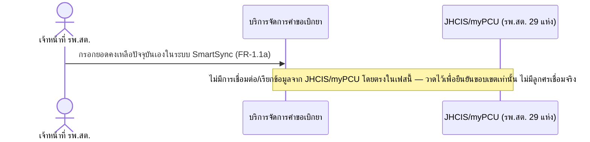

# Detailed Design (Conceptual) — เชื่อมต่อ JHCIS/myPCU โดยตรง (พิจารณาภายหลัง) (FT-019)

> เอกสารนี้เป็น detailed design ระดับแนวคิด (conceptual) เท่านั้น **ยังไม่ผูกมัดกับ technology stack, protocol, หรือเทคนิคการ implement ใดๆ** — ตาม CLAUDE.md เฟสปัจจุบันของโปรเจกต์คือการทำเอกสาร ยังไม่เข้าสู่เฟสพัฒนา เอกสารนี้จะถูกทบทวนอีกครั้งเมื่อเข้าสู่เฟสพัฒนาจริง
>
> อ้างอิงจาก [backlog.md](../backlog.md), [Feature List](../02-feature-list.md), [User Journey](../03-user-journey/), [Acceptance Criteria](../04-test-design/acceptance-criteria.md), [High-Level Architecture](../05-architecture.md), [Data Model](../06-data-model.md), [API Spec](../07-api-spec.md) — ดูนโยบาย granularity/exception/state-diagram ที่ใช้ร่วมกันทุกไฟล์ใน [README.md](README.md)

**วันที่สร้าง/อัปเดตล่าสุด:** 20260823
**Feature:** FT-019 — เชื่อมต่อ JHCIS/myPCU โดยตรง (พิจารณาภายหลัง)
**Backlog item ที่เกี่ยวข้อง:** BL-023

## 1. ภาพรวม (Overview)

BL-023 มีสถานะ **Won't (เฟสนี้) — ยืนยันแล้ว 20260823 (fully confirmed):** เภสัชกรเจ้าของระบบยืนยันโดยตรงว่าจะ**ไม่มีการเชื่อมต่อ JHCIS/myPCU โดยตรง**กับ SmartSync ในเฟสนี้ (คงตามข้อสรุปเดิม ไม่ใช่ประเด็นเปิดอีกต่อไป) เนื่องจากยอดคงเหลือ/การเบิกได้มาจากการกรอกในระบบ SmartSync เอง (FR-1.1a, ดู [monthly-requisition-request.md](monthly-requisition-request.md) FT-001) ไม่ได้ดึงจาก JHCIS/myPCU — ดู [005](../01-spec/20260816-005-legacy-system-integration.md) FR-4.4/FR-4.4a และหัวข้อ "เพิ่มเติม 20260823 (รอบ 2)" AC มีเพียง scenario เดียวที่เป็น "scope-confirmation" (ยืนยันขอบเขตว่าไม่เชื่อมต่อ) ไม่ใช่ scenario ของการพัฒนาจริง จึงไม่มีลำดับการโต้ตอบเชิงบวก (positive interaction) ให้ออกแบบ — ไดอะแกรมด้านล่างแสดงขอบเขตที่ **ไม่มี** การเชื่อมต่อ เพื่อยืนยันภาพให้ตรงกับ [05-architecture.md](../05-architecture.md) §2

**หมายเหตุ cross-reference (ไม่ใช่ scope ของไฟล์นี้):** spec 005 FR-4.4a เพิ่มรายละเอียดใหม่ว่าข้อมูลย้อนหลังอย่างน้อย 3 ปีที่ใช้เป็นฐานคำนวณ safety stock เริ่มต้น (FT-009/BL-010) มาจากการขอไฟล์ด้วยมือ/ประสานงานตรงกับ รพ.สต. ทุกแห่ง (29 แห่ง) — เป็นกิจกรรมตั้งต้นครั้งเดียวของ **FT-009 เท่านั้น** (ดู [historical-data-migration.md](historical-data-migration.md)) ไม่ใช่ scenario หรือ interaction ของ FT-019 นี้ จึงไม่มีการเพิ่มไดอะแกรมหรือ scenario ใหม่ในไฟล์นี้สำหรับรายละเอียดดังกล่าว

## 2. Sequence Diagram(s)

### 2.1 BL-023 — ยืนยันขอบเขต: ไม่เชื่อมต่อ JHCIS/myPCU โดยตรงในเฟสนี้

**อ้างอิง:** Acceptance Criteria BL-023 Scenario 1

## 3. Lifecycle / State Diagram

ไม่เกี่ยวข้อง

## 4. องค์ประกอบและ Operation ที่เกี่ยวข้อง (Cross-reference)

| องค์ประกอบ/Entity/Operation | มาจากเอกสาร | บทบาทใน Feature นี้ |
|---|---|---|
| บริการจัดการคำขอเบิกยา | 05-architecture.md §3 | รับยอดคงเหลือที่กรอกเองแทนการดึงจาก JHCIS/myPCU |
| JHCIS/myPCU | 05-architecture.md §2/§6 | ระบบภายนอกที่ไม่มีการเชื่อมต่อโดยตรงในเฟสนี้ (resolved เฟสนี้) |

## 5. สิ่งที่ยังไม่ตัดสินใจ / Assumption ที่ต้องยืนยัน

- **ยืนยันแล้ว (20260823, ไม่มี `[รอยืนยัน]` ค้างในไฟล์นี้อีกต่อไป):** เภสัชกรเจ้าของระบบยืนยันโดยตรงว่าไม่เชื่อมต่อ JHCIS/myPCU โดยตรงในเฟสนี้ — ดู [005](../01-spec/20260816-005-legacy-system-integration.md) FR-4.4/FR-4.4a มตินี้อาจถูกทบทวนอีกในเฟสพัฒนาถัดไป (นอกเฟสนี้) แต่ไม่ถือเป็นประเด็นเปิดของเอกสารชุดนี้
- รายละเอียดรูปแบบไฟล์/โครงสร้างข้อมูลของ JHCIS/myPCU เอง ยังไม่มีการยืนยันและไม่จำเป็นสำหรับขอบเขตที่ยืนยันแล้ว (การขอไฟล์ย้อนหลัง 3 ปีเป็นการส่งมอบไฟล์ด้วยมือ ไม่ใช่การอ่านข้อมูลจากระบบนั้นโดยตรง — ดู FR-4.4a) — ไม่สมมติเพิ่มตามกฎ "ห้ามสมมติข้อมูลระบบภายนอกเอง"

---

## บันทึกการอัปเดต (Changelog)

- **20260823:** สร้างไฟล์ครั้งแรก — 1 ไดอะแกรมยืนยันขอบเขต "ไม่มีการเชื่อมต่อ" (Won't เฟสนี้) แทนการออกแบบการเชื่อมต่อจริงที่ไม่มีอยู่
- **20260823 (audit, หลังยืนยัน BL-023 fully confirmed + เพิ่ม FR-4.4a):** อัปเดตหัวข้อ 1 และ 5 ให้ระบุชัดว่าการไม่เชื่อมต่อโดยตรงเป็นข้อสรุปที่ยืนยันแล้ว (ไม่ใช่ `[รอยืนยัน]` อีกต่อไป) — ดู [005](../01-spec/20260816-005-legacy-system-integration.md) FR-4.4/FR-4.4a เพิ่มหมายเหตุ cross-reference ในหัวข้อ 1 ชี้ไปยัง [historical-data-migration.md](historical-data-migration.md) (FT-009) สำหรับรายละเอียดใหม่เรื่องการขอไฟล์ข้อมูลย้อนหลัง 3 ปีด้วยมือจาก รพ.สต. ทุกแห่ง (29 แห่ง) — ไม่เพิ่มไดอะแกรม/scenario ใหม่ในไฟล์นี้เนื่องจากเป็นเนื้อหาของ FT-009 ไม่ใช่ FT-019 (ไม่มีลำดับการโต้ตอบใหม่เกิดขึ้นสำหรับ Feature นี้เอง)
