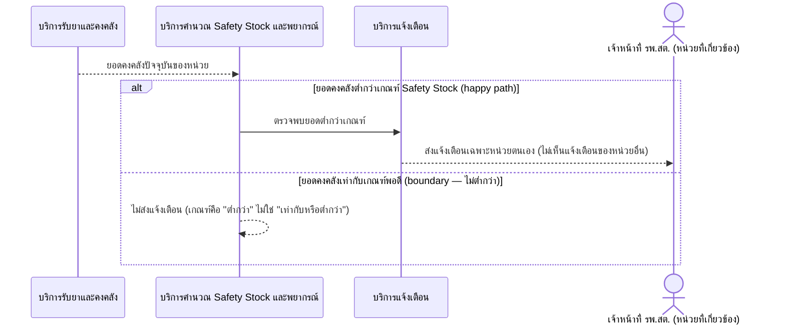

# Detailed Design (Conceptual) — แจ้งเตือนเมื่อยาใกล้หมด (ต่ำกว่า Safety Stock) (FT-011)

> เอกสารนี้เป็น detailed design ระดับแนวคิด (conceptual) เท่านั้น **ยังไม่ผูกมัดกับ technology stack, protocol, หรือเทคนิคการ implement ใดๆ** — ตาม CLAUDE.md เฟสปัจจุบันของโปรเจกต์คือการทำเอกสาร ยังไม่เข้าสู่เฟสพัฒนา เอกสารนี้จะถูกทบทวนอีกครั้งเมื่อเข้าสู่เฟสพัฒนาจริง
>
> อ้างอิงจาก [backlog.md](../backlog.md), [Feature List](../02-feature-list.md), [User Journey](../03-user-journey/), [Acceptance Criteria](../04-test-design/acceptance-criteria.md), [High-Level Architecture](../05-architecture.md), [Data Model](../06-data-model.md), [API Spec](../07-api-spec.md) — ดูนโยบาย granularity/exception/state-diagram ที่ใช้ร่วมกันทุกไฟล์ใน [README.md](README.md)

**วันที่สร้าง/อัปเดตล่าสุด:** 20260823
**Feature:** FT-011 — แจ้งเตือนเมื่อยาใกล้หมด (ต่ำกว่า Safety Stock)
**Backlog item ที่เกี่ยวข้อง:** BL-013

## 1. ภาพรวม (Overview)

ระบบแจ้งเตือนเจ้าหน้าที่ รพ.สต. เมื่อยอดคงคลังของหน่วยต่ำกว่าเกณฑ์ safety stock ที่คำนวณได้ ([safety-stock-calculation.md](safety-stock-calculation.md)) เพื่อให้เบิกยาทันเวลาก่อนยาขาด ตาม [staff-hph-journey.md](../03-user-journey/staff-hph-journey.md) step 11 — 1 BL-ID, 1 ไดอะแกรม happy path พร้อม inline `alt` สำหรับ boundary (ยอดเท่ากับเกณฑ์พอดี)

## 2. Sequence Diagram(s)

### 2.1 BL-013 — แจ้งเตือนเมื่อยอดคงคลังต่ำกว่าเกณฑ์

**อ้างอิง:** Acceptance Criteria BL-013 Scenario 1-3

## 3. Lifecycle / State Diagram

ไม่เกี่ยวข้อง

## 4. องค์ประกอบและ Operation ที่เกี่ยวข้อง (Cross-reference)

| องค์ประกอบ/Entity/Operation | มาจากเอกสาร | บทบาทใน Feature นี้ |
|---|---|---|
| บริการคำนวณ Safety Stock และพยากรณ์ | 05-architecture.md §3 | ตรวจจับยอดต่ำกว่าเกณฑ์ |
| บริการแจ้งเตือน | 05-architecture.md §3 | กระจายแจ้งเตือนเฉพาะหน่วยที่เกี่ยวข้อง |
| InventoryBalance, SafetyStockThreshold | 06-data-model.md §3.11/3.8 | ค่าที่ใช้เปรียบเทียบ |
| NotificationEvent | 06-data-model.md §3.12 | ประเภทเหตุการณ์ "สต็อกต่ำ" |

## 5. สิ่งที่ยังไม่ตัดสินใจ / Assumption ที่ต้องยืนยัน

- ไม่มี open item ใหม่ — AC ของ BL-013 resolved ครบทั้ง 3 scenario

---

## บันทึกการอัปเดต (Changelog)

- **20260823:** สร้างไฟล์ครั้งแรก — 1 ไดอะแกรม happy path พร้อม inline `alt` สำหรับ boundary scenario
