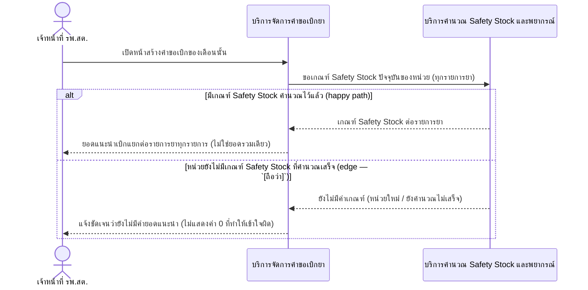
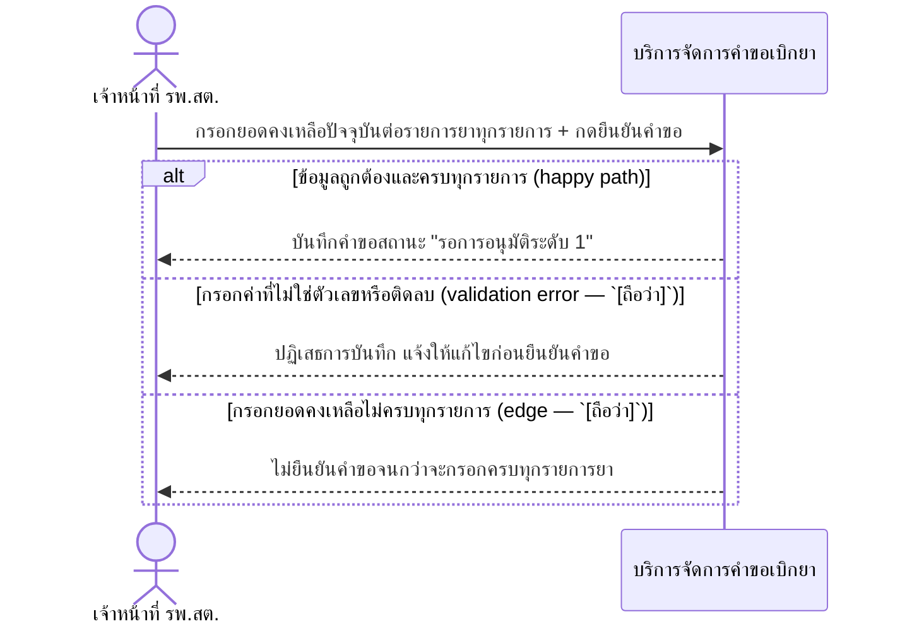
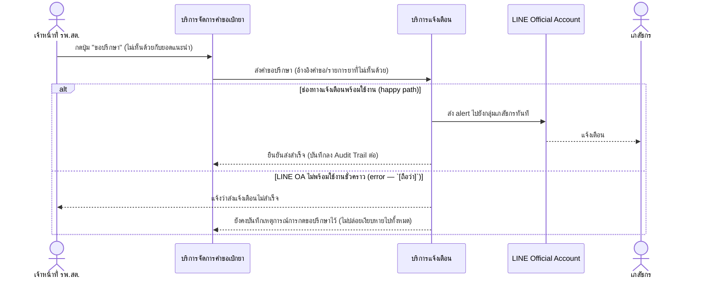

# Detailed Design (Conceptual) — สร้างคำขอเบิกยาประจำเดือน (ยอดแนะนำอัตโนมัติ + ขอปรึกษา) (FT-001)

> เอกสารนี้เป็น detailed design ระดับแนวคิด (conceptual) เท่านั้น **ยังไม่ผูกมัดกับ technology stack, protocol, หรือเทคนิคการ implement ใดๆ** — ตาม CLAUDE.md เฟสปัจจุบันของโปรเจกต์คือการทำเอกสาร ยังไม่เข้าสู่เฟสพัฒนา เอกสารนี้จะถูกทบทวนอีกครั้งเมื่อเข้าสู่เฟสพัฒนาจริง
>
> อ้างอิงจาก [backlog.md](../backlog.md), [Feature List](../02-feature-list.md), [User Journey](../03-user-journey/), [Acceptance Criteria](../04-test-design/acceptance-criteria.md), [High-Level Architecture](../05-architecture.md), [Data Model](../06-data-model.md), [API Spec](../07-api-spec.md) — ดูนโยบาย granularity/exception/state-diagram ที่ใช้ร่วมกันทุกไฟล์ใน [README.md](README.md)

**วันที่สร้าง/อัปเดตล่าสุด:** 20260823
**Feature:** FT-001 — สร้างคำขอเบิกยาประจำเดือน (ยอดแนะนำอัตโนมัติ + ขอปรึกษา)
**Backlog item ที่เกี่ยวข้อง:** BL-001, BL-002, BL-003

## 1. ภาพรวม (Overview)

Feature นี้ครอบคลุมขั้นตอนแรกของวงจรเบิกยาปกติ: เจ้าหน้าที่ รพ.สต. เปิดหน้าสร้างคำขอเดือนนั้นและเห็นยอดแนะนำเบิกที่คำนวณอัตโนมัติ (BL-001) กรอกยอดคงเหลือปัจจุบันแล้วยืนยันคำขอ (BL-002) และมีทางเลือกกด "ขอปรึกษา" แจ้งกลุ่มเภสัชกรก่อนยืนยันหากไม่เห็นด้วยกับยอดแนะนำ (BL-003) — เป็นกลไกหลักที่ตอบ Root Cause ของโครงการ (เกณฑ์คำนวณของผู้เบิก/ผู้คัดกรองไม่ตรงกัน) ตาม [staff-hph-journey.md](../03-user-journey/staff-hph-journey.md) step 2-6

มี 3 sequence diagram ต่อ BL-ID (granularity ระดับกลาง — ดู README.md): 2.1 (BL-001), 2.2 (BL-002), 2.3 (BL-003) แต่ละอันเป็น happy path พร้อม `alt` แสดง exception ที่เกี่ยวข้องโดยตรง (≤2 branch ต่อ BL-ID จึงแสดง inline ทั้งหมด ไม่ต้องแยกไดอะแกรม) ไม่มี state diagram ของ Feature นี้เอง (สถานะคำขอเบิกยาทั้งวงจรอยู่ที่ [two-level-requisition-approval.md](two-level-requisition-approval.md) หัวข้อ 3 ซึ่งเป็นเจ้าของ)

## 2. Sequence Diagram(s)

### 2.1 BL-001 — แสดงยอดแนะนำเบิกอัตโนมัติ

**อ้างอิง:** Acceptance Criteria BL-001 Scenario 1-3

Feature นี้ต้องรอ [safety-stock-calculation.md](safety-stock-calculation.md) (FT-010) มีเกณฑ์พร้อมใช้งานก่อนจึงจะมีค่าให้แสดงจริง (BL-001 depends on BL-011) — operation ที่เกี่ยวข้องคือ "ดูยอดแนะนำเบิกของเดือนนั้น" ([07-api-spec.md](../07-api-spec.md) §3.3) และ entity `RequisitionLineItem`/`SafetyStockThreshold` ([06-data-model.md](../06-data-model.md) §3.5/3.8)

### 2.2 BL-002 — กรอกยอดคงเหลือ + ยืนยันคำขอเบิก

**อ้างอิง:** Acceptance Criteria BL-002 Scenario 1-3

Operation ที่เกี่ยวข้อง: "บันทึกยอดคงเหลือและยืนยันคำขอเบิก" ([07-api-spec.md](../07-api-spec.md) §3.3) — สร้าง entity `Requisition` (header) + `RequisitionLineItem` (detail) ตาม [06-data-model.md](../06-data-model.md) §3.4/3.5 คำขอที่บันทึกแล้วต่อเนื่องไปยัง [two-level-requisition-approval.md](two-level-requisition-approval.md)

### 2.3 BL-003 — กด "ขอปรึกษา"

**อ้างอิง:** Acceptance Criteria BL-003 Scenario 1-3

หมายเหตุ: Scenario 3 ของ BL-003 (กดขอปรึกษาแล้วยังแก้ไข/ยืนยันคำขอในภายหลังได้) เป็นกฎทางธุรกิจที่ไม่มีขั้นตอนระบบเพิ่มเติม (ปุ่มขอปรึกษาไม่บล็อกการยืนยันคำขอ) จึงไม่แสดงเป็น branch แยกในไดอะแกรม — ทุกเหตุการณ์นี้ถูกบันทึกลง Audit Trail ต่อที่ [requisition-audit-trail.md](requisition-audit-trail.md) (FT-005)

## 3. Lifecycle / State Diagram

ไม่เกี่ยวข้องกับไฟล์นี้โดยตรง — สถานะของคำขอเบิกยา (Requisition Status) ทั้งวงจรถูกอธิบายที่ [two-level-requisition-approval.md](two-level-requisition-approval.md) หัวข้อ 3 ซึ่งเป็นเจ้าของ state diagram นี้ (FT-002)

## 4. องค์ประกอบและ Operation ที่เกี่ยวข้อง (Cross-reference)

| องค์ประกอบ/Entity/Operation | มาจากเอกสาร | บทบาทใน Feature นี้ |
|---|---|---|
| บริการจัดการคำขอเบิกยา | 05-architecture.md §3 | รับยอดคงเหลือ, แสดงยอดแนะนำ, สร้างคำขอ |
| บริการคำนวณ Safety Stock และพยากรณ์ | 05-architecture.md §3 | จัดหาเกณฑ์ Safety Stock ให้ REQ ใช้คำนวณยอดแนะนำ |
| บริการแจ้งเตือน | 05-architecture.md §3 | กระจาย alert "ขอปรึกษา" ไปกลุ่มเภสัชกร |
| Requisition, RequisitionLineItem | 06-data-model.md §3.4/3.5 | header/detail ของคำขอเบิกยา |
| SafetyStockThreshold | 06-data-model.md §3.8 | input ของยอดแนะนำเบิก |
| NotificationEvent | 06-data-model.md §3.12 | บันทึกเหตุการณ์ "ขอปรึกษา" |
| ดูยอดแนะนำเบิกของเดือนนั้น / บันทึกยอดคงเหลือและยืนยันคำขอเบิก / ขอปรึกษา | 07-api-spec.md §3.3 | operation ที่ใช้ในแต่ละขั้นตอน |

## 5. สิ่งที่ยังไม่ตัดสินใจ / Assumption ที่ต้องยืนยัน

- Scenario ที่ทำเครื่องหมาย `[ถือว่า]` ในไดอะแกรม 2.1/2.2/2.3 เป็นข้อสมมติฐาน QA/UX มาตรฐานจาก acceptance-criteria.md เอง (validation, error handling) ไม่ใช่การตัดสินใจใหม่ของไฟล์นี้ — ยังต้องให้เภสัชกรเจ้าของระบบยืนยันก่อนถือเป็นเกณฑ์จริง
- BL-001 ยังไม่มีค่ายอดแนะนำจริงจนกว่า FT-010 (Safety Stock) จะเสร็จสมบูรณ์ — ไม่ใช่ประเด็นใหม่ของไฟล์นี้ (ระบุไว้แล้วใน backlog.md)

---

## บันทึกการอัปเดต (Changelog)

- **20260823:** สร้างไฟล์ครั้งแรก — 3 sequence diagram ต่อ BL-ID (BL-001/002/003) ตาม granularity ระดับกลางที่ผู้ใช้ยืนยัน ทุก exception แสดงแบบ inline `alt` (≤2 branch ต่อ BL-ID) ไม่มี state diagram (อ้างอิงไปยัง FT-002 แทน)
