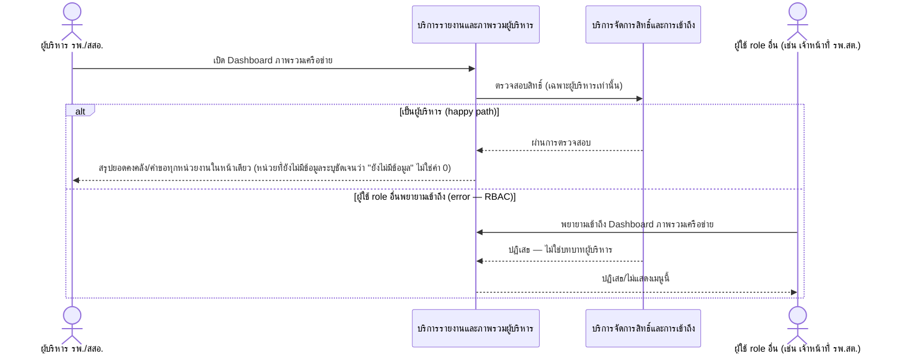
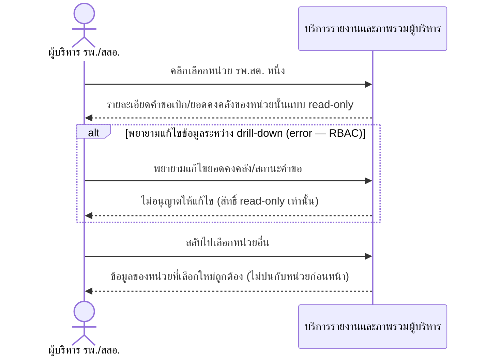

# Detailed Design (Conceptual) — ภาพรวมคงคลังทั้งเครือข่ายพร้อม Drill-down รายหน่วย (FT-014)

> เอกสารนี้เป็น detailed design ระดับแนวคิด (conceptual) เท่านั้น **ยังไม่ผูกมัดกับ technology stack, protocol, หรือเทคนิคการ implement ใดๆ** — ตาม CLAUDE.md เฟสปัจจุบันของโปรเจกต์คือการทำเอกสาร ยังไม่เข้าสู่เฟสพัฒนา เอกสารนี้จะถูกทบทวนอีกครั้งเมื่อเข้าสู่เฟสพัฒนาจริง
>
> อ้างอิงจาก [backlog.md](../backlog.md), [Feature List](../02-feature-list.md), [User Journey](../03-user-journey/), [Acceptance Criteria](../04-test-design/acceptance-criteria.md), [High-Level Architecture](../05-architecture.md), [Data Model](../06-data-model.md), [API Spec](../07-api-spec.md) — ดูนโยบาย granularity/exception/state-diagram ที่ใช้ร่วมกันทุกไฟล์ใน [README.md](README.md)

**วันที่สร้าง/อัปเดตล่าสุด:** 20260823
**Feature:** FT-014 — ภาพรวมคงคลังทั้งเครือข่ายพร้อม Drill-down รายหน่วย
**Backlog item ที่เกี่ยวข้อง:** BL-016, BL-017

## 1. ภาพรวม (Overview)

ผู้บริหารเห็นสรุปยอดคงคลังทั้งเครือข่ายในหน้าเดียว (BL-016) และคลิกเลือกหน่วยใดหน่วยหนึ่งเพื่อดูรายละเอียดคำขอเบิก/ยอดคงคลังของหน่วยนั้นแบบ read-only (BL-017) ตาม [executive-journey.md](../03-user-journey/executive-journey.md) step 2-3 — 2 ไดอะแกรมต่อ BL-ID

## 2. Sequence Diagram(s)

### 2.1 BL-016 — เปิด Dashboard เห็นภาพรวมทั้งเครือข่าย

**อ้างอิง:** Acceptance Criteria BL-016 Scenario 1-3

### 2.2 BL-017 — Drill-down ดูรายละเอียดรายหน่วย

**อ้างอิง:** Acceptance Criteria BL-017 Scenario 1-3

## 3. Lifecycle / State Diagram

ไม่เกี่ยวข้อง

## 4. องค์ประกอบและ Operation ที่เกี่ยวข้อง (Cross-reference)

| องค์ประกอบ/Entity/Operation | มาจากเอกสาร | บทบาทใน Feature นี้ |
|---|---|---|
| บริการรายงานและภาพรวมผู้บริหาร | 05-architecture.md §3 | รวบรวมภาพรวม/รายละเอียดรายหน่วย |
| บริการจัดการสิทธิ์และการเข้าถึง | 05-architecture.md §3 | บังคับสิทธิ์ผู้บริหาร = read-only เท่านั้น |
| มุมมองภาพรวมเครือข่าย (Network Overview View) | 06-data-model.md §5 | คำนวณจาก Requisition + InventoryBalance + Unit ทุกหน่วย ณ เวลาร้องขอ ไม่ใช่ entity แยก |
| ดูภาพรวมคงคลังทั้งเครือข่าย; Drill-down ดูรายละเอียดรายหน่วย | 07-api-spec.md §3.8 | operation หลักของ Feature นี้ |

## 5. สิ่งที่ยังไม่ตัดสินใจ / Assumption ที่ต้องยืนยัน

- ไม่มี open item ใหม่ — AC ของ BL-016/BL-017 resolved ครบ

---

## บันทึกการอัปเดต (Changelog)

- **20260823:** สร้างไฟล์ครั้งแรก — 2 ไดอะแกรมต่อ BL-ID พร้อม inline `alt`/`opt` สำหรับ RBAC denial แต่ละกรณี
