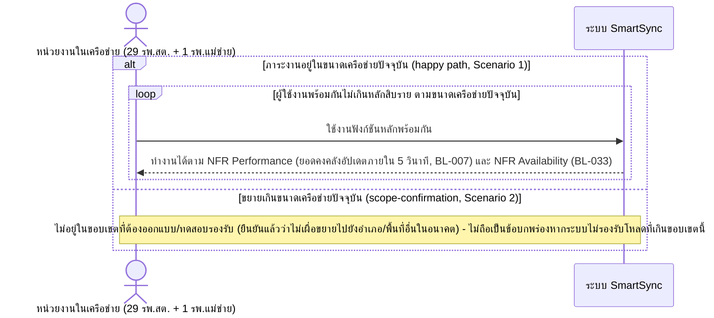

# Detailed Design (Conceptual) — ขอบเขต Scalability เฉพาะขนาดเครือข่ายปัจจุบัน (FT-032)

> เอกสารนี้เป็น detailed design ระดับแนวคิด (conceptual) เท่านั้น **ยังไม่ผูกมัดกับ technology stack, protocol, หรือเทคนิคการ implement ใดๆ** — ตาม CLAUDE.md เฟสปัจจุบันของโปรเจกต์คือการทำเอกสาร ยังไม่เข้าสู่เฟสพัฒนา เอกสารนี้จะถูกทบทวนอีกครั้งเมื่อเข้าสู่เฟสพัฒนาจริง
>
> อ้างอิงจาก [backlog.md](../backlog.md), [Feature List](../02-feature-list.md), [User Journey](../03-user-journey/), [Acceptance Criteria](../04-test-design/acceptance-criteria.md), [High-Level Architecture](../05-architecture.md), [Data Model](../06-data-model.md), [API Spec](../07-api-spec.md) — ดูนโยบาย granularity/exception/state-diagram ที่ใช้ร่วมกันทุกไฟล์ใน [README.md](README.md)

**วันที่สร้าง/อัปเดตล่าสุด:** 20260825
**Feature:** FT-032 — ขอบเขต Scalability เฉพาะขนาดเครือข่ายปัจจุบัน
**Backlog item ที่เกี่ยวข้อง:** BL-041

## 1. ภาพรวม (Overview)

**หมายเหตุเรื่องความเหมาะสมของ sequence diagram:** BL-041 เป็นข้อจำกัดเชิงออกแบบระบบ (design/testing scope constraint) ไม่ใช่ workflow ที่มีผู้ใช้เจาะจงคนใดโต้ตอบ — เนื้อหาจริงคือ "ระบบต้องรักษาเกณฑ์ NFR อื่น (Performance/Availability) ไว้ได้เมื่อมีผู้ใช้จากทั้งเครือข่ายใช้งานพร้อมกันตามขนาดปัจจุบัน" ไดอะแกรมด้านล่างจึงแทนหน่วยงานทั้ง 29 รพ.สต. + 1 รพ.แม่ข่าย เป็น actor กลุ่มเดียว (แสดงด้วย `loop` แทนการใช้งานพร้อมกันหลายหน่วย) และอ้างอิงผลลัพธ์กลับไปยัง NFR ที่มีอยู่แล้ว (BL-007 Performance, BL-033 Availability) แทนการวาดกลไก load-testing/infrastructure ใดๆ ซึ่งเป็นรายละเอียดที่ยังไม่ตัดสินใจในเฟสนี้

## 2. Sequence Diagram(s)

### 2.1 BL-041 — ขอบเขตการรองรับตามขนาดเครือข่ายปัจจุบัน

**อ้างอิง:** Acceptance Criteria BL-041 Scenario 1-2

## 3. Lifecycle / State Diagram

ไม่เกี่ยวข้อง

## 4. องค์ประกอบและ Operation ที่เกี่ยวข้อง (Cross-reference)

| องค์ประกอบ/Entity/Operation | มาจากเอกสาร | บทบาทใน Feature นี้ |
|---|---|---|
| ระบบ SmartSync (ภาพรวม, ไม่ระบุองค์ประกอบเจาะจง) | 05-architecture.md §3 (หมายเหตุ NFR เพิ่มเติม 20260824) | BL-041 เป็นข้อจำกัดเชิงขอบเขต ไม่ผูกกับองค์ประกอบใดเป็นการเฉพาะ |
| NFR ขอบเขตการรองรับปริมาณงาน (Scalability) | 05-architecture.md §7 | ขอบเขตรองรับเฉพาะ 29 รพ.สต. + 1 รพ.แม่ข่าย |
| NFR ประสิทธิภาพ (Performance, BL-007); NFR ความพร้อมใช้งาน (Availability, BL-033) | 05-architecture.md §7 | เกณฑ์ที่ต้องรักษาไว้ภายใต้ขนาดเครือข่ายปัจจุบัน |

## 5. สิ่งที่ยังไม่ตัดสินใจ / Assumption ที่ต้องยืนยัน

- ไม่มี open item ใหม่ — AC ของ BL-041 resolved ครบ (scope-confirmation)

---

## บันทึกการอัปเดต (Changelog)

- **20260825:** สร้างไฟล์ครั้งแรก — 1 ไดอะแกรมแนวคิดล้วนๆ แทนหน่วยงานทั้งเครือข่ายเป็น actor กลุ่มเดียวใช้ `loop` แทนการใช้งานพร้อมกัน พร้อม cross-reference ไปยัง NFR Performance (BL-007)/Availability (BL-033) แทนการวาดกลไก load-testing ใดๆ
