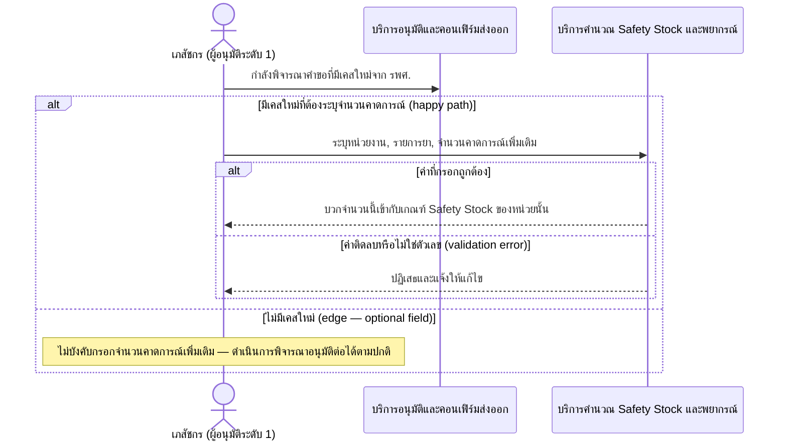

# Detailed Design (Conceptual) — ปรับเกณฑ์ Safety Stock สำหรับเคสใหม่จาก รพศ. (FT-013)

> เอกสารนี้เป็น detailed design ระดับแนวคิด (conceptual) เท่านั้น **ยังไม่ผูกมัดกับ technology stack, protocol, หรือเทคนิคการ implement ใดๆ** — ตาม CLAUDE.md เฟสปัจจุบันของโปรเจกต์คือการทำเอกสาร ยังไม่เข้าสู่เฟสพัฒนา เอกสารนี้จะถูกทบทวนอีกครั้งเมื่อเข้าสู่เฟสพัฒนาจริง
>
> อ้างอิงจาก [backlog.md](../backlog.md), [Feature List](../02-feature-list.md), [User Journey](../03-user-journey/), [Acceptance Criteria](../04-test-design/acceptance-criteria.md), [High-Level Architecture](../05-architecture.md), [Data Model](../06-data-model.md), [API Spec](../07-api-spec.md) — ดูนโยบาย granularity/exception/state-diagram ที่ใช้ร่วมกันทุกไฟล์ใน [README.md](README.md)

**วันที่สร้าง/อัปเดตล่าสุด:** 20260823
**Feature:** FT-013 — ปรับเกณฑ์ Safety Stock สำหรับเคสใหม่จาก รพศ.
**Backlog item ที่เกี่ยวข้อง:** BL-015

## 1. ภาพรวม (Overview)

ระหว่างขั้นตอนพิจารณาอนุมัติระดับ 1 ([two-level-requisition-approval.md](two-level-requisition-approval.md)) เภสัชกรระบุจำนวนคาดการณ์เพิ่มเติมเมื่อมีผู้ป่วยเคสใหม่จาก รพศ. ส่งต่อมารับยาที่ รพ.สต. ที่ยังไม่มีข้อมูลย้อนหลัง — เป็นฟิลด์ทางเลือก (optional) ไม่บังคับกรอก

## 2. Sequence Diagram(s)

### 2.1 BL-015 — ระบุจำนวนคาดการณ์เพิ่มเติม

**อ้างอิง:** Acceptance Criteria BL-015 Scenario 1-3

## 3. Lifecycle / State Diagram

ไม่เกี่ยวข้อง

## 4. องค์ประกอบและ Operation ที่เกี่ยวข้อง (Cross-reference)

| องค์ประกอบ/Entity/Operation | มาจากเอกสาร | บทบาทใน Feature นี้ |
|---|---|---|
| บริการอนุมัติและคอนเฟิร์มส่งออก | 05-architecture.md §3 | จุดที่เภสัชกรระบุจำนวนคาดการณ์ระหว่างพิจารณา |
| บริการคำนวณ Safety Stock และพยากรณ์ | 05-architecture.md §3 | รับค่าปรับเกณฑ์เพิ่มเติมไปบวกกับ Safety Stock |
| ManualForecastAdjustment | 06-data-model.md §3.7 | entity หลักของ Feature นี้ |
| ระบุจำนวนคาดการณ์เพิ่มเติมสำหรับเคสใหม่จาก รพศ. | 07-api-spec.md §3.4 | operation หลัก |

## 5. สิ่งที่ยังไม่ตัดสินใจ / Assumption ที่ต้องยืนยัน

- ไม่มี open item ใหม่ — AC ของ BL-015 resolved ครบทั้ง 3 scenario

---

## บันทึกการอัปเดต (Changelog)

- **20260823:** สร้างไฟล์ครั้งแรก — 1 ไดอะแกรมรวม happy/optional-field/validation-error เป็น nested `alt` เดียว (เนื่องจากทุก branch อยู่ในผู้กระทำ/องค์ประกอบชุดเดียวกัน)
