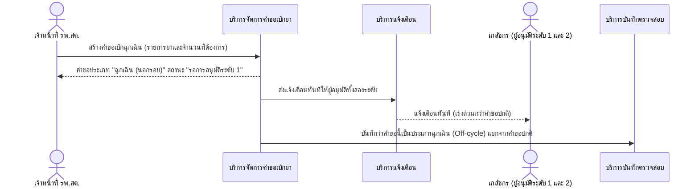

# Detailed Design (Conceptual) — สร้างคำขอเบิกฉุกเฉินนอกรอบ (FT-006)

> เอกสารนี้เป็น detailed design ระดับแนวคิด (conceptual) เท่านั้น **ยังไม่ผูกมัดกับ technology stack, protocol, หรือเทคนิคการ implement ใดๆ** — ตาม CLAUDE.md เฟสปัจจุบันของโปรเจกต์คือการทำเอกสาร ยังไม่เข้าสู่เฟสพัฒนา เอกสารนี้จะถูกทบทวนอีกครั้งเมื่อเข้าสู่เฟสพัฒนาจริง
>
> อ้างอิงจาก [backlog.md](../backlog.md), [Feature List](../02-feature-list.md), [User Journey](../03-user-journey/), [Acceptance Criteria](../04-test-design/acceptance-criteria.md), [High-Level Architecture](../05-architecture.md), [Data Model](../06-data-model.md), [API Spec](../07-api-spec.md) — ดูนโยบาย granularity/exception/state-diagram ที่ใช้ร่วมกันทุกไฟล์ใน [README.md](README.md)

**วันที่สร้าง/อัปเดตล่าสุด:** 20260823
**Feature:** FT-006 — สร้างคำขอเบิกฉุกเฉินนอกรอบ
**Backlog item ที่เกี่ยวข้อง:** BL-009

## 1. ภาพรวม (Overview)

เมื่อยาหมดกะทันหันนอกรอบเดือนปกติ เจ้าหน้าที่ รพ.สต. สร้างคำขอเบิกฉุกเฉิน (Off-cycle) ซึ่งเข้าสู่ผังอนุมัติสองระดับเดียวกับคำขอปกติ ([two-level-requisition-approval.md](two-level-requisition-approval.md)) แต่ส่ง notify ทันทีให้ผู้อนุมัติทั้งสองระดับเพื่อความเร่งด่วน ตาม [staff-hph-journey.md](../03-user-journey/staff-hph-journey.md) step 12 — 1 BL-ID, 1 ไดอะแกรม happy path (ไม่มี exception scenario แยกใน AC นอกจากหมายเหตุเชิงแสดงผล)

## 2. Sequence Diagram(s)

### 2.1 BL-009 — สร้างคำขอเบิกฉุกเฉิน

**อ้างอิง:** Acceptance Criteria BL-009 Scenario 1-3

หมายเหตุ: คำขอนี้เข้าสู่ผังอนุมัติเดียวกับ [two-level-requisition-approval.md](two-level-requisition-approval.md) (FT-002) ทุกประการหลังสร้างแล้ว — ไม่มี branch การอนุมัติแยกต่างหาก Scenario 2 ของ AC (ต้องแสดง/ระบุคำขอฉุกเฉินให้แยกแยะได้จากคำขอปกติ, `[ถือว่า]`) เป็นข้อกำหนดด้านการแสดงผล ไม่ใช่ลำดับการโต้ตอบระหว่างองค์ประกอบ จึงไม่แสดงเป็น branch แยก

## 3. Lifecycle / State Diagram

ไม่เกี่ยวข้อง — คำขอฉุกเฉินใช้สถานะเดียวกับคำขอปกติ (ดู [two-level-requisition-approval.md](two-level-requisition-approval.md) หัวข้อ 3)

## 4. องค์ประกอบและ Operation ที่เกี่ยวข้อง (Cross-reference)

| องค์ประกอบ/Entity/Operation | มาจากเอกสาร | บทบาทใน Feature นี้ |
|---|---|---|
| บริการจัดการคำขอเบิกยา | 05-architecture.md §3 | สร้าง/ติดตามสถานะคำขอประเภทฉุกเฉิน |
| บริการแจ้งเตือน | 05-architecture.md §3 | แจ้งเตือนทันทีให้ผู้อนุมัติทั้งสองระดับ |
| Requisition (ประเภทคำขอ = ฉุกเฉิน) | 06-data-model.md §3.4 | ฟิลด์ "ประเภทคำขอ" แยกปกติ/ฉุกเฉิน |
| สร้างคำขอเบิกฉุกเฉิน | 07-api-spec.md §3.3 | operation หลักของ Feature นี้ |

## 5. สิ่งที่ยังไม่ตัดสินใจ / Assumption ที่ต้องยืนยัน

- ไม่มี open item ใหม่ — AC ของ BL-009 resolved ครบทั้ง 3 scenario

---

## บันทึกการอัปเดต (Changelog)

- **20260823:** สร้างไฟล์ครั้งแรก — 1 ไดอะแกรม happy path เดียว (ไม่มี exception branch ตาม AC)
