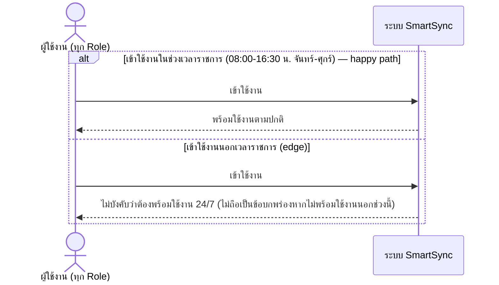

# Detailed Design (Conceptual) — ระบบพร้อมใช้งานเฉพาะเวลาราชการ (FT-025)

> เอกสารนี้เป็น detailed design ระดับแนวคิด (conceptual) เท่านั้น **ยังไม่ผูกมัดกับ technology stack, protocol, หรือเทคนิคการ implement ใดๆ** — ตาม CLAUDE.md เฟสปัจจุบันของโปรเจกต์คือการทำเอกสาร ยังไม่เข้าสู่เฟสพัฒนา เอกสารนี้จะถูกทบทวนอีกครั้งเมื่อเข้าสู่เฟสพัฒนาจริง
>
> อ้างอิงจาก [backlog.md](../backlog.md), [Feature List](../02-feature-list.md), [User Journey](../03-user-journey/), [Acceptance Criteria](../04-test-design/acceptance-criteria.md), [High-Level Architecture](../05-architecture.md), [Data Model](../06-data-model.md), [API Spec](../07-api-spec.md) — ดูนโยบาย granularity/exception/state-diagram ที่ใช้ร่วมกันทุกไฟล์ใน [README.md](README.md)

**วันที่สร้าง/อัปเดตล่าสุด:** 20260823
**Feature:** FT-025 — ระบบพร้อมใช้งานเฉพาะเวลาราชการ
**Backlog item ที่เกี่ยวข้อง:** BL-033

## 1. ภาพรวม (Overview)

**หมายเหตุเรื่องความเหมาะสมของ sequence diagram:** เช่นเดียวกับ [responsive-ui-all-devices.md](responsive-ui-all-devices.md) (FT-022) BL-033 เป็น NFR ด้าน Availability ล้วนๆ ไม่มีองค์ประกอบ/บทบาทที่โต้ตอบกันต่างไปตามช่วงเวลา — สิ่งที่ต่างกันคือ "ระบบต้องพร้อมใช้งานหรือไม่" ไม่ใช่ "ใครโต้ตอบกับใคร" ไดอะแกรมด้านล่างจึงสั้นและเป็นแนวคิดล้วนๆ โดยไม่บ่งบอกกลไก uptime/monitoring ใดๆ (ซึ่งเป็นรายละเอียด deployment ที่ยังไม่ตัดสินใจในเฟสนี้ตาม [05-architecture.md](../05-architecture.md) §8)

## 2. Sequence Diagram(s)

### 2.1 BL-033 — ความพร้อมใช้งานตามช่วงเวลาราชการ

**อ้างอิง:** Acceptance Criteria BL-033 Scenario 1-2

## 3. Lifecycle / State Diagram

ไม่เกี่ยวข้อง

## 4. องค์ประกอบและ Operation ที่เกี่ยวข้อง (Cross-reference)

| องค์ประกอบ/Entity/Operation | มาจากเอกสาร | บทบาทใน Feature นี้ |
|---|---|---|
| ระบบ SmartSync (ภาพรวม, ไม่ระบุองค์ประกอบเจาะจง) | 05-architecture.md §7 | NFR Availability ครอบคลุมทุกองค์ประกอบ ไม่ใช่บริการใดบริการหนึ่ง |

## 5. สิ่งที่ยังไม่ตัดสินใจ / Assumption ที่ต้องยืนยัน

- ไม่มี open item ใหม่ — AC ของ BL-033 resolved ครบ; ไม่รวมมุมมอง deployment/monitoring ตามที่ [05-architecture.md](../05-architecture.md) §8 ยืนยันไว้แล้วว่าไม่อยู่ในขอบเขตเอกสารชุดนี้

---

## บันทึกการอัปเดต (Changelog)

- **20260823:** สร้างไฟล์ครั้งแรก — 1 ไดอะแกรมแนวคิดล้วนๆ ไม่บ่งบอกกลไก uptime/deployment ใดๆ
