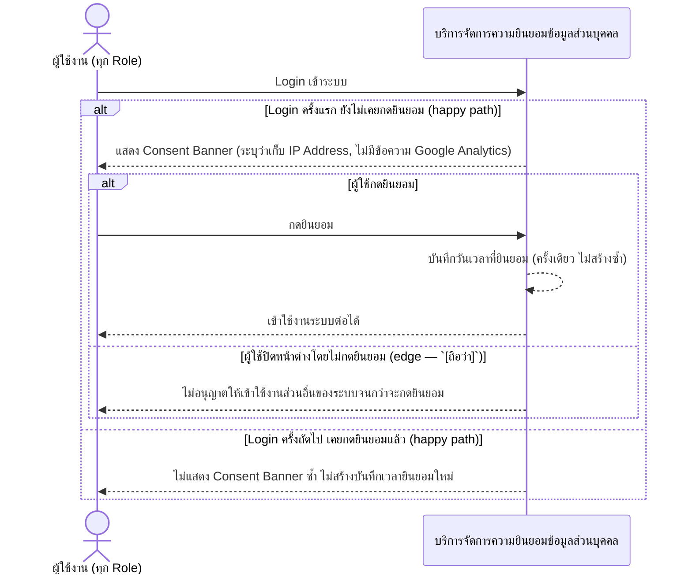

# Detailed Design (Conceptual) — มาตรการคุ้มครองข้อมูลตาม PDPA (Consent + บันทึกเวลายินยอม) (FT-023)

> เอกสารนี้เป็น detailed design ระดับแนวคิด (conceptual) เท่านั้น **ยังไม่ผูกมัดกับ technology stack, protocol, หรือเทคนิคการ implement ใดๆ** — ตาม CLAUDE.md เฟสปัจจุบันของโปรเจกต์คือการทำเอกสาร ยังไม่เข้าสู่เฟสพัฒนา เอกสารนี้จะถูกทบทวนอีกครั้งเมื่อเข้าสู่เฟสพัฒนาจริง
>
> อ้างอิงจาก [backlog.md](../backlog.md), [Feature List](../02-feature-list.md), [User Journey](../03-user-journey/), [Acceptance Criteria](../04-test-design/acceptance-criteria.md), [High-Level Architecture](../05-architecture.md), [Data Model](../06-data-model.md), [API Spec](../07-api-spec.md) — ดูนโยบาย granularity/exception/state-diagram ที่ใช้ร่วมกันทุกไฟล์ใน [README.md](README.md)

**วันที่สร้าง/อัปเดตล่าสุด:** 20260823
**Feature:** FT-023 — มาตรการคุ้มครองข้อมูลตาม PDPA (Consent + บันทึกเวลายินยอม)
**Backlog item ที่เกี่ยวข้อง:** BL-027, BL-030, BL-031

## 1. ภาพรวม (Overview)

ผู้ใช้งานทุกคนเห็น Consent Banner ตอน login ครั้งแรกเท่านั้น (BL-030) พร้อมบันทึกวันเวลาที่กดยินยอมเป็นหลักฐาน (BL-031) เป็นส่วนหนึ่งของมาตรการ PDPA ระดับพื้นฐาน (BL-027, resolved — ไม่ต้องมี DPO/DPIA) ตาม step แรกของทุก user journey ("Login + Consent Banner (ครั้งแรก)") — BL-030/BL-031 เป็นสองด้านของ flow เดียวกัน (แสดง + บันทึก) จึงรวมเป็น 1 ไดอะแกรม ส่วน BL-027 เป็นข้อกำหนดระดับนโยบาย (Basic compliance) ไม่มีลำดับการโต้ตอบของตัวเอง จึงอ้างอิงในเชิงเนื้อหาแทนการวาดแยก

## 2. Sequence Diagram(s)

### 2.1 BL-030 + BL-031 — แสดง Consent Banner ครั้งแรกและบันทึกเวลายินยอม

**อ้างอิง:** Acceptance Criteria BL-030 Scenario 1-4, BL-031 Scenario 1-2

## 3. Lifecycle / State Diagram

ไม่เกี่ยวข้อง — ConsentRecord บันทึกครั้งเดียวต่อผู้ใช้ ไม่มีสถานะหลายขั้น

## 4. องค์ประกอบและ Operation ที่เกี่ยวข้อง (Cross-reference)

| องค์ประกอบ/Entity/Operation | มาจากเอกสาร | บทบาทใน Feature นี้ |
|---|---|---|
| บริการจัดการความยินยอมข้อมูลส่วนบุคคล | 05-architecture.md §3 | แสดง Consent Banner + บันทึกความยินยอม |
| ConsentRecord | 06-data-model.md §3.17 | entity หลัก |
| แสดง/บันทึกความยินยอม Consent | 07-api-spec.md §3.2 | operation หลักของ Feature นี้ |

## 5. สิ่งที่ยังไม่ตัดสินใจ / Assumption ที่ต้องยืนยัน

- Scenario "ผู้ใช้ปิดหน้าต่างโดยไม่กดยินยอม" เป็น `[ถือว่า]` (ข้อสมมติฐาน UX มาตรฐาน) จาก acceptance-criteria.md ไม่ใช่การตัดสินใจใหม่ของไฟล์นี้

---

## บันทึกการอัปเดต (Changelog)

- **20260823:** สร้างไฟล์ครั้งแรก — 1 ไดอะแกรมรวม BL-030/BL-031 (สองด้านของ flow เดียวกัน) พร้อม nested `alt` ครบทั้ง 4+2 scenario ของ AC
