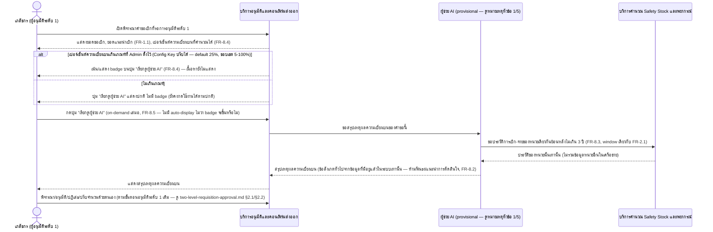
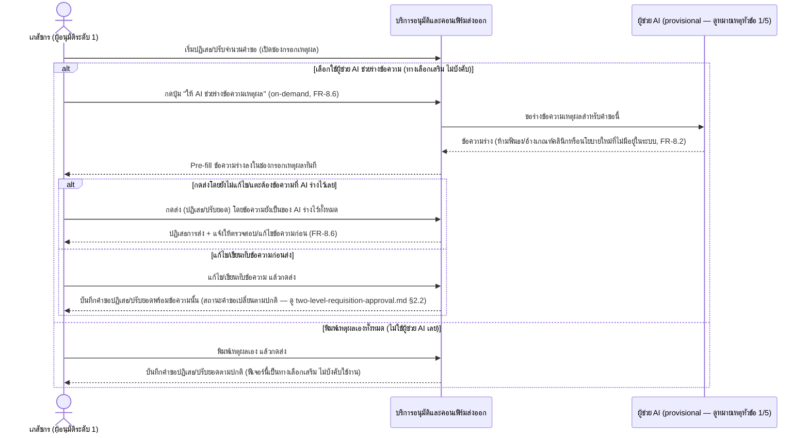

# Detailed Design (Conceptual) — ผู้ช่วย AI สำหรับเภสัชกรผู้อนุมัติระดับ 1 (Assistive เท่านั้น) (FT-036)

> เอกสารนี้เป็น detailed design ระดับแนวคิด (conceptual) เท่านั้น **ยังไม่ผูกมัดกับ technology stack, protocol, หรือเทคนิคการ implement ใดๆ** — ตาม CLAUDE.md เฟสปัจจุบันของโปรเจกต์คือการทำเอกสาร ยังไม่เข้าสู่เฟสพัฒนา เอกสารนี้จะถูกทบทวนอีกครั้งเมื่อเข้าสู่เฟสพัฒนาจริง **ฟีเจอร์นี้ (BL-047) ยังไม่ได้รับคำสั่งเข้าสู่เฟสพัฒนา** เช่นเดียวกับที่ระบุไว้ใน [spec 008](../01-spec/20260914-008-pharmacist-approval-ai-assistant.md)/backlog.md/CLAUDE.md — การมีไฟล์นี้อยู่ไม่ใช่คำสั่งพัฒนาโค้ดจริงแต่อย่างใด
>
> อ้างอิงจาก [backlog.md](../backlog.md), [Feature List](../02-feature-list.md), [User Journey](../03-user-journey/), [Acceptance Criteria](../04-test-design/acceptance-criteria.md), [High-Level Architecture](../05-architecture.md), [Data Model](../06-data-model.md), [API Spec](../07-api-spec.md) — ดูนโยบาย granularity/exception/state-diagram ที่ใช้ร่วมกันทุกไฟล์ใน [README.md](README.md)

**วันที่สร้าง/อัปเดตล่าสุด:** 20260915
**Feature:** FT-036 — ผู้ช่วย AI สำหรับเภสัชกรผู้อนุมัติระดับ 1 (Assistive เท่านั้น)
**Backlog item ที่เกี่ยวข้อง:** BL-047

## 1. ภาพรวม (Overview)

Feature นี้ต่อยอดขั้นตอนอนุมัติระดับ 1 เดิม (FT-002/BL-004, ดู [two-level-requisition-approval.md](two-level-requisition-approval.md)) ด้วยผู้ช่วย AI แบบ **assistive เท่านั้น** ที่เภสัชกรผู้อนุมัติระดับ 1 เรียกดูได้เอง (on-demand เสมอ) สองความสามารถ พัฒนาพร้อมกัน: **(ก)** สรุปเหตุผลความเบี่ยงเบนระหว่างยอดขอเบิกกับยอดแนะนำเบิก (FR-1.1) โดยอ้างอิงเฉพาะประวัติของหน่วยตนเองย้อนหลังไม่เกิน 3 ปี และ **(ข)** ช่วยร่างข้อความเหตุผลตอนปฏิเสธ/ปรับยอด แบบ prefill-ต้องแก้ไขก่อนส่งเสมอ — ทั้งสองความสามารถห้ามฟันธง/แนะนำการตัดสินใจ และห้ามอนุมัติ/ปฏิเสธ/ปรับจำนวนแทนเภสัชกรโดยอัตโนมัติไม่ว่ากรณีใด (FR-8.1, FR-8.2) spec 008 resolved ครบทุกประเด็นแล้ว (20260914 รอบ 3) ไม่มี Open Item เชิงกฎธุรกิจค้าง

**Granularity ของ scenario:** BL-047 เป็น backlog item เดียว แต่ประกอบด้วย 2 ความสามารถที่แยกจากกันชัดเจน (US-8.1 กับ US-8.2 คนละชุด AC, คนละปุ่ม/จังหวะการเรียกใช้) ซึ่งแต่ละความสามารถเองก็มี 3+ branch ที่มีนัยสำคัญต่างกัน (เช่น (ก) มี badge เน้น/ไม่เน้น + เนื้อหา on-demand; (ข) มี prefill/บล็อกการส่ง/อนุญาตส่งหลังแก้ไข/ไม่ใช้ AI เลย) — ตามนโยบาย "แยกไดอะแกรมเมื่อมี 3+ branch ที่มีนัยสำคัญต่างกัน" ใน [README.md](README.md) (บรรทัดฐานเดียวกับที่ [two-level-requisition-approval.md](two-level-requisition-approval.md) แยก BL-004 เป็น 3 ไดอะแกรม และ [confirm-export-and-download.md](confirm-export-and-download.md) แยก BL-020 เป็น 2 ไดอะแกรม) จึงแยกเป็น **2 ไดอะแกรม** ต่อความสามารถ (2.1 = ความสามารถ (ก)/US-8.1, 2.2 = ความสามารถ (ข)/US-8.2) แทนการยัดรวมเป็นไดอะแกรมเดียว

**หมายเหตุสำคัญเรื่อง participant "ผู้ช่วย AI" (ต่างจากไฟล์อื่นในโฟลเดอร์นี้ — โปรดอ่าน):** ต่างจาก FT-035 ที่องค์ประกอบใหม่ ("บริการสร้างเอกสารใบเบิกยาแบบพิมพ์") ถูกเพิ่มเข้า [05-architecture.md](../05-architecture.md) §3 โดย `/build-architecture` **ก่อน** สร้างไฟล์ detailed design นั้น — FT-036/BL-047 **ยังไม่มีการรัน `/build-architecture` เพื่อ sync** เอกสารสถาปัตยกรรมยังไม่มีองค์ประกอบเชิงตรรกะที่ครอบคลุมความรับผิดชอบของผู้ช่วย AI นี้เลย (ตรวจสอบแล้วด้วย grep เมื่อ 20260915 — ไม่พบคำว่า "BL-047"/"FT-036"/"ผู้ช่วย AI" ใน 05-architecture.md/06-data-model.md/07-api-spec.md ทั้งสามไฟล์) ไดอะแกรมด้านล่างจึงใช้ participant ชื่อ **"ผู้ช่วย AI"** เป็น**ชื่อชั่วคราว (provisional)** แทนการรอ/บล็อกงานเอกสารนี้ทั้งหมด (ทางเลือก (c) ตามนโยบาย fallback ของ agent นี้เมื่อสถาปัตยกรรมยังไม่ครอบคลุม Feature ที่กำลังทำ) — **ไม่ใช่การตั้งชื่อ component ใหม่แบบถาวร** ต้องพิจารณา reconcile กับ [05-architecture.md](../05-architecture.md) ภายหลังผ่าน `/build-architecture` (ดูหัวข้อ 5)

**ไม่มี Lifecycle/State Diagram (หัวข้อ 3) สำหรับ Feature นี้** — ไม่มี entity ใหม่ที่มีสถานะหลายขั้นเป็นของตัวเอง เกณฑ์ trigger % เป็นเพียงค่า Config Key เดียว (ไม่มี lifecycle) และการตรวจสอบ "ข้อความร่างถูกแก้ไขหรือยัง" เป็นการตรวจสอบชั่วคราวระดับหน้าจอ ไม่ใช่สถานะที่บันทึกถาวรของ entity ใดๆ — ดูรายละเอียดในหัวข้อ 3

## 2. Sequence Diagram(s)

### 2.1 US-8.1 (ความสามารถ ก) — สรุปเหตุผลความเบี่ยงเบน (on-demand)

**อ้างอิง:** Acceptance Criteria BL-047 / US-8.1 Scenario 1-5 (สรุปเหตุผลความเบี่ยงเบน, badge เน้นเมื่อเกินเกณฑ์, ปุ่มยังใช้ได้ปกติเมื่อไม่เกินเกณฑ์, ห้ามฟันธง/แนะนำการตัดสินใจ, ไม่มีการอนุมัติ/ปฏิเสธ/ปรับจำนวนอัตโนมัติ)

หมายเหตุ: บรรทัดสุดท้ายของไดอะแกรมย้ำ FR-8.1 — ผู้ช่วย AI ไม่ทำการอนุมัติ/ปฏิเสธ/ปรับจำนวนใดๆ แทนเภสัชกร ไม่ว่าจะเรียกดูสรุปหรือไม่ก็ตาม การกระทำสุดท้ายเป็นของ PHARM1 เองเสมอตามขั้นตอนเดิมของ FT-002 — participant AI เป็นชื่อชั่วคราว (provisional) ยังไม่ปรากฏใน [05-architecture.md](../05-architecture.md) (ดูหัวข้อ 1/5)

### 2.2 US-8.2 (ความสามารถ ข) — ช่วยร่างข้อความเหตุผลปฏิเสธ/ปรับยอด (on-demand, prefill-ต้องแก้ไขก่อนส่ง)

**อ้างอิง:** Acceptance Criteria BL-047 / US-8.2 Scenario 1-5 (prefill ข้อความร่างทันที, บล็อกการส่งเมื่อยังไม่แก้ไข, อนุญาตส่งเมื่อแก้ไข/เขียนทับแล้ว, ทำงานได้ตามปกติเมื่อไม่ใช้ผู้ช่วย AI เลย, ห้ามฟันธง/อ้างเกณฑ์คลินิกใหม่)

หมายเหตุ: กลไกตรวจจับ "ยังไม่ถูกแตะต้อง" ระดับ implementation (เช่น เปรียบเทียบ string เป๊ะ, จำนวนตัวอักษรขั้นต่ำที่ต้องพิมพ์เพิ่ม ฯลฯ) เป็นรายละเอียดของเฟสพัฒนา ไม่ใช่ขอบเขตของไดอะแกรมนี้ (ยืนยันแล้วใน spec 008 FR-8.6) — เหมือนกับ 2.1 บรรทัดสุดท้ายของทุก branch ในไดอะแกรมนี้ย้ำ FR-8.1 ว่าการกระทำสุดท้าย (ปฏิเสธ/ปรับยอด) เป็นการกดของ PHARM1 เองเสมอ ไม่มีการส่งอัตโนมัติจากผู้ช่วย AI

## 3. Lifecycle / State Diagram

**ไม่มีสำหรับ Feature นี้ (ตามนโยบายในหัวข้อ "นโยบายรวม" ของ [README.md](README.md))** — Feature นี้ไม่ได้เป็นเจ้าของสถานะของ entity ใดๆ: (1) เกณฑ์ trigger % (FR-8.4) เป็นเพียงค่า Config Key เดี่ยวที่ Admin ปรับได้ ("ค่าตั้งค่าระบบ") ไม่มี lifecycle หลายสถานะเหมือนคำขอเบิกยา — การปรับค่านี้ใช้รูปแบบเดียวกับ FT-034 (ดู [admin-system-configuration.md](admin-system-configuration.md)) (2) การตรวจสอบว่าข้อความร่าง "ถูกแก้ไขแล้วหรือยัง" (FR-8.6) เป็นการตรวจสอบชั่วคราวระดับหน้าจอ ณ ขณะกดส่งเท่านั้น ไม่ใช่สถานะที่บันทึกถาวรของ RequisitionLineItem หรือ entity ใดๆ (3) สถานะของคำขอเบิกยาเองที่เปลี่ยนแปลงหลังกดส่งปฏิเสธ/ปรับยอด เป็นสถานะเดิมของ Requisition ที่ [two-level-requisition-approval.md](two-level-requisition-approval.md) (FT-002) §3 เป็นเจ้าของอยู่แล้ว — Feature นี้เป็นเพียงผู้ใช้/อ่านสถานะนั้น ไม่ใช่เจ้าของ ไม่วาดซ้ำในไฟล์นี้

## 4. องค์ประกอบและ Operation ที่เกี่ยวข้อง (Cross-reference)

| องค์ประกอบ/Entity/Operation | มาจากเอกสาร | บทบาทใน Feature นี้ |
|---|---|---|
| บริการอนุมัติและคอนเฟิร์มส่งออก | 05-architecture.md §3 | เจ้าภาพของ interaction นี้ทั้งหมด — ผู้ช่วย AI ถูกเรียกใช้ระหว่างขั้นตอนอนุมัติระดับ 1 ของ FT-002/BL-004 |
| ผู้ช่วย AI (**provisional — ยังไม่มีใน 05-architecture.md**) | ใหม่ ยังไม่ sync (ดูหัวข้อ 1/5) | ให้บริการสรุปเหตุผลความเบี่ยงเบน (ก) และร่างข้อความเหตุผล (ข) ตาม FR-8.1-FR-8.6 |
| บริการคำนวณ Safety Stock และพยากรณ์ | 05-architecture.md §3 | แหล่งประวัติการเบิก-จ่ายของหน่วยย้อนหลัง 3 ปี ที่ความสามารถ (ก) อ้างอิง (FR-8.3, window เดียวกับ FR-2.1) |
| บริการดูแลระบบ (Admin Operations) | 05-architecture.md §3 | เจ้าของ Config Key ของเกณฑ์ trigger % (FR-8.4, แนวทางเดียวกับ FR-6.10/FT-034) — ดู [admin-system-configuration.md](admin-system-configuration.md) สำหรับลำดับการปรับค่าเต็มรูปแบบ (ไม่วาดซ้ำในไฟล์นี้) |
| Requisition, RequisitionLineItem ("ยอดแนะนำเบิก"/"ยอดที่อนุมัติจริง") | 06-data-model.md §3.4/§3.5 | ข้อมูลที่ใช้อ้างอิง/เปรียบเทียบเพื่อคำนวณเปอร์เซ็นต์ความเบี่ยงเบน — ยังไม่มีฟิลด์ที่ formalize คำว่า "ยอดขอเบิก" ที่ spec 008 ใช้ แยกจากฟิลด์ที่มีอยู่แล้ว (ดูหัวข้อ 5) |
| พิจารณา/อนุมัติ/ปฏิเสธ/ปรับจำนวน (ระดับ 1) | 07-api-spec.md §3.4 | operation เดิมของ FT-002 ที่ interaction ของ Feature นี้ต่อยอด — ยังไม่มี operation ที่ตั้งชื่อเฉพาะสำหรับ "ขอสรุปเหตุผลความเบี่ยงเบน"/"ขอร่างข้อความเหตุผล" เอง (ดูหัวข้อ 5) |
| (cross-reference) FT-002 — อนุมัติคำขอเบิกแบบสองระดับ | [two-level-requisition-approval.md](two-level-requisition-approval.md) | ลำดับการโต้ตอบเต็มของขั้นตอนอนุมัติ/ปฏิเสธ/ปรับจำนวนที่ Feature นี้แทรกตัวเข้าไปแบบ on-demand ไม่ซ้ำวาดในไฟล์นี้ |
| (cross-reference) FT-034 — Admin ปรับค่า Config ผ่านหน้าจอระบบ | [admin-system-configuration.md](admin-system-configuration.md) | รูปแบบการปรับ Config Key ของเกณฑ์ trigger % (default/min/max) ที่ Feature นี้ใช้ร่วม |

## 5. สิ่งที่ยังไม่ตัดสินใจ / Assumption ที่ต้องยืนยัน

- **[เอกสารยังไม่ sync — ไม่ใช่ open item เชิงกฎธุรกิจ]** participant "ผู้ช่วย AI" เป็นชื่อชั่วคราว (provisional) ที่ยังไม่ปรากฏใน [05-architecture.md](../05-architecture.md) §3/§4.2 เลย (ตรวจสอบแล้วด้วย grep เมื่อ 20260915 ไม่พบ) — แนะนำรัน `/build-architecture` แยกต่างหากเพื่อพิจารณาว่าจะ (1) เพิ่มเป็นองค์ประกอบเชิงตรรกะใหม่ (แนวทางเดียวกับที่เคยเพิ่ม "บริการสร้างเอกสารใบเบิกยาแบบพิมพ์" ให้ FT-035) หรือ (2) รวมเข้าเป็นความรับผิดชอบย่อยของ "บริการอนุมัติและคอนเฟิร์มส่งออก" ที่มีอยู่แล้ว — เมื่อ sync แล้วต้องกลับมาแก้ไฟล์นี้ให้ตรงชื่อองค์ประกอบจริง (ไม่ใช่ open item เชิงกฎธุรกิจ เนื่องจาก spec 008 resolved ครบทุกประเด็นแล้ว 20260914 รอบ 3 — เป็นเพียงจุดที่เอกสาร 05-08 ยังไม่ sync กัน ตามหมายเหตุใน CLAUDE.md หัวข้อ "ป้องกันเอกสาร 05-08 หลุด sync แบบเงียบๆ")
- **[ส่งต่อ]** 06-data-model.md ยังไม่มีฟิลด์ที่ formalize คำว่า "ยอดขอเบิก" (ที่ spec 008/feature-list/journey ใช้เปรียบเทียบกับ "ยอดแนะนำเบิก") แยกจากฟิลด์ "ยอดแนะนำเบิก (Suggested Quantity)"/"ยอดที่อนุมัติจริง (Approved Quantity)" ที่มีอยู่แล้วใน §3.5, ไม่มีฟิลด์เก็บเปอร์เซ็นต์ความเบี่ยงเบนที่คำนวณได้ (FR-8.4), และไม่มี Config Key ของเกณฑ์ trigger (default/min/max) ที่ตั้งชื่ออย่างเป็นทางการ — รอ `/build-data-api-spec` ออกแบบ ไม่บล็อกงานเอกสารเฟสปัจจุบัน (รูปแบบเดียวกับที่ [stock-reconciliation.md](stock-reconciliation.md) เคยยกไว้สำหรับ FT-008)
- **[ส่งต่อ]** 07-api-spec.md ยังไม่มี operation ที่ตั้งชื่อเฉพาะสำหรับ "ขอสรุปเหตุผลความเบี่ยงเบน" และ "ขอร่างข้อความเหตุผล" — ไดอะแกรมในไฟล์นี้ใช้คำอธิบายเชิงแนวคิดแทนไปก่อน จนกว่าจะมี operation ที่ตั้งชื่อแล้วให้อ้างอิงตรงตัว
- **PDPA point-of-use consent (NFR ของ spec 008):** การส่งข้อมูลคำขอเบิก/ประวัติหน่วยงานไปประมวลผลกับผู้ให้บริการ AI ภายนอก (ถ้ามีในเชิงเทคนิค) อาจต้องมีข้อความแจ้ง/ความยินยอมเฉพาะจุดเพิ่มเติม — กลไกที่ชัดเจน (ข้อความ, จังหวะแสดง) **ยังไม่กำหนด** ตามที่ spec 008 ระบุว่าเป็นรายละเอียดของเฟสพัฒนา จึงไม่ปรากฏเป็นขั้นตอนในไดอะแกรมข้างต้น
- ไม่มี Open Item เชิงกฎธุรกิจค้างอื่นใด — spec 008/BL-047 resolved ครบทุกประเด็นแล้ว (20260914 รอบ 3, ดู [backlog.md](../backlog.md) BL-047)

---

## บันทึกการอัปเดต (Changelog)

- **20260915:** สร้างไฟล์ครั้งแรกสำหรับ FT-036 (ใหม่จาก spec 008/BL-047, ยืนยันขอบเขตครบ 20260914) — granularity แยกเป็น 2 ไดอะแกรมตามความสามารถ (2.1 = US-8.1/ความสามารถ (ก), 2.2 = US-8.2/ความสามารถ (ข)) ตามนโยบาย "แยกไดอะแกรมเมื่อมี 3+ branch ที่มีนัยสำคัญต่างกัน" — **ต่างจากไฟล์อื่นในโฟลเดอร์นี้ทั้งหมด**: [05-architecture.md](../05-architecture.md)/[06-data-model.md](../06-data-model.md)/[07-api-spec.md](../07-api-spec.md) ยังไม่ได้ sync กับ FT-036/BL-047 เลย (ตรวจสอบด้วย grep ยืนยันแล้วว่าไม่พบการอ้างอิงใดๆ ในทั้งสามไฟล์) จึงใช้ participant "ผู้ช่วย AI" เป็นชื่อชั่วคราว (provisional) แทนการรอ `/build-architecture` ก่อน (ทางเลือก (c) ตามนโยบาย fallback ของ agent นี้เมื่อสถาปัตยกรรมยังไม่ครอบคลุม Feature ที่กำลังทำ) — ไม่มีจุดกำกวมเชิงกฎธุรกิจที่ต้องถาม AskUserQuestion เนื่องจาก spec 008 resolved ครบทุกประเด็นแล้ว (20260914 รอบ 3) และ granularity/participant-representation/state-diagram มีบรรทัดฐานชัดเจนจากนโยบายรวมใน README.md อยู่แล้ว — ไม่มี state diagram (หัวข้อ 3) เนื่องจากไม่มี entity ใหม่ที่มีสถานะหลายขั้นเป็นของตัวเอง — ทิ้ง open item เอกสาร (ไม่ใช่เชิงกฎธุรกิจ) ไว้ในหัวข้อ 5 ให้ `/build-architecture`/`/build-data-api-spec` ตามมา sync ภายหลัง
