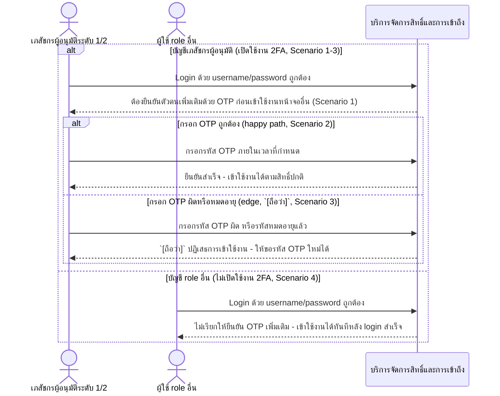

# Detailed Design (Conceptual) — ยืนยันตัวตนสองปัจจัย (2FA/OTP) เฉพาะเภสัชกรผู้อนุมัติระดับ 1/2 (FT-029)

> เอกสารนี้เป็น detailed design ระดับแนวคิด (conceptual) เท่านั้น **ยังไม่ผูกมัดกับ technology stack, protocol, หรือเทคนิคการ implement ใดๆ** — ตาม CLAUDE.md เฟสปัจจุบันของโปรเจกต์คือการทำเอกสาร ยังไม่เข้าสู่เฟสพัฒนา เอกสารนี้จะถูกทบทวนอีกครั้งเมื่อเข้าสู่เฟสพัฒนาจริง
>
> อ้างอิงจาก [backlog.md](../backlog.md), [Feature List](../02-feature-list.md), [User Journey](../03-user-journey/), [Acceptance Criteria](../04-test-design/acceptance-criteria.md), [High-Level Architecture](../05-architecture.md), [Data Model](../06-data-model.md), [API Spec](../07-api-spec.md) — ดูนโยบาย granularity/exception/state-diagram ที่ใช้ร่วมกันทุกไฟล์ใน [README.md](README.md)

**วันที่สร้าง/อัปเดตล่าสุด:** 20260825
**Feature:** FT-029 — ยืนยันตัวตนสองปัจจัย (2FA/OTP) เฉพาะเภสัชกรผู้อนุมัติระดับ 1/2
**Backlog item ที่เกี่ยวข้อง:** BL-038

## 1. ภาพรวม (Overview)

หลัง login ด้วย username/password สำเร็จ บัญชีเภสัชกรผู้อนุมัติระดับ 1 และระดับ 2 เท่านั้นที่ต้องยืนยันตัวตนเพิ่มเติมด้วย OTP ก่อนเข้าใช้งานได้เต็มรูปแบบ (เนื่องจากมีผลผูกพันทาง audit/กฎหมาย) ส่วน role อื่น (เจ้าหน้าที่ รพ.สต., ผู้บริหาร, ผู้ดูแลระบบ) ไม่บังคับขั้นตอนนี้ ตาม [pharmacist-journey.md](../03-user-journey/pharmacist-journey.md) step 2 (node A2) — ต่อยอดจากขั้นตอน login พื้นฐานที่ [access-log-retention.md](access-log-retention.md) §2.1 (FT-024) วาดไว้แล้ว และเกิดขึ้น**หลัง**ขั้นตอนบังคับเปลี่ยนรหัสผ่านครั้งแรก (ถ้ามี) ตามลำดับที่ [07-api-spec.md](../07-api-spec.md) §3.2 ระบุไว้ (login → เปลี่ยนรหัสผ่าน [ถ้าจำเป็น] → OTP [ถ้าจำเป็น] → เข้าใช้งานได้) — ดู [forced-password-change-session-timeout.md](forced-password-change-session-timeout.md) (FT-028) สำหรับขั้นตอนก่อนหน้านี้

ใช้ไดอะแกรมเดียวแบบ nested `alt`: ชั้นนอกแยกตามขอบเขต role (บัญชีเภสัชกรผู้อนุมัติ vs. role อื่น) ชั้นในแยกผลของการกรอก OTP (ถูก/ผิด)

## 2. Sequence Diagram(s)

### 2.1 BL-038 — บังคับ 2FA/OTP เฉพาะเภสัชกรผู้อนุมัติ

**อ้างอิง:** Acceptance Criteria BL-038 Scenario 1-4

## 3. Lifecycle / State Diagram

ไม่เกี่ยวข้อง — ฟิลด์ "เปิดใช้งานการยืนยันตัวตนสองปัจจัย" บน UserAccount เป็น Boolean เดี่ยว กำหนดตามบทบาทตอนสร้างบัญชี ไม่ใช่สถานะแบบ workflow

## 4. องค์ประกอบและ Operation ที่เกี่ยวข้อง (Cross-reference)

| องค์ประกอบ/Entity/Operation | มาจากเอกสาร | บทบาทใน Feature นี้ |
|---|---|---|
| บริการจัดการสิทธิ์และการเข้าถึง | 05-architecture.md §3 | บังคับยืนยันตัวตนสองปัจจัยเฉพาะบัญชีเภสัชกรผู้อนุมัติระดับ 1/2 |
| UserAccount (Two-Factor Authentication Enabled) | 06-data-model.md §3.2 | ฟิลด์บ่งชี้ว่าบัญชีนี้ต้องยืนยันตัวตนด้วย OTP หรือไม่ |
| ยืนยันตัวตนด้วย OTP (2FA); เข้าสู่ระบบ | 07-api-spec.md §3.2 | operation หลักของ Feature นี้ |

## 5. สิ่งที่ยังไม่ตัดสินใจ / Assumption ที่ต้องยืนยัน

- ~~`[รอยืนยัน]` จำนวนครั้งที่อนุญาตให้กรอก OTP ผิดและระยะเวลาหมดอายุของรหัส OTP~~ — **ยืนยันแล้ว 20260825:** ไม่เกิน 3 ครั้งก่อนล็อกชั่วคราว, หมดอายุ 5 นาที, หลังล็อกอนุญาตขอ OTP ใหม่อัตโนมัติหลังผ่านไป 5 นาที — ดู [07-api-spec.md](../07-api-spec.md) §5
- ~~`[รอยืนยัน]` ช่องทางที่ใช้ส่งรหัส OTP ไปยังเภสัชกรผู้อนุมัติ~~ — **ยืนยันแล้ว 20260825:** อีเมลที่มีอยู่แล้วในระบบ (ช่องทางเดียวกับการแจ้งเตือนเดิม) — ดู [07-api-spec.md](../07-api-spec.md) §5

---

## บันทึกการอัปเดต (Changelog)

- **20260825:** สร้างไฟล์ครั้งแรก — 1 ไดอะแกรม nested `alt` (ชั้นนอก: ขอบเขต role เภสัชกรผู้อนุมัติ vs. role อื่น; ชั้นใน: OTP ถูก/ผิด) ครอบคลุมทั้ง 4 scenario ของ BL-038 — cross-reference [forced-password-change-session-timeout.md](forced-password-change-session-timeout.md) (FT-028) และ [access-log-retention.md](access-log-retention.md) (FT-024) สำหรับลำดับขั้นตอนก่อนหน้า โดยไม่แก้ไขไฟล์เหล่านั้น
