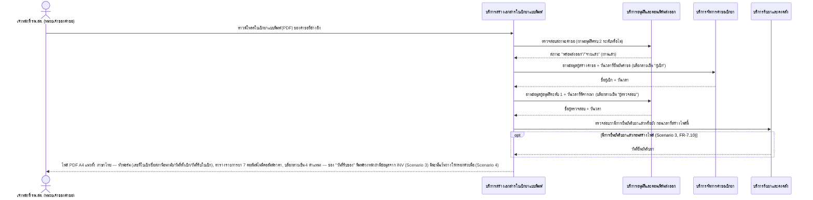
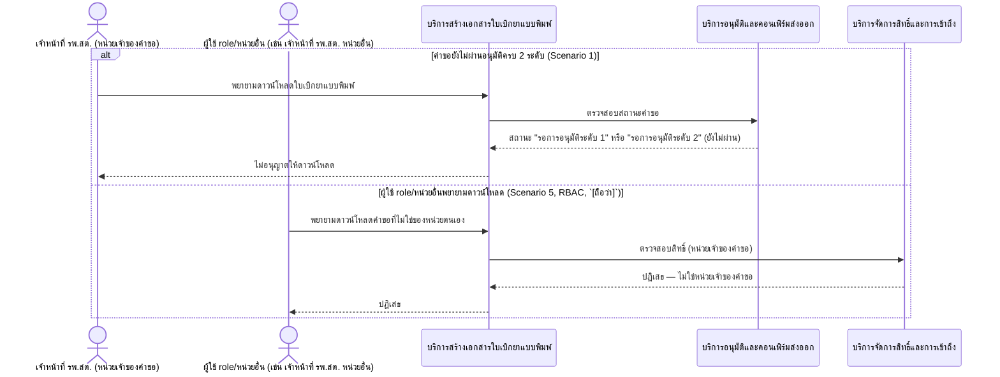
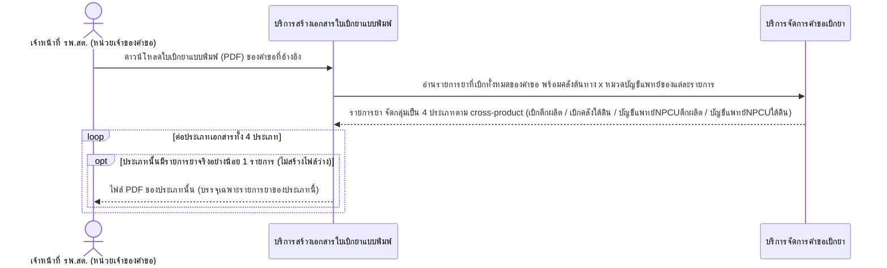
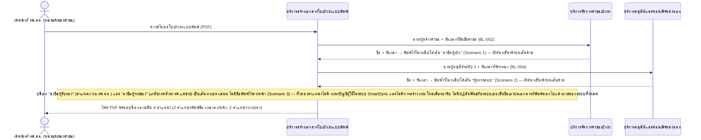

# Detailed Design (Conceptual) — ดาวน์โหลดใบเบิกยาแบบพิมพ์เพื่อเซ็นชื่อ (FT-035)

> เอกสารนี้เป็น detailed design ระดับแนวคิด (conceptual) เท่านั้น **ยังไม่ผูกมัดกับ technology stack, protocol, หรือเทคนิคการ implement ใดๆ** — ตาม CLAUDE.md เฟสปัจจุบันของโปรเจกต์คือการทำเอกสาร ยังไม่เข้าสู่เฟสพัฒนา เอกสารนี้จะถูกทบทวนอีกครั้งเมื่อเข้าสู่เฟสพัฒนาจริง
>
> อ้างอิงจาก [backlog.md](../backlog.md), [Feature List](../02-feature-list.md), [User Journey](../03-user-journey/), [Acceptance Criteria](../04-test-design/acceptance-criteria.md), [High-Level Architecture](../05-architecture.md), [Data Model](../06-data-model.md), [API Spec](../07-api-spec.md) — ดูนโยบาย granularity/exception/state-diagram ที่ใช้ร่วมกันทุกไฟล์ใน [README.md](README.md)

**วันที่สร้าง/อัปเดตล่าสุด:** 20260831
**Feature:** FT-035 — ดาวน์โหลดใบเบิกยาแบบพิมพ์เพื่อเซ็นชื่อ (Printable Signed Requisition Form)
**Backlog item ที่เกี่ยวข้อง:** BL-044, BL-045, BL-046

## 1. ภาพรวม (Overview)

เมื่อคำขอเบิกผ่านอนุมัติครบ 2 ระดับแล้ว (เงื่อนไขจังหวะเดียวกับการดาวน์โหลดไฟล์ Excel นำเข้า INVC ใน [confirm-export-and-download.md](confirm-export-and-download.md) FT-017/BL-020b) เจ้าหน้าที่ รพ.สต. เจ้าของคำขอดาวน์โหลด**ใบเบิกยาและเวชภัณฑ์แบบพิมพ์**ในรูปแบบไฟล์ PDF ได้อีกช่องทางหนึ่ง เพื่อนำไปเซ็นชื่อจริงและส่งต่อเป็นหลักฐานยืนยันการเบิก-จ่ายกับหน่วยงานอื่น (BL-044) — **เป็นคนละไฟล์และคนละวัตถุประสงค์โดยสิ้นเชิงจากไฟล์ Excel นำเข้า INVC** ตาม [staff-hph-journey.md](../03-user-journey/staff-hph-journey.md) step 9 ระบบแยกไฟล์ PDF ตามคลังต้นทาง (ตึกผลิต/คลังใต้ดิน) คูณหมวดยา (ปกติ/บัญชีแพทย์) แบบ cross-product เต็มรูปแบบ สูงสุด 4 ไฟล์ต่อคำขอ สร้างเฉพาะไฟล์ที่มีรายการยาจริง (BL-045) และแต่ละไฟล์มีบล็อกลายเซ็น 4 ตำแหน่ง โดย "ผู้เบิก"/"ผู้ตรวจสอบ" พิมพ์ชื่อ+วันเวลาไว้ล่วงหน้า (ดึงจากข้อมูลที่มีอยู่แล้วของ [monthly-requisition-request.md](monthly-requisition-request.md) FT-001/BL-002 และ [two-level-requisition-approval.md](two-level-requisition-approval.md) FT-002/BL-004) ส่วน "ผู้รับรอง"/"ผู้จ่ายของ" เว้นเส้นว่างเปล่าเสมอ (BL-046)

**Feature นี้เป็น scenario ต่อ BL-ID ตามนโยบาย granularity กลาง** — 4 sequence diagram: 2.1/2.2 ครอบคลุม BL-044 (happy path รวม opt วันที่รับของ, และ error/RBAC), 2.3 ครอบคลุม BL-045 (ตรรกะแยกไฟล์ cross-product), 2.4 ครอบคลุม BL-046 (การประกอบบล็อกลายเซ็น 4 ตำแหน่ง)

**"ผู้รับรอง" (ผอ.รพ.สต.) และ "ผู้จ่ายของ" (เภสัชกรคลังยา รพ.แม่ข่าย) ไม่ปรากฏเป็น participant/actor ในไดอะแกรมใดเลยของไฟล์นี้** — ยืนยันแล้ว (spec 007, backlog.md BL-046) ว่าไม่มี role ในระบบ SmartSync ไม่มีปฏิสัมพันธ์กับระบบเลย เซ็นชื่อเองนอกระบบทั้งหมด — เมื่อจำเป็นต้องกล่าวถึงในไดอะแกรม 2.4 จะใช้ `Note` ประกอบเท่านั้น

## 2. Sequence Diagram(s)

### 2.1 BL-044 — ดาวน์โหลดสำเร็จหลังอนุมัติครบ 2 ระดับ (happy path)

**อ้างอิง:** Acceptance Criteria BL-044 Scenario 2-4

โครงสร้างการแยกไฟล์เป็นสูงสุด 4 ไฟล์ (คลังต้นทาง × หมวดยา) แสดงรายละเอียดแยกไว้ที่ไดอะแกรม 2.3 (BL-045) — ไดอะแกรมนี้แสดงเฉพาะขั้นตอนของไฟล์เดียว/คำขอเดียวเพื่อไม่ให้ปนกับตรรกะแยกไฟล์

### 2.2 BL-044 — ปฏิเสธการดาวน์โหลด (error / RBAC)

**อ้างอิง:** Acceptance Criteria BL-044 Scenario 1, Scenario 5

**`[ถือว่า]`** สิทธิ์ในสาขา "else" ข้างต้นใช้ค่าเริ่มต้นเดียวกับการดาวน์โหลดไฟล์ Excel (BL-020b) คือเฉพาะเจ้าหน้าที่ รพ.สต. เจ้าของคำขอเท่านั้น — FR-7.12 ยังมี Open Item รองที่ยังไม่ยืนยันว่าเภสัชกรผู้อนุมัติระดับ 1/2 หรือ role อื่นควรดาวน์โหลดได้ด้วยหรือไม่ (ดูหัวข้อ 5) — ไดอะแกรมนี้ครอบคลุมเฉพาะกรณีที่ชัดเจนอยู่แล้วว่าไม่ควรมีสิทธิ์ (หน่วยอื่น) เท่านั้น ไม่ได้สมมติคำตอบของ Open Item รอง

### 2.3 BL-045 — แยกไฟล์ตามคลังต้นทาง × หมวดยา (Cross-Product เต็มรูปแบบ)

**อ้างอิง:** Acceptance Criteria BL-045 Scenario 1-4

ไดอะแกรมนี้ครอบคลุมทั้ง 4 scenario ของ BL-045 ด้วยโครงสร้างเดียว: มี 2 คลัง ไม่มีบัญชีแพทย์ปน = ได้ 2 ไฟล์ (Scenario 1), คลังต้นทางเดียว = ได้ 1 ไฟล์ (Scenario 2), มีครบ 4 กลุ่ม = ได้ 4 ไฟล์ (Scenario 3), มีเพียง 2 ใน 4 กลุ่ม = ได้เฉพาะ 2 ไฟล์ที่มีรายการจริง (Scenario 4) — ตรรกะ "หมวดบัญชีแพทย์" ใช้ flag เดียวกับ [invc-file-format-compatibility.md](invc-file-format-compatibility.md) (FT-018/BL-034) บน DrugItem ([06-data-model.md](../06-data-model.md) §3.3)

### 2.4 BL-046 — การประกอบบล็อกลายเซ็น 4 ตำแหน่ง

**อ้างอิง:** Acceptance Criteria BL-046 Scenario 1-4

**ขอบเขตจบที่การสร้าง/ดาวน์โหลดไฟล์เท่านั้น (Scenario 4, FR-7.9)** — ระบบไม่มีสถานะ/ฟีเจอร์ใดๆ ที่ track ว่าไฟล์นี้ถูกเซ็นครบ 4 ตำแหน่งแล้วหรือยัง หรือถูกส่งต่อให้ "ผู้รับรอง"/"ผู้จ่ายของ" แล้วหรือไม่ — จึงไม่มีขั้นตอนถัดจาก `PRINTDOC-->>STAFF` ในไดอะแกรมใดของไฟล์นี้ที่เกี่ยวข้องกับการเซ็น/ส่งต่อ (ไม่มี operation "ยืนยันเซ็นครบ" หรือคล้ายกันใน [07-api-spec.md](../07-api-spec.md) §3.12)

## 3. Lifecycle / State Diagram

**ไม่มีสำหรับ Feature นี้ (ตามนโยบายในหัวข้อ "นโยบายรวม" ของ [README.md](README.md))** — PrintableRequisitionDocument ([06-data-model.md](../06-data-model.md) §3.19) **ไม่มีฟิลด์สถานะใดๆ ที่ track ได้** (ไม่มี "ดาวน์โหลดแล้วหรือไม่", ไม่มีสถานะการเซ็น) ต่างจาก ExportFile ที่มี download-gate state diagram เป็นของตัวเอง ([confirm-export-and-download.md](confirm-export-and-download.md) §3) — เงื่อนไขจังหวะที่ทำให้ดาวน์โหลดได้ (คำขอต้องผ่านอนุมัติครบ 2 ระดับ) เป็นสถานะของ **Requisition** ซึ่ง Feature นี้เป็นเพียงผู้ใช้/อ่านสถานะนั้น ไม่ใช่เจ้าของ — state diagram เต็มของสถานะคำขอเบิกยาอยู่ที่ [two-level-requisition-approval.md](two-level-requisition-approval.md) (FT-002) §3 อยู่แล้ว ไม่วาดซ้ำในไฟล์นี้

## 4. องค์ประกอบและ Operation ที่เกี่ยวข้อง (Cross-reference)

| องค์ประกอบ/Entity/Operation | มาจากเอกสาร | บทบาทใน Feature นี้ |
|---|---|---|
| บริการสร้างเอกสารใบเบิกยาแบบพิมพ์ | 05-architecture.md §3 (เพิ่ม 20260831) | เจ้าของ Feature นี้ — สร้าง/ประกอบไฟล์ PDF จากข้อมูลที่มีอยู่แล้วในระบบ ควบคุมสิทธิ์การดาวน์โหลด |
| บริการอนุมัติและคอนเฟิร์มส่งออก | 05-architecture.md §3 | ตรวจสอบสถานะคำขอ (gate เงื่อนไข), ให้ข้อมูลผู้อนุมัติระดับ 1 + เวลา |
| บริการจัดการคำขอเบิกยา | 05-architecture.md §3 | ให้ข้อมูลผู้เบิก + เวลายืนยันคำขอ, ให้รายการยาพร้อมคลังต้นทาง/หมวดยา |
| บริการรับยาและคงคลัง | 05-architecture.md §3 | ให้ข้อมูลวันที่ยืนยันรับยา (ถ้ามี) สำหรับช่อง "วันที่รับของ" |
| บริการจัดการสิทธิ์และการเข้าถึง | 05-architecture.md §3 | ตรวจสอบสิทธิ์การดาวน์โหลด (RBAC — หน่วยเจ้าของคำขอ) |
| PrintableRequisitionDocument | 06-data-model.md §3.19 | entity หลักของ Feature นี้ — สูงสุด 4 ระเบียนต่อคำขอ ไม่มีฟิลด์ track สถานะเซ็น/ส่งต่อ |
| Requisition, RequisitionLineItem, DrugItem, ApprovalRecord, GoodsReceiptRecord | 06-data-model.md §3.3–3.10 | entity ที่ฟิลด์ถูก "ฉาย" มาประกอบไฟล์ PDF (ไม่ได้จัดเก็บซ้ำใน entity ใหม่) |
| ดาวน์โหลดใบเบิกยาแบบพิมพ์ (PDF) (§3.12) | 07-api-spec.md | operation หลักเพียงหนึ่งเดียวของ Feature นี้ — ทุกไดอะแกรมข้างต้นเป็นรายละเอียดภายในของ operation นี้ |

## 5. สิ่งที่ยังไม่ตัดสินใจ / Assumption ที่ต้องยืนยัน

- **`[รอยืนยัน]` (Open Item รอง, FR-7.12):** สิทธิ์การดาวน์โหลดไฟล์ PDF นี้ครบทุก role หรือไม่ — ปัจจุบัน `[ถือว่า]` อย่างน้อยเจ้าหน้าที่ รพ.สต. เจ้าของคำขอ (เหมือน BL-020b) ยังไม่ยืนยันว่าเภสัชกรผู้อนุมัติระดับ 1/2 ควรดาวน์โหลดได้ด้วยหรือไม่ — ไดอะแกรม 2.2 ครอบคลุมเฉพาะกรณีที่ชัดเจนแล้ว (หน่วยอื่น) เท่านั้น
- **`[ถือว่า]` (รายละเอียด implementation, ไม่กระทบไดอะแกรม):** ชื่อไฟล์ PDF (naming convention) ยังไม่ได้ระบุมาอย่างเป็นทางการ — spec 007 ใช้ค่าเริ่มต้นชั่วคราวเป็นตัวอย่างเท่านั้น ไม่ปรากฏในไดอะแกรมของไฟล์นี้เนื่องจากเป็นรายละเอียดระดับ implementation ไม่ใช่ลำดับการโต้ตอบ

---

## บันทึกการอัปเดต (Changelog)

- **20260831:** สร้างไฟล์ครั้งแรกสำหรับ FT-035 (ใหม่จาก spec 007/BL-044/BL-045/BL-046) — granularity ตามนโยบายเดิม (1 ไดอะแกรมต่อ BL-ID เป็นค่าเริ่มต้น): BL-044 แยกเป็น 2 ไดอะแกรม (happy path รวม `opt` วันที่รับของ / error+RBAC รวม `alt` 2 branch), BL-045 เป็น 1 ไดอะแกรมครอบคลุมทั้ง 4 scenario ด้วย `loop`+`opt`, BL-046 เป็น 1 ไดอะแกรมแสดงการประกอบบล็อกลายเซ็นพร้อม `Note` สำหรับ "ผู้รับรอง"/"ผู้จ่ายของ" (ไม่ใช่ participant ตามที่ยืนยันแล้วว่าไม่มี role ในระบบ) — ไม่มี state diagram (หัวข้อ 3) เนื่องจาก PrintableRequisitionDocument ไม่มีฟิลด์สถานะที่ track ได้ (FR-7.9) — participant ทั้งหมดใช้ชื่อองค์ประกอบเชิงตรรกะตรงตัวจาก [05-architecture.md](../05-architecture.md) §3 รวมถึงองค์ประกอบใหม่ "บริการสร้างเอกสารใบเบิกยาแบบพิมพ์" ที่เพิ่มโดย `/build-architecture` ในรอบเดียวกัน — ไม่มีจุดใดต้องถาม AskUserQuestion เนื่องจากทุกจุดกำกวมที่อาจเกิดขึ้น (granularity, การแทน participant, การไม่มี state diagram) มีบรรทัดฐานชัดเจนจากนโยบายรวมและไฟล์ FT-001–034 ที่มีอยู่แล้วทั้งหมด — คงเครื่องหมาย `[รอยืนยัน]`/`[ถือว่า]` ของ Open Item รอง (FR-7.12 สิทธิ์ role อื่น, ชื่อไฟล์) ไว้ตรงจุดเดิมโดยไม่สมมติคำตอบขึ้นเอง
