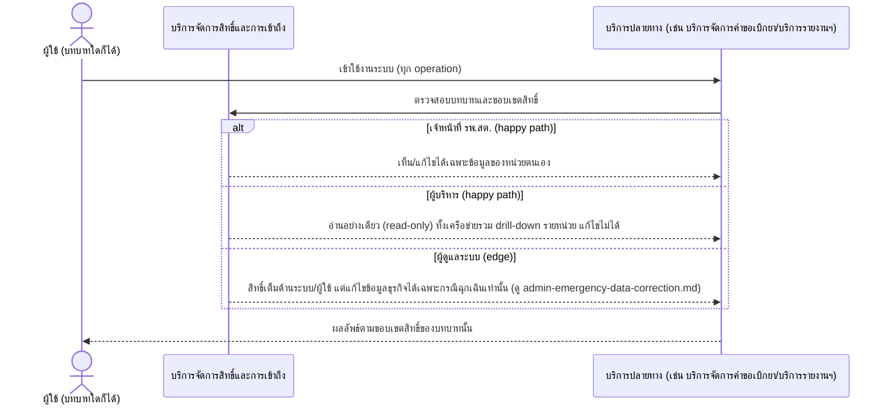
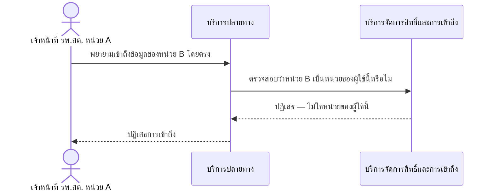

# Detailed Design (Conceptual) — กำหนดสิทธิ์การเข้าถึงตาม Role (RBAC) (FT-020)

> เอกสารนี้เป็น detailed design ระดับแนวคิด (conceptual) เท่านั้น **ยังไม่ผูกมัดกับ technology stack, protocol, หรือเทคนิคการ implement ใดๆ** — ตาม CLAUDE.md เฟสปัจจุบันของโปรเจกต์คือการทำเอกสาร ยังไม่เข้าสู่เฟสพัฒนา เอกสารนี้จะถูกทบทวนอีกครั้งเมื่อเข้าสู่เฟสพัฒนาจริง
>
> อ้างอิงจาก [backlog.md](../backlog.md), [Feature List](../02-feature-list.md), [User Journey](../03-user-journey/), [Acceptance Criteria](../04-test-design/acceptance-criteria.md), [High-Level Architecture](../05-architecture.md), [Data Model](../06-data-model.md), [API Spec](../07-api-spec.md) — ดูนโยบาย granularity/exception/state-diagram ที่ใช้ร่วมกันทุกไฟล์ใน [README.md](README.md)

**วันที่สร้าง/อัปเดตล่าสุด:** 20260823
**Feature:** FT-020 — กำหนดสิทธิ์การเข้าถึงตาม Role (RBAC)
**Backlog item ที่เกี่ยวข้อง:** BL-024

## 1. ภาพรวม (Overview)

รากฐานของ [monthly-requisition-request.md](monthly-requisition-request.md) (BL-002), [two-level-requisition-approval.md](two-level-requisition-approval.md) (BL-004), [network-inventory-dashboard-drilldown.md](network-inventory-dashboard-drilldown.md) (BL-017) ตาม [admin-journey.md](../03-user-journey/admin-journey.md) step 2 — BL-024 มี 4 AC scenario ครอบคลุม 3 บทบาท (เจ้าหน้าที่ รพ.สต., ผู้บริหาร, Admin) บวก 1 error scenario เจาะจงเรื่องการเข้าถึงข้ามหน่วยโดยตรง กลไกตรวจสอบสิทธิ์ (IAM ตรวจ role+scope ก่อนทุก operation) เป็นแบบเดียวกันทุกบทบาท จึงแสดงเป็น 1 ไดอะแกรมภาพรวมพร้อม `alt` ต่อบทบาท (2.1) และแยกไดอะแกรมต่างหากสำหรับ error scenario ที่มีลักษณะเป็น "ความพยายามเจาะข้อมูล" ต่างจาก 3 scenario แรกอย่างมีนัยสำคัญ (2.2)

## 2. Sequence Diagram(s)

### 2.1 บังคับขอบเขตสิทธิ์ตาม Role (ภาพรวม 3 บทบาท)

**อ้างอิง:** Acceptance Criteria BL-024 Scenario 1-3

### 2.2 พยายามเข้าถึงข้อมูลหน่วยอื่นโดยตรง (error)

**อ้างอิง:** Acceptance Criteria BL-024 Scenario 4

## 3. Lifecycle / State Diagram

ไม่เกี่ยวข้อง — บัญชีผู้ใช้และสิทธิ์ (User & Role) ไม่มีสถานะหลายขั้นแบบ workflow (มีเฉพาะสถานะการใช้งาน Active/Inactive ซึ่งเป็น boolean ไม่ใช่ลำดับขั้น)

## 4. องค์ประกอบและ Operation ที่เกี่ยวข้อง (Cross-reference)

| องค์ประกอบ/Entity/Operation | มาจากเอกสาร | บทบาทใน Feature นี้ |
|---|---|---|
| บริการจัดการสิทธิ์และการเข้าถึง | 05-architecture.md §3 | กำหนด/ตรวจสอบสิทธิ์ตาม Role ทุกจุดที่มีการเข้าถึง/แก้ไขข้อมูล |
| UserAccount | 06-data-model.md §3.2 | เก็บบทบาทและหน่วยงานที่สังกัด |
| เพิ่ม/แก้ไข/กำหนดสิทธิ์บัญชีผู้ใช้ (RBAC) | 07-api-spec.md §3.1/§2 | operation ที่ Admin ใช้กำหนดสิทธิ์ |

## 5. สิ่งที่ยังไม่ตัดสินใจ / Assumption ที่ต้องยืนยัน

- ไม่มี open item ใหม่ — AC ของ BL-024 resolved ครบ

---

## บันทึกการอัปเดต (Changelog)

- **20260823:** สร้างไฟล์ครั้งแรก — 2 ไดอะแกรม: ภาพรวมกลไกตรวจสอบสิทธิ์ 3 บทบาทแบบ `alt` เดียว (เนื่องจากเป็นกลไกเดียวกัน ไม่ใช่ workflow ต่างกัน) + แยกไดอะแกรมต่างหากสำหรับความพยายามเข้าถึงข้ามหน่วยโดยตรง
