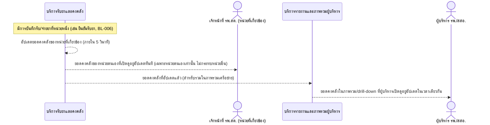

# Detailed Design (Conceptual) — แสดงยอดคงคลังแบบ Real-time (FT-004)

> เอกสารนี้เป็น detailed design ระดับแนวคิด (conceptual) เท่านั้น **ยังไม่ผูกมัดกับ technology stack, protocol, หรือเทคนิคการ implement ใดๆ** — ตาม CLAUDE.md เฟสปัจจุบันของโปรเจกต์คือการทำเอกสาร ยังไม่เข้าสู่เฟสพัฒนา เอกสารนี้จะถูกทบทวนอีกครั้งเมื่อเข้าสู่เฟสพัฒนาจริง
>
> อ้างอิงจาก [backlog.md](../backlog.md), [Feature List](../02-feature-list.md), [User Journey](../03-user-journey/), [Acceptance Criteria](../04-test-design/acceptance-criteria.md), [High-Level Architecture](../05-architecture.md), [Data Model](../06-data-model.md), [API Spec](../07-api-spec.md) — ดูนโยบาย granularity/exception/state-diagram ที่ใช้ร่วมกันทุกไฟล์ใน [README.md](README.md)

**วันที่สร้าง/อัปเดตล่าสุด:** 20260823
**Feature:** FT-004 — แสดงยอดคงคลังแบบ Real-time
**Backlog item ที่เกี่ยวข้อง:** BL-007

## 1. ภาพรวม (Overview)

ทุก Role เห็นยอดคงคลังของหน่วยที่เกี่ยวข้องอัปเดตภายใน 5 วินาทีหลังมีการบันทึกรับ/จ่ายยา (NFR Performance) เพื่อวางแผนเบิก-จ่ายได้แม่นยำ — 1 BL-ID มี 3 AC scenario ที่จริงๆ คือมุมมอง "ผู้สังเกตการณ์" 2 กลุ่มของเหตุการณ์เดียวกัน (จนท. รพ.สต. เห็นยอดหน่วยตนเอง, ผู้บริหารเห็นผ่าน Dashboard) จึงแสดงเป็น 1 ไดอะแกรมที่มีทั้งสองเส้นทางกระจายผล ไม่ใช่ 2 ไดอะแกรมแยก (ไม่ใช่ branch ทางเลือก แต่เป็นผู้สังเกตการณ์คู่ขนาน)

## 2. Sequence Diagram(s)

### 2.1 BL-007 — อัปเดตยอดคงคลังภายใน 5 วินาที

**อ้างอิง:** Acceptance Criteria BL-007 Scenario 1-3

หมายเหตุ: ขนาดผู้ใช้งานพร้อมกันคาดว่าไม่เกินหลักสิบราย (29 รพ.สต. + รพ.แม่ข่าย) ตาม NFR Performance ใน [05-architecture.md](../05-architecture.md) §7 — Scenario 2 ของ AC (เฉพาะหน่วยที่เกี่ยวข้องเท่านั้นที่อัปเดต) แสดงด้วยข้อความ "เฉพาะหน่วยตนเองเท่านั้น" ในลูกศรด้านบน ไม่แยกเป็น branch เพิ่มเติม

## 3. Lifecycle / State Diagram

ไม่เกี่ยวข้อง — ยอดคงคลัง (Inventory Balance) เป็น snapshot ตัวเลข ไม่มีสถานะ (status) หลายขั้น

## 4. องค์ประกอบและ Operation ที่เกี่ยวข้อง (Cross-reference)

| องค์ประกอบ/Entity/Operation | มาจากเอกสาร | บทบาทใน Feature นี้ |
|---|---|---|
| บริการรับยาและคงคลัง | 05-architecture.md §3 | คำนวณ/แสดงยอดคงคลังแบบใกล้เคียงเรียลไทม์ |
| บริการรายงานและภาพรวมผู้บริหาร | 05-architecture.md §3 | รวบรวมยอดคงคลังของทุกหน่วยสำหรับผู้บริหาร |
| InventoryBalance | 06-data-model.md §3.11 | มีฟิลด์ "วันที่-เวลาที่ปรับปรุงล่าสุด" ต้องอัปเดตภายใน 5 วินาที |
| ดูยอดคงคลังของหน่วยตนเอง | 07-api-spec.md §3.5 | operation ของเจ้าหน้าที่ รพ.สต. |
| ดูภาพรวมคงคลังทั้งเครือข่าย | 07-api-spec.md §3.8 | operation ของผู้บริหาร |

## 5. สิ่งที่ยังไม่ตัดสินใจ / Assumption ที่ต้องยืนยัน

- ไม่มี open item ใหม่ — เกณฑ์ 5 วินาที resolved แล้วใน spec 006

---

## บันทึกการอัปเดต (Changelog)

- **20260823:** สร้างไฟล์ครั้งแรก — 1 ไดอะแกรมแสดงการกระจายผลไปยังผู้สังเกตการณ์ 2 กลุ่ม (จนท. รพ.สต., ผู้บริหาร) แทนการแยกไดอะแกรมเนื่องจากเป็นเหตุการณ์เดียวกัน ไม่ใช่ branch ทางเลือก
