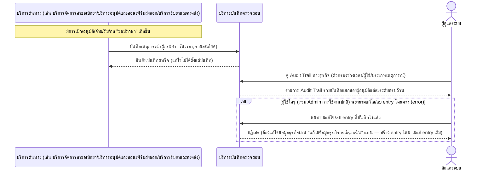

# Detailed Design (Conceptual) — Audit Trail การเบิก-จ่าย-อนุมัติ-รับ-ขอปรึกษา (FT-005)

> เอกสารนี้เป็น detailed design ระดับแนวคิด (conceptual) เท่านั้น **ยังไม่ผูกมัดกับ technology stack, protocol, หรือเทคนิคการ implement ใดๆ** — ตาม CLAUDE.md เฟสปัจจุบันของโปรเจกต์คือการทำเอกสาร ยังไม่เข้าสู่เฟสพัฒนา เอกสารนี้จะถูกทบทวนอีกครั้งเมื่อเข้าสู่เฟสพัฒนาจริง
>
> อ้างอิงจาก [backlog.md](../backlog.md), [Feature List](../02-feature-list.md), [User Journey](../03-user-journey/), [Acceptance Criteria](../04-test-design/acceptance-criteria.md), [High-Level Architecture](../05-architecture.md), [Data Model](../06-data-model.md), [API Spec](../07-api-spec.md) — ดูนโยบาย granularity/exception/state-diagram ที่ใช้ร่วมกันทุกไฟล์ใน [README.md](README.md)

**วันที่สร้าง/อัปเดตล่าสุด:** 20260823
**Feature:** FT-005 — Audit Trail การเบิก-จ่าย-อนุมัติ-รับ-ขอปรึกษา
**Backlog item ที่เกี่ยวข้อง:** BL-008

## 1. ภาพรวม (Overview)

ทุกเหตุการณ์ทางธุรกิจ (เบิก/อนุมัติ/จ่าย/รับ/ขอปรึกษา/แก้ไขฉุกเฉิน) ถูกบันทึกผู้กระทำ วันเวลา และรายละเอียดลง audit log ที่แก้ไขไม่ได้ — Feature นี้เป็นบริการที่ถูก "trigger" จาก Feature อื่นเสมอ (FT-001/002/003/006/021) ไม่ใช่ operation ที่ผู้ใช้เรียกสร้าง entry เองโดยตรง (มีเฉพาะ operation "ดู" สำหรับผู้ดูแลระบบ) จึงมี 1 ไดอะแกรมแสดงรูปแบบการ trigger ทั่วไป พร้อม `alt` แสดงกรณีพยายามแก้ไข/ลบ entry โดยตรง (ต้องถูกปฏิเสธ)

## 2. Sequence Diagram(s)

### 2.1 BL-008 — บันทึกเหตุการณ์ทางธุรกิจลง Audit Trail

**อ้างอิง:** Acceptance Criteria BL-008 Scenario 1-3

Feature "แก้ไขข้อมูลธุรกิจกรณีฉุกเฉิน" ([admin-emergency-data-correction.md](admin-emergency-data-correction.md), FT-021) เป็นทางเดียวที่ Admin แก้ไขข้อมูลธุรกิจได้ โดยยังต้องสร้าง Audit Trail entry คู่กันเสมอ (ดู [06-data-model.md](../06-data-model.md) §4 ความสัมพันธ์ EmergencyDataEditRecord ↔ AuditTrail)

## 3. Lifecycle / State Diagram

ไม่เกี่ยวข้อง — Audit Trail entry ไม่มีสถานะหลายขั้น (เขียนครั้งเดียว แก้ไขไม่ได้)

## 4. องค์ประกอบและ Operation ที่เกี่ยวข้อง (Cross-reference)

| องค์ประกอบ/Entity/Operation | มาจากเอกสาร | บทบาทใน Feature นี้ |
|---|---|---|
| บริการบันทึกตรวจสอบ | 05-architecture.md §3 | รับ/จัดเก็บเหตุการณ์ทางธุรกิจจากทุกบริการ |
| AuditTrail | 06-data-model.md §3.14 | entity หลักของ Feature นี้ |
| ดู Audit Trail ทางธุรกิจ | 07-api-spec.md §3.10 | operation เดียวที่ผู้ใช้ (Admin) เรียกตรง |

## 5. สิ่งที่ยังไม่ตัดสินใจ / Assumption ที่ต้องยืนยัน

- ไม่มี open item ใหม่ — AC ของ BL-008 resolved ครบทั้ง 3 scenario

---

## บันทึกการอัปเดต (Changelog)

- **20260823:** สร้างไฟล์ครั้งแรก — 1 ไดอะแกรมแสดงรูปแบบการ trigger ทั่วไปจากบริการอื่น พร้อม inline `alt` กรณีพยายามแก้ไข/ลบ entry โดยตรง
