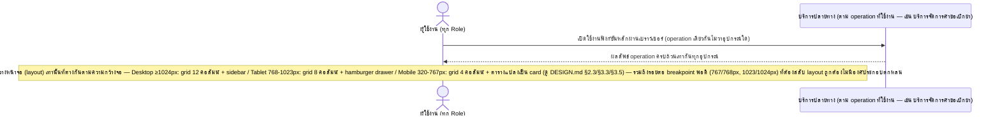

# Detailed Design (Conceptual) — ออกแบบ UI แบบ Responsive เต็มรูปแบบ รองรับทุกอุปกรณ์ (FT-022)

> เอกสารนี้เป็น detailed design ระดับแนวคิด (conceptual) เท่านั้น **ยังไม่ผูกมัดกับ technology stack, protocol, หรือเทคนิคการ implement ใดๆ** — ตาม CLAUDE.md เฟสปัจจุบันของโปรเจกต์คือการทำเอกสาร ยังไม่เข้าสู่เฟสพัฒนา เอกสารนี้จะถูกทบทวนอีกครั้งเมื่อเข้าสู่เฟสพัฒนาจริง
>
> อ้างอิงจาก [backlog.md](../backlog.md), [Feature List](../02-feature-list.md), [User Journey](../03-user-journey/), [Acceptance Criteria](../04-test-design/acceptance-criteria.md), [High-Level Architecture](../05-architecture.md), [Data Model](../06-data-model.md), [API Spec](../07-api-spec.md) — ดูนโยบาย granularity/exception/state-diagram ที่ใช้ร่วมกันทุกไฟล์ใน [README.md](README.md)

**วันที่สร้าง/อัปเดตล่าสุด:** 20260823
**Feature:** FT-022 — ออกแบบ UI แบบ Responsive เต็มรูปแบบ รองรับทุกอุปกรณ์
**Backlog item ที่เกี่ยวข้อง:** BL-026

## 1. ภาพรวม (Overview)

**หมายเหตุสำคัญเรื่องความเหมาะสมของ sequence diagram กับ Feature นี้:** BL-026 เป็น NFR ด้าน Usability ล้วนๆ (breakpoint การจัดวางหน้าจอ: mobile 320-767px / tablet 768-1023px / desktop 1024px+) — **ไม่มีความแตกต่างของลำดับการโต้ตอบระหว่าง role/องค์ประกอบ/ระบบภายนอกตาม breakpoint** operation ที่เรียกใช้ (สร้างคำขอ, อนุมัติ, ดู Dashboard ฯลฯ) เหมือนกันทุกประการไม่ว่าจะเปิดจากอุปกรณ์ขนาดใด มีเพียงการจัดวางหน้าจอ (layout/grid/navigation) ที่ต่างกัน ซึ่งเป็นเรื่องของ [DESIGN.md](../../DESIGN.md) (การนำเสนอ) ไม่ใช่ interaction design เชิงแนวคิดที่ไฟล์นี้ควรกำหนด

ด้วยเหตุนี้ ไฟล์นี้จึงแสดง**ไดอะแกรมเดียว**ที่ครอบคลุมทั้ง 3 breakpoint (ไม่แยกเป็น 3 ไดอะแกรมซ้ำกันที่มีแค่ note ต่างกัน) — เป็นข้อยกเว้นที่ตั้งใจจากนโยบาย "3+ branch แยกไดอะแกรม" ของ README.md เนื่องจากความแตกต่างเป็นเชิงการนำเสนอ (presentation) ไม่ใช่เชิงลำดับการโต้ตอบ (interaction order) — ดูเหตุผลเต็มในหัวข้อ 5

## 2. Sequence Diagram(s)

### 2.1 BL-026 — เข้าใช้งานฟังก์ชันหลักผ่านอุปกรณ์ต่างขนาด (interaction เดียวกันทุก breakpoint)

**อ้างอิง:** Acceptance Criteria BL-026 Scenario 1-4

## 3. Lifecycle / State Diagram

ไม่เกี่ยวข้อง

## 4. องค์ประกอบและ Operation ที่เกี่ยวข้อง (Cross-reference)

| องค์ประกอบ/Entity/Operation | มาจากเอกสาร | บทบาทใน Feature นี้ |
|---|---|---|
| (ทุกองค์ประกอบเชิงตรรกะ) | 05-architecture.md §3/§7 | ทุก operation ของทุกบริการต้องใช้งานได้เท่ากันทุกอุปกรณ์ |
| — | [DESIGN.md](../../DESIGN.md) §2.3, §3.3, §3.5 | รายละเอียด grid/breakpoint/component ที่เป็นรูปธรรม (การนำเสนอ ไม่ใช่ conceptual interaction) |

## 5. สิ่งที่ยังไม่ตัดสินใจ / Assumption ที่ต้องยืนยัน

- ไม่มี — แนวทาง hybrid (1 ไดอะแกรมตัวแทนครอบคลุมทั้ง 3 breakpoint แทนการแยก 3 ไดอะแกรม) ได้รับการยืนยันจากเจ้าของข้อกำหนดแล้วเมื่อ 20260823 ผ่าน `AskUserQuestion` (ดู Changelog)

---

## บันทึกการอัปเดต (Changelog)

- **20260823:** สร้างไฟล์ครั้งแรก — 1 ไดอะแกรมครอบคลุมทั้ง 3 breakpoint (ไม่แยกไดอะแกรมซ้ำ) พร้อมอธิบายเหตุผลของการเบี่ยงเบนจากนโยบาย "3+ branch แยกไดอะแกรม" ไว้ชัดเจนในหัวข้อ 1 และ 5 — เป็นการตัดสินใจของผู้เขียนเองในตอนนั้น ยังไม่ได้ยืนยันจากผู้ใช้
- **20260823 (ยืนยัน):** ถามผู้ใช้ยืนยันรูปแบบการนำเสนอ FT-022 ผ่าน `AskUserQuestion` โดยเสนอ 3 ทางเลือก (คงแนวทาง hybrid ปัจจุบัน / เปลี่ยนเป็น checklist-constraint แทน sequence diagram / แยก 3 ไดอะแกรมต่อ breakpoint) — ผู้ใช้ตอบ **คงแนวทาง hybrid ปัจจุบัน** ไม่มีการแก้ไขเนื้อหาไดอะแกรม เปลี่ยนเฉพาะสถานะจาก "ตัดสินใจเอง รอยืนยัน" เป็น "ยืนยันแล้ว" ในหัวข้อ 5
