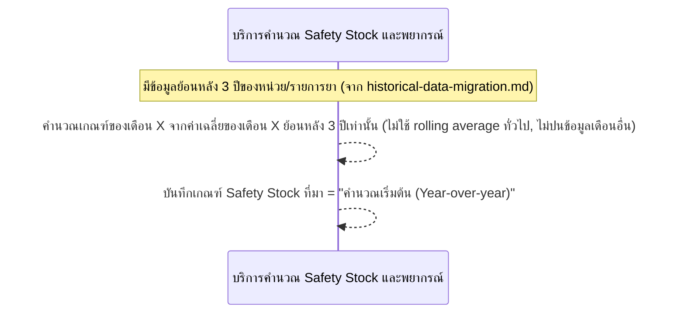
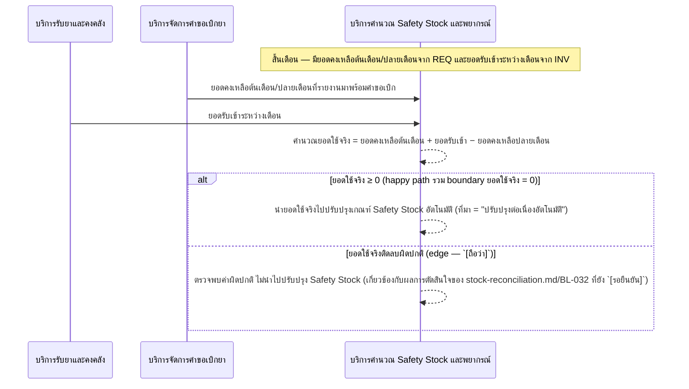

# Detailed Design (Conceptual) — คำนวณและปรับปรุงเกณฑ์ Safety Stock (เริ่มต้น + ต่อเนื่อง) (FT-010)

> เอกสารนี้เป็น detailed design ระดับแนวคิด (conceptual) เท่านั้น **ยังไม่ผูกมัดกับ technology stack, protocol, หรือเทคนิคการ implement ใดๆ** — ตาม CLAUDE.md เฟสปัจจุบันของโปรเจกต์คือการทำเอกสาร ยังไม่เข้าสู่เฟสพัฒนา เอกสารนี้จะถูกทบทวนอีกครั้งเมื่อเข้าสู่เฟสพัฒนาจริง
>
> อ้างอิงจาก [backlog.md](../backlog.md), [Feature List](../02-feature-list.md), [User Journey](../03-user-journey/), [Acceptance Criteria](../04-test-design/acceptance-criteria.md), [High-Level Architecture](../05-architecture.md), [Data Model](../06-data-model.md), [API Spec](../07-api-spec.md) — ดูนโยบาย granularity/exception/state-diagram ที่ใช้ร่วมกันทุกไฟล์ใน [README.md](README.md)

**วันที่สร้าง/อัปเดตล่าสุด:** 20260823
**Feature:** FT-010 — คำนวณและปรับปรุงเกณฑ์ Safety Stock (เริ่มต้น + ต่อเนื่อง)
**Backlog item ที่เกี่ยวข้อง:** BL-011, BL-012

## 1. ภาพรวม (Overview)

คำนวณเกณฑ์ Safety Stock เริ่มต้นแบบเทียบช่วงเดือนเดียวกันของแต่ละปี (year-over-year, BL-011) แล้วปรับปรุงต่อเนื่องทุกเดือนโดยอัตโนมัติจากยอดใช้จริงหลังเริ่มใช้งานระบบจริง (BL-012) — เป็น input หลักของ [monthly-requisition-request.md](monthly-requisition-request.md) (FT-001, BL-001) 2 ไดอะแกรมต่อ BL-ID ตามนโยบายมาตรฐาน

## 2. Sequence Diagram(s)

### 2.1 BL-011 — คำนวณเกณฑ์เริ่มต้นแบบ Year-over-year

**อ้างอิง:** Acceptance Criteria BL-011 Scenario 1-3

หมายเหตุ: Scenario 3 (ข้อมูลพอดีขั้นต่ำ 3 ปี) เป็นกรณี boundary ที่ยืนยันแล้วว่าไม่ปฏิเสธ ไม่แสดงเป็น branch แยกเนื่องจากผลลัพธ์เหมือน happy path ทุกประการ

### 2.2 BL-012 — ปรับปรุง Safety Stock ต่อเนื่องอัตโนมัติ

**อ้างอิง:** Acceptance Criteria BL-012 Scenario 1-3

## 3. Lifecycle / State Diagram

ไม่เกี่ยวข้อง — SafetyStockThreshold เป็นค่าตัวเลขที่มี "ที่มา" เป็น enum คงที่ (ไม่ใช่สถานะที่เปลี่ยนแปลงเป็นลำดับขั้น)

## 4. องค์ประกอบและ Operation ที่เกี่ยวข้อง (Cross-reference)

| องค์ประกอบ/Entity/Operation | มาจากเอกสาร | บทบาทใน Feature นี้ |
|---|---|---|
| บริการคำนวณ Safety Stock และพยากรณ์ | 05-architecture.md §3 | คำนวณเกณฑ์เริ่มต้น + ปรับปรุงต่อเนื่อง |
| SafetyStockThreshold, HistoricalUsageRecord | 06-data-model.md §3.8/3.9 | เกณฑ์ที่คำนวณได้ + ฐานข้อมูลย้อนหลัง |
| ดูเกณฑ์ Safety Stock ปัจจุบันของหน่วย/รายการยา | 07-api-spec.md §3.6 | operation เดียวที่ผู้ใช้เรียกตรง (ที่เหลือเป็น trigger อัตโนมัติ) |

## 5. สิ่งที่ยังไม่ตัดสินใจ / Assumption ที่ต้องยืนยัน

- Scenario ค่าติดลบผิดปกติของ BL-012 เกี่ยวโยงกับผลการตัดสินใจของ BL-032 ([stock-reconciliation.md](stock-reconciliation.md)) ที่ยัง `[รอยืนยัน]` — ไม่ใช่ประเด็นใหม่ของไฟล์นี้

---

## บันทึกการอัปเดต (Changelog)

- **20260823:** สร้างไฟล์ครั้งแรก — 2 ไดอะแกรมต่อ BL-ID (BL-011 happy path เดียว, BL-012 happy+boundary รวมกันกับ inline `alt` สำหรับค่าผิดปกติ)
