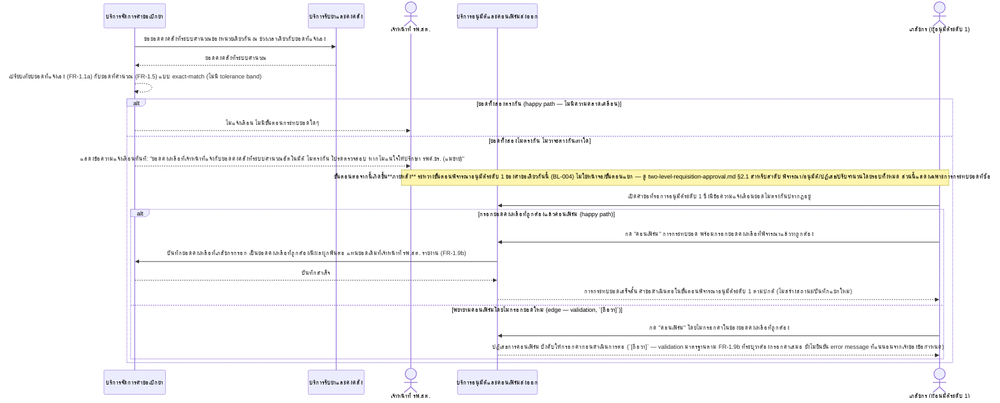

# Detailed Design (Conceptual) — กระทบยอดคงเหลือที่แจ้งเองกับยอดคงคลังที่ระบบคำนวณ (FT-008)

> เอกสารนี้เป็น detailed design ระดับแนวคิด (conceptual) เท่านั้น **ยังไม่ผูกมัดกับ technology stack, protocol, หรือเทคนิคการ implement ใดๆ** — ตาม CLAUDE.md เฟสปัจจุบันของโปรเจกต์คือการทำเอกสาร ยังไม่เข้าสู่เฟสพัฒนา เอกสารนี้จะถูกทบทวนอีกครั้งเมื่อเข้าสู่เฟสพัฒนาจริง
>
> อ้างอิงจาก [backlog.md](../backlog.md), [Feature List](../02-feature-list.md), [User Journey](../03-user-journey/), [Acceptance Criteria](../04-test-design/acceptance-criteria.md), [High-Level Architecture](../05-architecture.md), [Data Model](../06-data-model.md), [API Spec](../07-api-spec.md) — ดูนโยบาย granularity/exception/state-diagram ที่ใช้ร่วมกันทุกไฟล์ใน [README.md](README.md)

**วันที่สร้าง/อัปเดตล่าสุด:** 20260824
**Feature:** FT-008 — กระทบยอดคงเหลือที่แจ้งเองกับยอดคงคลังที่ระบบคำนวณ
**Backlog item ที่เกี่ยวข้อง:** BL-032 (คอนเฟิร์ม/กรอกยอดที่ถูกต้องเกิดขึ้นภายใน BL-004 — ดู [two-level-requisition-approval.md](two-level-requisition-approval.md) สำหรับลำดับ approve/reject/ปรับจำนวนโดยรอบทั้งหมด)

## 1. ภาพรวม (Overview)

ระบบเปรียบเทียบยอดคงเหลือที่เจ้าหน้าที่แจ้งเอง (FR-1.1a) กับยอดคงคลังที่ระบบคำนวณอัตโนมัติ (FR-1.5) ของหน่วยเดียวกันในช่วงเวลาเดียวกัน เพื่อตรวจพบความคลาดเคลื่อนก่อนที่จะกระทบความแม่นยำของ safety stock ตาม [staff-hph-journey.md](../03-user-journey/staff-hph-journey.md) step 4

**สถานะยืนยันแล้ว (resolved ครบ 20260823-20260824, 4 รอบ):** เภสัชกรเจ้าของระบบยืนยันโดยตรงว่าเมื่อยอดทั้งสองไม่ตรงกัน (ไม่ว่าจะต่างกันเท่าใด — เปรียบเทียบแบบ **exact-match/zero-tolerance** ไม่มี tolerance band) ระบบต้องแสดงข้อความแจ้งเตือนทันทีตามคำที่กำหนดคำต่อคำ: "ยอดคงเหลือที่เจ้าหน้าที่แจ้งกับยอดคงคลังที่ระบบคำนวณอัตโนมัติ ไม่ตรงกัน โปรดตรวจสอบ หากไม่แน่ใจให้ปรึกษา รพศ.ชร. (แม่ข่าย)" (FR-1.9/US-1.6) และปิด Open Item ที่ค้างไว้ก่อนหน้าครบแล้ว: **เภสัชกร** (ไม่ใช่เจ้าหน้าที่ รพ.สต.) เป็นผู้ตรวจสอบ/คอนเฟิร์มความคลาดเคลื่อนนี้ โดยการปรึกษา รพศ.ชร. เป็นทางเลือกเสริมเท่านั้น (FR-1.9a) และเมื่อคอนเฟิร์ม เภสัชกร**ต้องกรอกยอดคงเหลือที่ถูกต้องด้วยตนเอง** ซึ่งกลายเป็นยอดคงเหลือที่ถูกต้อง/มีผลผูกพันต่อแทนยอดเดิมที่เจ้าหน้าที่ รพ.สต. รายงาน — และขั้นตอนคอนเฟิร์มนี้**รวมอยู่ในขั้นตอนอนุมัติคำขอเบิกระดับ 1 เดิม (BL-004/FT-002) ไม่ใช่ขั้นตอนแยกใหม่** (FR-1.9b) ดู [002](../01-spec/20260816-002-ncd-drug-requisition-core.md) FR-1.9/FR-1.9a/FR-1.9b/US-1.6 ไดอะแกรมด้านล่างจึงขยายต่อจากการแจ้งเตือนไปจนถึงผลลัพธ์ที่ resolved นี้ (คอนเฟิร์ม → กรอกยอดที่ถูกต้อง → บันทึกเป็นค่าที่มีผลผูกพันต่อ) โดยเน้นเฉพาะส่วนกระทบยอด — ลำดับการโต้ตอบโดยรอบของการอนุมัติระดับ 1 เอง (พิจารณา/อนุมัติ/ปฏิเสธ/ปรับจำนวน) อยู่ที่ [two-level-requisition-approval.md](two-level-requisition-approval.md) (FT-002) ไม่ซ้ำวาดในที่นี้ **สิ่งที่เหลืออยู่มีเฉพาะรายละเอียดระดับ data model** (ฟิลด์เก็บยอดคงเหลือ authoritative ที่เภสัชกรกรอก) ที่ยัง `[ส่งต่อ]` ให้ `/build-data-api-spec` ออกแบบ ไม่ใช่ประเด็นของ detailed design เอง

## 2. Sequence Diagram(s)

### 2.1 BL-032 — เปรียบเทียบยอดที่แจ้งเองกับยอดที่คำนวณ และกระทบยอดระหว่างอนุมัติระดับ 1

**อ้างอิง:** Acceptance Criteria BL-032 Scenario 1-4 (Scenario 3-4 เพิ่ม 20260824); คู่กับ BL-004 Scenario 5 ([two-level-requisition-approval.md](two-level-requisition-approval.md))

หมายเหตุ: PHARM ในไดอะแกรมนี้คือบทบาทเดียวกับ PHARM1 ("เภสัชกร (ผู้อนุมัติระดับ 1)") ใน [two-level-requisition-approval.md](two-level-requisition-approval.md) §2.1/§2.2 — ไม่ใช่บุคคล/บทบาทใหม่แยกต่างหาก

## 3. Lifecycle / State Diagram

ไม่เกี่ยวข้อง — ยังไม่มี entity/สถานะที่เกิดจากการกระทบยอดนี้ (ดู [06-data-model.md](../06-data-model.md) §6 — ไม่มีฟิลด์ใหม่รอเพียงการยืนยันพฤติกรรม)

## 4. องค์ประกอบและ Operation ที่เกี่ยวข้อง (Cross-reference)

| องค์ประกอบ/Entity/Operation | มาจากเอกสาร | บทบาทใน Feature นี้ |
|---|---|---|
| บริการจัดการคำขอเบิกยา | 05-architecture.md §3 | ฝ่ายเปรียบเทียบยอดที่แจ้งเองกับยอดคงคลัง แสดงข้อความแจ้งเตือน และบันทึกยอดคงเหลือที่ถูกต้อง (authoritative) หลังเภสัชกรกรอก |
| บริการรับยาและคงคลัง | 05-architecture.md §3 | แหล่งข้อมูลยอดคงคลังที่ระบบคำนวณ |
| บริการอนุมัติและคอนเฟิร์มส่งออก | 05-architecture.md §3 | ควบคุมขั้นตอนคอนเฟิร์มการกระทบยอด ซึ่งซ้อนอยู่ภายในขั้นตอนพิจารณาอนุมัติระดับ 1 (BL-004) — ดูรายละเอียดการอนุมัติโดยรอบที่ [two-level-requisition-approval.md](two-level-requisition-approval.md) |
| RequisitionLineItem (ยอดที่แจ้งเอง), InventoryBalance (ยอดที่คำนวณ) | 06-data-model.md §3.5/3.11 | สองค่าที่ต้องเปรียบเทียบแบบ exact-match — มีอยู่แล้วในโมเดล ไม่ต้องเพิ่มฟิลด์ใหม่สำหรับการเปรียบเทียบ |
| ฟิลด์เก็บยอดคงเหลือที่ถูกต้อง/มีผลผูกพันต่อ (authoritative value ตาม FR-1.9b) | 06-data-model.md (`[ส่งต่อ]`) | ยังไม่ถูกออกแบบอย่างเป็นทางการว่าจะเป็นฟิลด์ใหม่แยกหรือ overwrite ฟิลด์เดิม — รอ `/build-data-api-spec`; ไม่บล็อกเอกสารเฟสนี้ |
| operation คอนเฟิร์มการกระทบยอด/กรอกยอดที่ถูกต้อง | 07-api-spec.md §3.4 (รวมอยู่ใน operation พิจารณา/อนุมัติระดับ 1 เดิม ไม่ใช่ operation แยก) | operation หลักของขั้นตอนใน §2.1 ของไฟล์นี้ |

## 5. สิ่งที่ยังไม่ตัดสินใจ / Assumption ที่ต้องยืนยัน

- **ยืนยันแล้วครบ (20260823-20260824, 4 รอบ):** (1) ต้องแจ้งเตือนเมื่อพบความคลาดเคลื่อน ด้วยข้อความคำต่อคำที่กำหนด เปรียบเทียบแบบ exact-match/zero-tolerance (FR-1.9/US-1.6) (2) เภสัชกรเป็นผู้ตรวจสอบ/คอนเฟิร์ม ไม่ใช่เจ้าหน้าที่ รพ.สต. เอง และการปรึกษา รพศ.ชร. เป็นทางเลือกเสริม (FR-1.9a) (3) เภสัชกรกรอกยอดที่ถูกต้องเองเมื่อคอนเฟิร์ม กลายเป็นค่าที่มีผลผูกพันต่อ และขั้นตอนนี้รวมอยู่ในการอนุมัติระดับ 1 เดิม (BL-004) ไม่ใช่ขั้นตอนแยกใหม่ (FR-1.9b) — ดู [002](../01-spec/20260816-002-ncd-drug-requisition-core.md) FR-1.9/FR-1.9a/FR-1.9b — ไม่มี `[รอยืนยัน]` ค้างในเชิงกฎธุรกิจของไฟล์นี้อีกต่อไป
- **`[ถือว่า]` ที่เหลืออยู่:** พฤติกรรม validation เมื่อเภสัชกรพยายามคอนเฟิร์มโดยไม่กรอกยอดใหม่ (AC BL-032 Scenario 4) ยึดตามสมมติฐานมาตรฐาน (บังคับกรอกก่อน) แต่ error message ที่แน่นอนยังไม่ได้รับการยืนยันจากเจ้าของข้อกำหนดโดยตรง — ไม่บล็อกงานเอกสารเฟสนี้
- **`[ส่งต่อ]` ที่เหลืออยู่ (ไม่ใช่ประเด็นของ detailed design):** ฟิลด์ data model ที่จะเก็บยอดคงเหลือ authoritative ตาม FR-1.9b ยังไม่ถูกออกแบบอย่างเป็นทางการ — รอ `/build-data-api-spec`

---

## บันทึกการอัปเดต (Changelog)

- **20260823:** สร้างไฟล์ครั้งแรก — 1 ไดอะแกรมแสดงเฉพาะส่วนที่ยืนยันแล้ว (การเปรียบเทียบ + กรณีตรงกัน) คงเครื่องหมาย `[รอยืนยัน]` ไว้ตรงจุดพฤติกรรมกรณีไม่ตรงกันตามต้นทาง ไม่ได้สมมติขั้นตอนกระทบยอดขึ้นเอง — ควรได้รับการยืนยันจากเภสัชกรเจ้าของระบบก่อนขยายไดอะแกรมนี้เพิ่มเติม
- **20260823 (audit, หลังยืนยัน BL-032):** เภสัชกรเจ้าของระบบยืนยันแล้วว่าเมื่อยอดไม่ตรงกัน (exact-match/zero-tolerance) ต้องแสดงข้อความแจ้งเตือนคำต่อคำที่กำหนด (ดู [002](../01-spec/20260816-002-ncd-drug-requisition-core.md) FR-1.9/US-1.6) — แก้ไขไดอะแกรม 2.1 branch "ยอดไม่ตรงกัน" ให้แสดงข้อความแจ้งเตือนจริงแทนเครื่องหมาย `[รอยืนยัน]` เดิม (คง `[รอยืนยัน]` ไว้เฉพาะขั้นตอนกระทบยอด/แก้ไขข้อมูลต่อจากนั้น ซึ่งยังเป็น Open Item ใหม่ที่ไม่มี BL-ID — ไม่ได้สมมติขั้นตอนนั้นขึ้นเอง) อัปเดตหัวข้อ 1, 4, 5 ให้สะท้อนสถานะ resolved บางส่วนนี้
- **20260824 (sync หลังปิด Open Item รอบ 4 ของ BL-032/FR-1.9b — backlog.md/acceptance-criteria.md/test-cases เพิ่ม Scenario 3-4/TC-107-108 เมื่อ 20260824):** Open Item ที่เคยค้างอยู่ (ขั้นตอนกระทบยอด/แก้ไขข้อมูลต่อจากการแจ้งเตือน — ใครแก้ไข ค่าใดถูกต้อง) resolved ครบแล้วตั้งแต่ 20260823 รอบ 4 แต่ไฟล์นี้ยังไม่เคยขยายไดอะแกรมให้สะท้อนตาม — แก้ไขไดอะแกรม 2.1 ให้ขยายต่อจากข้อความแจ้งเตือนเดิม เพิ่ม participant PHARM (เภสัชกร ผู้อนุมัติระดับ 1, บทบาทเดียวกับ PHARM1 ใน two-level-requisition-approval.md) และ APPROVE (บริการอนุมัติและคอนเฟิร์มส่งออก) พร้อม `alt` ย่อยแสดง 2 branch: (1) กรอกยอดที่ถูกต้องแล้วคอนเฟิร์ม (happy path, AC Scenario 3) → บันทึกเป็นยอดคงเหลือที่ถูกต้อง/มีผลผูกพันต่อ ผ่านบริการจัดการคำขอเบิกยา (2) พยายามคอนเฟิร์มโดยไม่กรอกค่า (edge/validation, AC Scenario 4, `[ถือว่า]`) → ปฏิเสธ เพิ่ม Note cross-reference ไปยัง [two-level-requisition-approval.md](two-level-requisition-approval.md) ว่าไดอะแกรมนี้แสดงเฉพาะส่วนกระทบยอดที่ซ้อนอยู่ภายในขั้นตอนอนุมัติระดับ 1 โดยรอบ ไม่ซ้ำวาดลำดับ approve/reject/ปรับจำนวนเต็มรูปแบบ อัปเดตหัวข้อ 1, 4, 5 ให้สะท้อนสถานะ resolved ครบ (เหลือเฉพาะ `[ส่งต่อ]` ด้าน data model ที่รอ `/build-data-api-spec` ซึ่งไม่บล็อกสถานะไฟล์นี้)
