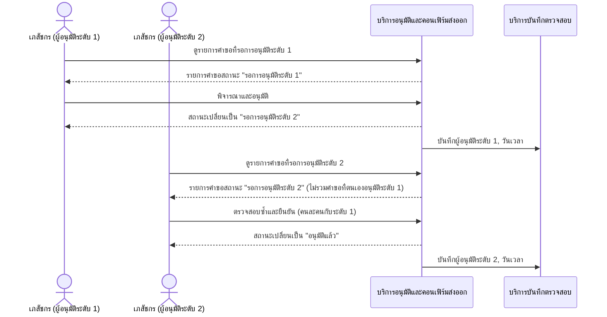
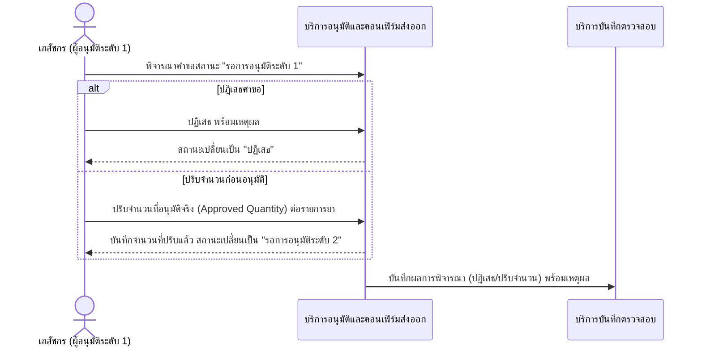
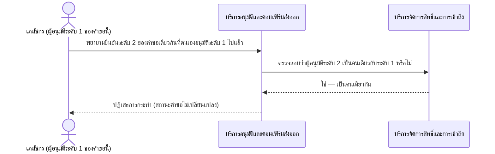
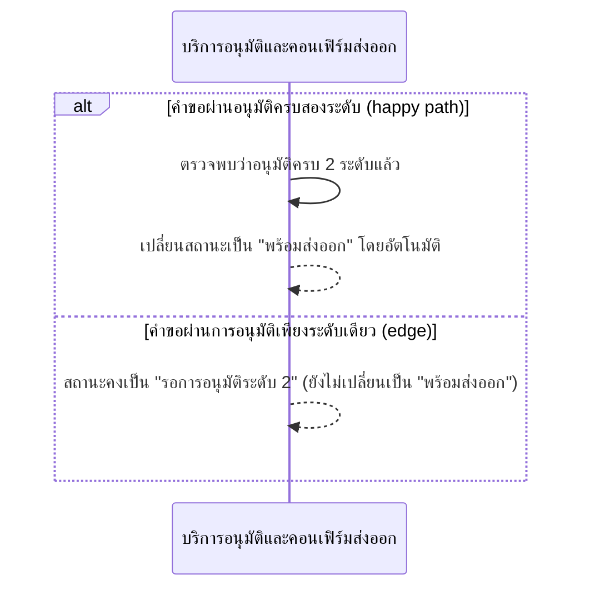
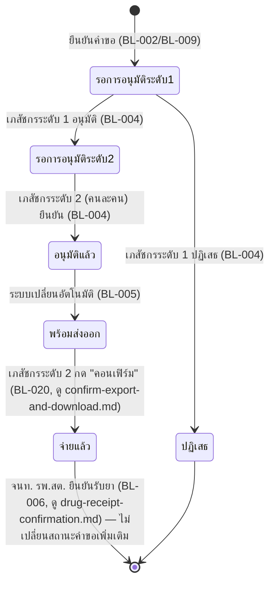

# Detailed Design (Conceptual) — อนุมัติคำขอเบิกแบบสองระดับ (FT-002)

> เอกสารนี้เป็น detailed design ระดับแนวคิด (conceptual) เท่านั้น **ยังไม่ผูกมัดกับ technology stack, protocol, หรือเทคนิคการ implement ใดๆ** — ตาม CLAUDE.md เฟสปัจจุบันของโปรเจกต์คือการทำเอกสาร ยังไม่เข้าสู่เฟสพัฒนา เอกสารนี้จะถูกทบทวนอีกครั้งเมื่อเข้าสู่เฟสพัฒนาจริง
>
> อ้างอิงจาก [backlog.md](../backlog.md), [Feature List](../02-feature-list.md), [User Journey](../03-user-journey/), [Acceptance Criteria](../04-test-design/acceptance-criteria.md), [High-Level Architecture](../05-architecture.md), [Data Model](../06-data-model.md), [API Spec](../07-api-spec.md) — ดูนโยบาย granularity/exception/state-diagram ที่ใช้ร่วมกันทุกไฟล์ใน [README.md](README.md)

**วันที่สร้าง/อัปเดตล่าสุด:** 20260824
**Feature:** FT-002 — อนุมัติคำขอเบิกแบบสองระดับ
**Backlog item ที่เกี่ยวข้อง:** BL-004, BL-005 (BL-004 มี AC Scenario 5 เพิ่ม 20260824 ครอบคลุมกรณีมี BL-032 มาเกี่ยวข้อง — ดูหมายเหตุท้าย §2.1)

## 1. ภาพรวม (Overview)

Feature นี้เป็นแกนกลางของ Epic 1: เภสัชกรผู้อนุมัติระดับ 1 พิจารณา/ปฏิเสธ/ปรับจำนวนคำขอ จากนั้นเภสัชกรผู้ตรวจสอบระดับ 2 (คนละคนกับระดับ 1 เสมอ — บังคับที่ระดับ operation) ยืนยันซ้ำก่อนสถานะเปลี่ยนเป็น "อนุมัติแล้ว" → "พร้อมส่งออก" โดยอัตโนมัติ ตาม [pharmacist-journey.md](../03-user-journey/pharmacist-journey.md) step 3-9

BL-004 มี 4 AC scenario ที่แบ่งตามผู้กระทำ/ผลลัพธ์ที่แตกต่างกันชัดเจน (อนุมัติระดับ 1, ปฏิเสธ/ปรับจำนวน, อนุมัติระดับ 2 โดยคนละคน, เภสัชกรคนเดียวกันพยายามอนุมัติซ้ำ) — ตามนโยบาย C ใน README.md (แยกไดอะแกรมเมื่อมี 3+ branch ที่มีนัยสำคัญต่างกัน) จึงแยกเป็น 3 ไดอะแกรม (2.1 happy path, 2.2 ปฏิเสธ/ปรับจำนวน, 2.3 RBAC denial) แทนการยัดรวมเป็น `alt` เดียว ส่วน BL-005 (เปลี่ยนสถานะอัตโนมัติ) มี 2 branch เท่านั้นจึงแสดง inline (2.4)

**เพิ่ม 20260824:** BL-004 ได้ AC Scenario 5 ใหม่ — เมื่อคำขอที่กำลังพิจารณาอยู่ในขั้นตอนอนุมัติระดับ 1 นี้มีข้อความแจ้งเตือนยอดไม่ตรงกันปรากฏอยู่ (BL-032) เภสัชกรผู้อนุมัติระดับ 1 จะคอนเฟิร์ม/กรอกยอดคงเหลือที่ถูกต้องด้วยตนเองเป็น**ส่วนหนึ่งของ interaction พิจารณาอนุมัติระดับ 1 นี้เอง** (ไม่ใช่ขั้นตอนแยก, FR-1.9b) — ไม่ทำเป็นไดอะแกรมแยกในไฟล์นี้ซ้ำ เนื่องจากรายละเอียดการกระทบยอดเป็นของ FT-008 อยู่แล้ว ดู [stock-reconciliation.md](stock-reconciliation.md) §2.1 สำหรับลำดับการโต้ตอบแบบเต็ม

**Feature นี้เป็นเจ้าของ state diagram ของสถานะคำขอเบิกยา (หัวข้อ 3)** เนื่องจากเป็นจุดที่สถานะเปลี่ยนมากที่สุดในวงจร (รออนุมัติ 1 → รออนุมัติ 2 → อนุมัติแล้ว → พร้อมส่งออก)

## 2. Sequence Diagram(s)

### 2.1 BL-004 — อนุมัติสองระดับสำเร็จ (happy path)

**อ้างอิง:** Acceptance Criteria BL-004 Scenario 1, 3

หมายเหตุ: PHARM1/PHARM2 แทนบทบาทเดียวกัน (เภสัชกร) ที่สลับหน้าที่กันได้ตามเวร ไม่ใช่บุคคลตายตัวคนละคน — ดู [pharmacist-journey.md](../03-user-journey/pharmacist-journey.md) หมายเหตุหัวไฟล์ สถานะ "อนุมัติแล้ว" ต่อเนื่องไปที่ 2.4 ด้านล่าง (BL-005) ทันที

หมายเหตุเพิ่ม 20260824 (BL-004 Scenario 5): ถ้าคำขอที่ PHARM1 กำลังพิจารณาในขั้นตอน "พิจารณาและอนุมัติ" ข้างต้นมีข้อความแจ้งเตือนยอดไม่ตรงกันปรากฏอยู่ (BL-032) PHARM1 จะคอนเฟิร์ม/กรอกยอดคงเหลือที่ถูกต้องด้วยตนเองเป็นส่วนหนึ่งของขั้นตอนนี้ก่อนดำเนินการต่อ — ไม่วาดซ้ำในไดอะแกรมนี้ ดูลำดับการโต้ตอบแบบเต็มที่ [stock-reconciliation.md](stock-reconciliation.md) (FT-008) §2.1

### 2.2 BL-004 — ปฏิเสธ/ปรับจำนวนที่ระดับ 1 (edge)

**อ้างอิง:** Acceptance Criteria BL-004 Scenario 2

### 2.3 BL-004 — เภสัชกรคนเดียวกันพยายามอนุมัติสองระดับ (error — RBAC)

**อ้างอิง:** Acceptance Criteria BL-004 Scenario 4

หมายเหตุ: ปุ่มอนุมัติระดับ 2 ควรถูกซ่อน/ปิดใช้งานที่ระดับหน้าจอด้วยเช่นกัน (ดู [DESIGN.md](../../DESIGN.md) §4.3) แต่การตรวจสอบสิทธิ์จริงต้องเกิดที่ระดับ operation เสมอ ไม่พึ่งพาการซ่อนปุ่มอย่างเดียว

### 2.4 BL-005 — เปลี่ยนสถานะ "พร้อมส่งออก" อัตโนมัติ

**อ้างอิง:** Acceptance Criteria BL-005 Scenario 1-3

สถานะ "พร้อมส่งออก" ต่อเนื่องไปยัง [confirm-export-and-download.md](confirm-export-and-download.md) (FT-017) ที่เภสัชกรระดับ 2 กด "คอนเฟิร์ม" แล้วสถานะเปลี่ยนเป็น "จ่ายแล้ว" ทันที (Scenario 2 ของ BL-005 อยู่ในไฟล์นั้นเนื่องจากเป็นผลจาก operation "คอนเฟิร์มส่งออกไฟล์เบิกยา" ของ FT-017 โดยตรง)

## 3. Lifecycle / State Diagram — สถานะคำขอเบิกยา (Requisition Status)

**อ้างอิง:** [06-data-model.md](../06-data-model.md) §3.4/§5 (enum สถานะ), FR-1.2/FR-1.3, BL-004/BL-005/BL-020

## 4. องค์ประกอบและ Operation ที่เกี่ยวข้อง (Cross-reference)

| องค์ประกอบ/Entity/Operation | มาจากเอกสาร | บทบาทใน Feature นี้ |
|---|---|---|
| บริการอนุมัติและคอนเฟิร์มส่งออก | 05-architecture.md §3 | ควบคุมวงจรอนุมัติสองระดับทั้งหมด |
| บริการจัดการสิทธิ์และการเข้าถึง | 05-architecture.md §3 | บังคับกฎห้ามคนเดียวกันอนุมัติสองระดับ |
| บริการบันทึกตรวจสอบ | 05-architecture.md §3 | บันทึกผู้อนุมัติแต่ละระดับลง Audit Trail |
| Requisition, ApprovalRecord | 06-data-model.md §3.4/3.6 | header คำขอ + บันทึกผลการพิจารณาแต่ละระดับ |
| พิจารณา/อนุมัติ/ปฏิเสธ/ปรับจำนวน (ระดับ 1); ตรวจสอบซ้ำและยืนยัน (ระดับ 2) | 07-api-spec.md §3.4 | operation หลักของ Feature นี้ |
| (cross-reference) FT-008 — กระทบยอดคงเหลือที่แจ้งเองกับยอดคงคลังที่ระบบคำนวณ (BL-032) | [stock-reconciliation.md](stock-reconciliation.md) | เมื่อคำขอที่กำลังพิจารณาในขั้นตอนอนุมัติระดับ 1 นี้มีข้อความแจ้งเตือนยอดไม่ตรงกัน เภสัชกรคอนเฟิร์ม/กรอกยอดที่ถูกต้องเป็นส่วนหนึ่งของ interaction นี้เอง (BL-004 Scenario 5, FR-1.9b) — รายละเอียดลำดับการโต้ตอบอยู่ที่ไฟล์นั้น ไม่ซ้ำวาดในที่นี้ |

## 5. สิ่งที่ยังไม่ตัดสินใจ / Assumption ที่ต้องยืนยัน

- ไม่มี open item ใหม่ของไฟล์นี้ — ทุกพฤติกรรมอ้างอิงจาก AC ที่ resolved แล้วทั้งหมด (BL-004/BL-005 ไม่มี `[รอยืนยัน]` ค้างอยู่ รวมถึง Scenario 5 ใหม่ของ BL-004 ที่ผูกกับ BL-032/FR-1.9b ซึ่ง resolved ครบแล้วเช่นกัน — ดู [stock-reconciliation.md](stock-reconciliation.md) §5 สำหรับรายละเอียด)

---

## บันทึกการอัปเดต (Changelog)

- **20260823:** สร้างไฟล์ครั้งแรก — แยก BL-004 เป็น 3 ไดอะแกรม (happy/reject-adjust/RBAC-denial) ตามนโยบาย "3+ branch ที่มีนัยสำคัญต่างกัน" ของ README.md, BL-005 แสดง inline (2 branch) และเป็นเจ้าของ state diagram สถานะคำขอเบิกยาทั้งวงจร (หัวข้อ 3)
- **20260824 (sync หลังปิด Open Item รอบ 4 ของ BL-032/FR-1.9b — backlog.md/acceptance-criteria.md เพิ่ม BL-004 AC Scenario 5 เมื่อ 20260824):** เพิ่มเติมเล็กน้อย (ไม่ทำใหม่ทั้งไฟล์) — อัปเดตหัวไฟล์/ภาพรวม (หัวข้อ 1) ให้ระบุ AC Scenario 5 ใหม่ของ BL-004, เพิ่มหมายเหตุท้ายไดอะแกรม 2.1 ว่าเมื่อคำขอมีข้อความแจ้งเตือนยอดไม่ตรงกัน (BL-032) การคอนเฟิร์ม/กรอกยอดที่ถูกต้องเกิดขึ้นเป็นส่วนหนึ่งของขั้นตอน "พิจารณาและอนุมัติ" ใน interaction นี้เอง พร้อม cross-reference ไปยัง [stock-reconciliation.md](stock-reconciliation.md) (FT-008) แทนการวาดซ้ำ — เพิ่มแถว cross-reference ในตารางหัวข้อ 4 และอัปเดตหัวข้อ 5 ให้ยืนยันว่า Scenario 5 นี้ไม่มี `[รอยืนยัน]` ค้าง — ไม่แก้ไดอะแกรม 2.1-2.4 หรือ state diagram หัวข้อ 3 (ยังคงเดิมทุกจุด เนื่องจาก Scenario 5 ไม่เปลี่ยนลำดับ approve/reject/สถานะใดๆ ของ FT-002 เอง)
